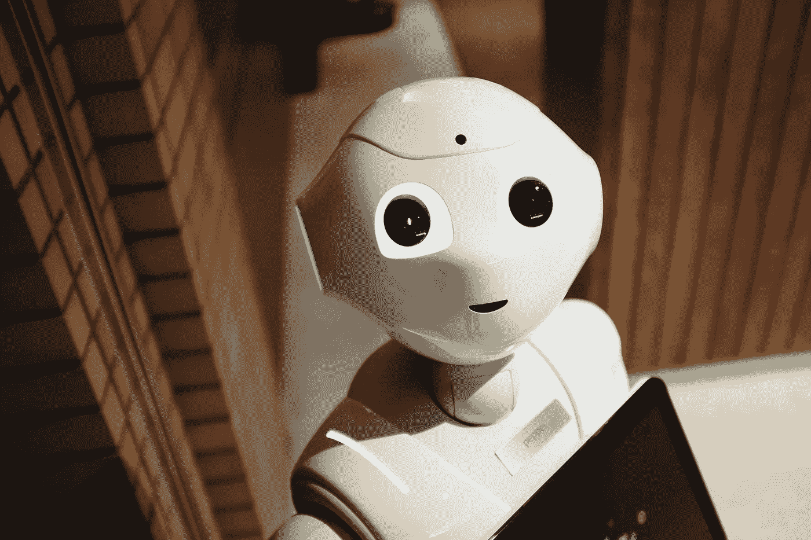

# 有偏见的人能创造出无偏的算法吗？

> 原文：<https://towardsdatascience.com/can-biased-people-create-unbiased-algorithms-a01813e0473a?source=collection_archive---------25----------------------->

算法已经在很大程度上存在于我们之中。他们中的一些人做出重要的决定，如帮助司法系统确定累犯的可能性，支持是否延长贷款或投资哪些股票的决定，甚至诊断我们的细胞样本是否是恶性的，这决定了我们接受的治疗和提供的保险。

虽然它们的使用具有巨大的潜力来帮助我们变得更加准确和做出更好的决策，但它们也带来了一系列问题，包括隐私问题、偏见风险、错误、责任问题和缺乏透明度。

人工智能的广泛采用依赖于信任。只有当我们了解一个算法是如何做出决定的，如果我们了解它是如何工作的，我们才能认为这个算法是可信的。

因此，可解释性和透明性是可信算法的两个重要特征。

产出的公平性也是建立信任的关键。然而，算法在其生命周期的每一步都可能出现偏差:

1.算法本身的发展会有偏差，称为技术偏差。

2.训练数据集可以包含偏差。例如，如果我们向算法提供样本，其中某个特定种族群体相对于其在总人口中所占的份额而言代表过多，则该算法会根据学习到的比例调整其数学预测。

3.实际数据集可能存在固有偏差。从政的男性人数多于女性。这是一个数学上的确定性，算法不会改变，但会在其预测中重现。

4.当未知样本出现时，训练算法的反馈回路可能在其响应中有偏差，并在算法中建立偏差

5.用户对算法的配置可以反映他们的文化和经验偏见

6.最糟糕的是，这种算法几乎不可解，可能会提供完全意想不到的输出

偏见是一件复杂的事情。

数据偏倚的定义意味着可用数据不能代表研究的总体或现象。当算法的输出不是由目标人群的真实构成驱动时，它是有偏差的。然后，它产生的决策没有数学准确性的支持，被认为是不公平的。

然而，当目标人群有偏差时会发生什么？

# 无偏算法代表我们有偏见的世界吗？

在许多情况下，结果是有偏见的，因为现实是有偏见的。做生意的男人比女人多。从政的黑人比白人少。偏差是数学上的必然。一个算法可能是“正确的”、“可信的”，但仍会延续过去的不平等。

这种类型的偏见是人口本身固有的，消除这种偏见更多的是有意识地决定要么忠于我们有偏见的世界的现实，要么为我们希望成为的世界建立我们的算法。

# **如何避免算法中的偏差**

有许多因素被普遍认为对限制算法中的偏差风险很重要:

**透明。**绝对清楚算法是如何工作的。

**可交代性。**能够理解一个决定是如何达成的，可以质疑思维过程和现场偏差。根据这一原则，所谓的“暗箱操作”是完全不可接受的。

**培训数据可用性。**训练数据量非常重要，可用于训练算法的数据越多，算法就越精确。但是数据集也必须代表我们打算研究的人群，以减少偏倚的风险。

**监控算法性能。**设置正确的参数并定期抽查。

**人工监督**。这意味着一种“人在回路中”的方法，并且如果算法没有按照预期的方式运行，就有可能忽略该算法。

**每一步都要考虑到人。**最终，算法会做出影响人们生活的决策。在生命周期的每个阶段考虑人的影响有助于更好地确定何时应该有人参与，在哪里选择而不是决策可能是一个好主意，以及何时完全依赖算法是安全的。

**多样性。**从不同的角度审查算法可以更早地识别潜在的缺失。在不同的团队中工作有助于避免算法偏差。

# **人类 vs 机器**

我们未来的关键是尽早思考人机关系应该是什么样子。

在我们与算法的关系中设置正确的先例是很重要的。

我们是否在为算法提供权威和正当性假设，让我们受制于它们的决定？

算法从来没有好坏之分。然而，它们有可能以精确的数学方式伤害我们。

与人类相比，算法决策可以导致更受数据驱动、更客观和更公平的决定，但它也可能导致歧视和不正确的结果。

有没有可能使我们成为人类的恰恰是这样一个事实，即数学的精确性并不能决定我们所做的一切？

正如汉娜·弗莱在《Hello World》中所说，“也许将算法视为某种权威正是我们的错误所在”。

算法可能更好地用于支持人类决策，而不是决策。我们应该利用算法擅长的东西，并将其与人类更擅长的东西结合起来，而不是为算法提供不容置疑的权力和权威以及委派责任的借口。

算法并不完美，但如前所述，人类也不总是对的。然而，算法可以支持人类，并为他们提供一种工具，在某些情况下变得更公平、更准确、更有效。

鉴于我们最终要对算法的行为负责，难道我们不应该确保自己保留这一权力吗？

**持有算法账户**

由于知识产权的原因，许多私有和公共算法目前都是不透明或不可解释的。打着捍卫商业秘密或保护知识产权的旗号，他们在未经深入审查的情况下影响着人类生活。

作为一个社会，我们看到了依靠算法来更深入地了解人，最终了解客户，并为他们提供渴望已久的个性化产品和服务的好处。

但反过来作为一个社会，我们也有责任确保它可以避免对人类的伤害。

也许是时候考虑建立一个监管机构，在最大限度地尊重隐私和知识产权的情况下，测试算法的准确性、一致性、偏见和影响，然后根据它们可能造成的伤害或产生的不公平输出，批准或拒绝它们的使用。