# 预算分配与政府绩效不佳和腐败有关吗？

> 原文：<https://towardsdatascience.com/can-budget-allocation-be-related-to-poor-government-performance-and-corruption-f9a1dc397bf0?source=collection_archive---------29----------------------->

# 机器学习分析

特别感谢 Michael Greencare 教授和 UPF 巴塞罗纳管理学院。

## 摘要

*本文旨在运用主成分分析和聚类分析研究腐败感知指数(CPI)及其与五大类预算支出和五个治理指标变量的关系。目的是通过从数据集中提取最重要的结构化信息，并以图表的形式提供综合结果，来确定不同欧洲国家之间的相似性以及 2010 年和 2016 年之间的变化。它通过运行 CPI 和分类变量之间的线性回归来进一步了解哪些类别是密切相关的。此外，该研究运行了回归树分析，以确定最有意义的变量，以制作一个潜在的解释模型。*

*首先简要介绍清廉指数和治理关键绩效指标。第二部分，使用的数据集和方法；在第二章和第三章解释。第四章和第五章分别给出了研究结果和结论。*

***关键词*** *:清廉指数、预算支出、治理指标、法治(RL)、主成分分析、聚类、数据、变量、R-studio。*

# 1.介绍

对腐败的研究是一个极端而微妙的问题，世界经济论坛最近的研究表明，腐败的成本大约为每年 2.6 万亿美元。这种影响影响了社会中最脆弱的阶层，影响了国家的发展，例如，委内瑞拉是世界上最富裕的国家之一，但它淹没在一个前所未有的腐败网络中，使其陷入经济和人道主义危机。

此外，腐败对国际投资产生不利影响，从而削弱经济增长和破坏法治。同样，这些做法会带来更严重的后果；浪费公共资源和金钱，破坏公众对政府的信任，降低政府运作效率，影响经济。

国际透明组织(International Transparency)的使命是[“在社会所有层面和所有部门制止腐败并促进透明度、问责制和廉正”](https://www.transparency.org/)，并创建了一个指数，根据商界人士和专家对全球 180 个国家公共部门腐败程度的看法，对这些国家进行排名。等级从 cero 到 100，cero 高度腐败，最高分 100 非常干净。

此外，[全球治理指标项目](http://info.worldbank.org/governance/wgi/index.aspx#home)报告了 200 多个国家的总体和单独治理绩效指标，使用六个不同的维度，并给它们打分，从-2.5 到 2.5，分数越高，治理绩效越好。出于本研究的目的，我们选择了前五个维度:

**声音与问责(VA):** 反映了人们对一个国家的公民能够在多大程度上参与选择他们的政府，以及言论自由、结社自由和自由媒体的看法。

**政治稳定和无暴力(PS-AV):** 衡量对政治不稳定和/或政治暴力(包括恐怖主义)可能性的看法。

**政府效力(GE):** 反映了对公共服务质量、公务员质量及其不受政治压力影响的程度、政策制定和执行的质量以及政府对这些政策的承诺的可信度的看法。

**监管质量(RQ):** 反映了对政府制定和实施允许和促进私营部门发展的健全政策和法规的能力的看法。

**法治(RL):** 反映了人们对代理人在多大程度上信任和遵守社会规则、合同执行质量、产权、警察和法院以及犯罪和暴力的可能性的看法。

此外，负责编制和提出欧盟预算草案的[欧盟委员会](http://ec.europa.eu/budget/figures/interactive/index_en.cfm)按不同支出范围的类别显示了欧盟国家的预算支出。我们只选择了占总支出预算 2%以上的类别，如:

智能和包容性增长(SIG)

可持续增长(SG-NR)

安全和公民身份(SC)

行政管理

# 2.资料组

该数据集对应于 2010 年和 2016 年的二十八(28)个西欧国家，以查看所述期间的相关变化。此外，数据集包含十五(15)个变量，包括 CPI、治理指标、预算支出占总支出的百分比，以及五(5)个人口变量，如失业率(UNPL)、通货膨胀率(INF)、人均国内生产总值(GPD)、购买力平价(PPP)和人口(POP)。下表显示了数据集的头部，仅显示了 2010 年和 2016 年这两个时期的前六个国家。BE10 表示 2010 年的国家是比利时，依此类推。

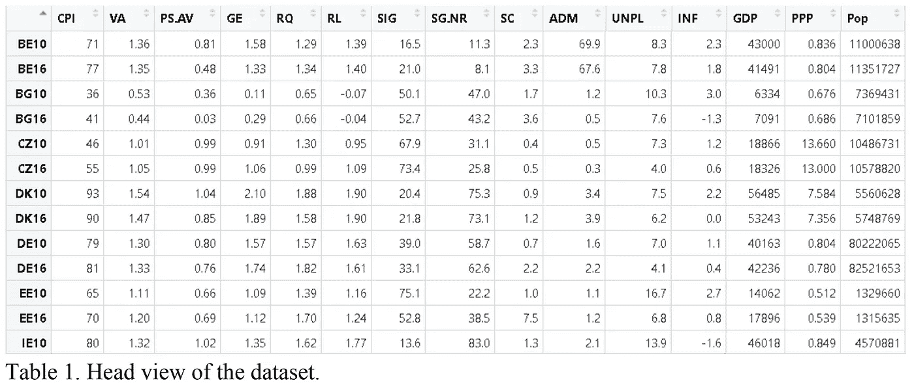

# 3.方法学

## 3.1.了解您的数据

第一步是通过引入变量的箱线图来了解数据。这是一种通过四分位数以图形方式描绘数字数据的方法，并使用触须来表示上下四分位数之外的可变性。这种图形表示的目的是检测异常值。在数据库里。第二步是在开始分析预测变量之前了解它们的分布；这很重要，因为某些分析需要某些分布。理想情况下，最好是正态分布，不要向一侧倾斜。

## 3.2.聚类分析

这种分析的目的是对非结构化数据集进行分组并从中提取价值，并在尝试对其进行分析之前对国家进行逻辑分组。这种分析将允许研究人员浏览一下数据，并在深入本研究的分析主题之前，根据我们的发现形成结构。关于分析本身，聚类是具有相似属性的国家和年份的集合，并基于它们的相似性以分层的方式将它们分成不同的组。为了获得集群，我们将以下代码引入 R-Studio 程序:

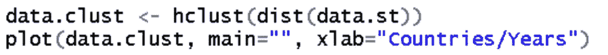

此外，我们分别分析每年的数据，以便对不同群体有一个清晰的认识，并比较两个时期，看是否有显著变化。为此，我们使用以下代码将数据集分为 2010 年和 2016 年的数据:

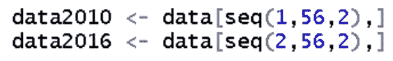

和编码两个独立的聚类分析。

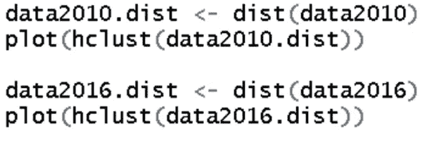

## 3.3.数据标准化和主成分分析

在应用主成分分析之前，数据集需要标准化，因为一些变量可能有较大的方差和其他最小的方差。这在运行 PCA 之前很重要，因为这是一种方差最大化方法。数据标准化是通过取出平均值，然后用数据除以标准偏差来完成的。将所有数据标准化后，使用的方法是主成分分析(PCA)来描述多变量数据。

我们使用这种方法的主要原因之一是因为简单，我们没有缺失值，主要是因为它不需要正态性。**这种检验不是假设检验，反应变量和解释变量之间没有明显的区别**(阿兰 f .祖尔，埃琳娜 n .雷诺&格雷厄姆 m .史密斯，2007)。这种方法背后的思想是将一个大的变量集减少到一个小的集合，该集合仍然包含大数据集中的大部分信息。第一个主成分解释了大部分差异，每个后续成分解释了剩余的可变性。此外，我们从 PCA 结果中提取行主坐标。

## 3.4.线性回归，回归树分析。

关于线性回归模型，我们首先用散点图分析因变量(腐败感知指数或 CPI)和预测变量之间的关系。LR 中的基本假设是两个变量之间的关系必须是线性的和可加的。

在第一个线性模型中，我们使用 CPI 作为自变量，治理指标作为预测因子。第二个线性回归模型使用了相同的因变量，但使用了预算支出和自变量。此外，第三个线性模型也涉及预算支出和治理指标。

此外，我们做了回归树分析来表示递归划分。每个终端节点代表分区的一个单元，每个单元只是自变量的一个常数估计。这种分析的优点是可以更快地做出预测，并且很容易理解哪些变量在做出预测时更重要。回归树是由各个线性模型中的重要变量组成的，我们可以在下面的代码中看到:

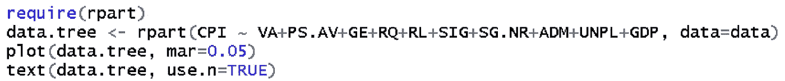

最后，使用 CPI 和其他重要变量的线性模型，以西班牙为所有国家的参考水平，以 2010 年为基准年。目的是查看 2016 年是否显著高于或低于基准年，并确定各县和参照国西班牙之间的显著性。

# 4.结果

## 4.1.第一阶段结果

第一阶段的结果，了解你的数据，非常有助于识别异常值和分布。关于异常值的识别，箱线图分析显示，2016 年，安全和公民身份(SC)有一个异常值，即马耳他。许多报告表明，马耳他的公民身份是一个非常重要的部门，因为他们向世界各地的亿万富翁和罪犯出售公民身份，作为进入欧洲的免费入口。

这可能是这个国家在这一类别中成为异类的原因之一。此外，管理(ADM)也显示出极端异常值。这两个国家是比利时和卢森堡，这些国家的许多公民在其他国家工作，因为它们非常小，更接近较大的国家，也因为它们是欧盟机构的东道国。同样，购买力平价箱线图显示了两个时期的异常值，在这种情况下是匈牙利，在 2016 年达到历史最高水平。下表包含变量的箱线图。

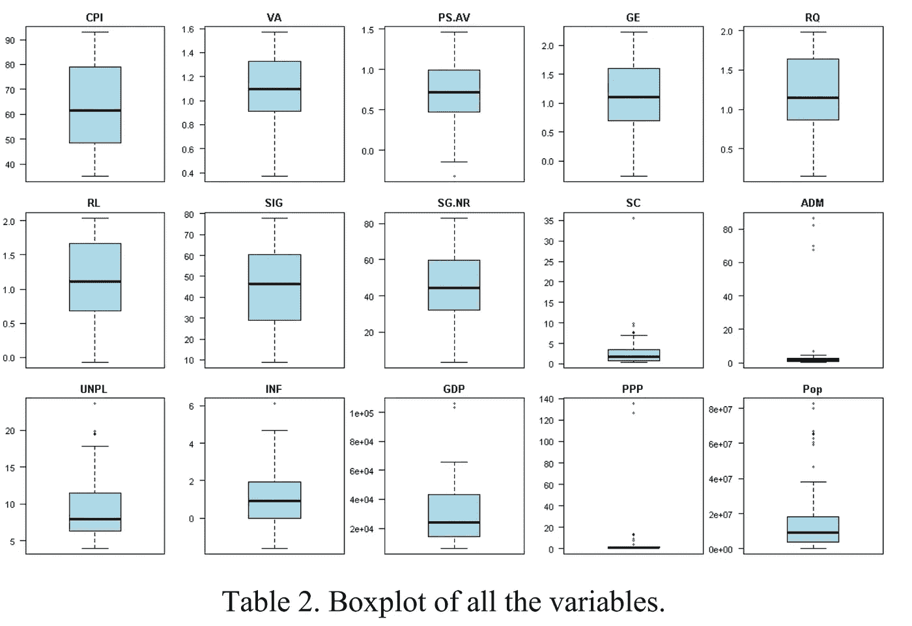

此外，表 3 显示了变量的分布，通过图形展示了本研究中一个变量对象的密度。

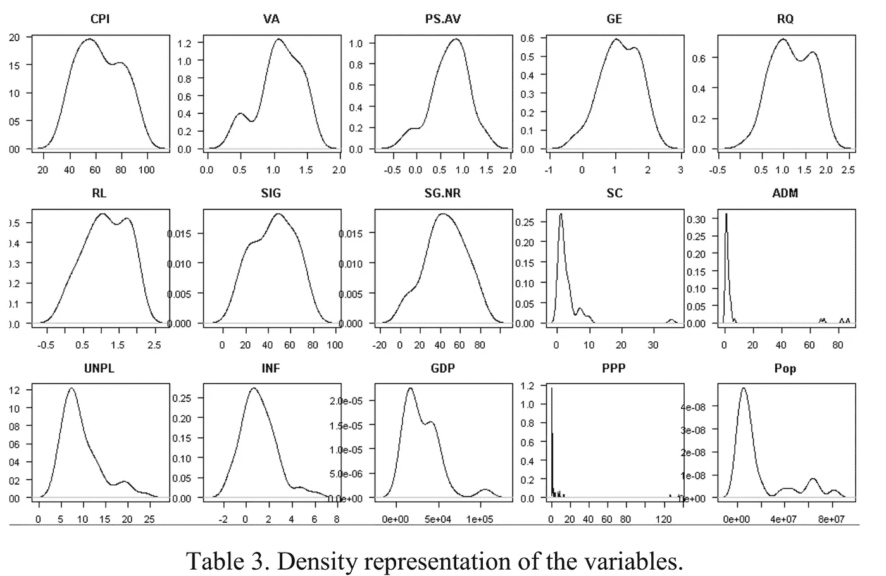

在此分析中，我们可以确认上一步中提到的异常值的存在。但最重要的是，我们可以确定变量的分布。这个想法是，分布应该接近正态分布，也就是说，不偏向一边。许多变量偏向一侧，但总体而言，该分布接近正态分布，尽管不需要进行主成分分析。

## 4.2.第二阶段结果

关于包括这两个时期的聚类分析的结果，我们看到许多国家聚集在一起，显示出很少的变化，但是其他国家与其他国家聚集在一起。下面的树状图显示了两个时期的结果，按年份分别分析了每个国家，例如，比利时在 2010 年和 2016 年的情况如下:

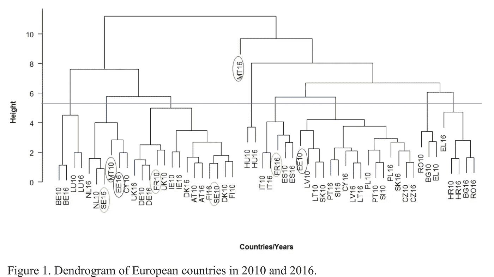

大多数国家坚持其在该组中的立场；与此同时，其他国家如爱沙尼亚也经历了巨大的变化。它从 2010 年与拉脱维亚和斯洛伐克同组，成为瑞典和荷兰等国家的一部分。我们可以假设这是一个正在取得进展的整体成就，因为它们看起来更像是发达国家。另一方面，法国(FR)也在年与年之间经历着变化。在 2010 年，它更像英国和德国，但在 2016 年底，它变得更像西班牙。马耳他是变化最大的国家。2010 年，他们被定位于爱沙尼亚和塞浦路斯，但在 2016 年，他们不太可能类似于任何国家。

如果我们深入到树状图中，如果不算蓝线，我们可以看到两个主要的集群。在最左边，我们可以看到比利时、卢森堡、英国、瑞典、荷兰和丹麦等国家。众所周知，这些国家发展良好，排名靠前。

另一方面，右边是南方国家，如西班牙、意大利、葡萄牙、希腊和其他位于欧洲西部的国家。非常有趣的是，各国在六年内会发生怎样的变化，一些国家的地位提高了，另一些国家的地位下降了，但总的来说，大多数国家保持了自己的地位。

## 4.3.第三阶段结果

数据集中所有变量的主成分分析结果如下图所示。为了更好地解释，国家节点用虚线连接。

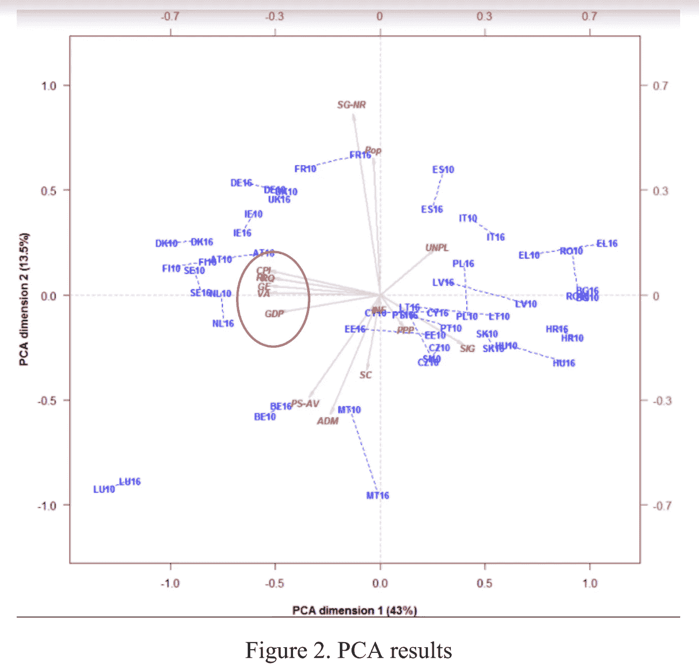

第一个维度解释了总方差的 43%；同时，第二维度解释了 13.5%，这是第二大跳跃。因此，我们更多地考虑第一个来解释这种差异，尽管可持续增长(SG-NR)似乎是第二维中最重要的差异贡献者，并且它与人口规模高度相关。

治理指标声音和问责(VA)、政府效率(GE)、法治(RL)、监管质量(RG)和清廉指数(CPI)高度相关。这些相关性是有意义的，因为发达国家往往在各个方面都有良好的治理指标，这使得该国在腐败方面非常干净。正如我们所看到的，一个国家的治理指数越高，他们在感知腐败方面就越干净。

此外，前面提到的变量(用红色圈出的)与明智和包容性增长(SIG)之间存在着深刻的负相关。看来，所罗门群岛政府的支出比例越大，该国就越有可能非常腐败，治理指标也越低。由此，我们可以假设，投资于这一类别，可能是政治家从公共资金中获利的一种方式，而不会如其名称所示产生任何明智的增长。这一假设有助于欧盟委员会详细研究匈牙利等国家在这一类别中的支出，这些国家在这一类别中的支出占其总预算的 50%以上。

关于失业率，似乎与 CPI 和治理指标负相关。腐败的国家在这方面比那些比较干净的国家失业率更高。我们可以看到，西班牙、意大利和希腊等发达国家失业率较高，但 CPI 得分较低。由此，我们可以假设腐败的政府会直接影响到社会的失业率。此外，通货膨胀率(INF)，安全和公民身份(SC)和人口规模(POP)是解释研究方差最小的变量。

最后，我们可以从主成分分析中得到的主要结果是，从 2010 年到 2016 年有显著的变化。大多数国家的趋势是向图表的右侧移动。结果显示，各州在腐败和治理问题上正在退步，这种情况在所有国家蔓延。看起来，欧洲国家在腐败和治理指标上的得分越来越低，这可能是欧洲议会的红色警报。有趣的是，治理得分越低，国家腐败的可能性就越大。我们可以假设，业绩差不是因为缺乏专业素养，而是缺乏价值观。

## 4.4.第四阶段结果

这一阶段的线性回归模型与独立变量 CPI 相关，并确定哪个预测变量解释得最多，以便进行预测。我们首先确定哪些变量更有可能与自变量相关。下表显示了这些关系。

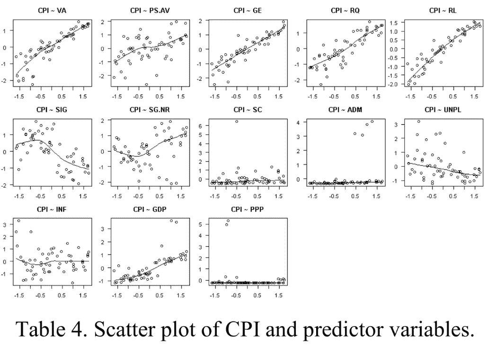

散点图和平滑线表明，治理指标随 CPI 线性增加。其他如 SC，INF 和，PPP 显示没有线性关系。这一点通过对每一个变量进行回归分析得到了证实。

包含 CPI 和治理指标变量的回归模型显示，法治显著不同于 p 值较低的 cero。此外，回归的斜率也明显不同于零。R 表明，治理指标变量解释 CPI 的 88.6%，经调整的 R 为 87.5%。

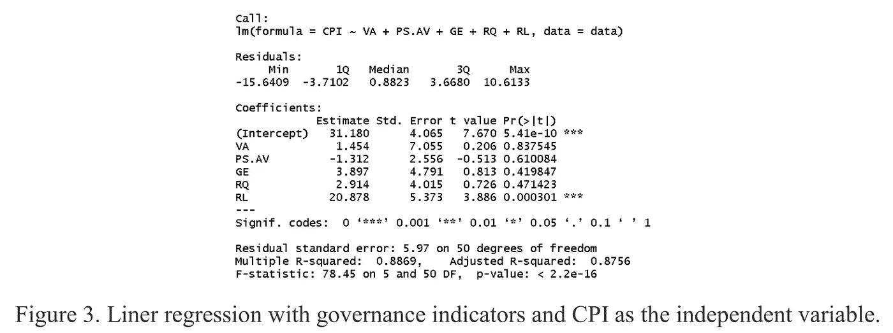

此外，对预算支出的第二次回归表明，所有变量都与 cero 显著不同，p 值小于 5%的置信水平。模型表明变量解释了 48.4%的方差。

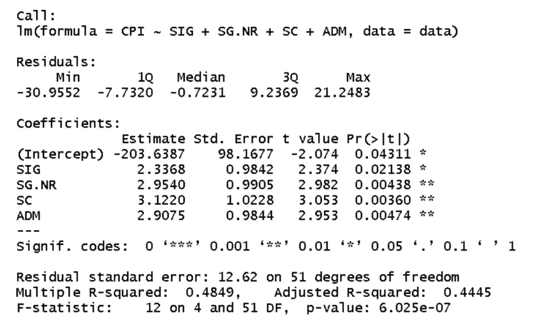

Figure 4\. Linear Regression with budget expenditure as the explanatory variables and CPI as the target variable.

此外，我们运行回归树分析。首先，使用代码中显示的变量，将两年的所有数据集放在一起:

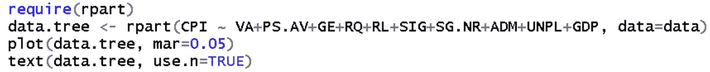

结果是下面的回归树:

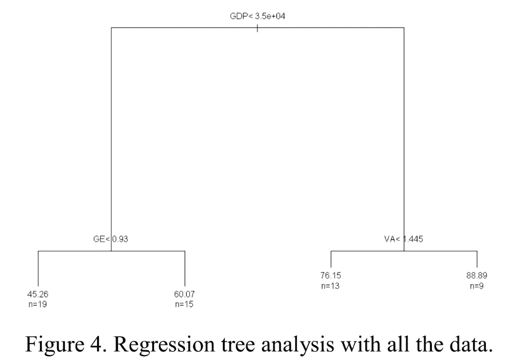

在回归树中我们可以分析出，如果 GPD 低于 3.5+04，政府有效性小于 0.93，我们预计 CPI 得分为 45.26，非常低，有 19 个国家落在这一边。另一方面，如果国内生产总值高于结果，并且话语权和问责制得分高于 1.445，我们预计 CPI 得分将为 88.89，9 个国家落在该区域。让我们记住，国家可以被计算两次，因为我们将它们作为单独的样本，2010 年和 2016 年。

# 5.结论

治理指标与对腐败的看法密切相关，就腐败而言，治理得分较高的发达国家比政府绩效差的国家更干净。正如我们之前提到的，政治家缺乏价值观直接影响政府的表现，而普通民众是受影响最大的群体，这可以通过失业率反映出来。

随着我们走向未来，大多数欧洲国家表现不佳，2010 年至 2016 年之间有显著变化，我们可以在 PCA 分析中看到，所有国家在 2016 年都远离了良好治理得分。

法治(RL)是与 CPI 最相关的指标。就腐败而言，一个法治强大的国家似乎比法治指数较低的国家更干净。这个结论是有道理的，因为强有力的法律会惩罚那些腐败的政客。

许多国家在 2010 年至 2016 年间经历了变化。例如，法国在第一年的研究中就处于发达国家的行列，到 2016 年就被移到了欠发达国家。像北欧这样的发达国家保持现状，这意味着它们在研究期间没有变化。

最后，Smart 和增长支出与 CPI 之间存在很强的负相关性。在这一类别中花费大量金钱的国家，如饥饿国家，似乎有较低的 CPI 分数。

# 6.数据源

[http://info.worldbank.org/governance/wgi/index.aspx#home](http://info.worldbank.org/governance/wgi/index.aspx#home)

http://ec.europa.eu/budget/figures/interactive/index_en.cfm

[http://EC . Europa . eu/Eurostat/statistics-explained/index . PHP/losis _ statistics](http://ec.europa.eu/eurostat/statistics-explained/index.php/Unemployment_statistics)

[http://EC . Europa . eu/Eurostat/statistics-explained/index . PHP/File:HICP _ 所有](http://ec.europa.eu/eurostat/statistics-explained/index.php/File:HICP_all-)-项目，_ 年度 _ 平均 _ 通货膨胀率，_ 2006–2016 _(% 25)_ yb17 . png

[http://ec.europa.eu/eurostat/tgm/table.do?tab=table&init = 1&language = en&pcode = TPS 00001&plugin = 1](http://ec.europa.eu/eurostat/tgm/table.do?tab=table&init=1&language=en&pcode=tps00001&)

[https://data . OECD . org/conversion/purchasing-power-parity-PPP . htm # indicator-chart](https://data.oecd.org/conversion/purchasing-power-parities-ppp.htm#indicator-chart)

https://data . OECD . org/conversion/exchange-rates . htm # indicator-chart