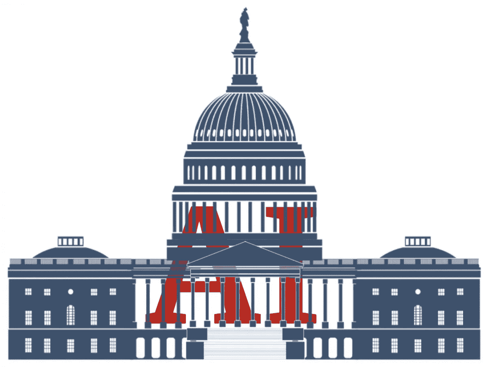

# 国会能帮助保持人工智能对消费者的公平性吗？

> 原文：<https://towardsdatascience.com/can-congress-help-keep-ai-fair-for-consumers-a9f3e86ab25?source=collection_archive---------33----------------------->

## 6 月 26 日的国会听证会为金融服务敲响了警钟。

> 企业如何确保人工智能系统不会对弱势群体产生不同的影响，以及监管机构和国会应该采取什么保护措施来保护消费者？
> 
> 在多大程度上**应该要求公司审计这些算法**以便他们不会不公平地歧视？谁应该确定这方面的标准？
> 
> 我们需要**确保人工智能不会制造偏向歧视的倾向。**

# 两个新的众议院工作队监管金融科技和人工智能

这些不是学术论文或社论中的问题。这些问题是 6 月 26 日美国众议院金融服务委员会听证会的证人提出的——由民主党人和共和党人，伊利诺伊州、北卡罗来纳州和阿肯色州的代表提出。

两党都认为，如果不加以控制，人工智能可能会对金融服务的公平性构成威胁。尽管这一危险的确切程度仍有争议，但美国和海外政府都承认这一必要性，并主张有权为此目的监管金融机构。

6 月 26 日的听证会为金融服务业敲响了第一记警钟:它们需要准备好应对并遵守未来要求透明和公平的立法。

在本帖中，我们回顾了这次听证会的重大事件，并探讨了美国众议院如何开始审查人工智能在金融服务中的风险和好处。

# 两个新的众议院工作队监管金融科技和人工智能

今年 5 月 9 日，美国众议院金融服务委员会主席，国会女议员 Maxine Waters[宣布成立两个工作组](https://financialservices.house.gov/news/documentsingle.aspx?DocumentID=403738)【2】:一个负责金融科技，一个负责人工智能。

一般来说，工作队开会是为了调查可能需要改变政策的具体问题。这些调查可能涉及召集专家向工作队通报情况的听证会。

这两个工作小组在权限上有所重叠，但是委员会的目标暗示了一些区别:

*   fintech 任务组应更关注应用(如承销、支付、即时监管)。
*   人工智能任务组应该更长期地关注风险(例如，欺诈、工作自动化、数字识别)。

沃特斯主席明确解释了她对监管的总体兴趣:

> 确保鼓励负责任的创新，确保监管者和法律适应不断变化的环境，以最好地保护消费者、投资者和小企业。

被任命为人工智能工作组主席的国会议员比尔·福斯特在一份类似的声明中赞扬了人工智能的潜力，但也警告说:

> 至关重要的是，人工智能在金融服务中的应用有助于实现对所有美国人都公平的经济。

第一次听证会确实发现了人工智能在金融服务领域的大量应用。但它也得出结论，这些担忧情绪既不是对选民的歪曲，也不是错位的。

*From left to right: Maxine Waters (D-CA), Chairwoman of the US House Committee on Financial Services; Bill Foster (D-IL), Chairman of the Task Force on AI; French Hill (R-AR), Ranking Member on the Task Force on AI*

# 人工智能的风险

在听证会后期的一次幽默交流中，众议员西尔维娅·加西亚(德克萨斯州民主党)请一位证人，萨里大学的邦妮·布坎南博士向普通美国人讲话，用 25 个或更少的单词解释人工智能。它进行得不顺利。

> *布坎南博士*
> 我认为这是一组技术和过程，可以确定一般的模式识别，关系的通用近似，并试图从嘈杂的数据或感官知觉中检测模式。
> 
> 众议员加西亚 我想这可能让他们更加困惑。
> 
> 布坎南博士哦，对不起。

除了开玩笑，众议员加西亚说得有道理。人工智能异常复杂。不仅如此，对许多美国人来说，这可能是一种威胁。正如加西亚后来所表达的，“我认为有一种想法，所有这些机器人将接管所有的工作，每个人都将进入我们的信息。”

在他的开场白中，工作小组资深成员、众议员 French Hill (R-AR)试图先发制人，至少先解决第一个问题。他引用了世界经济论坛的一项研究，称因人工智能而失去的 7500 万份工作将被 1 . 3 亿份新工作所抵消。但美国人仍然对 AI 发展感到焦虑。

在 2018 年 6 月牛津人工智能治理中心对 2000 名美国人进行的调查中，研究人员观察到

*   压倒性的支持对机器人和/或人工智能的谨慎管理(82%的支持)
*   更信任科技公司而不是美国政府为了公众的利益来管理人工智能
*   对开发高级机器智能的混合支持(定义为“当机器能够比今天的人类更好地执行几乎所有与经济相关的任务时”)

这种公众对人工智能发展的担忧也反映在任务组和专家的担忧上。在整个听证会中，个人隐私被提到了九次，特别是在国会议员安东尼·冈萨雷斯(R-OH)关于“平衡创新与赋予消费者数据权力”的宽泛问题中，专家小组没有充分解决这个问题。

但更多的时候，证人讨论的是**公平** **以及人工智能模型如何能够不被注意地进行区分**。最值得注意的是，布鲁金斯学会(Brookings Institution)研究员尼科尔·特纳-李(Nicol Turner-Lee)博士建议实施护栏，以防止有偏见的训练数据“复制和放大历史上对有色人种和其他弱势群体的刻板印象”。

她并不孤单。[另一份 2019 年 4 月的布鲁金斯报告](https://www.brookings.edu/research/credit-denial-in-the-age-of-ai/) [5]否认了这种对不公平的担忧，“算法使用一系列**变量拒绝信贷或提高利率，这些变量从根本上受到社会中根深蒂固的历史歧视因素的驱动**

因此，如果我们如此担心，为什么还要费心将人工智能的潘多拉魔盒引入金融服务呢？

# 人工智能的好处

根据国会议员希尔的说法，人工智能的潜在好处是“收集海量数据，检测异常，解决复杂问题。”在金融服务领域，这意味着欺诈、保险和核保的模型实际上更加公平和准确。**这可以同时提高银行的盈利能力，并将服务扩展到以前服务不足的银行。**

Hill 和 Foster 都引用了国家经济研究局的工作论文【6】发现在一个案例中，算法贷款模型比面对面贷款者少歧视 40%。此外，ZestFinance 的首席执行官兼专家证人道格拉斯·梅里尔博士(Dr. Douglas Merrill)声称，使用他公司的人工智能工具的客户在信用卡、汽车贷款和个人贷款方面体验到了更高的批准率，并且违约率没有增加。

此外，希尔用一个关于人工智能如何重塑行业的重要观点来框定他的声明:这一进步将“对颠覆性创新者和我们现有的金融参与者都有用”。乍一看，这似乎有悖常理。

“颠覆性创新者”更加敏捷，受传统流程的阻碍更少，[在实施新技术方面具有优势](https://knowledge.wharton.upenn.edu/article/banking-and-fintech/)。[7]但是，如果没有“现有金融机构”的巨额预算和客户基础，这些颠覆者怎么可能成功呢？陷入旧方式的现任者会采用人工智能吗？

Jesse McWaters 先生是世界经济论坛的金融创新负责人，也是最后一位专家证人，他谈到了这一明显的悖论，讨论了什么将“重新绘制我们所认为的金融部门的地图”第三方人工智能服务提供商-从传统银行到小型金融科技公司-可以“帮助较小的社区银行保持与客户的数字相关性”，并“使金融机构能够向前跨越。”

国会中的自由市场支持者认为，扶持竞争性市场，尤其是在金融服务等集中行业，是一项绝对的好处。然而，以这种方式“重绘地图”会让金融业变得更大、更复杂。国会将不得不制定政策，不仅要应对更复杂的模型，还要应对更复杂的金融体系。

这种制度给代表股东利益的公司和代表消费者利益的政府都带来了风险。

# 企业和政府关注风险

企业已经在采取行动，避免人工智能模型故障和系统复杂性带来的潜在损失。一份【2019 年 6 月 Gartner 报告 [8]预测，到 2023 年，75%的大型组织将雇佣人工智能行为取证专家来降低品牌和声誉风险。

然而，政府认识到，企业主导的举措，如果出于保护公司品牌和利润的动机，可能只能到此为止。对于一个保护消费者、投资者和小企业的政府来说，差距可能仍然存在。

随着政府探索如何填补这一缺口，它们正在建立支撑未来指导和监管的原则。各理事机构的主题是一致的:

*   人工智能系统需要值得信赖。
*   因此，他们需要代表人民的政府给予一些指导或管制。
*   这种指导应该鼓励公平、隐私和透明。

在美国，唐纳德·川普总统于 2019 年 2 月签署了[一项行政命令](https://www.whitehouse.gov/presidential-actions/executive-order-maintaining-american-leadership-artificial-intelligence/) [9]，“以保持美国在人工智能领域的领导地位”，指示联邦机构，除其他目标外，“**通过建立人工智能开发和使用指南，培养公众对人工智能系统的信任。共和党的白宫和民主党的众议院似乎总是发生冲突，但是他们在这里是一致的。**

欧盟也正在建立一个监管框架，以确保可信的人工智能。同样，在他们从 2019 年 4 月【10】开始的[最新沟通中，七项要求包括:隐私、透明和公平。](https://ec.europa.eu/futurium/en/ai-alliance-consultation/guidelines#Top)

六月的 20 国集团峰会[11]借鉴了类似的想法，创造了他们自己的一套原则，包括公平和透明，但也增加了可解释性。

这些理事机构正处于调查事实的阶段，在指导政策之前确立原则并了解他们所面临的情况。用福斯特主席的话来说，工作组必须理解“这项技术将如何影响决策者在未来几年必须解决的问题。”

在众议员加西亚有趣的挑战前一个小时，布坎南博士思考了几个共同关心的问题。

> 决策者需要关心人工智能模型的**可解释性**。我们应该**避免黑盒建模**，在黑盒建模中，人类无法确定机器学习或深度学习算法的底层过程或结果。

但通过这一陈述，她提出了一个解决方案:让这些人工智能模型变得可以解释。如果人类确实能够理解模型的输入、过程和输出，我们可以信任我们的人工智能。然后，通过人工智能在金融服务中的应用，我们可以促进所有美国人的公平。

# 来源

[1]美国众议院金融服务委员会。"人工智能透视:我们在哪里以及金融服务的下一个前沿."[https://financial services . house . gov/calendar/event single . aspx？EventID=403824](https://financialservices.house.gov/calendar/eventsingle.aspx?EventID=403824) 。2019 年 7 月 18 日接入。

[2]美国众议院金融服务委员会。"沃特世宣布成立金融技术和人工智能委员会工作组."[https://financial services . house . gov/news/document single . aspx？DocumentID=403738](https://financialservices.house.gov/news/documentsingle.aspx?DocumentID=403738) 。2019 年 7 月 18 日接入。

[3]利奥波德，直到亚历山大，Vesselina Ratcheva，和萨迪亚扎希迪。《2018 年就业报告的未来》世界经济论坛。[http://www3.weforum.org/docs/WEF_Future_of_Jobs_2018.pdf](http://www3.weforum.org/docs/WEF_Future_of_Jobs_2018.pdf)

[4]张、宝宝、艾伦·达福。“人工智能:美国的态度和趋势。”英国牛津:人工智能治理中心，牛津大学人类未来研究所，2019 年。[https://ssrn.com/abstract=3312874](https://ssrn.com/abstract=3312874)

[5]克莱因，亚伦。“人工智能时代的信用否认。”布鲁金斯学会。2019 年 4 月 11 日。[https://www . Brookings . edu/research/credit-denial-in-the-age-of-ai/](https://www.brookings.edu/research/credit-denial-in-the-age-of-ai/)

[6]巴特利特、罗伯特、王茂林·莫尔斯、理查德·斯坦顿、南希·华莱士，“金融科技时代的消费贷款歧视。”美国国家经济研究局，2019 年 6 月。【https://www.nber.org/papers/w25943 

[7]斯奈德，斯科特。“银行如何跟上数字颠覆者。”宾夕法尼亚州费城:宾夕法尼亚大学沃顿商学院，2017 年。[https://knowledge . Wharton . upenn . edu/article/banking-and-fin tech/](https://knowledge.wharton.upenn.edu/article/banking-and-fintech/)

[8]“Gartner 预测，到 2023 年，75%的大型组织将雇佣人工智能行为取证专家来降低品牌和声誉风险。”高德纳。2019 年 6 月 6 日。[https://www . Gartner . com/en/news room/press-releases/2019-06-06-Gartner-predicts-75-of-large-organizations-will-hire](https://www.gartner.com/en/newsroom/press-releases/2019-06-06-gartner-predicts-75--of-large-organizations-will-hire)

[9]美国，总统行政办公室[唐纳德·特朗普]。13859 号行政命令:关于保持美国在人工智能领域领导地位的行政命令。2019 年 2 月 11 日。[https://www . white house . gov/presidential-actions/executive-order-maintaining-American-leadership-artificial-intelligence/](https://www.whitehouse.gov/presidential-actions/executive-order-maintaining-american-leadership-artificial-intelligence/)

[10]“建立对以人为中心的人工智能的信任。”欧洲委员会。2019 年 4 月 8 日。[https://EC . Europa . eu/futuri um/en/ai-alliance-consultation/guidelines # Top](https://ec.europa.eu/futurium/en/ai-alliance-consultation/guidelines#Top)

[11]《二十国集团关于贸易和数字经济的部长声明》2019 年 6 月 9 日。[http://trade.ec.europa.eu/doclib/press/index.cfm?id=2027](http://trade.ec.europa.eu/doclib/press/index.cfm?id=2027)

*原载于 2019 年 7 月 18 日*[*https://blog . fiddler . ai*](https://blog.fiddler.ai/2019/07/can-congress-help-keep-ai-fair-for-consumers/)*。*