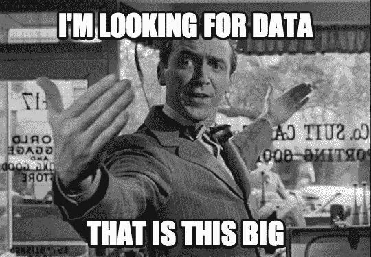
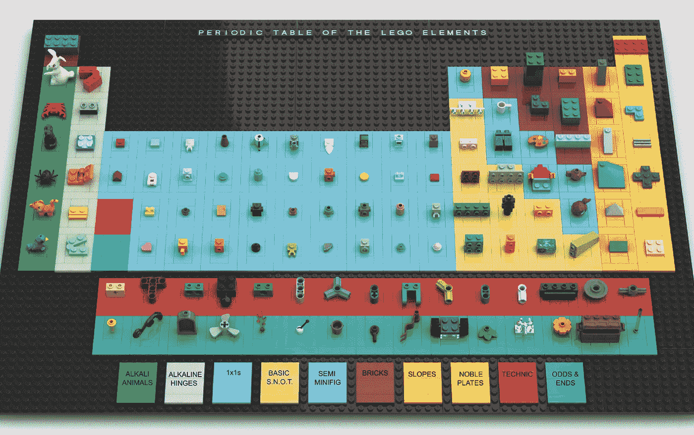
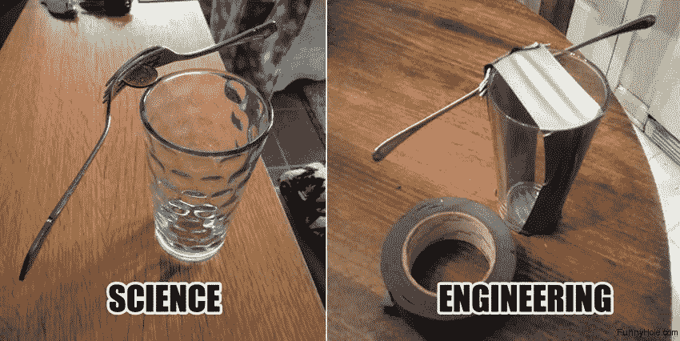

# 数据科学能从物理学中获得灵感吗？

> 原文：<https://towardsdatascience.com/can-data-science-get-inspiration-from-physics-9ab95a3c04d6?source=collection_archive---------23----------------------->

## 从一个做出转变的人的角度看问题。

Night sky in Poland, summer 2019\. Source: private collection.

我喜欢物理。如果我没有养成在大学校园实验室之外过职业生活的习惯，我会继续学习这门课程。然而，在我生命中的某个时刻，我感觉我会享受许多软件开发人员的生活方式。自然地，数据科学似乎是两个世界中最好的，并成为我的新方向。

在这篇文章中，我想与你分享我的一些观察，关于我认为物理学如何丰富数据科学。我们将超越简单的“保持好奇”的叙述。相反，我们将关注更微妙的东西，并研究将其与软件工程区分开来的“思维模式”。希望我们会发现熟悉物理可以给数据项目带来积极影响的领域，以及它可能不足的地方。

# 什么是数据科学？

从形式上来说，单词 [*科学*](https://dictionary.cambridge.org/dictionary/english/science) 表示构建和组织知识的系统企业，这是通过观察和可测试的预测来完成的。 [*物理学*](https://dictionary.cambridge.org/dictionary/english/physics) 作为自然科学的一部分，是一门用科学方法来建立对物质的认识的学科。简而言之，它研究世界并帮助预测其行为。

那么什么是数据科学呢？

Source: [https://analyticsindiamag.com/](https://analyticsindiamag.com/).

[数据科学](https://dictionary.cambridge.org/dictionary/english/data-science)是一个新的领域，它试图使用科学方法来构建给定*数据*的洞察和预测。在这里,“数据”一词可以指一些特定的物理测量，但也可以描述意见或表示任何合成或抽象的信息。正因为如此，它的主要兴趣领域与物理学非常不同。此外，由于今天数据大多是数字记录，这使得整个学科与计算机科学和软件工程紧密相关。最后，与物理学不同，数据科学主要在商业环境中运作。

然而，与计算机领域相反，数据科学应该对数据做一些事情——最好是提取信息并将其投射到未来。还有，和纯商业相反，它强调理性。

这听起来和物理学没有太大的距离，不是吗？

# 模拟现实

先说相似点。这两个学科中存在的一个共同的实践是对现实的建模。物理学家通过测量来研究世界，并用数学方程来描述世界。软件开发人员使用*抽象*来映射问题，并通过代码来表达它们。

这些抽象本身似乎源于物理学中一个众所周知的概念，即*一个孤立的系统。当我们对世界进行某种理想化假设，并将其视为一个分离的实体时，我们称一个系统为孤立的。这种方法使得问题更容易描述和测试。*

对于数据科学，尽管信息的性质不同，我们也试图通过隔离或抽象来创建我们所面临的问题的某种表示。这是一个好的开始。

# 第一性原理思维

现在，考虑以下情况:

“光子是玻色子类的物体，电子是轻子。原子是粒子和用途的实例。bond()方法形成分子……现在，这一切都是为了执行 universe.run()，对吗？”

除了跳过一百万个抽象层之外-是的。至少，它表明了思考的方向。另外，对整个宇宙建模不就是物理学作为一门科学的终极目标吗？确实是！对吗？

差不多，但不完全是。

Source: [https://reddit.com](https://reddit.com).

虽然这种想法很诱人，但这不是物理学家想要的。事实上，物理学家宁愿关心积木本身，而不是试图编译所有的基本积木。物理学家知道，一旦砖块被理解，通过组合、重复、排列和重新排列这些碎片，就获得了最终的建筑。

形成一个更高的结构当然不是一件容易的事情，但是计算机工程师是寻找砖块最佳排列的专家。这也是他们最感兴趣的领域。

两者之间的推理似乎几乎相反。当计算机专家试图爬上抽象的阶梯时，物理学家会急切地走下去用放大镜检查种子。说到数据科学，两种思维路径都需要。为了创建高效的预测模型，数据科学家必须了解需要哪些数据组件，以及应该如何安排它们。哪些功能看起来有意义？如果听起来像*探索性数据分析* (EDA)，物理学家一直在做。

# 从物理学导入洞察力

Source: [https://wonderfulengineering.com](http://wonderfulengineering.com).

说到有意义的特性，物理学，即使是最“实用”的，也需要相当数量的洞察力。深刻理解事物运行(或不运行)的原因不仅对构建有意义的假设至关重要，而且从长远来看也是成功的关键。

相反，软件工程的重点是交付商业解决方案。它强调“如何”而不是“为什么”，这既是优点，同时也是缺点。在处理复杂性、优化性能和保证健壮性方面，这是一个优势。当一头扎进数据中，即使是**领域驱动设计也没有给我们带来太多。这只是开发产品的另一种方式。换句话说，计算机科学没有计算出数据有什么意义的方法。**

**想到数据科学，它可能会遇到好像扩展计算机科学加上 EDA 可能会做到这一点。不幸的是，这是一个缺点。**

# **实验的价值**

****

**Source: [https://memecenter.com.](https://memecenter.com.)**

**物理学可以是理论性的，但它仍然是一门实验科学。无论是在强子对撞机上还是仅仅在 [*格丹肯*](https://en.wikipedia.org/wiki/Thought_experiment) 上，它都教导如何进行从陈述假设到分析结果的过程。在构建数据产品时，软件农场变成了进行虚拟实验的大数据军事基地。虽然没有人会因为比特(和字节)的飞散而受伤，但设计和携带这些受控的数据爆炸需要的不仅仅是建立必要的基础设施和挥舞“请勿靠近”的牌子。**

**仅仅依靠统计方程也不能保证成功。人们必须全面考虑正在调查的问题。虽然预测模型是最终目标，但在实现之前通常需要大量的实验。**

**在这里，如果数据科学向物理学寻求建议，这将有助于强化实验过程。这样的过程应该有助于产生深刻的见解，但又不影响审查。它还可能包括数据收集等附带活动——只要能确保结果可信，什么都可以做。**

# **数据科学不是物理学**

**到目前为止，我们在数据科学的背景下只考虑了物理学的积极方面。那些你不会从物理学中寻找灵感的领域呢？**

****

**Source: [https://me.me](https://me.me).**

**一个例子是运行一个没有明确交付约束的纯数据驱动的项目。这样一个项目很容易陷入永无休止的实验中。虽然这对团队来说很有趣，但对组织来说却很昂贵。其主要原因是数据科学的业务环境，而物理学没有停止机制。**

**其次，对构建模块的理性理解并不能保证解决更大的问题。软件开发人员通常更有能力提取粒度级别，并在任何开发开始之前发现实现挑战。最终，让它“合二为一”是一项工程工作，而知道砖块并不能让一个人建造房子。有时候，挖得太深可能是不合理的。**

**最后，至少在一些物理学家中也存在一种不健康的倾向，即积累数据只是为了“以防万一”。这不仅让开发人员非常头疼，在极端情况下，整个开发甚至可能无法启动！同样，洞察力是通过问正确的问题获得的——而不是问太多的问题。**

# **结束语**

**作为一门学科，物理学比计算机科学古老得多，比软件工程成熟得无可比拟。当阿基米德跳出他的浴盆时，世界还没有听说过[算法](https://en.wikipedia.org/wiki/Muhammad_ibn_Musa_al-Khwarizmi)*当艾萨克·牛顿阐明动力学定律时，第一台处理器早就被创造出来了。相反，软件工程只有一百年的历史，而互联网的普及被认为是最近的三十年。尽管每天都面临挑战，但如果是医学，我们可以说我们只是学会了洗手。***

***另一方面，技术进步的速度和它在我们生活中的无所不在是前所未有的。让我们以总数据量为例，估计今天大约为 [50 兆字节](https://www.forbes.com/sites/louiscolumbus/2018/05/23/10-charts-that-will-change-your-perspective-of-big-datas-growth/#40aad8142926)。如果一个字节的信息重 1 公斤，那么全世界的数据总量已经相当于月球的 2/3(到 2020 年)。再过五年，它将超过月球两倍。我们，自愿去理解这些数据的人，不能在学习中偷懒。***

***物理学作为一门古老的学科，确实有时间研究出一些行之有效的方法。有时我甚至认为数据科学是虚拟的物理，尽管每次我都觉得有点奇怪。然而，如果数据科学从物理学中得到一些建议，它会立即投入到实验和分析中去。***

***从第一原则的角度思考对数据科学也大有裨益，前提是它不会变成“过度思考”。尽管如此，历史上发生的一些最伟大的发现背后往往是第一性原理思维。记住这一点是有益的。***

***最后，数据科学相关活动不能脱离组织的业务模型环境。与物理学这种自由科学不同，数据科学的主要目标是帮助发展业务。如果这一点得到保证，物理学可能会为数据科学提供非常有益的观点，并确实有助于它的成功。***

# ***还会有更多…***

***我计划把文章带到下一个层次，并提供简短的视频教程。***

***如果您想了解关于视频和未来文章的更新，**订阅我的** [**简讯**](https://landing.mailerlite.com/webforms/landing/j5y2q1) **。你也可以通过填写[表格](https://forms.gle/bNpf9aqZJGLgaU589)让我知道你的期望。回头见！*****