# 深度学习能帮助我们重新发现过去吗？

> 原文：<https://towardsdatascience.com/can-deep-learning-help-us-to-rediscover-the-past-5fa940c4e6c3?source=collection_archive---------23----------------------->

## 深度学习在考古学中的应用。

深度学习(D.L .)已经被证明是一种解决计算机视觉中广泛问题的杰出工具，并在几个领域中具有实际应用。然而，这种技术在考古学中，特别是在考古遗址的探测中，还没有被广泛地探索。在这篇文章中，我想告诉你 D.L .在机载数据分析中探测考古痕迹的应用。

Rune stone located at Lund University campus, the inscribed runic text describe the death of a King in Northern Europe. Image taken from: [https://www.instagram.com/j.org.ls/](https://www.instagram.com/j.org.ls/)

如今，从航空图像中探测考古结构几乎完全依赖于专家的分析。这是一项耗时的任务，需要高度专业化的知识，并且涉及进行分析的人的解释偏差。例如，在下图中，您可以看到两张航空照片。其中一个包含考古结构，而另一个没有。

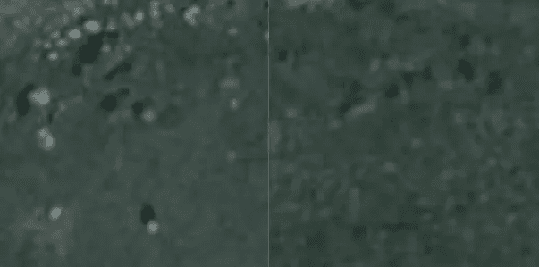

Example of aerial photographs containing archaeological structures (right) and just a pile of rocks (left). ©Lantmäteriet: I2018 / 00119.

从航空数据中探测考古遗址所用的数据有不同的类型。它不仅限于电磁波谱可见范围内的航空照片。还使用了从 ASTER 卫星等专门卫星获得的多光谱航空图像，或使用激光雷达系统提供的激光测绘，激光雷达系统的优点是可以穿过植被并提供清晰的地形测绘。在最后一种情况下，它在探测植被非常密集的地区的考古遗址方面特别有用，例如发现隐藏在危地马拉丛林中的新遗址。对这些遗址的探测可以恢复为对可能属于古代景观遗产的地形异常的搜索。这种所谓的异常可能有不同的类型，被称为考古痕迹。

## **案例分析**

隆德大学考古和古代史系提供的数据与来自瑞典南部波罗的海沿岸 5 个地区(skne 和 Blekinge 县)和位于马拉伦湖的 Birka 岛 Birka 的电磁波谱可见光和近红外区域的航空图像相对应。总共提供了 8 幅航空图像，其中包括与维京时代的坟墓和结构相对应的遗留痕迹和地形异常。这些结构有不同的形状，是最臭名昭著的船状墓葬。

所有图像的分辨率都是 20cm/像素，但是它们都具有不同的尺寸，因此执行平铺处理以具有如图像中所示的 100×100 像素的恒定尺寸的图像，重要的是要注意到，由于空间图像平铺的方式(将整个空间图像均匀地分成恒定尺寸的正方形，而不管其内容如何)， 在一些情况下，考古结构似乎被分成不同的瓦片，而在其他一些情况下，瓦片中有不止一个单一的结构。

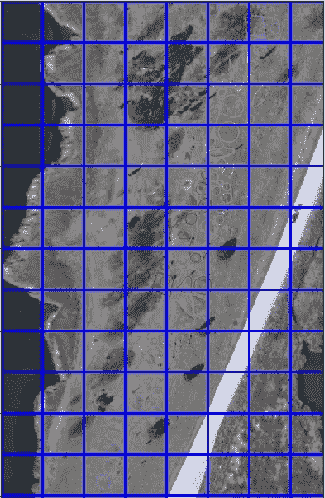

Example of one of the aerial images after the tiling. It is possible to see the shapes of the different structures marked in different colors. © Lantmäteriet: I2018 / 00119.

下表显示了案例研究数据的最终构成。

Composition of the data set.

从上表中，我们可以看到，有考古痕迹的瓷砖(不包括情况 5)仅占总数据的 5.7%。案例研究 4 被选作测试数据集，因此它被排除在所有其他操作、方法和流程之外，仅在最后用于测试不同的模型。考虑到带有考古痕迹的瓦片数量较少，因此决定最好的方法是开发一个分类器，该分类器可以区分两种不同类型的带有考古痕迹的数据图像(阳性案例)和不带有考古痕迹的图像(阴性案例)。

## **任务**

当谈到分析具有网格状拓扑结构的图像或数据时，深度学习中最常用的模型类型是卷积神经网络(CNN)。这种类型的网络可以被看作是多层感知器的一种变体，但它的优点是比它的前身更轻，因为它基于共享权重的体系结构。在这个项目中，测试了 4 种不同的架构，其中 3 种是最先进的架构(它们是 [VGG16](https://medium.com/coinmonks/paper-review-of-vggnet-1st-runner-up-of-ilsvlc-2014-image-classification-d02355543a11) 、 [Inception V3](https://medium.com/@sh.tsang/review-inception-v3-1st-runner-up-image-classification-in-ilsvrc-2015-17915421f77c) 和 [ReNet50](/an-overview-of-resnet-and-its-variants-5281e2f56035) )以及一种基于典型 CNN 架构的拟议模型，如下图所示。

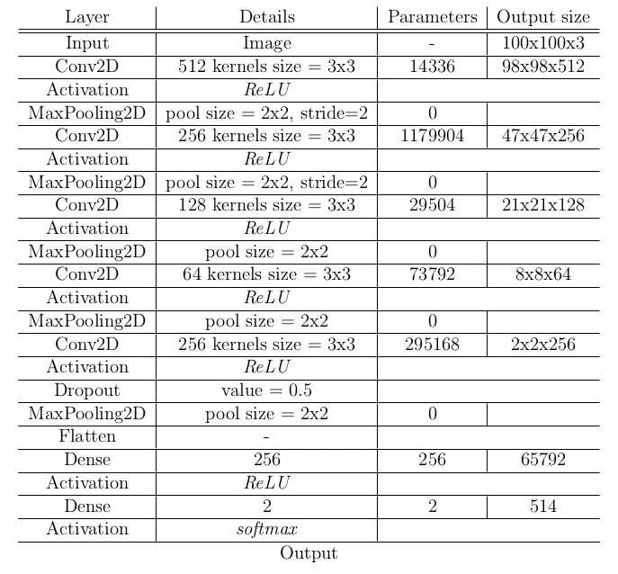

CNN proposed for the project.

通常，当可用的数据量足够大，并且它很好地代表了对于所选择的任务，信息可能出现的所有可能性的分布时，那么网络可以仅用该数据来训练，因为它预期它将从中学习所有需要的模式，以便在看不见的数据中表现良好。然而，当可用的数据不够时，可以应用一些其他技术。迁移学习是一种允许通过使用已经在类似任务中训练过的知识来使过程更有效的方法，它被用于前面提到的 3 个预训练模型。

使用深度学习时的一个常见错误是认为使用它需要大量数据，但这不是真的。在许多现实生活的应用中，标记的数据是有限的，正如这个问题的情况，所以为了解决这个问题，除了使用迁移学习之外，还使用了数据增强。航空图像类型数据的一个优点是，我们感兴趣检测的特征不依赖于方向，这为应用图像变换方法提供了很大的余地

在这个项目中，应用了两种不同的技术，第一种可以称为“典型的”图像数据增强，首先对所有图像应用 90°、180°和 270°的旋转，然后垂直翻转它们，这总共给出了 8 幅不同的图像。最后一步是随机选择这 8 个新创建的图像中的两个，并再次随机选择以下操作中的两个:改变亮度、对比度、色调、饱和度、相对亮度或添加高斯噪声；应用于两个选择的图像。通过使用这些技术，数据集以因子 10 增加，具有 2070 个具有正轨迹的图像和 14050 个没有正轨迹的图像的最终组成。然而，即使在某些情况下使用这种方法，前面所述的技术也不能推广到可能存在自然数据的各种情况，因为它没有在可用于训练的数据中描述。一种可以解决这个问题的方法是使用生成对抗网络(GANs)。

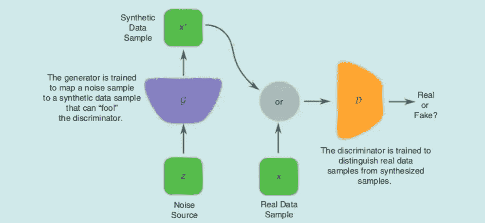

Graphical representation of a GAN network.

gan 是基于零和博弈的场景。在这个博弈中，有两个参与者，生成器和鉴别器。第一个可以被看作是一个函数，它试图从一个被称为潜在空间的表示空间映射到数据空间，在这种情况下是图像。第二个是从图像数据映射到图像来自真实分布而不是生成器分布的概率的函数。如果生成器分布能够完美地匹配真实的统计数据分布，那么鉴别器将被混淆，预测所有输入为 0.5。打个比方，生成器可以被视为伪造者，而鉴别者则是艺术专家。生成器创建假画的目的是逼真，而专家的目的是区分哪些是真的，哪些是假的。值得一提的是，生成器无法访问真实图像，它唯一的学习方式是通过与鉴别器的交互。

第二个数据扩充数据集是通过使用基于深度卷积 GAN (DCGAN)的模型创建的，以创建带有考古痕迹的图像。结果如下图所示。

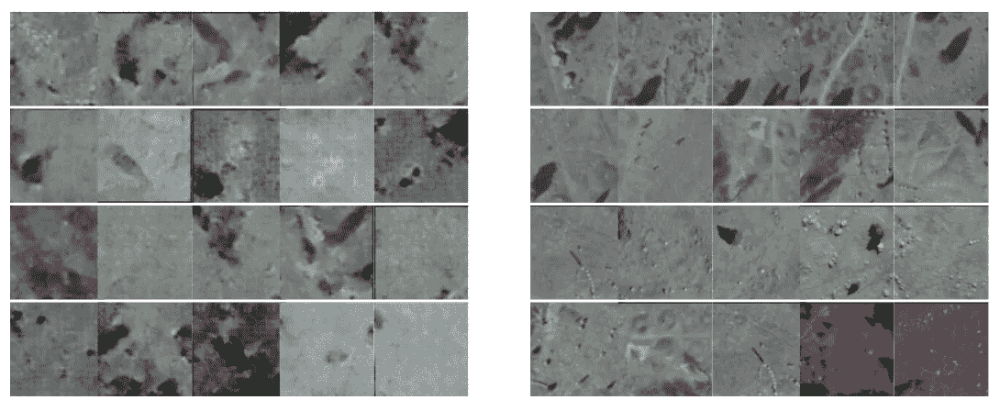

Samples of the images generated using the DCGAN model (left) and real images with archaeological traces.
© Lantmäteriet: I2018 / 00119.

在左侧，您可以看到生成的图像，而在右侧，显示了一些真实图像的示例。其中一些确实与考古遗迹相似，但大多数遗迹的分辨率与原始遗迹不同。

该任务的另一个问题是数据中的不平衡，即 94%的图像对应于我们不感兴趣检测的类别，因此使用准确度作为性能测量不会揭示模型的真实性能，例如，将所有图像分类为负面的系统将获得 94%的准确度分数。为此，选择受试者工作特征(ROC)图及其曲线下面积(AUC)作为性能测量。ROC 曲线是显示分类器的真阳性(TP)和假阳性(FP)之间的权衡的图。这是通过改变阈值来绘制速率值而构建的。网络的输出给出了一个介于 0 和 1 之间的数字，该数字表示一幅图像属于包含考古结构的图像类别的概率。AUC 表明模型能够在多大程度上区分这两个类别。

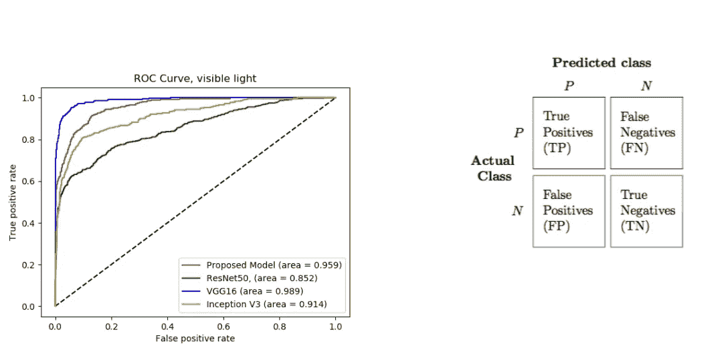

Left: Example of a ROC curve obtained in the validation data set using the data set generated using “typical” data-augmentation techniques. Right: Confusion matrix of a binary classifier.

前面提到的每个模型(VGG16、Inception V3、ResNet50 和提议的模型)在使用前面提到的两种提到的数据扩充方法获得的两个不同数据集中进行训练。使用 4 重交叉验证，选择正则化技术漏失和 L2 的值。使用每个模型的最佳配置，进行最后一轮训练和测试，在这种情况下，在现有的 3 个数据集的每一个中训练模型:没有任何类型的数据增强的原始数据集，使用 DCGAN 生成图像的数据集，以及最后使用典型的数据增强操作的数据集。

## **结果**

每个模型都在看不见的数据中进行了测试，在这种情况下，案例研究 4 分别针对该数据集的每种图像(可见光和红外航空图像)。下表显示了在不同训练数据集上训练的每个不同模型的测试数据集中获得的结果的摘要。

AUC values obtained in the test data set for each of the two types of aerial images and for the different models trained in the data set generated using “typical” data-augmentation techniques.

可以看出，Inception V3 是在可见光范围内的图像情况下表现更好的模型，而 VGG16 是在红外范围内的图像情况下表现更好的模型。

总的来说，观察到在使用“典型”数据扩充技术产生的数据集中训练的所有模型比在训练期间使用的另外两个数据集表现得更好。下图显示了 VGG16 和 Inception V3 的结果。

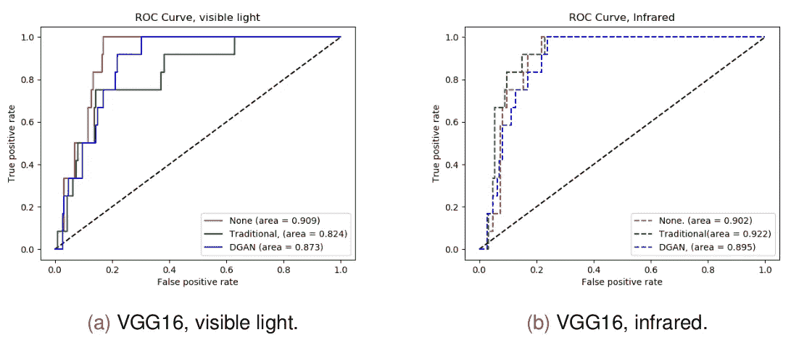

ROC curves and AUC obtained from the test data set for each of the two types of data after training VGG16 in different data sets (No data augmentation, augmentation using traditional techniques and augmentation using a DCGAN model).

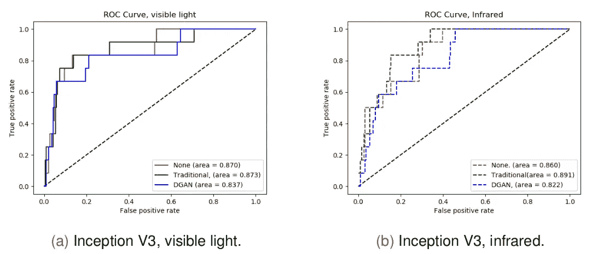

ROC curves and AUC obtained from the test data set for each of the two types of data after training Inception V3 in different data sets (No data augmentation, augmentation using traditional techniques and augmentation using a DCGAN model).

为了改善结果，进行了一个额外的步骤，在这种情况下，使用系综。通过分别训练两个模型并平均它们的输出来构建集成。仅使用在不同数据集中训练的两个最佳模型。下表显示了真阳性和假阳性的百分比。

Percentage of true positives and false positives detection for the different combinations of
VGG and Inception V3 trained on the data augmented data set.

性能也可以在下面的图中可视化，其中显示了每个集合的 ROC 曲线，正如可以看到的，最低的具有 0.894 的 AUC，并且所有其余的具有高于 0.9 的值。最好的一种 AUC 为 0.96

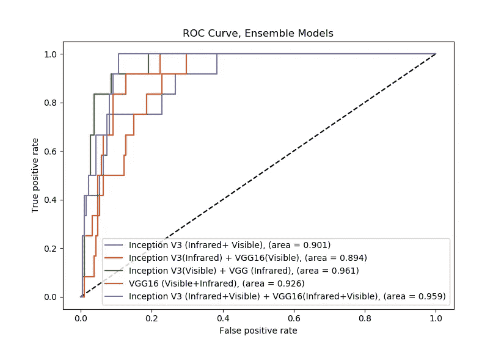

ROC curve of the ensembles.

然而，这些结果并没有告诉太多，所以进行了视觉分析，以了解他们每个人的弱点。为此，需要一个视觉参照物，下图显示了彩色瓷砖对应的区域，这些区域中存在一些考古结构。

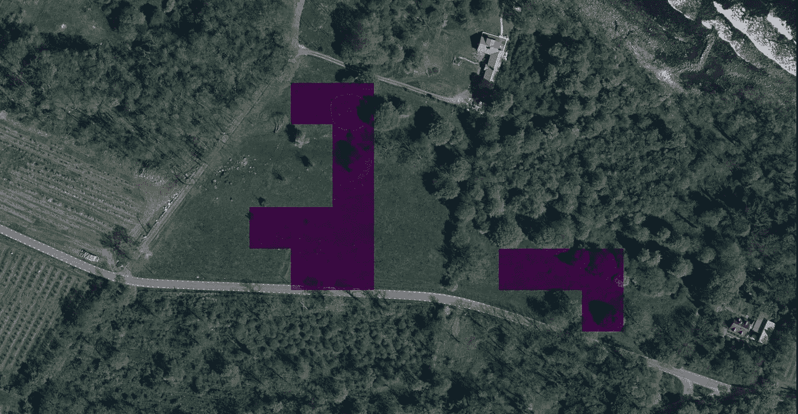

Case study 4 in visible light with the tiles with archaeological traces marked in purple.
© Lantmäteriet: I2018 / 00119.

Results obtained using Inception V3 in aerial images in the visible light range. The tiles
are colored according to the classification probability: blue > 0.5, light blue ∈ [0.3, 0.5], yellow
∈[0.1, 0.3]. © Lantmäteriet: I2018/ 00119

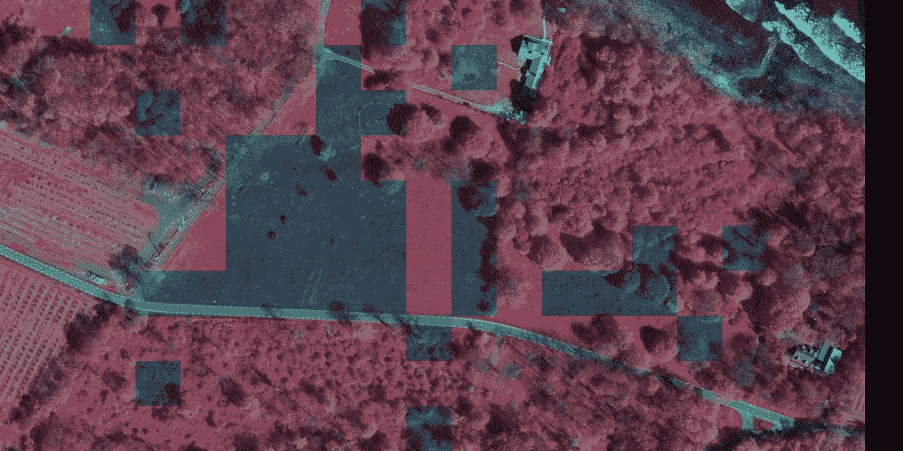

Results obtained using VGG16 in aerial images in the near-infrared light range. The tiles
are colored according to the classification probability: blue > 0.5, light blue ∈ [0.3, 0.5], yellow
∈[0.1, 0.3]. © Lantmäteriet: I2018/ 00119

下图描绘了最佳集合的图形输出，可以看到只有 3 个瓦片丢失，但正如我之前提到的，瓦片本身并不对应于结构，而是结构的一部分，实际上，在检测中没有任何结构丢失，只是它们的一些部分。此外，这里仍然存在的一些假阳性是由于所谓的“*有争议的图像*”。

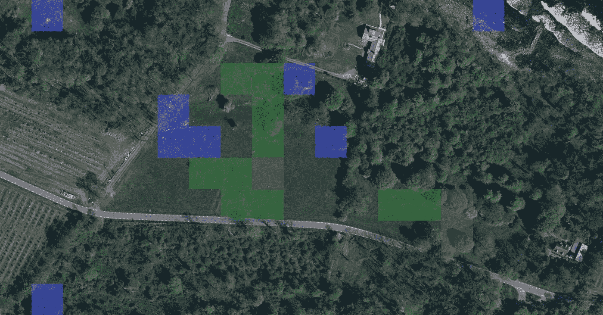

Combined results of the predictions using Inception V3 in the visible light data and VGG16
in the infrared. © Lantmäteriet: I2018 / 00119.

现场检查揭示了遗漏检测和假阳性检测的性质。下图显示了其中的一些。

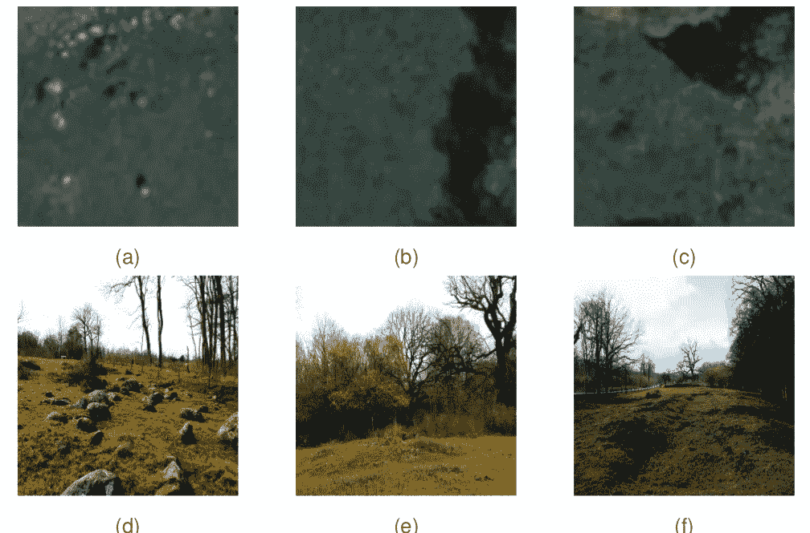

The figures in the left and in the middle row correspond to the false positives, the ones in the left is an area in which some rocks placed in a circle like order, and the one in the middle. The pictures in the right correspond to a false negatives, in this case only a small part was missed in the detection, in this case the one closer to the images. © Lantmäteriet: I2018 / 00119.

然而，该系统也能够检测到所有结构中的大部分，其中一些对于非考古专家(比如我自己)来说并不是微不足道的。下图描述了一些正确检测的示例。

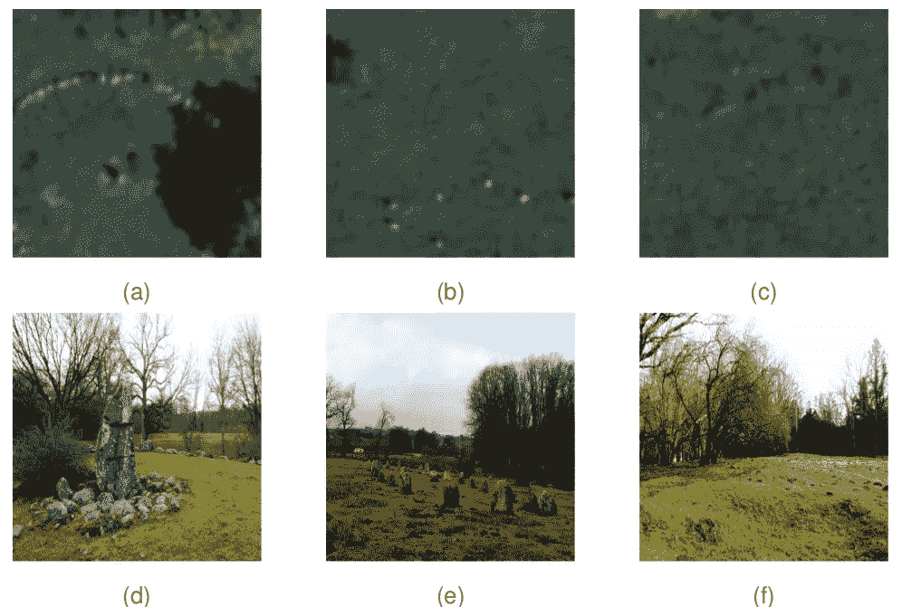

Example of images correctly detected with its respective picture at the location. © Lantmäteriet: I2018 / 00119.

## **结论。**

从非常少量的数据开始，使用不同的数据扩充技术、迁移学习方法和不同的 CNN 体系结构，有可能以 76 %的真阳性率对属于与训练数据来自的区域不同的区域的看不见的数据中 4 %的假阴性率进行预测。

我开始的问题是深度学习是否有助于考古结构的发现。所以答案是肯定的，这可能不是一个微不足道的任务，但确实是可能的。

这些方法的改进和研究非常重要，因为现在可用的数据比人类可能分析的数据要多。考古遗址的探测至关重要，因为它可以恢复和保护这些结构，这有助于了解这些古代文明的许多方面，以及整个人类历史，否则这些知识将永远丢失。

如果你想了解更多关于这个项目的细节，你可以在这里找到他们[。](http://lup.lub.lu.se/student-papers/record/8974790)

Penninggraven at Ängakåsen gravfält. The stone over 2 meters high was blown out in three parts in 1915 and probably would have been used as a building material for a bridge. The stone was eventually restored and now stands where it should stand. Image taken from: [https://www.instagram.com/j.org.ls/](https://www.instagram.com/j.org.ls/)