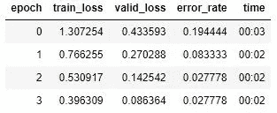
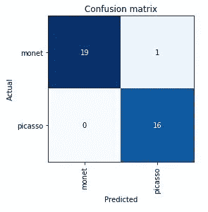
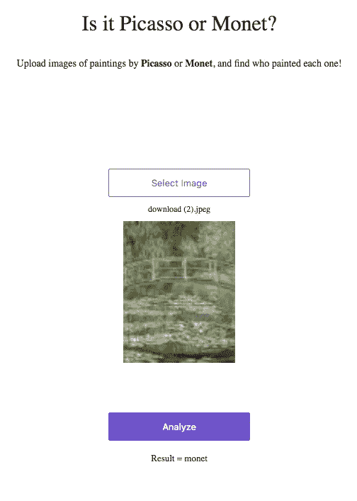

# 深度学习能比鸽子表现更好吗？

> 原文：<https://towardsdatascience.com/can-deep-learning-perform-better-than-pigeons-d37ef1581a2f?source=collection_archive---------36----------------------->

## 我第二次尝试 fast.ai 的《程序员实用深度学习》第二课

我正在学习 fast.ai 的杰瑞米·霍华德和雷切尔·托马斯(Rachel Thomas)教授的精彩的[“程序员实用深度学习”](https://course.fast.ai/)课程的[第二课](https://course.fast.ai/videos/?lesson=2)，上周，我训练了一个深度学习模型来[对怀孕测试](/classifying-pregnancy-test-results-99adda4bca4c)的图像进行分类，这些测试的结果不是明显阳性或阴性，而是微弱阳性或显示蒸发线。然而，模型的准确性并不是我想要的，所以我决定重新开始一个分类问题，对于这个问题，我可以很容易地获得比棘手的怀孕测试分类问题更好的图像集。然后，我试图训练一个模型来对红杉和红杉进行分类，但再次达到了非常低的准确率，大多数错误来自被分类为红杉的红杉。红杉的树干比红杉大得多，但从图像上看，很难获得尺度感，我认为这个问题很可能是模型将红杉误认为红杉的原因。

所以再一次，我需要一个新问题。我考虑将画作归类为莫奈或马奈的作品，但我发现自己区分这两者的能力不足以检查模型的准确性，所以我决定尝试毕加索或莫奈的作品。我希望能够将我的模型的准确性与另一个模型的准确性进行比较，并且不要为这个问题找到深度学习模型，但要找到一项研究，该研究训练几组鸽子以超过 90%的准确性识别毕加索和莫奈的画作！我认为击败鸽子是我的模型可以接受的第一基准。

按照第二课讲座中的说明，我在 Google Images 上搜索“毕加索的画”和“莫奈的画”,并下载了这两组图像(见我之前的帖子，我需要对笔记本中的代码进行细微的调整)。

第一次出门，我的模型就打败了鸽子！

我的训练集损失是 0.396，而我的验证集损失是 0.086，我的错误率是 0.278。很难再提高了！不过，我的蜘蛛侠感觉在响，因为我的训练集损失高于我的验证集，我想 Jeremy 在讲座中说过，这是过度拟合的迹象。我在 fast.ai 论坛上搜索并找到了[这篇文章](https://forums.fast.ai/t/determining-when-you-are-overfitting-underfitting-or-just-right/7732/5?u=go_go_gadget)，其中杰里米说，只要错误率低，一点点过度拟合是可以接受的。咻！

现在，对于一些超参数调谐，虽然精度如此之高，我根本不确定我可以显著提高它。我运行学习率查找器并试图绘制图表，但它显示为空白。笔记本上有一个提示，如果学习率查找器图是空白的，尝试运行`learn.lr_find(start_lr=1e-5, end_lr=1e-1`。

那有效！这是图表。

根据图表，我将学习率设置在 1e-6 到 1e-4 之间:

我已经大大降低了我的训练集损失和验证集损失，但是错误率基本上是相同的(这是我所期望的)。这个模型只犯了一个错误，把毕加索的画归类为莫奈的。

我运行了 ImageCleaner，但没有发现任何质量差或有噪声的图像，所以我保留了它们。因为我的损失和错误率都很低，我想我的模型已经准备好了！

接下来，我打算在 web 应用程序中将我的模型投入生产。我以前玩过 HTML 和 CSS，就像我这样的千禧一代，很久以前我确实有一个 Geocities 网站，但我从未开发过 web 应用程序。杰里米说“建立一个 web 应用程序”，就像我可能会说“做一些咖啡”，所以也许它会相对容易？

我按照 fast.ai 的指示将[部署在渲染](https://course.fast.ai/deployment_render.html for deploying on Render (https://render.com/)上，并分叉所提供的回购。我遇到了一个小障碍:指令告诉我们编辑“app”目录中的 server.py 文件，但我在 Jupyter 目录树中的任何地方都找不到。最终，我意识到“app”目录在 GitHub 上的分叉回购中，而不是在 Jupyter 中！也许这对某些人来说是显而易见的，但对我来说不是。下一个小问题是，我们需要在 server.py 文件中编辑的变量名为“export_file_url”，而不是“model_file_url”，如说明中所示。没什么大不了的。

我继续按照部署说明进行操作，但是我的 web 应用程序无法部署，并且在我的 Render 日志中出现以下错误:`TypeError: __call__() missing 2 required positional arguments: 'receive' and 'send'`。我不知道这是什么意思，所以我咨询了 fast.ai 论坛，并在[找到了一个解决这个问题的帖子](https://forums.fast.ai/t/deployment-platform-render/33953/174?u=go_go_gadget)。显然，在 forked repo 中有一个名为 requirements.txt 的文件，它需要我的模型正在运行的各种库的版本号。我找到我的 requirements.txt 文件，在笔记本中创建一个新的单元格，并在其中运行`! pip list`。我找到了 requirements.txt 文件所寻找的大部分值，但是没有 starlette、aiofiles 或 aiohttp 的条目。我在线程上复制并粘贴最近帖子中给出的值，交叉手指，但这不起作用。

所以我[把](https://forums.fast.ai/t/deployment-platform-render/33953/288?u=go_go_gadget)贴到非常友好和有用的论坛上，并在我的 requirements.txt 文件中获取一些新的值来尝试。

进步！我的 web 应用程序部署了，但它似乎默认为回购中默认的泰迪熊分类器示例。我确实更新了 server.py 文件中的 URL 链接，但是由于我的 export.pkl 小于 100 MB，所以第一次没有生成 API 密钥。不过，也许我需要一个，所以这次我按照[这些指令](https://www.wonderplugin.com/wordpress-tutorials/how-to-apply-for-a-google-drive-api-key/)去做。我使用新链接再次编辑 server.py 文件，并重新部署。不，还是熊。

server.py 中仍然有一个示例链接，但它似乎被注释掉了。我试试删？但是我也编辑了类别为“毕加索”和“莫奈”,而不是熊的类型，所以那些也应该改变了。嗯……如果他们做了呢？也许它*看起来*像熊分类器，但它实际上是我的绘画分类器？

我接受了“有益蠕虫”的建议，试着让̶w̶a̶l̶k̶i̶n̶g̶̶t̶h̶r̶o̶u̶g̶h̶̶i̶t̶运行它。

是啊！我通过分类器运行毕加索的图像，模型对它进行了正确的分类。因此，当实际运行我的分类器时，它显示得好像是熊分类器。

我发现我需要在某个地方为面向用户的文本编辑一些代码，但是不知道在哪里做。fast.ai 论坛上非常有用的 [mrfabulous1](https://forums.fast.ai/u/mrfabulous1) 再次出现，告诉我我需要编辑的代码是“app”目录的“view”子目录中的 index.html 文件。有用！

试试我的“毕加索还是莫奈？”给自己分类器[这里](https://picasso-or-monet.onrender.com/)！

因此，现在我有了一个准确率高达 97%的图像分类模型，并部署了一个 web 应用程序来使用它。继续第三课！

查看 [GitHub](https://github.com/g0g0gadget/picasso_vs_monet) 上的代码！

关于此主题的其他帖子:

第一课:[fast . ai 入门](/getting-started-with-fast-ai-350914ee65d2)

第二课(尝试 1): [对验孕结果进行分类](/classifying-pregnancy-test-results-99adda4bca4c)！

第三课:[一万种行不通的方法](/10-000-ways-that-wont-work-311925525cf0)

第四课:[预测服务员的小费](/predicting-a-waiters-tips-1990342a0d02)

第五课:[但是泡菜去哪了？](/but-where-does-the-pickle-go-53619676bf5f)

第六课:每个人都想成为一只猫

我是加州大学东湾分校的数学讲师，也是一名有抱负的数据科学家。在 [LinkedIn](https://linkedin.com/in/laura-langdon/) 上和我联系，或者在 [Twitter](https://twitter.com/laura_e_langdon) 上打招呼。