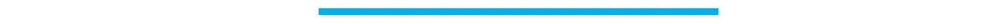
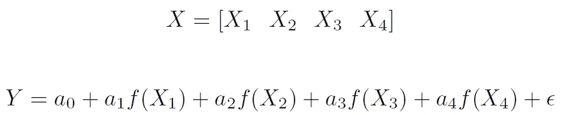
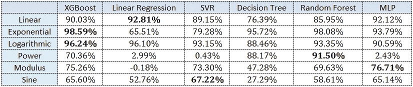

# 机器学习可以模拟简单的数学函数吗？

> 原文：<https://towardsdatascience.com/can-machine-learning-model-simple-math-functions-d336cf3e2a78?source=collection_archive---------16----------------------->

## 使用机器学习对一些基本数学函数建模


Photo Credits: [Unsplash](https://unsplash.com/)

如今，将机器学习应用于各种任务已经成为一种规范。这是一个事实的征兆，即机器学习似乎是 Gartner 对新兴技术的炒作周期中的一个永久固定装置。这些算法被视为自己解决问题的模型:将任何类型的数据分解为一系列特征，应用大量黑盒机器学习模型，评估每个模型，并选择效果最好的一个。

但是，机器学习真的能解决所有这些问题吗，或者它只是对少数任务有好处？在这篇文章中，我们倾向于回答一个更基本的问题，那就是，ML 甚至可以推导出日常生活中非常常见的数学关系吗？在这里，我将尝试使用一些流行的机器学习技术来拟合一些基本函数。让我们看看这些算法是否能辨别和模拟这些基本的数学关系。

我们将尝试适应的功能:

*   线性的
*   指数的
*   对数
*   力量
*   系数
*   三角法的

将使用的机器学习技术:

*   XGBoost
*   线性回归
*   支持向量回归机
*   决策图表
*   随机森林
*   多层感知器(前馈神经网络)



## 准备数据

我保持因变量的大小为 4(没有理由选择这个特定的数字)。因此，X(自变量)和 Y(因变量)之间的关系将是:



f:我们试图拟合的函数

ε:-随机噪声(使我们的 Y 更真实一点，因为真实生活中的数据总会有一些噪声)

每种函数类型都使用一组参数。这些参数是通过使用以下方法生成随机数来选择的:

```
numpy.random.normal()
numpy.random.randint()
```

randint()用于获取幂函数的参数，以避免 Y 值变得非常小。normal()用于所有其他情况。

生成自变量(或 X):

对于对数，均值为 5 的正态分布(均值> >方差)用于避免获得任何负值。

获取因变量(或 Y):

噪声随机采样，平均值为 0。我让噪声方差等于 f(X)的方差，以确保我们的数据中的“信号和噪声”是可比较的，一个不会在另一个中丢失。

## 培养

注意:没有对任何模型进行超参数调整。
基本原理是对这些模型在上述功能上的性能进行粗略估计，因此，没有做太多工作来针对这些情况中的每一个优化这些模型。


## 结果



Results

大多数绩效结果都比平均基线好得多。随着平均 R 平方达到 **70.83%** ，*，我们可以说机器学习技术在模拟这些简单的数学函数方面确实很不错*。

但是通过这个实验，我们不仅知道机器学习是否可以模拟这些功能，还知道不同的技术如何在这些不同的基础功能上执行。

有些结果令人惊讶(至少对我来说)，而有些则令人放心。总的来说，这些结果重新确立了我们以前的一些信念，也产生了一些新的信念。

总之，我们可以说:

*   线性回归尽管一个简单的模型在线性相关数据上胜过其他任何模型
*   在大多数情况下，决策树< Random Forest < XGBoost, according to performance (as is evident in 5 out of 6 cases above)
*   Unlike the trend these days in practice, XGBoost (turning out best in just 2 out of 6 cases) should not be a one-stop-shop for all kinds of tabular data, instead a fair comparison should be made
*   As opposed to what we might presume, Linear function may not necessarily be easiest to predict. We are getting best aggregate R-squared of 92.98% for Logarithmic function
*   Techniques are working (relatively) quite different on different underlying functions, therefore, technique for a task should be selected via thorough thought and experimentation

Complete code can be found on my [github](https://github.com/SahuH/Model-math-functions-using-ML) 。

鼓掌，评论，分享。建设性的批评和反馈总是受欢迎的！