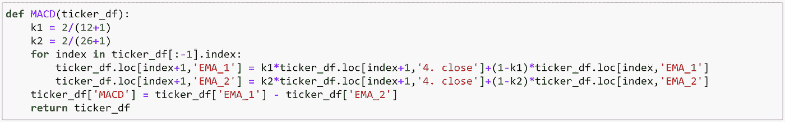

# 机器学习能预测股市吗？

> 原文：<https://towardsdatascience.com/can-machine-learning-predict-the-stock-market-8562be3b3d05?source=collection_archive---------8----------------------->

## 我们测试技术是否强大到足以解开金融市场的谜团

Photo by [Chris Liverani](https://unsplash.com/@chrisliverani?utm_source=medium&utm_medium=referral) on [Unsplash](https://unsplash.com?utm_source=medium&utm_medium=referral)

如果投资正确明智，美国股市可以产生惊人的回报。跟随量化投资公司如两个适马和 Citadel 的脚步，我们有兴趣知道我们是否可以使用机器学习来预测股价走势。

***注来自《走向数据科学》的编辑:*** *虽然我们允许独立作者根据我们的* [*规则和指导方针*](/questions-96667b06af5) *发表文章，但我们不认可每个作者的贡献。你不应该在没有寻求专业建议的情况下依赖一个作者的作品。详见我们的* [*读者术语*](/readers-terms-b5d780a700a4) *。*

# 数据

我们使用 Alpha Vantage API 提取五只 ETF(QQQ、TQQQ、VTI、IWM、SPY)的每日价格数据，并从开盘价、最高价、最低价、收盘价和成交量开始。

# 特征生成

我们决定在 python 中手动创建函数来计算交易中常用的几个技术指标:柴金模数、波段、CCI、均线、MACD、OBV、RSI、SMA 和 STOCH。

## 简单移动平均线

移动平均线用于平滑数组中的数据，以帮助消除噪音和识别趋势。简单移动平均线实际上是移动平均线的最简单形式。每个输出值是前 *n* 个值的平均值。在简单移动平均线中，时间段内的每个值具有相同的权重，时间段之外的值不包括在平均值中。这使得它对数据中最近的变化不太敏感，而这对于过滤掉那些变化是有用的。

## 指数移动平均线

指数移动平均线是技术分析的主要部分，在无数的技术指标中使用。在简单移动平均线中，时间段内的每个值具有相同的权重，时间段之外的值不包括在平均值中。但是，指数移动平均线是一种累积计算，包括所有数据。过去的值对平均值的贡献越来越小，而最近的值贡献越来越大。这种方法使移动平均线对数据的变化更敏感。

## 移动平均收敛发散

移动平均线收敛发散(MACD)是两个指数移动平均线之间的差异。信号线是 MACD 的指数移动平均线。

MACD 发出趋势变化的信号，表明新趋势方向的开始。高值表示超买状态，低值表示超卖状态。与价格的背离表明当前趋势的结束，特别是当 MACD 处于极高或极低的值时。当 MACD 线穿过信号线时，就会产生买入信号。当 MACD 穿过信号线下方时，就会产生卖出信号。为了确认这个信号，MACD 应该在零以上买入，在零以下卖出。

MACD 的时间周期通常是 26 日和 12 日。但是，函数实际上使用的是 0.075 和 0.15 的指数常数，更接近于 25.6667 和 12.3333 周期。要创建时间周期不同于 MACD 内置时间周期的类似指标，请使用价格振荡器函数。

## 随机振荡器

随机振荡指标衡量收盘与最近交易区间的关系。值的范围从 0 到 100。%D 值超过 75 表示超买状态；低于 25 的值表示超卖状态。当快速的%D 穿越慢速的%D 上方时，是买入信号；当它穿过下方时，是卖出信号。原始%K 通常被认为太不稳定，不能用于交叉信号。

## 积累/分配线

累积/分配线类似于平衡交易量(OBV ),它根据收盘价是否高于前一收盘价来计算交易量乘以+1/-1 的总和。然而，累积/分布指示器将体积乘以接近位置值(CLV)。CLV 基于单根棒线内的发行变动，可以是+1、-1 或零。

积累/分配线是通过寻找指标相对于价格的背离方向来解释的。如果累积/分配线呈上升趋势，则表明价格可能会跟随上涨。此外，如果在价格仍在上涨(或下跌)时，积累/分配线变平，那么它标志着价格即将变平。

## 布林线

布林线由三条线组成。中间带是典型价格(TP)的简单移动平均线(一般为 20 个周期)。上下波段是中间波段上下的 *F* 标准差(一般为 2)。当价格波动较高或较低时，波段分别变宽和变窄。

布林线本身不会产生买入或卖出信号；它们是超买或超卖的指标。当价格接近上限或下限时，它表明反转可能即将发生。中间带成为支撑位或阻力位。上下波段也可以解释为价格目标。当价格从低波段反弹并穿过中波段时，高波段就成为价格目标。

## 论平衡体积

平衡交易量(OBV)是上涨和下跌交易量的累计总和。当收盘价高于前一收盘价时，成交量被加到累计总数中，当收盘价低于前一收盘价时，成交量被从累计总数中减去。

要解读 OBV，寻找随价格移动或先于价格移动的 OBV。如果价格在 OBV 之前变动，那么它就是一个未确认的变动。OBV 一系列上升的波峰或下降的波谷表明了一个强劲的趋势。如果 OBV 是平的，那么市场不是趋势。

# 特征生成后的数据

# 我们的假设

我们最初希望使用所有 ETF(QQQ、TQQQ、SPY、VTI、IWM)的数据建立一个单一模型，以预测交易所交易股票的长期价格趋势。如果未来 20 个交易日的回报率> 3%，我们将标签设为 1，否则设为 0。

然而，我们发现每个 ETF 之间的数据差异很大，所以我们决定需要为每个 ETF 建立单独的模型。我们最终只使用 QQQ ETF 数据集来构建我们的模型。

# 实验 1 (20 天回报率> 3%，如标签所示)

## LSTM:测试 AUC 0.476

## MLP 神经网络:测试 AUC 0.577

## 随机森林:测试 AUC 0.917

# 好得难以置信——虚幻的希望

我们使用 QQQ 数据集的最佳模型给出了. 917 的 AUC。我们以为我们找到了预测股票市场的方法。然而，事实并非如此，因为我们在模型中发现了一个重大缺陷。

按照惯例，在机器学习中，您需要打乱数据集，以便创建训练集和测试集。这样做是必要的，因为您希望测试集中的数据与训练数据来自相同的分布。但是，因为历史股票数据是依赖于时间的，这意味着后续日期的数据在这些后续日期发生之前不存在，所以对我们的数据进行洗牌将意味着训练数据集可以访问实际上是在未来设置的一些数据。例如，假设，如果我们要在 2017 年使用具有 2018 年数据的数据集来训练我们的模型，我们实际上不能使用这个训练数据集来训练我们的模型，因为在 2017 年，2018 年的数据还不存在。因此，在创建训练和测试数据集时，我们不能打乱数据。

对于我们的下一个模型，我们使用 2010 年至 2016 年的数据作为我们的训练集，使用 2017 年至 2019 年的数据作为我们的测试集。这种分布分割也很有用，因为它基本上允许我们“模拟”我们的模型如何处理未来数据。

可悲的是，使用这种模型，AUC 分数在相同的随机森林分类器下显著下降到 0.44。

## 随机森林:测试 AUC 0.440

# 重新思考标签分配

正如您在我们的样本数据集中看到的，所有这些行都有非常相似的 20-MAs、打开和关闭。如果 2019 年 1 月 4 日之后的 20 天有> 3%的涨幅，那么 2019 年 1 月 4 日左右的日子也将有> 3%的涨幅，对于任何股票来说都是如此，20 天内标签上涨的决定因素通常不是在第 20 天决定的。它是在记录在其 20 个未来交易周期中有重叠周期的日子里确定的。在这种情况下，如果我们提取 2019 年 1 月 6 日作为测试集，并对其余部分进行训练，模型肯定会为测试数据分配一个标签，因为它的所有特征都与它周围的日期相似，从而形成一个聚类。这种方法的另一个问题是，如前所述，模型允许训练集使用未来的数据进行预测。例如，训练集包括 2019 年 1 月 7 日-2019 年 1 月 11 日，以预测 2019 年 1 月 6 日，这在现实世界中是不可能的。

当我们不重组原始数据集，并且使用较晚的日期作为测试集时，这就成了一个问题。在这种情况下，训练集中的收盘价徘徊在每股 20 美元左右，但由于我们使用 2019 年作为测试集，价格明显不同，因此，模型在为它们分配正确的标签方面表现不佳，特别是考虑到我们的记录具有训练集中不存在的一系列值的特征。

我们想出的解决方案是将我们的标签改为每日股价变动。如果第二天的收盘价高于当天的收盘价，则标签为 1。在这里，一天的股票价格第二天是否上涨是相互独立的，这解决了我们形成集群和窥视未来数据的问题。

# 实验 2(第二天价格上涨/下跌，如标签所示)

## 1.TPOT

**参考文献:**

[**https://towardsdatascience . com/tpot-automated-machine-learning-in-python-4c 063 B3 e 5 de 9**](/tpot-automated-machine-learning-in-python-4c063b3e5de9)

[**https://epistasislab.github.io/tpot/using/**](https://epistasislab.github.io/tpot/using/)

TPOT 是一个开源的 AutoML python 包，运行在特征工程和模型选择的许多不同组合中。TPOT 自动创建许多管线，包括不同的特征工程方法(PCA、MaxAbsScaler、MinMaxScaler 等)以及各种混合超参数的不同模型。

TPOT 的性能在很大程度上取决于管道的数量和您允许它运行的时间。流水线的总数等于种群大小+世代 x 后代大小，这可以在 TPOT 参数中确定。

由于我们只让 TPOT 跑了 150 个管道，只用了不到 15 分钟，所以性能并不理想:测试 AUC 0.509。然而，只要有足够的时间(几十个小时甚至几天)，TPOT 可以成为一个非常强大和简单的工具来产生巨大的成果。

此外，TPOT 自动存储其搜索到的最佳管道，并允许用户将这些结果导出为. py 文件。如你所见，在我们的例子中，TPOT 对我们的数据进行了主成分分析，并选择高斯神经网络作为最佳分类模型。

## 2.XGBoost

使用 XGBClassifier，除了学习率、最大深度、n_estimators 和子样本之外，我们不需要配置太多。使用交叉验证和 AUC 评分标准，我们优化了超参数。最后，我们使用优化的超参数在 X-train 和 y-train 上制作最终模型。测试集的准确度(非 AUC)为 50.5%

使用 XGBClassifier，我们获得了 0.478 的测试集 AUC 分数

## 3.随机森林

使用随机森林分类器，我们使用强力网格搜索交叉验证在一个值范围内调整超参数。最佳参数显示为 max_depth = 3，min_samples_leaf = 3。

使用这个随机森林分类器，我们获得了 0.519 的测试集 AUC 分数

## 4.谷歌汽车

随着 AutoML 越来越受欢迎，我们决定将我们的数据集输入到 Google Cloud AutoML，看看它是否可以预测比我们更好的 AUC 分数。Google AutoML 有一个非常用户友好的界面，在你上传数据集后，它会自动给出一些统计数据。

在像我们这样的分类项目中，Google AutoML 允许用户选择不同的性能指标来优化最终的模型。

那么 Google AutoML 做的怎么样呢？仅仅一个小时的训练后，它返回了 0.529 的 AUC，这是我们过程中最高的。值得注意的是，随机森林的 AUC 达到 0.519，仅比 Google AutoML 低 0.01。

# 结论和见解

**技术分析的弱点:**在金融的世界里，技术分析(利用历史股价预测未来股价)已经被证明是徒劳的。在进一步分析中，可以考虑其他特征:

1.  推文废弃:推文情感分析
2.  财报电话会议记录:分析高管在财报电话会议上的语气；评估高管/分析师正在讨论的话题
3.  卫星数据(油井的卫星图像有可能被用来预测石油价格)

战胜股市的唯一真正方法是获得额外的信息，例如获得未来的数据或提前知道季度收益结果，这导致不可能或非法。使用技术指标可以告诉你故事的一部分，但预测第二天的股票方向太随机，受外部因素的影响，无法创建一个强大的模型。

***关键提示:只有当用于训练模型的数据和模型未来遇到的数据来自同一个分布时，机器学习项目才是有用和有效的，而当使用独立且波动的股市日收益率作为标签时，情况并非如此。***

# 贡献者

oseph.chin@utexas.edu[约瑟夫·陈](https://medium.com/@joseph.chin)，犹他·MSBA【20:j】

[郝伦科林楚](http://linkedin.com/in/haoluncolinchu)，UT 奥斯汀 MSITM ' 20:[colinchu@utexas.edu](mailto:colinchu@utexas.edu)

[威尔希尔刘](https://medium.com/@wilshireliu)，UT 奥斯汀 MSITM’20:[wilshire.liu@utexas.edu](mailto:wilshire.liu@utexas.edu)

[smitheitches@gmail.com 布莱恩·史密斯-艾奇斯](https://www.linkedin.com/in/briansmitheitches/)，UT Austin MSITM '20:

[wenzhuo@utexas.edu](https://www.linkedin.com/in/zhuo-wen/)文卓