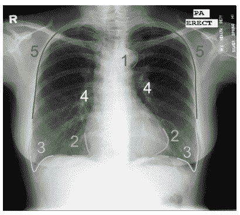

# AI 能像放射科医生一样看懂胸透吗？

> 原文：<https://towardsdatascience.com/can-machine-learning-read-chest-x-rays-like-radiologists-part-1-7182cf4b87ff?source=collection_archive---------9----------------------->

## **使用对抗网络实现胸部 x 光器官分割的人类级性能**

# **医疗保健需要人工智能来扩展**

今天，世界上 70 亿人口中只有 10%能够获得良好的医疗服务，而[世界上一半的人甚至无法获得基本的医疗服务。即使在发达国家，医疗保健系统也面临压力，成本上升，等待时间长。在短时间内培养足够的医生和护理人员来满足日益增长的需求是不切实际的，甚至是不可能的。解决方案必须涉及技术突破。](https://www.who.int/news-room/detail/13-12-2017-world-bank-and-who-half-the-world-lacks-access-to-essential-health-services-100-million-still-pushed-into-extreme-poverty-because-of-health-expenses)

这就是机器学习(ML)和人工智能(AI)可以发挥巨大作用的地方。

在这篇文章中，我将介绍我为理解胸部 x 光图像而开发的一种简单但极其有效的深度学习方法。更多细节可以在原[论文](https://arxiv.org/abs/1703.08770)中找到。

## 有许多胸部 x 光片

**cxr 是最常见的医学成像类型，通常比 MRI、CT 扫描、PET 扫描等其他高级成像方法高出 2-10 倍**:

Among the 20+ million X-rays, over 8 millions are chest x-rays, making chest x-rays the most common standardized medical imaging. ([source](https://www.england.nhs.uk/statistics/statistical-work-areas/diagnostic-imaging-dataset/))

CXRs 受欢迎的一些原因包括:(1)辐射剂量较低；(2)成本较低；(3)拍摄一幅图像只需要不到一分钟的时间(相比之下，CT 扫描需要一个多小时)。因此，cxr 被广泛用作筛选工具。如果你的肺部有问题，需要更多的证据来诊断，你的医生通常会先开 CXR。CXR 提供了一个低保真度视图，为其他更复杂的成像方法铺平了道路。

从与放射科医生的交谈中，我了解到一个相当大的医院一天可以产生数百个(如果不是数千个的话)CXR，所有这些都需要由放射科医生阅读，或者最好是其他医生。并且通常最重要的是在数小时内完成读数，以检测紧急情况(例如住院患者出现的情况)。简而言之，阅读 CXR 对放射科医生和内科医生来说都是一项艰巨的任务。

## CXR 阅读涉及许多步骤，可能很费时间

一名训练有素的放射科医师阅读 CXR 的平均时间约为 1-2 分钟。很难加快速度，因为阅读 CXR 是一个非常系统的过程。阅读 CXR 的一个流行的记忆方法如下: [ABCDEFGHI](https://radiopaedia.org/articles/chest-radiograph-assessment-using-abcdefghi?lang=us) 。a 代表气道，B 代表骨骼，C 代表心脏……你明白了。它并不短，走捷径意味着冒着忽略重要发现的风险。

通过在《CXR》中的工作，我也意识到阅读 CXR 实际上是非常困难的。我曾带患有结核病的 CXRs 去看全科医生，他在很大程度上无法判断哪个病人是结核病阳性。与我交谈过的放射科住院医师告诉我，在他们的住院医师培训项目中，他们将阅读大约 10，000 张 CXR 图像，以便精通它。这提醒了我，MLB 大多数职业棒球击球手需要挥杆 10，000 次才能击中球。人类似乎需要那么多的训练数据才能开始识别 cxr 中的模式。这种陡峭的学习曲线可能是因为 CXR 与我们一生中所接受的自然图像如此不同。这对人工智能系统来说也是一个障碍，我们将在后面重新讨论。

## **放射科医生严重短缺**

我们说的只是 cxr。随着 CT 扫描和其他成像技术越来越受欢迎，放射科医生的工作量将大幅增加。发达国家放射科医生的长期短缺是有据可查的。例如，英国发布了关于英国临床放射学的报告，几年来的主要发现是劳动力短缺和成本上升。放射科工作人员显示出紧张和疲惫的迹象。在医疗基础设施落后的发展中国家，训练有素的放射科医生的短缺甚至更加严重。

# CXR 的器官分割

理解 CXR 的一个基本任务是识别肺野和心脏区域:

Left: CXR from [Japanese Society of Radiology Technology](https://www.ncbi.nlm.nih.gov/pubmed/10628457). Right: The same CXR overlaid with human labeled left lung, right lung, and heart contours.

实际上，你可以从肺部轮廓获得很多信息:异常大的心脏可能意味着心脏扩大(心脏异常增大)；肋膈角变钝(下图中的 3 号)可能意味着[胸腔积液](https://my.clevelandclinic.org/health/diseases/17373-pleural-effusion-causes-signs--treatment)。这也有助于将诊断人工智能算法仅隔离到肺野，从而最大限度地减少来自图像其他部分的虚假信号。(这是一个已知的问题，因为神经网络分类器有时会利用 CXR 中的伪像，如曝光和文本。)

Important contour landmarks around lung fields: aortic arch (1) is excluded from lung fields; costophrenic angles (3) and cardiodiaphragmatic angles (2) should be visible in healthy patients. Hila and other vascular structures (4) are part of the lung fields. The rib cage contour (5) should be clear in healthy lungs.

# CXR 分割的临床应用

**除了辅助计算机辅助诊断，CXR 分割直接导致*心胸比率* (CTR) *的自动化计算。*** CTR 简单来说就是心脏的宽度除以肺的宽度(见下图)。

CTR 是一个关键的临床指标。CTR > 0.5 表明心脏扩大，这通常是由心脏病或先前的心脏病发作引起的。测量 CTR 非常繁琐。它包括确定心脏和肺部最左侧和最右侧的点，并实际进行测量。因此，大多数放射科医生简单地跳过这一测量，只关注心脏是否过大。在中国等一些国家，CXR 读者需要进行明确的 CTR 测量，这可能会大大增加放射科医生的工作量。

很容易看出，高质量的肺部分割可以导致自动 CTR 计算:

这些是根据我们的方法(将在第 2 部分介绍)生成的肺屏蔽计算的 CTR 测量线。事实上，在我们的[后续工作](https://link.springer.com/chapter/10.1007/978-3-030-00934-2_61)中，我们发现我们的 CTR 计算非常准确，均方根误差(RMSE)仅为 6%，与现有工作相当，甚至可能更好，如( [Dallal 等人 2017](https://www.spiedigitallibrary.org/conference-proceedings-of-spie/10134/101340K/Automatic-estimation-of-heart-boundaries-and-cardiothoracic-ratio-from-chest/10.1117/12.2254136.short?SSO=1) )^.

^The 的数据没有直接可比性，因为我们无法获得他们的数据集。

# 用神经网络分割 CXR 的挑战

## 挑战#1:隐含的医学知识

因为 CXR 是三维人体的二维投影，所以许多生理结构在图像中彼此重叠，很多时候这是对你在哪里画边界的判断。以下面这个案例为例:

Left: CXR with mild deformity. Right: Human labeled left and right lung regions. ([Source](https://lhncbc.nlm.nih.gov/system/files/pub9356.pdf))

图像显示在左肺下叶(图像的右侧)和左肺尖有一些疤痕。它们明显模糊了肺部轮廓。因此，必须通过使用医学知识推断肺部形状来绘制红色轮廓。分割模型必须获得轮廓形状的全局概念，以便解决模糊边界周围的局部模糊性，并产生类似于人类标记器的正确轮廓。

## 挑战#2:非自然图像

CXR 图像看起来一点也不像我们日常生活中看到的自然图像:

大多数现有的计算机视觉神经网络是为丰富多彩的自然图像设计的，并利用了这些图像中丰富的纹理。这使得很难在 CXR 上直接应用现成的解决方案。

## 挑战#3:少量的训练数据

由于隐私问题和管理障碍等原因，CXR 的公共医学图像比自然图像小得多。此外，与可以由任何标注器标注的自然图像不同，医学图像标注只能由医生和受过训练的专业人员来完成，从而导致高的标签获取成本。

据我所知，只有两个公开可用的 CXR 数据集具有肺野的像素级标签，一个有 247 个图像，另一个有 138 个。这至少比 ImageNet 挑战小 3000 倍，ImageNet 挑战有 120 万到 1400 万张标记图像。事实上，在 ImageNet 数据集上训练的神经网络是如此强大，以至于几乎所有现有的神经网络分割模型都是用在 ImageNet 挑战赛上学习到的参数(例如来自 ResNet 或 VGG)来初始化的。尚不清楚这样一个小数据集是否足以满足拥有数百万到数亿参数的数据饥渴神经网络。

# 解决方案的潜在峰值

在本系列的第 2 部分中，我们设计模型来解决上面的每个挑战。这里有一个快速预览:

与自然图像不同，cxr 是灰度的，并且是高度标准化的(挑战 2)。这一观察使我们设计了分割网络，与在具有不同颜色和形状的 ImageNet 数据集上使用的网络相比，使用更少的卷积通道。不幸的是，这种变化使得从 ImageNet 训练的模型进行迁移学习变得不切实际。然而，通过使用更少的过滤器，我们的模型具有非常少的参数(小模型容量)，这最小化了易于在小训练数据上发生的过度拟合的风险(挑战#3)。

最后，也许是最具挑战性的，是如何教授分割模型人类所拥有的医学知识(挑战 1)。这里的关键见解是使用对抗性学习来指导分割模型，以生成更自然的图像，我们将在第 2 部分中展示这是非常有效的。

应对所有挑战的最终解决方案的体系结构如下所示:

这是两部分系列的第 1 部分。有关模型设计和性能的详细信息，请参见[第 2 部分](/can-machine-learning-read-chest-x-rays-like-radiologists-part-2-aa77dba219f0)。

***作者简介:*** 大卫·戴是[苹果](https://www.apple.com/)的高级机器学习工程师，[探路者 AI](http://wayfinder.ai) 的顾问， [Petuum](http://petuum.com) 的前高级工程总监。他拥有卡内基梅隆大学的机器学习博士学位，并被评为匹兹堡 30 岁以下。[@ daiwei 89](https://twitter.com/daiwei89)|[Medium](https://medium.com/@davidwdai)| David @ way finder . ai。

# 参考

*   [扫描:用于胸部 X 射线中器官分割的结构校正对抗网络](https://arxiv.org/abs/1703.08770)
*   [世界银行和世卫组织:世界一半人口缺乏基本卫生服务，仍有 1 亿人因医疗费用而陷入极端贫困](https://www.who.int/news-room/detail/13-12-2017-world-bank-and-who-half-the-world-lacks-access-to-essential-health-services-100-million-still-pushed-into-extreme-poverty-because-of-health-expenses)
*   [英国国家健康服务局的诊断成像数据集](https://www.england.nhs.uk/statistics/statistical-work-areas/diagnostic-imaging-dataset/)
*   [使用 ABCDEFGHI 进行胸片评估](https://radiopaedia.org/articles/chest-radiograph-assessment-using-abcdefghi?lang=us)
*   [英国临床放射学劳动力普查 2018 年报告](https://www.rcr.ac.uk/system/files/publication/field_publication_files/clinical-radiology-uk-workforce-census-report-2018.pdf)
*   [用于自动估计心胸比率的无监督域适应](https://link.springer.com/chapter/10.1007/978-3-030-00934-2_61)
*   [根据胸部 x 射线图像自动估计心脏边界和心胸比率](https://www.spiedigitallibrary.org/conference-proceedings-of-spie/10134/101340K/Automatic-estimation-of-heart-boundaries-and-cardiothoracic-ratio-from-chest/10.1117/12.2254136.short?SSO=1)
*   [ImageNet 训练的 CNN 偏向于纹理；增加形状偏差可以提高精确度和鲁棒性](https://openreview.net/forum?id=Bygh9j09KX)
*   [有和无肺结节的胸片数字图像数据库的开发:放射科医师检测肺结节的接收器操作特征分析。](https://www.ncbi.nlm.nih.gov/pubmed/10628457)
*   [用于肺部疾病计算机辅助筛查的两个公共胸部 x 光数据集](https://lhncbc.nlm.nih.gov/system/files/pub9356.pdf)