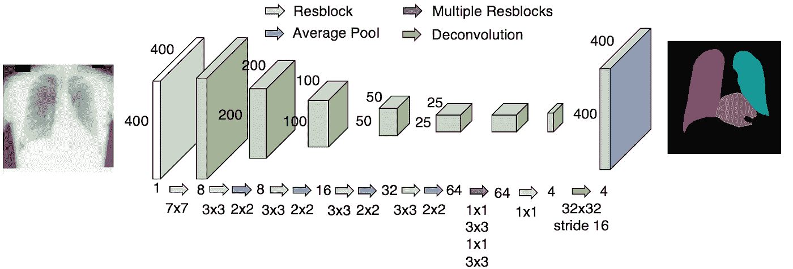
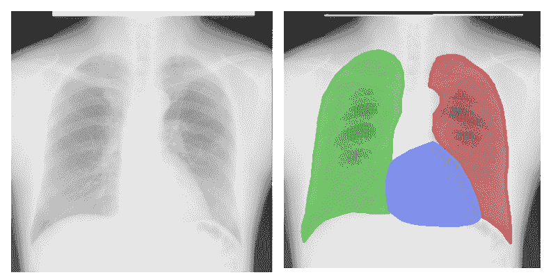
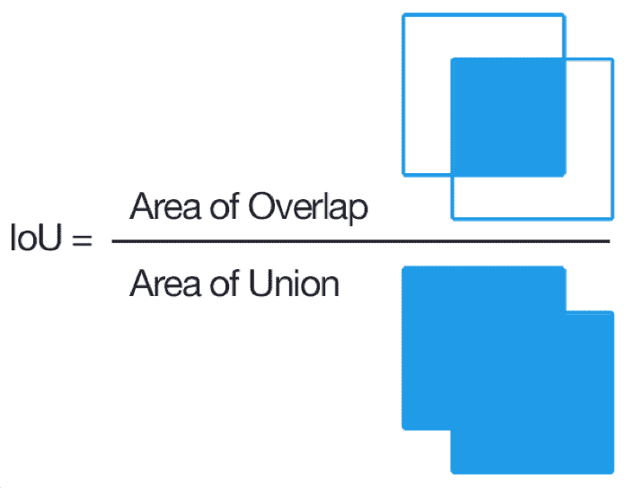
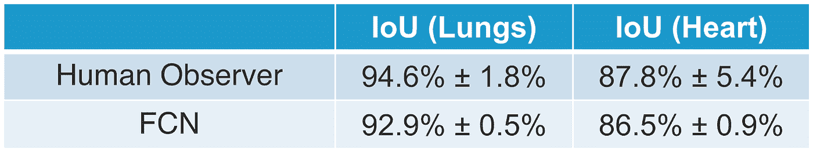
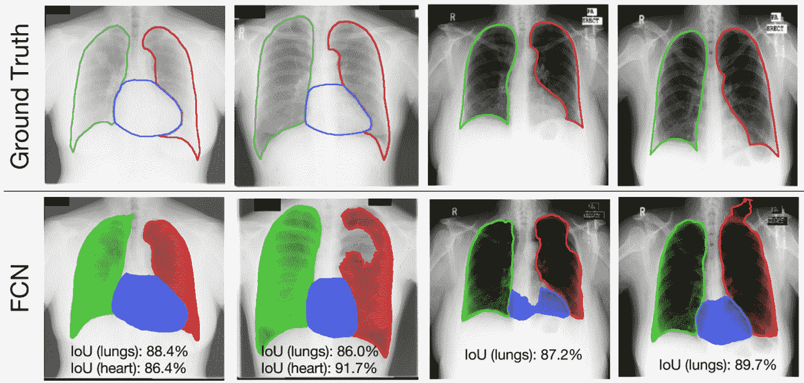
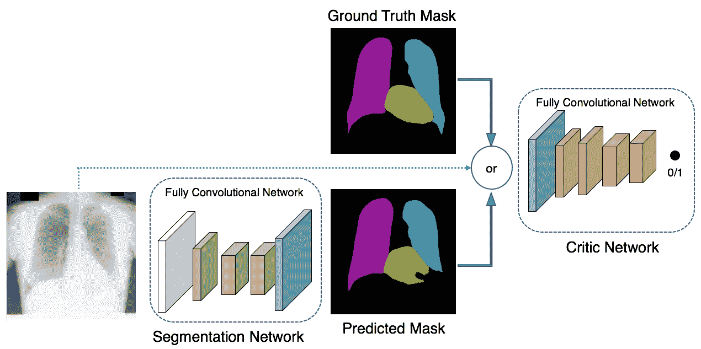
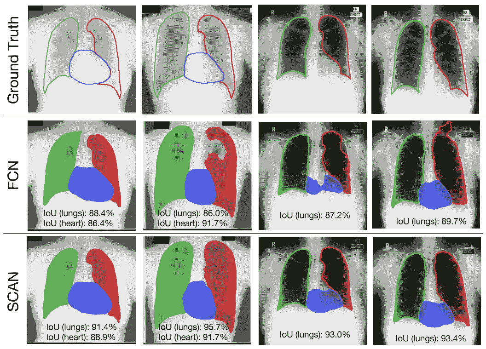
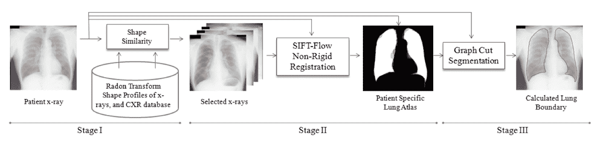
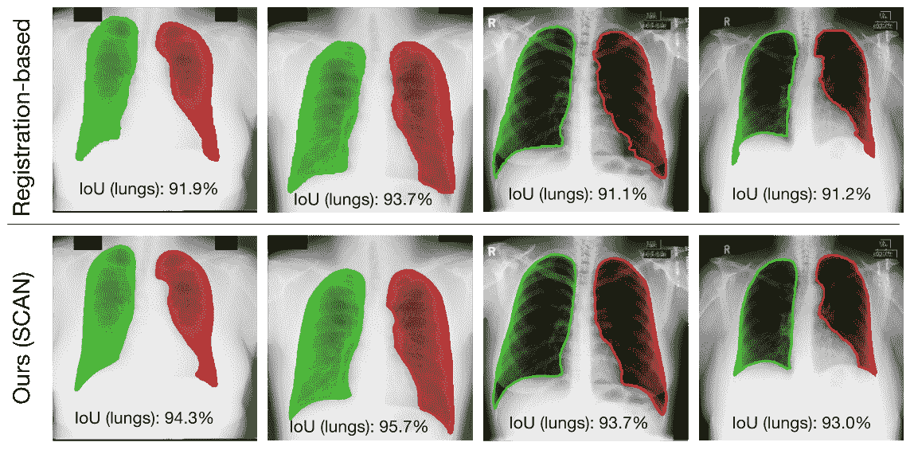

# AI 能像放射科医生一样看懂胸透吗？

> 原文：<https://towardsdatascience.com/can-machine-learning-read-chest-x-rays-like-radiologists-part-2-aa77dba219f0?source=collection_archive---------14----------------------->

## **使用对抗网络实现胸部 x 光器官分割的人类级性能**

*这是两部分系列的第二部分。参见* [*Part 1*](/can-machine-learning-read-chest-x-rays-like-radiologists-part-1-7182cf4b87ff) *胸部 x 射线(CXR)分割的挑战和临床应用，以及医学成像如何，特别是 CXRs，关键需要 AI 来缩放。*

# 回顾第 1 部分

胸部 X 射线(CXR)分割的任务是识别 CXRs 中的肺野和心脏区域:

Left: CXR from [Japanese Society of Radiology Technology](https://www.ncbi.nlm.nih.gov/pubmed/10628457). Right: The same CXR overlaid with human labeled left lung, right lung, and heart contours.

在许多临床应用中，肺分割直接导致关键的临床指标心胸比率(CTR ),其导致心脏扩大的诊断。

# 设计解决方案

考虑到使用 CXR 的挑战(参见第 1 部分)，我们首先设计基于完全卷积网络(FCN)的分段模型。然后，我们在结构校正对抗网络(SCAN)框架中增加对抗训练，这实现了人类水平的性能。

让我们深入研究模型和导致模型设计的思维过程。

## 全卷积网络分段(FCN)

分割模型的输入是尺寸为 H×W×C(高度、宽度、通道)的图像，其中对于 RGB 值，C = 3，或者对于灰度图像，如 CXR，C = 1。该模型然后输出每像素类概率 H×W×T，其中 T 是类的数量。在我们的情况下，对于[左肺、右肺、心脏、背景]，T = 4，而当心脏分割标签不可用时(例如在一个数据集中)，T=3。

我们将网络设计为全卷积网络，用 1x1 卷积取代全连接层。(更多详细信息，请参见此处的)。我们从类似 VGG 的架构开始，大约有 16 个权重层和许多特征图(或卷积通道):第一个卷积中有 64 个特征图，然后在最终层中增加到 512 个通道。所得到的模型具有很大的容量(> 1 亿个参数)，它完美地过拟合训练数据，但是在测试数据上表现不佳。这清楚地表明，我们的数据集太小，无法支持像这样的大型模型。

由于 CXR 图像是具有标准化结构的灰度图像，我们减少了滤波器的数量，并且发现对于第一卷积使用 8 个特征图，而不是 VGG 的 64 个，给出了更好的结果。然而，我们很快就达到了模型的容量极限。为了增加模型容量，我们更深入。最终，我们得到了一个由 21 个重量层组成的“瘦”而深的网络:

The segmentation network architecture. The input image (400 pixels by 400 pixels) goes through convolution (in the residual blocks “Resblock”) where spacial resolution reduces but the number of feature maps (“semantic concepts”) increases. [Further tech details: the integer sequence (1, 8, 16,…) is the number of feature maps. k × k below Resblock (residual block), average pool, and deconvolution arrows indicates the receptive field sizes. The dark gray arrow denotes 5 resblocks. All convolutional layers have stride 1 × 1, while all average pooling layers have stride 2 × 2\. The output is the class distribution for 4 classes (3 foreground + 1 background).]

模型中的参数总数为 271k，比基于 [VGG 的](https://arxiv.org/abs/1409.1556)分割模型小 500 倍。

## 细分模型的性能

Intersection over Union (IoU) is computed between the ground truth mask and the predicted segmentation

因为模型很小(很少的参数)，我们可以在 209 个 CXR 例子上从头开始训练它。我们使用联合交集(IoU)度量来评估肺和心脏分割的质量。(请参见左图了解图示定义。)IoU 的范围在 0(预测掩码和地面真实值之间没有重叠)到 1(完全匹配)之间。

我们使用来自[日本放射技术学会(JSRT)数据集](https://www.ncbi.nlm.nih.gov/pubmed/10628457)的 cxr 和来自另一个[研究](https://www.ncbi.nlm.nih.gov/pubmed/15919232)的标签来准备 JSRT 数据集，包括 247 个 cxr(209 个用于训练和验证，38 个用于评估)。这个又细又高的分段网络(我们称之为全卷积网络的 FCN)表现得相当好:

请注意，人的表现并不完美，受到划出界限所需的固有主观解释的限制。人类观察者的低心脏 IoU 表明心脏边界特别难以推断(参见第 1 部分中的挑战)。这只是医学不是精确科学的许多地方之一。

## FCN 的失效模式

可视化低性能样本中发生的情况并进行故障分析通常很有帮助。下面，我们将在 JSRT 数据集上训练的模型应用于 JSRT 和另一个数据集(我们称之为 [Montgomery](https://lhncbc.nlm.nih.gov/system/files/pub9356.pdf) ):

Each column is a patient. The left two columns are patients from the JSRT evaluation set with models trained on JSRT development set. The right two columns are from the [Montgomery dataset](https://lhncbc.nlm.nih.gov/system/files/pub9356.pdf) using a model trained on the full JSRT dataset only (no Montgomery data), which is a much more challenging scenario. Note that only JSRT dataset (left two columns) have heart annotations for evaluation of heart area IoU.

旁白:在上面的图片中，请注意，由于不同的设备、医疗操作人员和人口等因素，来自不同数据集的 cxr 看起来非常不同。因此，适应一个新的数据集领域是一项更加困难的任务。知道了这一点，我们的分割模型已经在 Montgomery 数据集上对肺分割表现得令人惊讶地好，甚至没有看到来自该人群的图像。

这些失败案例揭示了 CXR 图像在样本之间的不同对比度所带来的困难。例如，在上面的图像中，最右边患者的胸腔顶点被误认为内部肋骨，导致遮罩“渗出”到黑色背景，其强度与肺野相似。纵膈(两个肺之间的“白色物质”)和前肋骨(肺野中的纵横交错的线条)周围的血管结构也可以具有与外部边界相似的强度和纹理，从而导致中间两列中可以看到的严重错误。

## 结构校正对抗网络(扫描)

失败案例告诉我们，模型需要有全局结构感，以避免像前面的例子那样的严重失败。例如，任何受过基础训练的人都知道，心脏应该或多或少是椭圆形的，而肺野的顶点应该是平滑的，隔膜与胸腔的夹角应该是尖锐的。但是我们应该如何将这些知识传授给 FCN 细分模型呢？

虽然对知识进行数学编码并不容易(例如，锐角到底有多尖？)，很容易判断预测的分割看起来是否自然。在机器学习的行话中，这被称为二元分类问题。这自然导致以下对抗性框架:

Overview of the proposed Structure Correcting Adversarial Network (SCAN) framework that jointly trains a segmentation network and a critic network in an adversarial setting. The segmentation network produces per-pixel class prediction. The critic takes either the ground truth label or the prediction by the segmentation network, optionally with the CXR image, and outputs the probability estimates of whether the input is the ground truth (with training target 1) or the segmentation network prediction (with training target 0).

这里的关键补充是，分割网络的预测不仅通过每像素损失(即，预测的遮罩与地面真实像素的匹配程度)来评估，还通过 critic 网络给出的“整体外观和感觉”评估(即，预测的遮罩看起来有多真实，足以欺骗 critic 网络)。敏锐的读者可能会注意到，这与[生成对抗网络(GAN)](https://papers.nips.cc/paper/5423-generative-adversarial-nets.pdf) 非常相似。事实上，这个框架可以被视为条件 GAN，其中我们基于输入 CXR 图像而不是原始 GAN 中的随机噪声向量来生成掩模。

在我们的工作中，我们设计了 critic 网络，以在很大程度上反映分段网络的架构。培训目标、模型的超参数、实验设置等细节可以在[我们的论文](https://arxiv.org/pdf/1703.08770.pdf)中找到。

# 扫描性能

在我们深入研究这些数字之前，我们应该澄清一下，SCAN 中的 critic network 只在培训阶段涉及。在测试过程中，我们只使用分段网络，它与 FCN 具有相同的架构。换句话说，我们的希望是，随着 critic 网络的加入，我们可以以某种方式更好地训练相同的分割网络，使用来自 critic 网络的指导来鼓励相同的分割网络进行更“自然”的预测。考虑到这一点，我们在 JSRT 数据集上重复评估:

Evaluation on JSRT dataset. FCN is segmentation model only. Registration-based method is the prior state of the art for lung field segmentation (no heart) from [(Candemir et. al., TMI (2014))](https://www.ncbi.nlm.nih.gov/pubmed/24239990)

请注意，在 FCN 架构没有任何变化的情况下，SCAN 将 FCN 相对于人类水平的性能绝对提高了 1.8%，大约为 94.6%的 lung IoU！让我们回顾一下失败案例中的 4 个棘手患者:

Each column is a patient. The left two columns are patients from the JSRT evaluation set with models trained on JSRT development set. The right two columns are from the Montgomery dataset using a model trained on the full JSRT dataset only (but no Montgomery data), which is a much more challenging scenario. Note that only the two patients from JSRT dataset (left two columns) have heart annotations for evaluation of heart area IoU. These examples aren’t cherry picked results, but are in fact the more difficult cases. For example, notice that the 91.4% lung IoU by SCAN in the left most column is already much below the average 94.7% IoU in our evaluation (see the evaluation table above).

正如您所看到的，所有 4 个案例都非常令人满意地“修复”了。此外，请注意，与扫描相比，扫描在每个肺野的外下角(肋膈角)产生了更真实的锐角。拐角通常不会影响每像素性能，但在下游诊断任务中可能很重要(例如，检测肋膈角的钝化)。

在临床环境中，仅仅有良好的平均表现是不够的，但重要的是要避免令人发指的预测错误，因为它们会影响医生对人工智能的信任。通过使用对抗性学习框架，SCAN 改进了每像素指标以及预测的“整体外观和感觉”。这两者在临床环境中都很重要。

# 与 CXR 分割的现有技术的比较

上面的评估表表明，我们的方法在 CXR 肺野分割方面远远优于现有技术(“基于配准”的方法)。由于我们的工作是第一个针对 CXR 细分的深度学习解决方案，因此了解非深度学习解决方案可能有多复杂很有帮助:

The CXR lung segmentation pipeline used in (Candemir et. al., TMI (2014))

坎迪米尔等人的方法。艾尔。，TMI (2014) 涉及一系列 sift 特征提取、形状变换、寻找具有相似肺形状轮廓的患者作为候选 CXR 分割、图切割等以产生最终分割。每个阶段需要各种调整参数，并且由于预测是基于使具有相似肺轮廓的患者变形，因此当新患者的肺与现有训练数据足够不同时，性能会受到影响，这一点我们将在后面看到。

[坎迪米尔等地的复杂管道。艾尔。，TMI (2014)](https://www.ncbi.nlm.nih.gov/pubmed/24239990) 与神经网络的简单性形成鲜明对比，在神经网络中，网络自己学习特征和形状*。像 SIFT 和一系列阶段的精细形状操作这样的手工制作功能的日子已经一去不复返了。*

*进行一些定性比较有助于理解 SCAN 如何优于 Candemir 等人。艾尔。，TMI (2014) :*

**

*The left two columns are from the JSRT evaluation set (using model trained on JSRT development set), and the right two columns are from the Montgomery set (using model trained on the full JSRT dataset).*

*对于左边的两列，扫描在尖锐的肋膈角周围产生更真实的轮廓。这在基于配准的模型中可能是一个挑战，其中检测和匹配肋膈点是困难的。对于右边的两列(坎迪米尔等人。艾尔。、TMI (2014))由于测试患者肺轮廓(来自 Montgomery 数据集)和 JSRT 数据集中的现有肺轮廓之间的不匹配而挣扎，导致不自然的掩模形状。*

# *最后的想法*

*围绕人工智能在 CXRs 上的诊断准确性有很多炒作。然而，基于人工智能的 CXR 诊断可能会受到放射科医生的怀疑。虽然有令人兴奋的结果，但通常更容易通过较小的改进进入医院，如心胸比率(CTR)计算，可以从肺分割中获得(见第 1 部分)。我们能够很快对 CTR 引擎进行测试。自动 CTR 计算很容易解释，而且通常非常准确。我们发现，有时更重要的是通过用强大的人工智能很好地支持他们现有的工作流程来获得医生和领域专家的信任，而不是用不太成熟的人工智能解决方案来改变他们的工作流程。我希望这个案例研究可以为其他医疗保健人工智能解决方案的开发提供一个有益的例子。*

****作者简介:*** 大卫·戴是[苹果](https://www.apple.com/)的高级机器学习工程师，[探路者 AI](http://wayfinder.ai) 的顾问， [Petuum](http://petuum.com) 的前高级工程总监。他拥有卡内基梅隆大学的机器学习博士学位，并被评为匹兹堡 30 岁以下。[@ daiwei 89](https://twitter.com/daiwei89)|[Medium](https://medium.com/@davidwdai)| David @ way finder . ai。*

# *参考*

*   *[扫描:用于胸部 X 射线中器官分割的结构校正对抗网络](https://arxiv.org/abs/1703.08770)*
*   *[用于语义分割的全卷积网络](https://people.eecs.berkeley.edu/~jonlong/long_shelhamer_fcn.pdf)*
*   *有无肺结节的胸片数字图像数据库的开发:放射科医师检测肺结节的接收器操作特征分析。*
*   *[用于大规模图像识别的极深度卷积网络](https://arxiv.org/abs/1409.1556)*
*   *[使用监督方法分割胸片中的解剖结构:一项公共数据库的比较研究。](https://www.ncbi.nlm.nih.gov/pubmed/15919232)*
*   *[用于肺部疾病计算机辅助筛查的两个公共胸部 x 光数据集](https://lhncbc.nlm.nih.gov/system/files/pub9356.pdf)*
*   *[医生是主观的不是客观的](https://www.bmj.com/rapid-response/2011/10/28/re-doctors-are-subjective-not-objective)*
*   *[使用非刚性配准的解剖图谱在胸片中进行肺部分割](https://www.ncbi.nlm.nih.gov/pubmed/24239990)*
*   *[生成对抗网络](https://papers.nips.cc/paper/5423-generative-adversarial-nets.pdf)*
*   *[快速思考 ChestXray14、绩效声明和临床任务](https://lukeoakdenrayner.wordpress.com/2017/11/18/quick-thoughts-on-chestxray14-performance-claims-and-clinical-tasks/)*