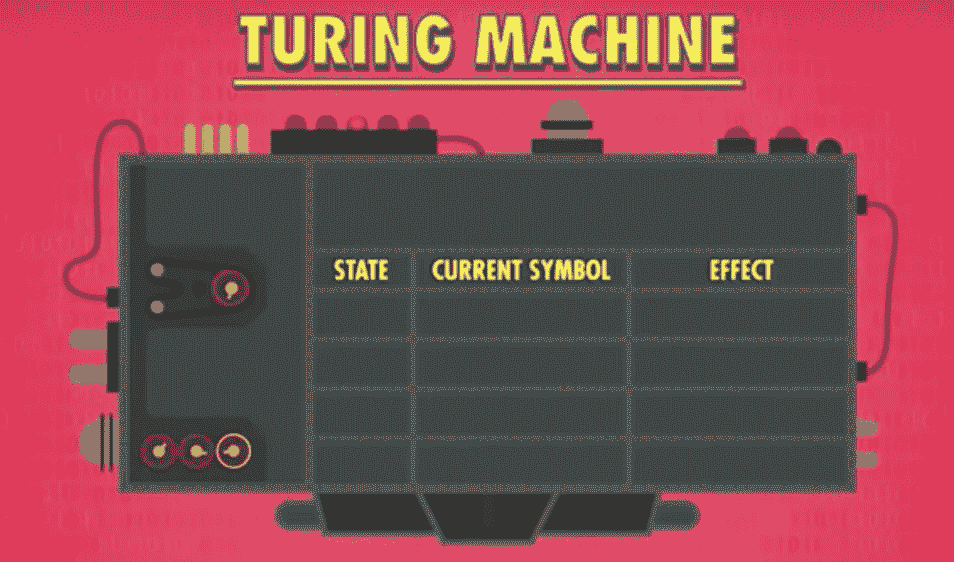
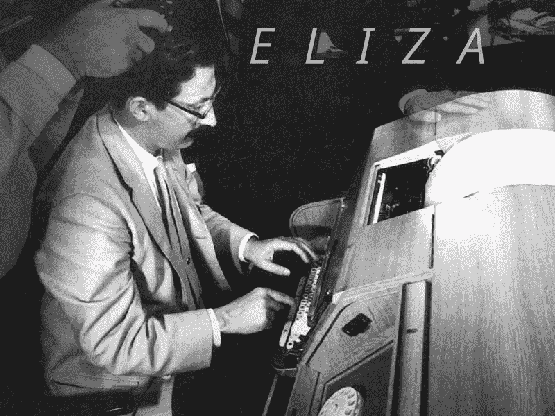

# 机器能用图灵测试思考吗？

> 原文：<https://towardsdatascience.com/can-machines-think-using-the-turing-test-2dce3665b552?source=collection_archive---------21----------------------->

“The Imitation Game”

我一直以来最喜欢的电影之一是《模仿游戏》。当我第一百次看它时，我不禁想到了英格玛机的重要性，它是电影中的一个重要符号，负责加扰文本和解密原始信息。简要概述电影:一个真实的故事，情节围绕着主角艾伦·图灵(由本尼迪克特·康伯巴奇饰演)，以及他在成为编码员和帮助战争方面的成就。

# A.M .图灵的观点

他研究的目标是寻找戴维·希尔伯特*提出的“决策问题”的答案，“有没有一种算法，它以形式逻辑写成的语句作为输入，并产生总是准确的“是”或“否”的答案？*

Turing Machine: Theoretical computing device

**组件**

*   读/写磁头:读、写和修改磁带上符号的装置。
*   状态变量:保存一条关于机器当前状态的信息。
*   规则集:描述机器在给定状态和磁头正在读取的当前符号的情况下做什么。

**结果:**表明如果给定足够的时间和内存，这个简单的假设机器可以执行任何计算。

# 图灵测试

艾伦·图灵认为这个测试来自于术语“机器”和“思考”的定义以及一个问题，“机器能思考吗？”以及“计算机能像人一样说话吗？”这是两个主要的问题，帮助图灵把它们放在正确的角度，并导致了如下发现:图灵测试，人工智能和一项研究，“*模仿游戏”。*

# 《模仿游戏》

**描述:**三个人一起玩，一个男人(A)，一个女人(B)，一个审问者(C)，男女不限。审讯者和另外两个人呆在不同的房间里。对于审讯者来说，游戏的目的是确定另外两个人中哪个是男人，哪个是女人。他通过标签 X 和 Y 认识他们，在游戏结束时，他说“X 是 A，Y 是 B”或者“X 是 B，Y 是 A”。

**提出问题:** *“当一台机器在这个游戏中扮演人 A 的角色会发生什么？”*

**假设:**结果会一样吗？从这个意义上来说，当游戏这样玩的时候，审讯者会像在一个男人和一个女人之间玩的时候一样经常错误地决定吗？计算机被认为是智能的，它的对话很难与人类的区别开来。

图灵预言，到 2000 年，拥有 100 兆或更高内存的机器将很容易通过这项测试。虽然现代机器已经超过了这个内存量，但在量子计算的帮助下，他们正在努力寻找创造性的有效解决方案，以找到虚假的机器人和数据。

# 伊莱扎

是第一个声称成功通过图灵测试的算法/程序。它通过模仿心理学家来误导人类，目的是让病人说更多的话，并用更多的问题来回答问题！什么？！？！？！？！？！？

ELIZA was made in the MIT Artificial Intelligence Laboratory by Joseph Weizenbaum

它愚弄人的成功证明了这个测试的一个弱点。虽然个体生成的机器人听起来令人难以置信地像人，但它缺乏一致的个性，并且没有能力在不使用数据的情况下产生新的想法，这是一个明显的迹象。归根结底，创造计算机生成的对话需要的不仅仅是内存、数据和处理能力。相反，我们希望有一天能达到图灵的目标，毕竟我们必须克服机器意识的障碍。

> “为了达到真正的智能，图灵测试通常被视为人工智能必须通过的重要门槛。”

我发现这是一个技术的证明，虽然缓慢，但肯定会朝着图灵测试的目标前进，即构建执行核心脑力任务(如推理、决策、解决问题等)的计算机器。人工智能等技术依赖于这一概念，并进一步理解过去、现在和未来的技术伦理。