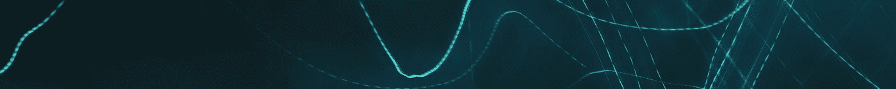
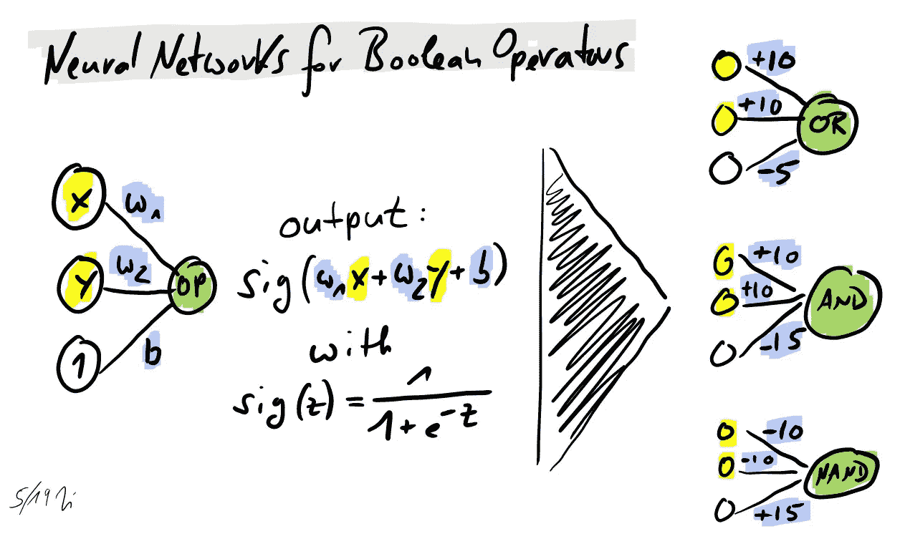
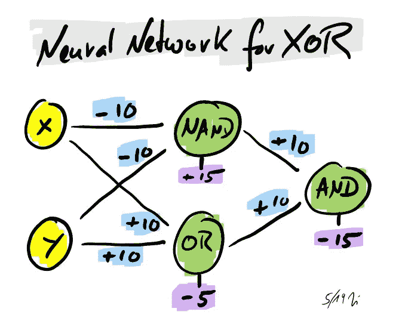
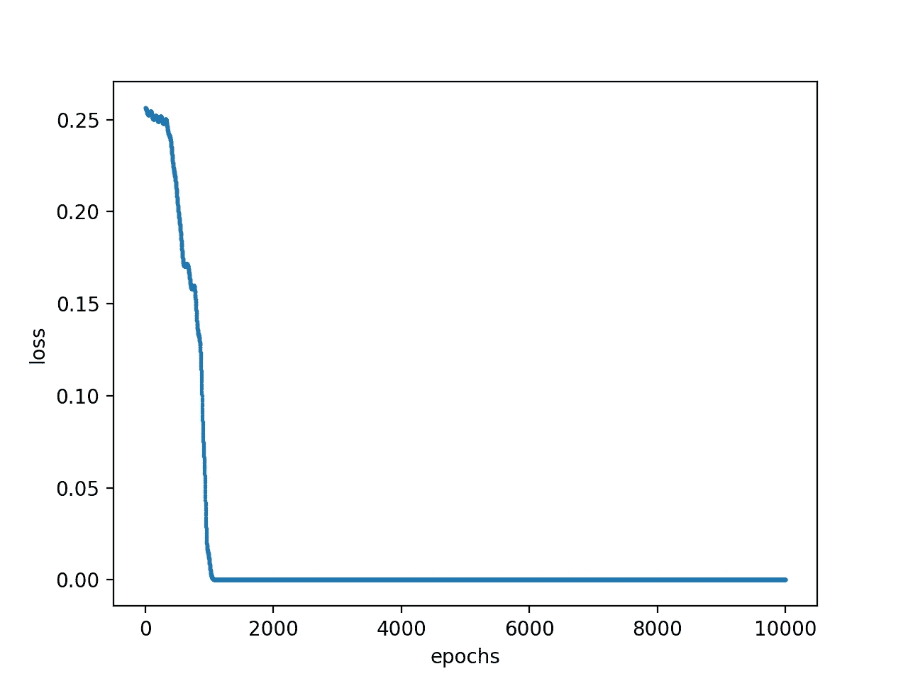
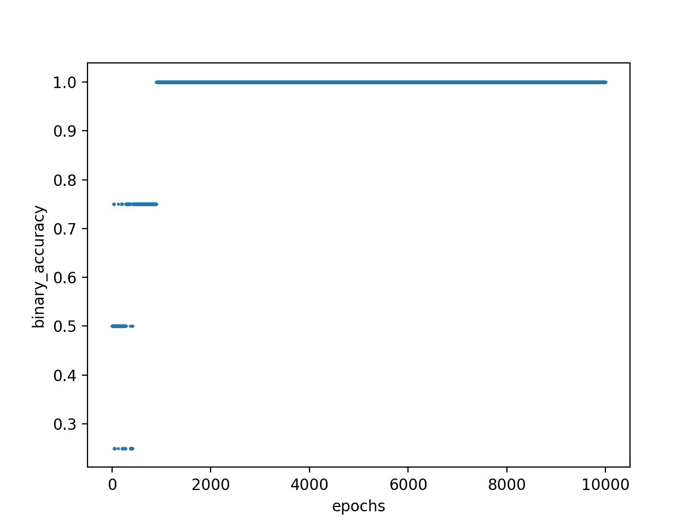
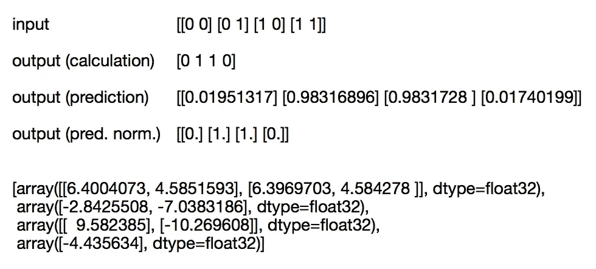
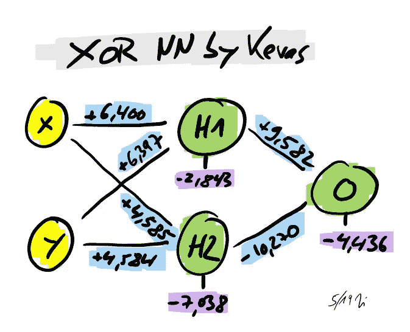
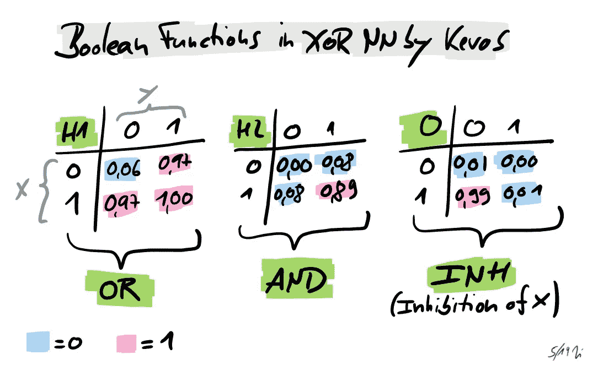

# 神经网络能创造新知识吗？解除神经网络的装箱

> 原文：<https://towardsdatascience.com/can-neural-networks-create-new-knowledge-unboxing-a-neural-net-acee47d4ea03?source=collection_archive---------23----------------------->

Original photo by [Nina Ž.](https://unsplash.com/photos/snixPaBvfBo?utm_source=unsplash&utm_medium=referral&utm_content=creditCopyText) on [Unsplash](https://unsplash.com/search/photos/neural-network?utm_source=unsplash&utm_medium=referral&utm_content=creditCopyText)

令人惊讶的是，在不知道执行这些工作的显式算法的情况下，神经网络(nn)可以被设计和训练成特定的任务。例如，众所周知的识别手写数字的教程很容易实现，但底层逻辑最终隐藏在神经网络中，仅由它的层结构、权重和激活函数隐式给出。

*在这篇文章中，我们通过使神经网络的规则透明来揭示其黑箱知识。为此，我们检查了布尔异或函数的神经网络。首先，我们使用已知的关于 XOR 的性质构建一个 NN 自底向上，即我们合并显式已知的代数关系。在第二步中，我们使用张量流 Keras 从零开始训练一个 NN 到 XOR。*

*最后，我们比较两种方法。我们将 Keras 神经网络分解为布尔分量，并发现其逻辑设置不同于第一步中构建的神经网络。经过训练的 NN 已经发现了使用不同布尔函数的 XOR 的替代表示。*

我们不认为这种替代的异或公式在数学界是未知的，但至少对我们来说是新的。这可能表明神经网络可以创造新知识。但是要提取它，我们必须能够将神经网络的设置和参数转换成显式规则。

# 异或神经网络的自底向上构造

XOR 是由映射定义的布尔函数

XOR (0，0) = XOR (1，1) = 0

XOR (1，0) = XOR (0，1) = 1

为了构建 XOR 的神经网络，我们记住或搜索身份

XOR (x，y) = AND ( NAND (x，y)，OR (x，y))

这是有帮助的，因为运算符 AND、NAND(不是 AND)和 OR 是众所周知的，并且都可以由具有 2 个输入和 1 个输出节点、偏置和 sigmoid 激活函数的简单 nn 来表示。

Neural Networks for Boolean Operators

这样，我们就可以把与非、与和或的神经网络连接起来，组成异或神经网络。所以 XOR 变成了一个 3 层 NN。

Neural Network for XOR

让我们只输入可能的输入配置并检查输出(为此我使用了 Excel 表格)。我们分别为(0，0)和(1，1)得到 0.0072，为(0，1)和(1，0)得到 0.9924。它工作了。

我们可以通过使用 XOR 的以下表示来构建其他 nn:

XOR (x，y) = OR ( AND ( NOT(x)，y)，AND ( x，NOT(y))。

XOR (x，y) = NAND ( NAND ( x，NAND ( x，y))、NAND ( y，NAND ( x，y)))

然而，这些身份导致了更复杂的网络。

此外，不可能构建 2 层 NN，因为 XOR 不是线性可分的(并且激活函数是严格单调的)。

但是，也许有其他选择来建立一个异或神经网络？让我们在下一节中通过训练一个神经网络来尝试找到一个替代的解决方案。

# 用张量流构造异或神经网络

对于 NNs 来说，Keras 确实是一个强大且易于使用的库。如上所述，我们构建了一个 3 层 2–2–1 模型，将我们的结果与之前构建的神经网络进行比较。

我们使用学习率为 1 的梯度下降优化器和均方损失函数进行误差反向传播，这是 NNs 的标准方法。

以下是 Python 代码片段:

XOR 的好处是，我们可以训练整个参数空间，因为只有四种可能的配置可以教授。然而，我们需要一些历元来将模型驱动到零损耗和 100%精度，即对于(0，1)和(1，0)输出趋向于 1，对于(0，0)和(1，1)输出分别趋向于 0。

Loss vs. epochs for XOR NN

Accuracy vs. epochs for XOR NN

但是，培训课程也可能会停滞不前，无法收敛。那么准确度停止在 75%或甚至 50%，即一个或两个二元元组的映射是不正确的。在这种情况下，只要重新建立神经网络，直到你获得一个适当的解决方案。

# 分析和结论

现在让我们验证 Keras NN 是否具有与构造的相似的结构。通过 get_weights(参见代码片段的结尾),我们获得权重和偏差值。

Output Python script

我们使用这些参数来重建神经网络(我再次使用 Excel)。它由三个运算符组成。

Neural Network for XOR trained by Keras

通过输入所有可能的配置，我们可以识别与运算符 H1、H2 和 o 相关的布尔函数

Boolean Functions in XOR NN by Keras

这就有意思了！我们本来期望 Keras NN 显示与构造的逻辑相同的逻辑，但是，它创建了一个替代解决方案。它没有使用运算符 Nand、OR 和 AND，而是使用 OR、AND 和(相对不为人知的)INH。即神经网络已经找到了公式

XOR (x，y) = INH ( OR (x，y)，AND (x，y))

这表明神经网络可以获得以前没有的知识！当然，“新知识”是相对的，取决于专业知识的水平，也就是说，如果有人知道 XOR 的所有表示，Keras NN 不会提供额外的价值。

此外，对于更复杂的神经网络，将权重转化为显式算法或公式并不容易。但也许这种专业知识将是未来人工智能专家必须具备的能力。

最后请注意，NNs 不是我的日常业务。特别是，我不知道我的发现是新东西还是旧帽子。所以我期待你的反馈。感谢您事先提出的意见、问题、建议或更正——我们都欢迎！