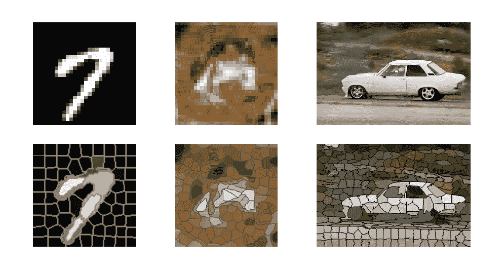
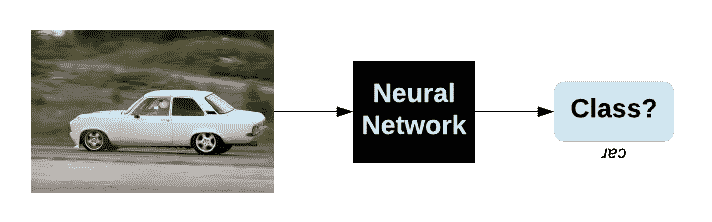
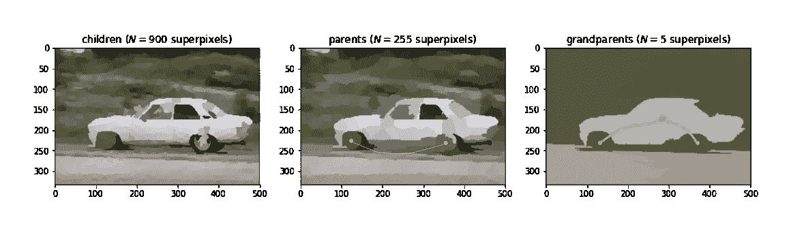
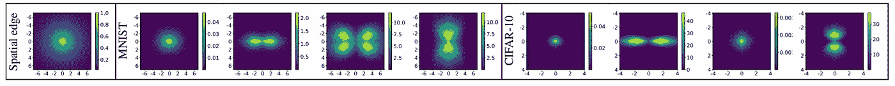
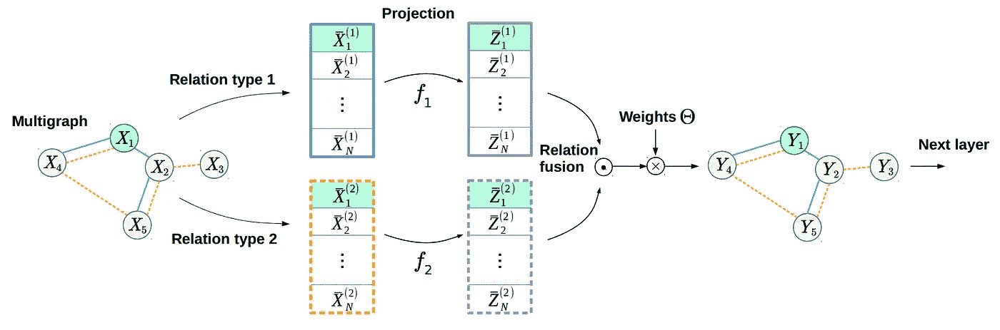

# 我们能比卷积神经网络做得更好吗？

> 原文：<https://towardsdatascience.com/can-we-do-better-than-convolutional-neural-networks-46ed90fed807?source=collection_archive---------12----------------------->

## PyTorch 实现了 BMVC 2019 的“利用分层多图网络进行图像分类”



The number of pixels in the top row is 11, 7 and 1000 times larger (from left to right) than the number of “superpixels” in the bottom row. Can we use the superpixels rather than raw pixels as input and improve on convolutional neural networks?

大约两周前在英国加的夫结束的英国机器视觉大会(BMVC)是计算机视觉模式识别领域的顶级会议之一，竞争接受率为 28%。与其他人相比，这是一个小事件，所以你有足够的时间在海报周围走动，并与主持人一对一交谈，我觉得这真的很好。

我在 [*肖林*](https://filebox.ece.vt.edu/~linxiao/) *、* [默罕默德·阿梅尔](https://medium.com/u/6cf41cb2c546?source=post_page-----46ed90fed807--------------------------------) *(* [*主页*](https://mohamedramer.com/)*和我的博士导师 [*格拉汉姆·泰勒的指导下，展示了一张关于*](https://www.gwtaylor.ca/) *[**图像分级多图网络**](https://bmvc2019.org/wp-content/uploads/papers/1186-paper.pdf) 的海报**

*在论文中，我们基本上试图回答“我们能比卷积神经网络做得更好吗？”。这里我讨论这个问题，用结果来支持我的论点。我还使用 PyTorch 向您展示了来自 [PASCAL VOC 2012](http://host.robots.ox.ac.uk/pascal/VOC/voc2012/) 的单个图像的整个流水线的前向传递。*

***这篇文章的完整代码**在 Github 上的[我的笔记本里。](https://github.com/bknyaz/bmvc_2019)在整个 PASCAL 数据集上进行训练和验证应该很容易。*

*那么，我们为什么要做得比康文网更好呢？他们不是在很多任务上都超过了人类吗？*

*例如，你可以说**图像分类**是一个已解决的任务。嗯，就 ImageNet 而言，是的。尽管 ImageNet 做出了巨大贡献，但这是一项奇怪的任务。为什么你要区别数百种狗的品种？因此，结果是我们有成功的模型，但是不能区分轻微旋转的狗和猫。幸运的是，我们现在有 [ImageNet-C](https://arxiv.org/abs/1903.12261) 和[其他类似的基准](https://arxiv.org/abs/1907.07484)显示我们离解决这个问题还很远。*

**

*Pipeline: We solve the classical task of image classification.*

*在相关任务中出现的另一个公开问题，如对象检测，是对非常大的图像(例如，4000×3000)进行训练，这由例如[Katharopoulos&Fleuret(ICML，2019](https://arxiv.org/abs/1905.03711) )和 [Ramapuram 等人(BMVC，2019](https://bmvc2019.org/wp-content/uploads/papers/0555-paper.pdf) )解决。多亏了后者，我现在知道如果海报的背景是黑色的，那么它很可能来自苹果。我也应该留点颜色！*

*所以，也许我们需要一个不同于卷积神经网络的东西？与其不断修补它的[错误](https://distill.pub/2019/advex-bugs-discussion/)，也许我们应该从一开始就使用一个具有更好属性的模型？*

*我们认为这样的模型*可以是* 一个**图形神经网络(GNN)**——一个可以从图形结构数据中学习的神经网络。gnn 有一些吸引人的特性。例如，与 ConvNets 相比，gnn 本质上是旋转和平移不变的，因为在图中根本没有旋转或平移的概念，即没有左和右，只有某种意义上的“邻居”( [Khasanova & Frossard，ICML，2017](https://arxiv.org/abs/1703.00356) )。因此，让一个 [ConvNet 更好地推广到不同的旋转](https://arxiv.org/abs/1602.07576)的问题，这个人们多年来一直试图解决的问题，被 GNNs 自动解决了！*

*关于从大图像中学习，如何从图像中提取[超像素](https://scikit-image.org/docs/dev/api/skimage.segmentation.html#skimage.segmentation.slic)并将低得多的维度输入馈送到 GNN，而不是将下采样(例如 224×224)图像馈送到 ConvNet？与双线性插值相比，超像素似乎是一种更好的图像下采样方法，因为它们通常通过保持对象之间的边界来保留大量语义。通过 ConvNet，我们无法直接从这种输入中学习，然而，有一些不错的作品提出利用它们( [Kwak 等人，AAAI，2017](https://aaai.org/ocs/index.php/AAAI/AAAI17/paper/view/14445) )。*

*所以，GNN 听起来很棒！让我们看看它在实践中的表现。*

*哦不！我们基于( [Kipf & Welling，ICLR，2017](https://arxiv.org/abs/1609.02907) )的基线 GNN 在 PASCAL 上仅实现了 19.2%(平均精度或 mAP)，相比之下，具有相同层数和每层过滤器的 ConvNet 达到了 32.7%。*

*我们提出了几项改进，最终击败了 ConvNet！*

# *1.分层图*

*在 ConvNets 中，图像的层次结构是通过池层隐式建模的。在 GNNs 中，至少有两种方法可以实现这一点。首先，您可以使用类似于 ConvNets 的池，但是对于图形，定义一个快速且良好的池方法确实具有挑战性。相反，我们可以在多个尺度上计算超像素，并通过它们与更大的父超像素的对应关系来汇集超像素。然而，由于某些原因，这种池化在我们的例子中并没有很好地工作(我仍然认为它应该工作得很好)。因此，取而代之的是，我们在输入级别建立一个层次模型。特别是，我们将所有尺度的超像素组合成一个集合，并基于语义分割中常用的交集并集(IoU)来计算层次关系。*

**

*Three scales of 1000, 300 and 7 superpixels computed by SLIC. Note that the [SLIC algorithm](https://scikit-image.org/docs/dev/api/skimage.segmentation.html#skimage.segmentation.slic) that we use often returns fewer superpixels (shown on top of each image) than we request. In the middle image I show spatial connections in yellow, while in the right image — hierarchical ones that allow to connect remote nodes.*

*基于这个原则，我在下面的代码中构建了层次图。我还构建了空间图的多尺度版本，但它只编码空间关系，而 IoU 应该更好地编码层次关系。例如，使用 IoU，我们可以在远程子节点之间创建**快捷方式，即连接两个小的超像素(例如车轮),它们在空间上相距很远，但属于同一个父节点(例如汽车),如上图所示。***

*事实上，层次图将 mAP 提升至 31.7%，仅比 ConvNet 低 1%，而可训练参数却少了 4 倍！如果我们只使用空间多尺度图，结果会更糟，正如本文所探讨的。*

*太好了！我们还能做些什么来进一步改善结果？*

# *2.可学习的关系*

*到目前为止，如果我们可视化我们的过滤器，它们将看起来非常原始(如高斯)。更多细节请看我的 GNNs 教程。我们想学习一些类似于 ConvNets 的边缘检测器，因为它们工作得非常好。但事实证明，用 GNNs 来学习它们是非常具有挑战性的。为此，我们基本上需要根据坐标之间的差异生成超像素之间的边缘。这样做，我们将赋予我们的 GNN 理解坐标系的能力(旋转，平移)。我们将使用 PyTorch 中定义的 2 层神经网络，如下所示:*

```
*pred_edge = nn.Sequential(nn.Linear(2, 32),
                          nn.ReLU(True),
                          nn.Linear(32, L))*
```

*其中 *L* 是预测边的数量或过滤器的数量，例如下面可视化中的 4。*

*我们将滤波器限制为仅基于坐标之间的绝对差`|(*x₁,y₁*) - (*x₂,y₂*)|`而不是原始值来学习边缘，使得滤波器变得对称。这限制了滤波器的容量，但它仍然比我们的基线 GCN 使用的简单高斯滤波器好得多。*

*在[我的 Jupyter 笔记本](https://github.com/bknyaz/bmvc_2019/blob/master/bmvc_2019.ipynb)中，我创建了一个类`LearnableGraph`，它实现了在给定节点坐标(或任何其他特征)和空间图的情况下预测边的逻辑。后者用于在每个节点周围定义一个小的局部邻域，以避免预测所有可能节点对的边，因为它很昂贵，并且连接非常远的超像素没有多大意义。*

*下面，我将训练过的`pred_edge`函数形象化。为此，我假设我们应用卷积的索引为 1 的当前节点位于坐标系的中心，`*(x₁,y₁)=0*`。然后我简单地采样其他节点的坐标，`*(x₂,y₂)*`，并把它们馈送给`pred_edge`。颜色显示边的强度取决于与中心节点的距离。*

**

*Visualization of predicted edges which can be interpreted as filters, where each intensity value is an edge between two nodes at a distance specified in axes.*

*学习后的图也非常强大，但计算成本较大，如果我们生成非常稀疏的图，这可以忽略不计。32.3%的结果仅比 ConvNet 低 0.4%，如果我们生成更多的滤波器，这个结果很容易提高！*

# *3.多尺度 GNN*

*我们现在有**三个图:空间图、层次图和学习图**。具有空间或分层图形的单个图形卷积层允许仅在“第一邻居”内传播特征。在我们的例子中，邻居是软的，因为我们使用高斯来定义空间图，并使用 IoU 来定义层次图。 [Defferrard 等人(NIPS，2016](https://arxiv.org/abs/1606.09375) )提出了一种多尺度(多跳)图卷积，它在一个 *K* 跳邻域内聚合特征，并近似谱图卷积。参见[我的另一篇文章](/tutorial-on-graph-neural-networks-for-computer-vision-and-beyond-part-2-be6d71d70f49)对这种方法的详细解释。对于我们的空间图，它本质上对应于使用不同宽度的多个高斯图。对于层次图，这样我们可以在远程子节点之间创建 *K* -hop 快捷方式。对于已学习的图形，该方法将创建以上可视化的已学习过滤器的多个尺度。*

*使用在我的`GraphLayerMultiscale`类中实现的多尺度图形卷积被证明是极其重要的，它使我们能够**超过基准 conv net 0.3%！***

# *4.以低成本改进关系类型的融合*

***到目前为止，为了从我们的三个图中学习，我们使用了标准的连接方法。然而，这种方法有几个问题。**首先**，这种融合算子的可训练参数的数量与输入和输出特征维数、标度( *K)* 和关系类型的数量成线性关系，因此如果我们一次增加两个或更多这些参数，它确实可以快速增长。**第二个**，我们试图融合的关系类型可以具有非常不同的性质，并且占据流形的非常不同的子空间。为了同时解决这两个问题，我们提出了类似于( [Knyazev 等人，NeurIPS-W，2018](https://arxiv.org/abs/1811.09595) )的可学习投影。通过这种方式，我们消除了线性依赖性，与串联相比，参数数量减少了 2-3 倍。此外，可学习的投影转换多关系特征，使得它们应该占据流形的邻近子空间，便于信息从一个关系传播到另一个关系。***

**

*One of the proposed relation type fusion methods, which performs very well on PASCAL and allows us to beat the ConvNet by a quite large margin.*

*通过使用提出的融合方法，在下面的`GraphLayerFusion`类中实现，我们获得了 34.5%的性能，比 ConvNet 高出 1.8%，同时参数减少了 2 倍！对于最初除了超像素中编码的信息之外，对图像的空间结构一无所知的模型来说，这令人印象深刻。探索其他融合方法会很有趣，比如这个，以获得更好的结果。*

# *结论*

*事实证明，通过多关系图网络和一些技巧，我们可以比卷积神经网络做得更好！*

*不幸的是，在我们改进 GNN 的过程中，我们慢慢地失去了它的不变性。例如，旋转图像后，超像素的形状可能会改变，我们用于节点特征的超像素坐标也使模型不太鲁棒。*

*然而，我们的工作是朝着更好的图像推理模型迈出的一小步，我们表明 GNNs 可以铺平一个有希望的方向。*

*具体实施详见 Github 上的[我的笔记本。](https://github.com/bknyaz/bmvc_2019)*

*我也强烈推荐[马蒂亚斯·菲](https://medium.com/u/24cd20b3728e?source=post_page-----46ed90fed807--------------------------------)的硕士论文[代码](https://github.com/rusty1s/embedded_gcnn)一个非常相关的题目。*

*在 [Github](https://github.com/bknyaz/) 、 [LinkedIn](https://www.linkedin.com/in/boris-knyazev-39690948/) 和 [Twitter](https://twitter.com/BorisAKnyazev) 上找到我。[我的主页](https://bknyaz.github.io/)。*