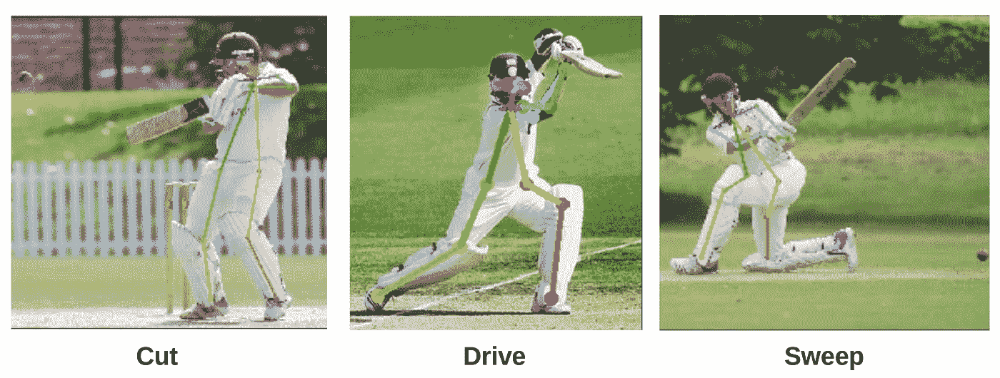
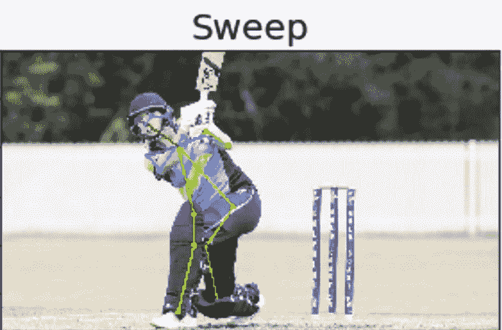
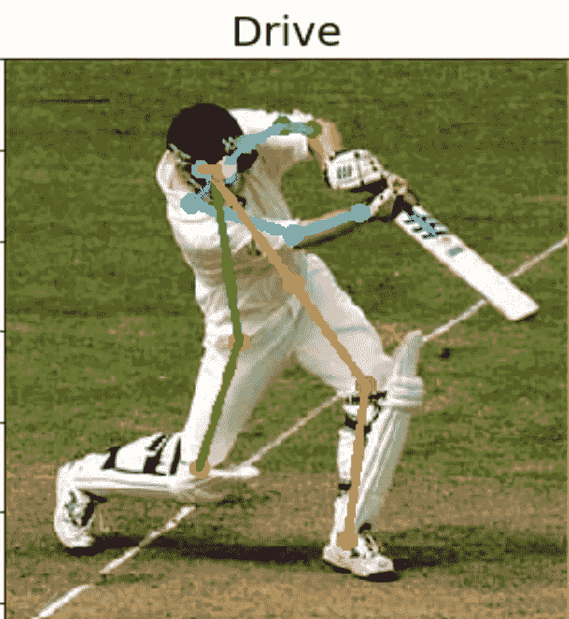
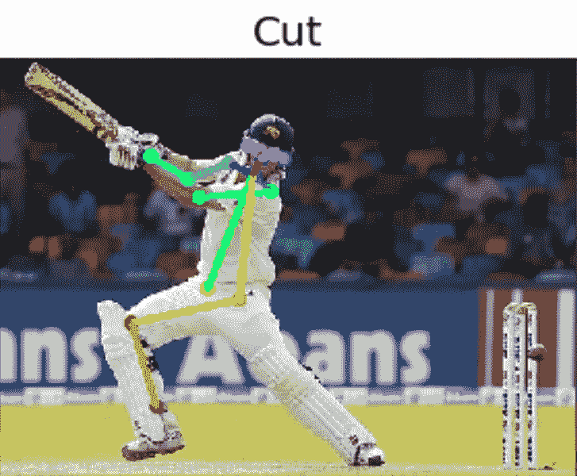

# 我们能使用神经网络生成自动板球解说吗？

> 原文：<https://towardsdatascience.com/can-we-generate-automatic-cricket-commentary-using-neural-networks-dbed3aeeef07?source=collection_archive---------19----------------------->

和其他事物一样，板球世界在最近几年也经历了很多技术变革。板球运动的方式以及全世界对它的看法都因此发生了变化。在这篇文章中，我们将讨论神经网络是否能够通过观看板球比赛来产生评论。

在文献中已经有一些工作(可以在这里找到、[这里](https://ieeexplore.ieee.org/stamp/stamp.jsp?tp=&arnumber=5973819)和[这里](https://ieeexplore.ieee.org/stamp/stamp.jsp?tp=&arnumber=7224605))但是他们没有使用神经网络。作为端到端深度学习的信徒，我认为神经网络将在不久的将来完成这项任务。这是一个很难解决的问题，因为除了视觉特征提取之外，它还涉及非常复杂的时间动态和长期依赖性的处理。这是因为评论通常与当前游戏的发展、它在更广阔的视角中的重要性(友谊赛与锦标赛)以及所涉及的球队和球员的历史高度相关。对正在发生的事情进行脱离上下文的解释似乎是一个更容易解决的问题，我可以想到一种架构来对此进行建模。

借鉴最近出现的时空神经网络的思想，我认为合理的架构应该包括从静态帧中提取视觉特征的卷积神经网络，对这些特征的复杂非线性时间动态进行建模的递归神经网络，以及在它们之上用于端到端(视频到评论)学习的解码器编码器架构。用板球镜头作为输入，用评论作为监督信号，为训练这个网络建立相当数量的数据似乎是可以管理的。我在这里为感兴趣的人发现了一个非常有前途的项目想法！

板球镜头分类似乎是这个自动评论生成系统的重要组成部分。最近一项非常有趣的[工作](https://ieeexplore.ieee.org/stamp/stamp.jsp?tp=&arnumber=8536277)关注这个问题，并使用基于 CNN 和 LSTM 的架构将视频剪辑分类成相关镜头，它显示了有希望的结果。玩家定位和姿态估计对于准确的镜头分类非常重要。在下面的章节中，我们将对人体姿态估计在从静态图像中识别板球击球中的功效进行初步探索。

我从谷歌图片收集了一个小数据集，总共约有 120 张图片，用于“剪切镜头”、“扫描”和“驾驶”。这个数据集非常小，如果你计划用这个想法设计一个有意义的项目，你可能需要收集一个更大的数据集。我使用[开放姿态](https://github.com/CMU-Perceptual-Computing-Lab/openpose)进行姿态估计，它提供了一个二维实时多人关键点检测。我使用了最轻最快的型号' *mobilenet_thin* '，为了简单和快速执行，你可以尝试不同的型号，以实现你选择的速度和精度之间的平衡。打开姿势给出了玩家 18 个关键点的 x 和 y 位置(在 2d 图像内)。然后，我试图在这个 18 维特征空间的顶部建立一个随机森林分类器，将每个实例分类为三个镜头之一。通过 70/30 的训练测试，我在测试集上获得了大约 0.8 的 F1 分数。考虑到我所使用的数据集的稀缺，这已经很不错了。测试集上的一些预测如下所示。

github 上有代码。

 [## muaz-urwa/Cricket-Shot-使用计算机视觉分类

### 通过在 GitHub 上创建一个帐户，为 muaz-urwa/Cricket-Shot-class ification-using-Computer-Vision 开发做出贡献。

github.com](https://github.com/muaz-urwa/Cricket-Shot-Classification-using-Computer-Vision) 

可以提高准确性的事情:

*   更大的数据集(无需动脑)
*   使用更大更精确的姿态估计模型(参考他们的 github)。
*   使用来自相同摄像机角度的图像，或者使用所有可用摄像机角度构建的多视图特征空间。
*   使用数据增强。水平翻转将有助于推广右手和左手击球手。如果你计划使用固定视角，不要使用大角度旋转。抖动和随机裁剪只有在使用数据集微调姿态估计时才有帮助。

玩得开心！