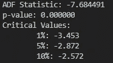
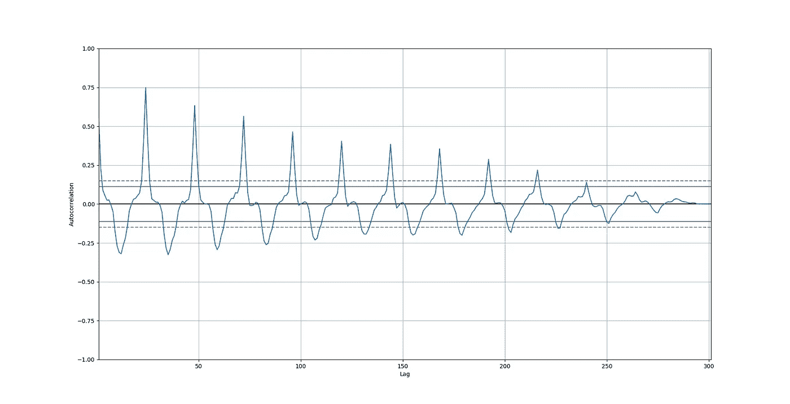
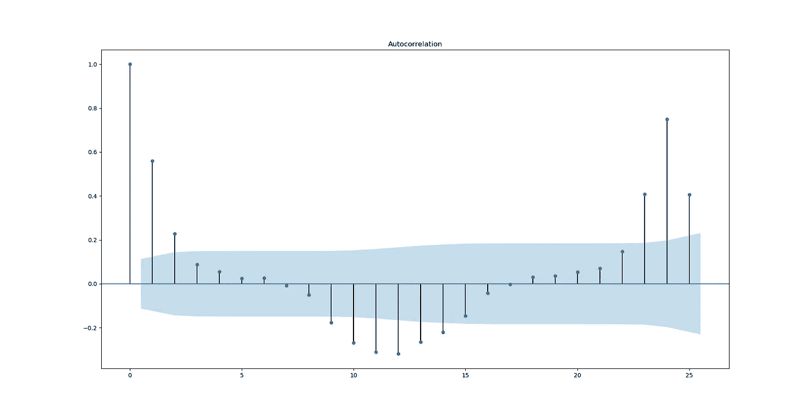
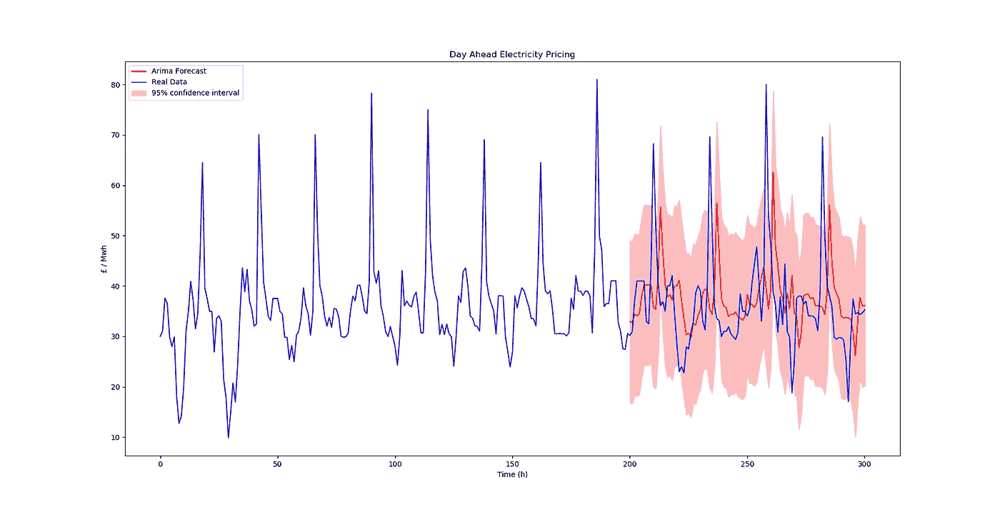

# 我们能预测未来的电力市场吗？

> 原文：<https://towardsdatascience.com/can-we-predict-the-day-ahead-electricity-market-f532137fd5be?source=collection_archive---------17----------------------->

Photo by [Severin D.](https://unsplash.com/@sdmk?utm_source=medium&utm_medium=referral) on [Unsplash](https://unsplash.com?utm_source=medium&utm_medium=referral)

## 用 ARIMA 预测法预测英国电力市场

ordpool 为英国、北欧和波罗的海国家运营前一天电力交易平台。前一天的市场通过建立供需平衡来运行，因此消费者将在系统中输入所需的电量和愿意按小时支付的价格，而发电机将需要确定它可以输送多少电以及它希望按小时支付的价格。电价是由系统将发电商的报价和消费者的出价匹配起来决定的。购买和销售曲线被构建，它们的交叉点决定了市场价格和每天整点交易的电量。

ARIMA 预测方法将用于预测未来一天的电力市场。我选择使用非季节性 ARIMA 方法，因为只使用了前 300 个值，而不是全年的数据。数据来自 nord pool 2016-2017 年，由于模型在我的电脑上运行时间太长，因此在潜在的 8800 个值中只有 300 个值用于此过程。这个过程的完整代码在 [GitHub 库](https://github.com/hhamud/Arima-Forecasting)中

# 拟合预测模型

ARIMA 代表**A**uto**R**e**I**integrated**M**oving**A**average，在这个模型中，使用了三个主要参数，分别表示为( **p，d，q** )。该模型结合了自回归模型和移动平均模型，并将这种混合预测模型应用于差分时间序列。

第一步是查看时间序列是否平稳，即查看时间序列的统计特性是否随时间变化。要使用的检验称为增广的 Dickey-Fuller 检验，也称为单位根检验。它检验零假设，即时间序列样本中存在单位根，它不是平稳的，另一个假设是它是平稳的，因为它的统计特性不随时间变化。

Dickey-fuller Test Code

Results of the Dickey-Fuller Test

结果表明，可以拒绝零假设，因为数据样本在统计上不可能是非平稳的，因为 p 值< 0.0000001，这意味着数据样本中不存在单位根，因此时间序列是平稳的。

**d** 参数代表模型要求的差分的综合阶次，使得时间序列数据变得稳定。通过从前一时间步的观测值中减去当前观测值，使时间序列变得平稳。因此，在这种情况下，它可以设置为 0，因为时间序列已经是稳定的。

**P** 参数代表 ARIMA 方法的自回归模型的阶数。这使用了一个观察值和多个滞后观察值之间的依赖关系，这意味着这是一个用于测试时间序列数据内随机性的工具，通过测试来查看 X 在多大程度上受 X. e. *的先前值的影响。g .当前价格在多大程度上受先前价格的支配，以及这种情况会持续多久。*此参数通过创建自相关图表并查看数字来计算。在这种情况下，从图表中可以设置为 5 阶。

Autocorrelation chart that helps to determine the P Parameter

**q** 参数代表移动平均值的阶数，并显示窗口函数移动时的大小。此参数通过部分自相关图表计算得出。在这种情况下，可以将其设置为 12 阶，因为有 12 个值超出了 95%的置信区间(蓝色条)。

Partial autocorrelation graph that helps to determine q parameter

下面是测试不同 ARIMA 模型并计算哪个具有最低 AIC 值的代码。AIC 值是赤池信息标准，用于比较预测模型。由于很难从上面的图中看到正确的参数，我也选择了迭代一系列 ARIMA 模型，看看哪个模型最好

Iterating the ARIMA forecasting models

上述代码的结果为我们提供了一个(1，1，2)模型，用于 AIC 值为 1400 的(p，d，q)参数，还有其他具有更低值的不同模型，但是它们会产生错误，因此我将使用这些值，因为很难单独从图中检测出正确的 AR 和 MA 参数。

# 验证模型

既然已经找到了 ARIMA 参数，必须将数据分成训练样本和测试样本，因此前 200 个值将用于训练模型，后 100 个值将用于验证模型。

Arima forecasting function written to predict the next 100 values

结果如下所示，大多数测试值都在预测 ARIMA 值的 95%置信区间内。该模型的均方误差为 62，表明该模型可以进一步改进。然而，我们最初的努力是成功的，你可以使用 ARIMA 模型预测未来一天的市场。

Results of validating the ARIMA prediction values against the test values