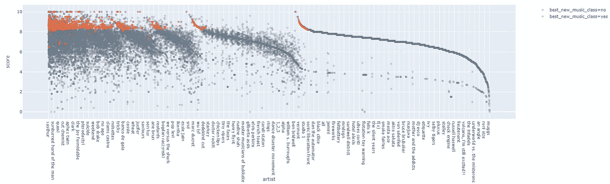

# 我们能预测干草叉音乐评论的结果吗？

> 原文：<https://towardsdatascience.com/can-we-predict-the-outcome-of-pitchfork-music-reviews-3b084d90c18f?source=collection_archive---------18----------------------->

## 我在研究数据时发现。

我是一个音乐迷。我尽可能多地听音乐。我不仅听，我还写，录，表演，制作，本质上是生活和呼吸音乐。我过去非常关注的事情之一是音乐评论。Pitchfork Music 是这个领域的主要参与者，我想知道我是否可以建立一个模型来预测 Pitchfork Music 的“*最佳新音乐”*奖。我也在学习数据科学，所以我决定让这两个世界稍微融合一下。

*一点背景:Pitchfork 对提交的内容进行 0 到 10 分的评分，10 分是最高分。多名员工都提交他们认为的分数，他们对所有员工的评价取平均值，这就是分数。他们还投票决定它是否应该获得“最佳新音乐”奖。这些实际上是如何确定的细节是未知的，至少对我来说是这样。* *你可以在这个子栏目* *里读到更多关于它的* [*。*](https://www.reddit.com/r/indieheads/comments/2xmmpi/how_does_pitchfork_come_up_with_their_ratings/)

我下载了数据，清理了数据，争论了数据，创建了模型，并运行了一些预测，能够以相当高的准确度合理地预测“最佳新音乐”。尽管有那么多的预测模型，但这并不是整个过程中最有趣的地方。这是我在数据中发现的。

先从分数分布说起。你在这里看到的是大约 26，000 个分数跨越了大约 17 年。你可以看到分数一般集中在 6 到 8 分之间(这里是不是存在一些选择偏差？)而且大多数 BNM(从现在开始我将简称为“最佳新音乐”)的评分都在 8 分以上，这并不奇怪。

您还可以在这个[部分依赖图](https://pdpbox.readthedocs.io/en/latest/)上看到分数和 BNM 差异之间的关系，这个图本质上显示了一个特征(在本例中为“分数”)对分类结果(即 BNM)的重要性。

我还测试了其他特性的依赖性，发现了许多关系。最值得注意的是流派、艺术家和标签。从表面上看，这可能很有意义，但我会告诉你为什么这很有趣，但为了做到这一点，我想从谈论与“作者”的关系开始。根据数据，一些作者似乎比其他人更有可能给出更高的分数和/或 BNM 标签，如下所示:

以下是列表形式的相同数据:

你也可以开始看到流派的倾斜。

关于“流派”的数据，最有趣的是它们的分布。看看这张表:

摇滚无疑是最常被评论的流派，而全球是最少被评论的流派，但这并不重要。最有趣的是 BNM 的分布。流行音乐和 R&B 拥有最高比例的 BNM，实验音乐和摇滚音乐紧随其后。

说到唱片公司，这里有一个非常明显的偏差…似乎有些只是比其他的更有趣！

看起来你和谁签约是很重要的，尽管我想指出的是，有 21 张专辑是自己发行的，这说明了现代传播音乐的方法。

我们看到同样的事情发生在艺术家身上:

这个图表可能看起来有点奇怪，但是它是由每个标签的总 BNM 值组织的。这是图表左上角特写:

现在让我们以同样的方式来看“艺术家”。

同样，为了清晰起见，左上角放大了。

BNM 集中在整个“艺术家”领域的一小部分。要么一些艺术家比其他人更受青睐，要么就是比其他人更好。

那么，这一切意味着什么呢？在每一个特征(流派、艺术家、作者和标签)中，最好的新音乐区别都集中在与整体数据相比相对较小的数量上。是不是一个厂牌挑的艺人比其他的好？是不是一个艺术家始终比其他人优秀？而作者呢？在什么是真正最好的新音乐的问题上，有些人比其他人更有先见之明或更有洞察力吗？

号码

至少在我看来不是。我相信我们在这里看到的是音乐是非常主观的。一直都是。尽管试图保持客观，或者至少声称如此，Pitchfork 倾向于支持特定的流派、特定的艺术家和特定的标签，作者本身也倾向于有特定的倾向。

现在，这只是一个网站，尽管它在乐评界很有影响力。如果我从其他大型评论网站获取数据，会有什么变化？我们会看到相同的偏差，还是会因站点而异？我认为公平地说，这将是一个有趣的实验，也许是我将来要解决的问题！

注意:我将整理一篇文章，介绍我是如何实现我的代码的，展示我的数据清理、模型和特性工程，并将相应地更新这里的链接。与此同时，[这里是我的 Github 库，供您欣赏。](https://github.com/lechemrc/Pitchfork_Review_Learning)