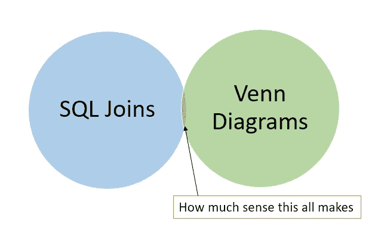
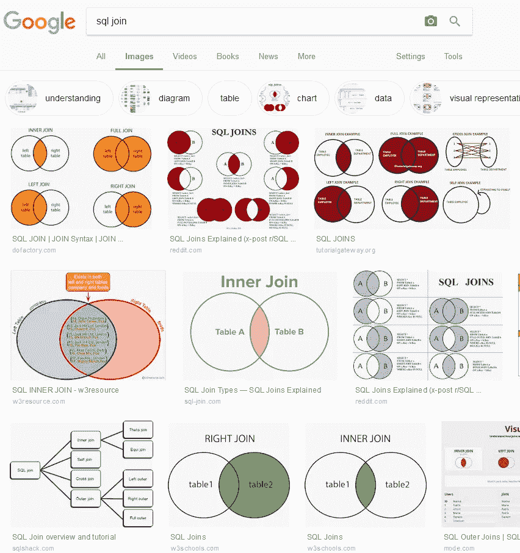
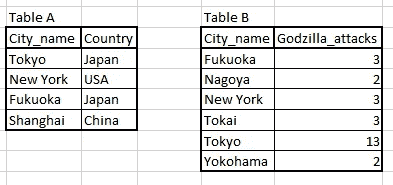
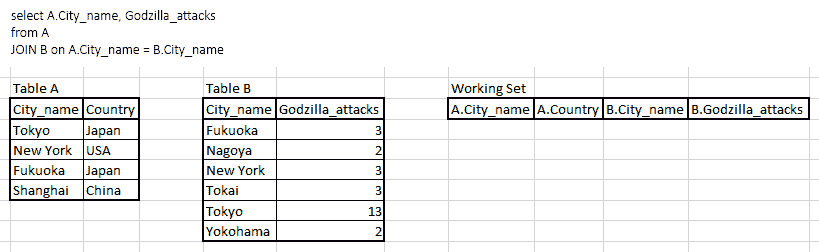
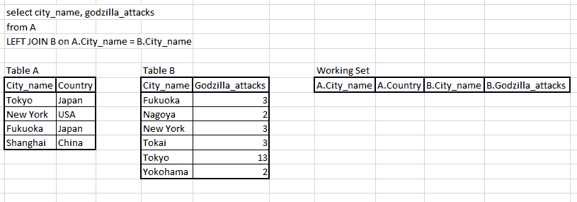
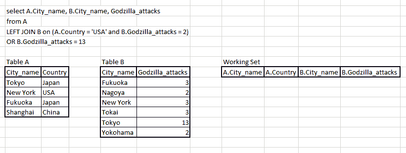

# 我们能不能不要再说 SQL JOINs venn diagrams 了？

> 原文：<https://towardsdatascience.com/can-we-stop-with-the-sql-joins-venn-diagrams-insanity-16791d9250c3?source=collection_archive---------8----------------------->

*真的，求求你，OMG，停*



烦躁时间。这些年来，我不得不多次向非技术人员教授 SQL，每个试图学习 SQL 但失败的人都谈到“连接是多么困难和可怕”。如果你在网上搜索 SQL 连接的解释，是的，它看起来很疯狂。



Look at this, just LOOK at it!

真正让我困惑的是，连接和集合论的整个混合甚至没有意义。一旦你的解释必须在看似任意的地方包含“其中 A 为空”,人们会认为你必须记住任意的咒语才能让事情正常进行——这听起来确实很难！

啊，谁来让这停下来！

## 旁注:关系代数

是的，我知道 SQL 源于关系代数，而不是集合论。实际上，我向人们解释事情的方式产生了类似的结果，但显然是从笛卡尔开始并向下过滤的正式方式向后倒退了一些。

我没有正式的关系代数背景，所以不要让我无药可救，欢迎你查看关于这个话题的[其他](http://www.databasteknik.se/webbkursen/relalg-lecture/index.html) [来源](http://www.cs.cornell.edu/projects/btr/bioinformaticsschool/slides/gehrke.pdf)。

## 我是如何向人们传授联结的

我用一步一步的伪算法来解释 SQL 引擎如何产生连接的数据集，因为我觉得它可以让你掌握一些用连接可以做的更疯狂的事情。

用于生成和测试这些查询的 PostgreSQL 兼容 SQL 位于末尾

假设我们有两张表，A 和 B:



Data about [cities godzilla attacks adapted from here](https://www.inverse.com/article/30488-godzilla-every-city-kaiju-attack-tokyo-new-york-ghidora-king-kong)

假设我们想任意连接 A 和 B 以得到“表 A 中的城市名称和 B 中的哥斯拉攻击”。(是的，这些表格有很多数据问题。为了简单起见，我没有考虑 id 和规范化，所以我必须使用 City_name 作为连接键。但所有这些在教授联接如何工作时都无关紧要，所以我忽略了它。)

我在这里的目标是教那些只看了 15 分钟 SQL 语法的人如何准确地预测一个连接将产生一致的结果。

## 概念连接算法

对于一般查询:

```
Select _*fields_*
FROM A
JOIN B ON on_*conditions* WHERE *where_conditions*
```

我使用了“*工作集*的概念，符合连接条件的行被名义上存储起来，以便以后根据 where 条件进行检查。

1.  对于 A 中的每一行，逐一与 B 中的每一行进行比较
2.  检查 *on_conditions
    —* 如果 *on_conditions* 为真，则将 A 中的行连接到 B 中的行，并将连接的 A+B 行放入*工作集
    —* 如果 *on_conditions* 为假，则继续比较下一对行
3.  对于左/右/外连接
    —对于左连接:如果对于 A 中的一行，没有条目被放置在*工作集*中，尽管检查了 B 中的每一行，然后将 A 中的该行放置在*工作集*中，在应该具有来自 B 的数据的字段中使用空值
    —对于右连接:类似于左连接，但是对于 B， 如果在与 A 的所有行进行比较后，B 中的某一行在*工作集*中没有条目，则将 B 中的行插入到*工作集*中，在应该有来自 A 的数据的地方使用空值
4.  检查完所有行组合后，从*工作集*中取出任何内容，并使用 *where_conditions* 对其进行过滤
5.  根据需要应用任何 GROUP BY、ORDER BY、HAVING 子句
6.  获得结果集，就大功告成了

## 这听起来仍然很难！

言语艰难。

动画更容易，所以我用 Excel 和 Photoshop 给你们做了一些。如果你想借，请随意。

## 警告:这不是 SQL 引擎的实际工作方式！

我在这里掩盖了一大堆东西，索引，NoSQL 的怪癖(比如如果你在 Hive 上，只能进行等价连接)，为了不浪费内存和时间而进行的许多优化。

没关系，一个初学者不应该关心这些东西，最终结果匹配。

## 内部连接

```
SELECT A.City_name, Godzilla_attacks
from A
JOIN B on A.City_name = B.City_name
```

这个很简单——遍历两个表，当名称匹配时，插入到工作集。



A simple INNER JOIN

## 左连接

```
SELECT A.City_name, Godzilla_attacks 
from A LEFT 
JOIN B on A.City_name = B.City_name
```

也很简单，遍历所有的行，发现末尾的上海在 B 中没有可连接的条目，用一个空值添加它。然后，您可以在 WHERE 子句中过滤掉工作集*中的空值。*



A simple LEFT JOIN

## 疯狂加入

```
SELECT A.City_name, B.City_name, Godzilla_attacks 
from A 
LEFT JOIN B 
  on (A.Country = ‘USA’ and B.Godzilla_attacks = 2) 
  OR B.Godzilla_attacks = 13
```

**这个查询毫无意义。故意的**。如果你能在脑子里想象这个东西的行为，你就基本上掌握了连接的概念。

只要 ON 条件的值为 true，连接就是有效的，这完全是滥用了这一事实。您可以以极其强大的方式滥用这一点，使用诸如 *case* 语句、算术和其他复杂的逻辑。这就是为什么自连接是完全自然的，以及如何可以轻松地构建直方图。左连接并不重要，因为 A 中的所有行都可以找到一些连接对象。

引擎不关心，它只看到逻辑符号，如果为真则加入。



A “Go home you’re drunk” JOIN

## 最后

希望有人，在某个地方，用这个从维恩图中被拯救出来。如果只有一个人得救，并学会了如何更好地加入，我很高兴。

前进，写一些疯狂的条款。

## 谢谢

这篇文章的灵感来自于某个人提醒我我有多讨厌这个:

## 密码

示例 DDL 和 [DB-fiddle](https://www.db-fiddle.com/f/kwBLvL8WUSbxvjSprJg5ce/0) 中的“疯狂”查询。

```
create table A (City_name varchar, Country varchar);
insert into A (City_name, Country) values
(‘Tokyo’,’Japan’),
(‘New York’,’USA’),
(‘Fukuoka’,’Japan’),
(‘Shanghai’,’China’)
;
create table B (City_name varchar, Godzilla_attacks int);
insert into B (City_name, Godzilla_attacks)
values
(‘Fukuoka’,3),
(‘Nagoya’,2),
(‘New York’,3),
(‘Tokai’,3),
(‘Tokyo’,13),
(‘Yokohama’,2)
;
```