# 我们能教一台计算机量子力学吗？(第一部分)

> 原文：<https://towardsdatascience.com/can-we-teach-a-computer-quantum-mechanics-part-i-c3e724e31e1a?source=collection_archive---------26----------------------->

## 量子电路综合的强化学习方法

**作者:** Kaiah Steven，Matthew Rose，Tyler Jones 和 Xavier Poncini(量子机器学习研究团队， [Max Kelsen](https://maxkelsen.com)

# 1.介绍

它被誉为震撼世界的下一项通用技术，就像图灵机的出现开启了信息时代一样。量子计算机被承诺会带来数不清的计算能力。然而，尽管我们尽了最大努力，我们还没有看到一台物理实现的量子计算机胜过它的经典计算机。通往[量子霸权](https://ai.google/research/pubs/pub46227)的道路是漫长的；幸运的是，这不是我们的第一次计算革命。借助经典计算领域的资源和经验，我们可以绘制出这一革命性技术发展阻力最小的路径。

本博客的第一部分将深入研究量子力学的使用，以促进有效的计算。然后，当我们试图解决同时控制和隔离量子比特的悖论时，本博客的第二部分讨论了我们打算如何通过强化学习将问题交给机器。

# 2.量子力学和计算

故事从我们最基本的现实理论*量子力学*开始。众所周知，这种描述是反直觉的，它预言了两种现象，这两种现象一旦被利用，就构成了量子计算的基础。
第一个效应，叠加，可以认为是一个物理系统可以同时存在于多个不同的状态。这种叠加持续到量子态被扰动(例如测量)导致“坍缩”成一个单一的经典态。进入量子领域，我们的标准计算单元可以从拥有 0 或 1 状态的简单比特升级到拥有 0 和 1 状态的任何可能组合的量子比特。

第二个影响是纠缠。顾名思义，这样的过程将两个或更多的物体缠绕在一起，确保它们有着相关的命运。假设我们纠缠两个量子位，每个量子位的状态是不确定的。从数学上来说，独立描述每个量子位是不可能的，我们只能描述整个系统。因此，我们对中一个量子位元的崩溃和测量会立即影响另一个的状态。

叠加和纠缠现象如何在有效计算中有用？首先，它们允许我们生产一个[通用图灵机](https://www.cl.cam.ac.uk/projects/raspberrypi/tutorials/turing-machine/one.html)的量子力学模拟。这是通过定义一组操作来实现的，这些操作的有限序列可以执行任何可能的计算。第二，也许是最令人兴奋的前景，是利用叠加来并行计算大量的场景。这种计算能力有助于高效解决多变量优化问题——自然出现在所有行业领域(参见[金融](https://arxiv.org/pdf/1905.02666.pdf)和[大数据](https://news.mit.edu/2016/quantum-approach-big-data-0125)中的例子)。

我们目前正处于通往量子霸权之旅的开端——可以使用被称为嘈杂的中等规模量子计算机( [NISQ](https://arxiv.org/pdf/1801.00862.pdf) )。这些设备的最大障碍之一是退相干，它为每个量子位设置了一个失效日期。量子系统中包含的信息最终会“泄漏”到环境中，直到你正在使用的系统失去其*，变得实际上不可用。*

*这产生了一个设定的时间窗口来执行量子计算(参见[量子纠错](https://arxiv.org/pdf/0905.2794.pdf)来永久解决这个问题)。因此，时间成为一种资源，必须有效地利用它来充分利用量子计算。因此，研究集中在寻找最快的方法来执行量子算法。找到这个最优解绝不是一个容易的问题，并且今天仍然是一个公开的研究问题。*

*量子计算的一个特殊公式由[电路模型](https://medium.com/@jonathan_hui/qc-programming-with-quantum-gates-8996b667d256)提供。这里，在量子位上执行的酉运算用门来表示。通用量子计算并没有唯一地定义一组门——因此有许多组[达到这个目的。出于我们的目的，我们将集中于由 X、Z、H、CNOT 组成的门集。这样的门集并不是通用的(在标准条件下)，然而它将允许我们访问叠加态和纠缠态。在我们创建第一个量子电路之前，我们将介绍两个想法，每个想法对于发展对这些机器要执行的操作类型的直觉都是至关重要的。](https://blogs.msdn.microsoft.com/uk_faculty_connection/2018/02/26/quantum-gates-and-circuits-the-crash-course/)*

# *2.1.布洛赫球*

*[布洛赫球](https://medium.com/@quantum_wa/quantum-computation-a-journey-on-the-bloch-sphere-50cc9d73530)是单个量子位状态的直观视觉表示。叠加允许系统处于 0 或 1 状态的任意线性组合。在 [bra-ket 符号](https://ocw.mit.edu/courses/physics/8-05-quantum-physics-ii-fall-2013/lecture-notes/MIT8_05F13_Chap_04.pdf)中，一个位的经典 0 和 1 状态被表示为|0⟩和|1⟩.，这将在下一节讨论因此，我们可以将某个系统 *S* 的状态描述为这两个状态的线性组合:*

**

*系数 *α* 和 *β* 被称为概率振幅。量子力学的核心是这些系数拥有复数值的能力，例如:*

**

*在上面的等式中，我们给出了 *α* 及其复共轭 *α* *，其简单地反转了与复数单元相关联的符号。量子力学的许多令人惊讶的结果可以归因于我们缺乏对复杂概率振幅的直觉。系统处于 0 或 1 状态的概率由概率幅度的绝对平方定义。*

*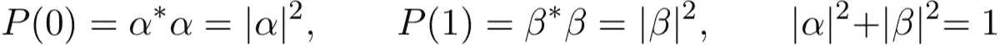*

*现在让我们用文字总结这些方程的主要结果:*

*   *我们将系统的状态描述为可能的状态 0 和 1 乘以它们相关的概率幅度的线性组合*
*   *这些振幅很奇怪，因为它们可以是复数*
*   *取与每个状态相关的概率振幅的绝对平方，我们可以确定系统处于每个状态的概率*
*   *概率之和必须等于 1*

*Bloch sphere 是将这些概念捆绑到一个直观的包中的简单方法(参见下面的图 1)。最后的约束确保单个量子位系统的所有可能的叠加态都存在于球体的表面上。当在我们的量子位上执行操作时，我们将探索这个物体的表面。*

*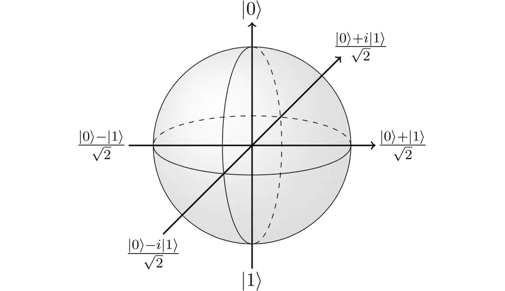*

*Figure 1: The surface of the Bloch sphere defines all of the possible states accessible to a single-qubit system. The application of universal single-qubit gates will allow us to travel anywhere on the surface of this object.*

# *2.2.布雷克记号*

*Bra-ket 符号是描述操作符(门)对状态的作用的数学形式，这些操作的结果允许我们的状态遍历 Bloch 球。下面的等式表示 X 门在零量子位状态下的作用:*

**

***换句话说**:将 X 门应用于量子位的计算零状态，将该状态转换为计算一状态。*

***在球体上**:X 门将量子位状态从布洛赫球体的北极发送到南极。*

*现在，让我们检查当我们将 X 门应用于计算一态时会发生什么:*

**

***换句话说**:X 门将一态转换为零态。我们看到 X 门是经典计算中[非门](https://www.khanacademy.org/computing/ap-computer-science-principles/computers-101/logic-gates-and-circuits/a/logic-gates)的量子模拟。*

***球体上**:X 门将量子位状态从布洛赫球体的南极发送到北极。*

*把这些动作结合起来，我们就可以看到在布洛赫球面上由这种操作引起的运动。*

*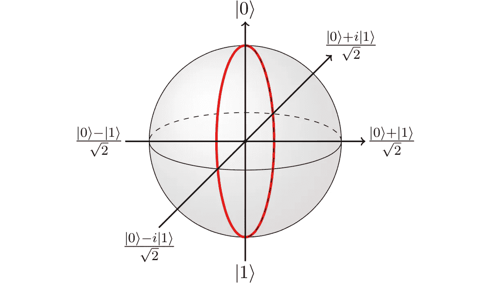*

*配备了我们的布洛赫球解释让我们检查剩下的单量子位门。Z 门的动作由下式给出:*

**

*检查 Z 对混合态的作用:*

*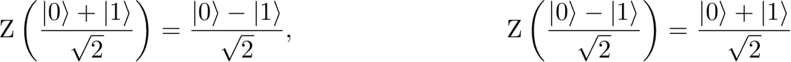*

***在球面上**:Z 门围绕布洛赫球面的赤道平面运行。*

*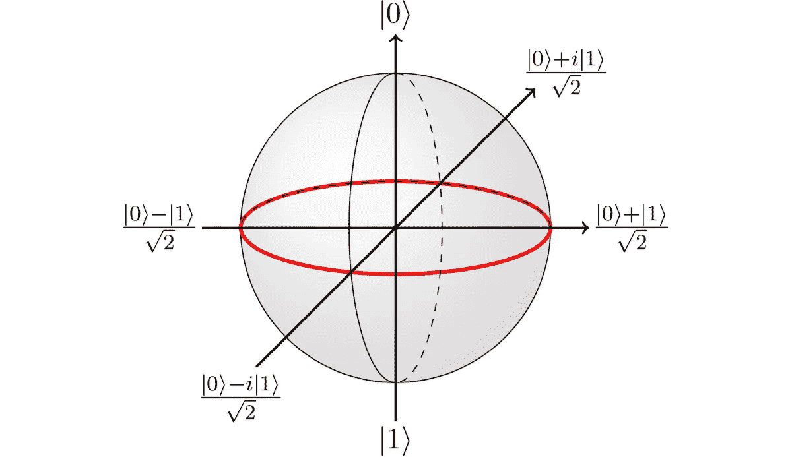*

*现在让我们检查哈达玛门:*

*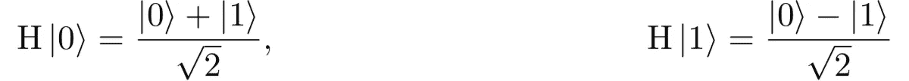*

***在球体上**:H 门从两极行进到赤道。*

*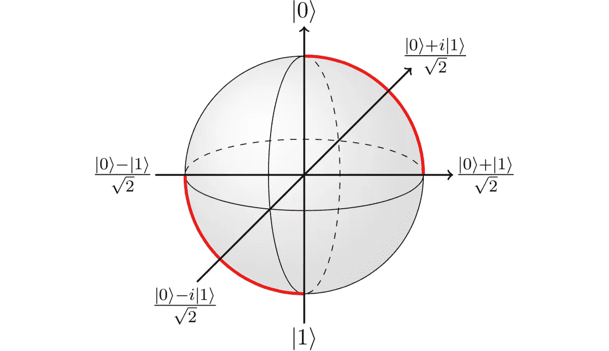*

*与我们之前检查过的三个门不同，CNOT 门是两个量子比特的操作，因此不允许用布洛赫球来解释。我们可以通过简单地在我们的状态旁边加上一个额外的项来表示两量子位系统——从数学上来说，这相当于取一个张量积。|01⟩状态拥有两个量子位，第一个处于 0 状态，第二个处于 1 状态。以类似于单量子位情况的方式，我们可以如下表示双量子位系统:*

**

*现在让我们研究一下 CNOT 门在我们拥有的两个量子比特系统空间中的作用:*

*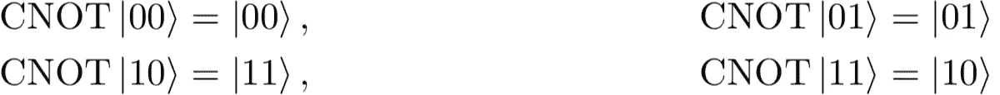*

*将 1 和 2 量子位状态的概念推广到 n 量子位状态对于下面的部分将是有用的，让我们通过建立序列来说明这样的推广:*

*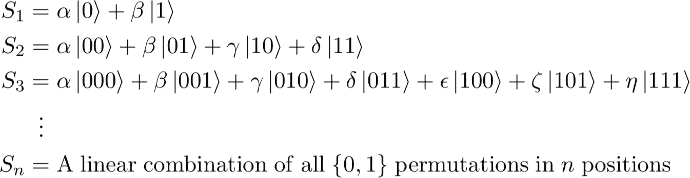*

*既然我们已经详细介绍了钥匙门的作用和多量子位系统的概念，让我们创建我们的第一个量子电路吧！*

# *2.3.线路模型*

*量子电路模型是量子算法的图形表示，它将问题分成常见的子过程，类似于经典计算或电气工程中的模拟电路模型。状态表示为水平线，集合中的任何门都可以对其进行操作:*

**

*让我们想象我们有三个量子比特在|111⟩态，我们想在最终态|110⟩.结束实现这一结果的示例计算如下:*

*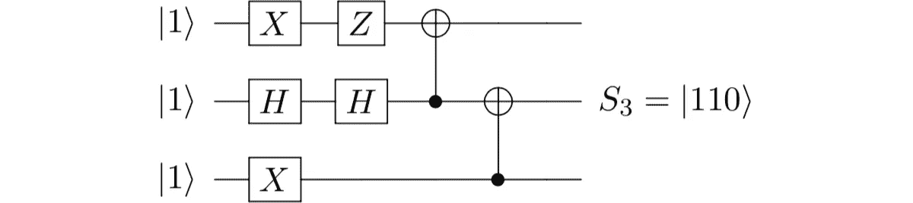*

*检查这个计算的输入和输出状态，我们看到这个复杂的图表只是翻转了第三个量子位的状态。实现相同结果的简化计算如下:*

**

*这里我们应用了量子力学的知识来简化一个电路的玩具例子。让我们看看当我们扩展到任意数量的量子位时会发生什么:*

*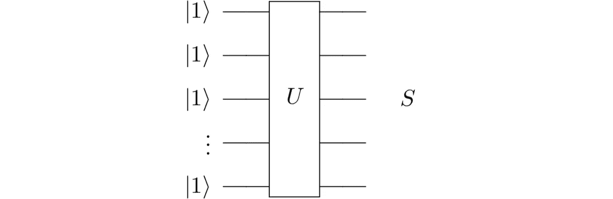*

*不一定清楚如何确定 *U* ，产生任意的最终状态 *S* ，以及这个特定的 *U* 是否有效。自动化的一个自然问题出现了:是否有可能构建一个模型，它采用一个输入输出状态对，并生成一个有效的电路来促进这种转换？*

*我们随后的研究试图回答这个问题。鉴于机器学习最近的成功——彻底改变了计算机视觉、机器人学和许多其他领域——我们试图调查这一领域，以检查可能有能力学习[计算景观](https://arxiv.org/pdf/1710.07753.pdf)结构的可能范式和架构。*

*很快就很明显，这样的问题可以类似于视频游戏。我们有一些初始状态，一组有限的操作和一个最终状态，我们只是不知道到达那里的最佳方式。随着强化学习在国际象棋和围棋中击败领域专家，挑战物理学家在高效量子电路的产生中找到阻力最小的路径似乎是很自然的。*

****见*** [***第二部分***](https://medium.com/@maxkelsen/can-we-teach-a-computer-quantum-mechanics-part-ii-5e90ac96ef3a) ***为我们的实现。****