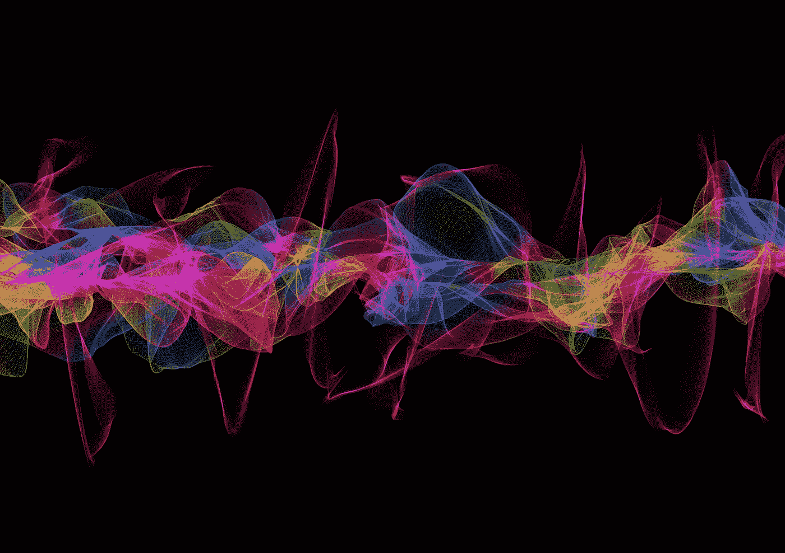
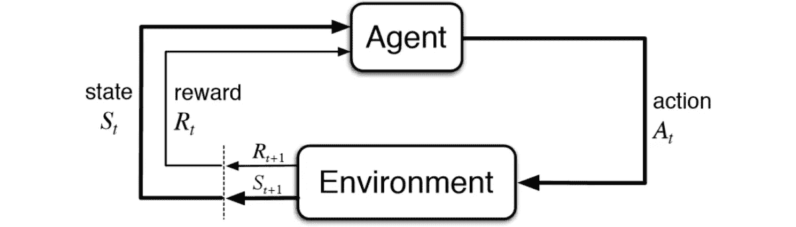
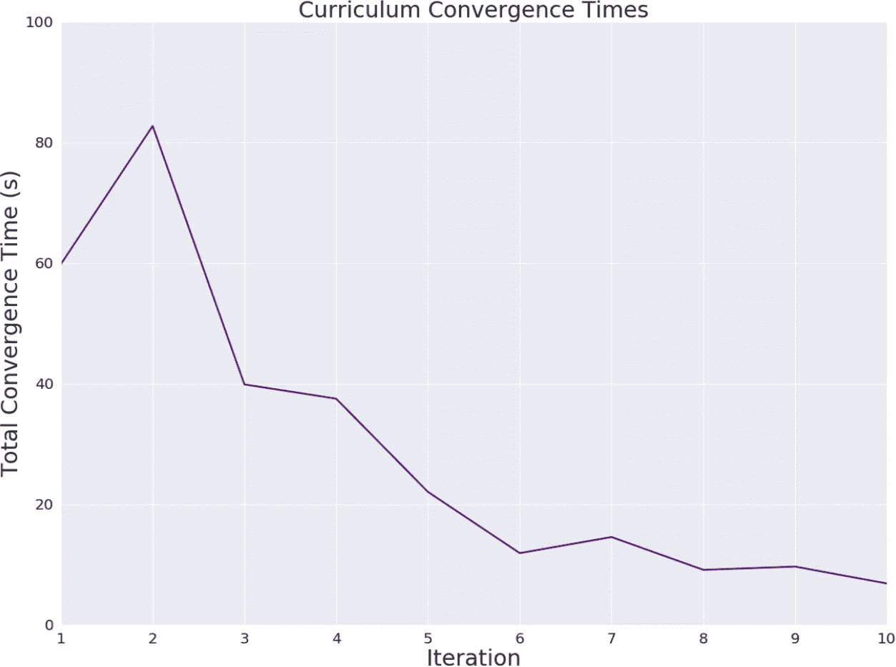
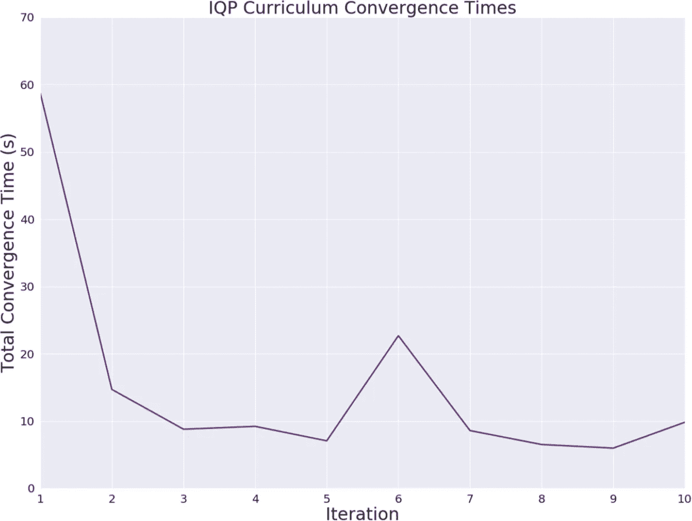

# 我们能教一台计算机量子力学吗？(第二部分)

> 原文：<https://towardsdatascience.com/can-we-teach-a-computer-quantum-mechanics-part-ii-5e90ac96ef3a?source=collection_archive---------35----------------------->

## 量子电路综合的强化学习方法

**作者:** Kaiah Steven，Matthew Rose，Tyler Jones 和 Xavier Poncini(量子机器学习研究团队， [Max Kelsen](https://maxkelsen.com)

在本系列的[第一部分](https://medium.com/@maxkelsen/can-we-teach-a-computer-quantum-mechanics-part-i-c3e724e31e1a)中，我们介绍了许多对量子计算至关重要的先决概念。在这一部分中，我们将详细介绍我们将强化学习应用于状态准备问题的工作。

# 介绍

我们生活在一个量子计算仅限于嘈杂的中等规模量子计算机(NISQ)的时代。这项技术——就像石头碰撞产生火花的启示——为难以想象的创新和潜力奠定了基础。

目前，这些设备受到可用量子位数量少和相干时间短的限制；因此，当前的目标是从这项新兴技术中提取尽可能多的“热”和“光”。在资源有限的情况下，NISQ 的潜力取决于资源的有效利用。因此，实现特定过程的最佳门(量子位操作)配置是非常需要的。然而，找到这种配置并不容易，尤其是在试图进行有用的量子计算时。

将机器学习突破应用于这一困境是一条充满希望的途径，可以用这些火花点燃一把火，并从今天的量子计算机中获得实际优势。

# 强化学习

在我们开始之前，让我们快速介绍一下强化学习(RL)。由于一些突破性的成就而在人工智能领域受到欢迎，例如 OpenAI Five RL 基于 DOTA2 团队击败了一支职业选手团队，以及谷歌的 AlphaZero 在围棋中击败了 Lee Sedol 和柯洁(两人都是多个世界冠军得主)。

RL 作为一种有潜力只“解决”视频游戏的技术已经获得了声誉。然而，我们希望量子计算是游戏领域之外的一个领域，可以有效地利用 RL 的力量。

强化学习背后的一般思想是教一个代理(由一个策略体现)如何达到某个定义的目标或目的。这可以通过对两个主要元素——代理和环境——的描述来理解。

Figure 2: Learning loop of a typical reinforcement agent

RL 中的环境可以被认为是我们的代理生活在其中并与之交互的虚拟世界。这种交互和反馈允许代理从环境中学习，就像人类通过与他人和周围世界的交互来学习一样。

在时间段(或“情节”)的每一步，我们的代理人被允许观察他们周围的世界，部分或全部，以获得对其当前状态的一些理解。然后，代理从一些预定义的动作空间中选择一个动作，以促进进一步的交互。这个动作改变了环境的状态，并根据世界先前状态和新状态之间的差异向代理返回一个奖励。

代理选择任何动作的基础是该代理的策略——基于当前观察到的环境状态输出有效动作的某种概率分布。在 Deep RL 中，这种策略通过一个神经网络来表现，该神经网络将当前状态作为输入，并提供一个动作作为输出。

一个天真的方法可能是简单地选择最直接的回报。然而，这可能会导致代理陷入困境或走进死胡同——达到局部极值。人们通常会将未来行动的贴现回报与最直接的行动相结合，以此来学习如何达到最终目标。

在我们的代理播放完一集之后，策略会根据存储的状态、动作和奖励信息进行更新。这种更新作为一种方式来教导代理在某些状态下哪些动作是优选的，哪些应该避免。

构建有用的、起作用的 RL 代理的一个主要障碍是构建一个最佳映射到您的特定用例的奖励函数。这种功能是代理在其环境中的唯一监督者，该环境应该只提供引导代理朝向其目标的奖励，并且以避免陷阱的方式。

RL 研究领域充斥着错位和误导代理的例子——大多数在我们看来很幽默，但对代理来说完全合理。例如:

*   “我在我的 Roomba 上连接了一个神经网络。我想让它学会在不撞到东西的情况下导航，所以我设立了一个奖励计划来鼓励速度，阻止撞上保险杠传感器。它学会了倒车，因为后面没有保险杠。”
*   “代理人在第 1 级结束时杀死自己，以避免在第 2 级失败”
*   “代理无限期暂停游戏以避免失败”
*   一种赛船游戏，其中“RL 代理找到一个孤立的泻湖，在那里它可以转一个大圈，并重复撞倒三个目标，定时移动，以便总是在目标重新聚集时撞倒它们”，而不是实际完成比赛

看到[这里](https://docs.google.com/spreadsheets/d/e/2PACX-1vRPiprOaC3HsCf5Tuum8bRfzYUiKLRqJmbOoC-32JorNdfyTiRRsR7Ea5eWtvsWzuxo8bjOxCG84dAg/pubhtml)越来越多的在游戏中使用强化学习的文献目录，以及一些相当有趣的错误奖励函数。在概述了量子计算和强化学习的预备知识之后，我们现在可以详细描述我们将强化学习应用于量子态制备的努力。

# 我们的方法

现在有了利用强化学习来优化量子电路构造的能力，我们开始探索我们的选项，包括使用什么样的动作集，将什么定义为我们的状态，可能的奖励函数，以及训练哪个实际的 RL 算法。

[IBMQs Qiskit Python 库](https://github.com/Qiskit/qiskit-api-py)用于构建和可视化量子电路，并与基于 Python 的量子计算库 [Qutip](http://qutip.org/) 一起执行相关的量子操作。用 TensorFlow 实现的神经网络被用作代理策略的基础。

在探索了有关 RL 算法的当前文献并检查了最先进的性能之后，[近似策略优化](https://openai.com/blog/openai-baselines-ppo/) (PPO)的广泛成功和适用性促使我们在测试中使用这种算法。检查的其他选项包括[投影模拟](https://arxiv.org/abs/1104.3787)、[深度 Q 网络](https://deepmind.com/research/dqn/)和[异步演员-评论家代理](https://arxiv.org/pdf/1602.01783.pdf) (A3C)。

我们的第一个努力是利用指定量子位的量子状态作为环境状态，同时定义一个由所有合法量子位门对组成的动作空间(例如，量子位 1 上的 X 门被指定为与量子位 3 上的 X 门不同的动作)。

最初的奖励函数是在保真度的唯一基础上运作的，保真度是衡量一个人区分两个量子态能力的尺度。基本上，环境的当前状态和目标状态重叠越多，奖励越高。为了鼓励合成更小的电路，每使用一个门，奖励也会减少。

尽管忠诚有效地决定了目标是否已经实现，但很快就发现这是一个错误的奖励功能。在这个离散门空间上的保真度函数有许多局部最大值的意义上，这是错误的。特别是对于简单的电路，保真度的短期增加通常会增加完成电路所需的门的总数，在某些情况下甚至会将电路引入死胡同。

我们第二次接受奖励功能是出于对完成电路剩余门数的某种测量的野心。有两篇论文在研究如何得出这一方法时脱颖而出。一个( [Nielsen 等人](https://arxiv.org/abs/quant-ph/0603161))利用几何学的思想将量子操作空间表示为一个表面，其中最佳电路是通过这个表面的最短路径(测地线)。另一个([吉洛拉米](https://arxiv.org/abs/1808.01649))推导出了将一些量子位从一个状态驱动到另一个状态所需的门数的下限表达式。

对我们来说不幸的是，这两个选项似乎都有限制因素，使得它们在我们的框架中没有用处。测地线的生成和求解在计算上非常昂贵，而且 Girolami 的下限只被证明适用于通勤门，这使得动作集失去了普遍性。

奖励函数问题的一个犹豫不决的解决方案是引入稀疏奖励方案——在最终电路达到目标的情况下，只提供正奖励(与使用的门的数量成反比)。在这个实验阶段，我们改变了动作空间，只包含单独的门操作，并设置代理在量子位上循环，而不是让它选择。

作为这种变化的结果，身份门被添加到动作空间中，这样代理可以“跳过”一个量子位，如果它认为有必要的话。这样做可以确保每次操作中不同量子位的一致性。

这些变化的结果是有希望的，该模型能够在合理的时间内设计出具有一致性的最佳简单三量子位电路(例如，下面的电路是在大约 40 个训练周期内合成的，或者在用于测试的笔记本电脑上是在 40 秒内合成的)。

目睹我们的代理人工作后，信心大增，我们想探索模型的通用性。产生了不同目标状态的课程，从简单的一门目标单元到更复杂的四门单元。多次对不同目标集的培训有明显的改进迹象，表明代理人有能力同时学习解释多个不同目标的策略。

Figure 3: Policy improvement as a model is trained over a set of 7 unique unitaries.

在没有任何指导奖励函数的情况下，PPO 的成功代表了一个有希望的结果，特别是在超参数优化导致收敛时间显著缩短(最简单的电路在 5 秒内，课程在几分钟后)之后。这种与预训练模型融合的改进代表了迄今为止最强有力的建议，即我们的神经网络可以学习在具有挑战性的量子电路环境中导航。

因此，我们决定测试其他奖励函数，用非通用通勤 IQP 门集替换我们的通用非通勤门集。然后，我们利用 Girolami 的下界结果来形成我们的奖励函数。这个模型能够从我们稀疏的奖励中获得成功，同时将代理推向目标，并(希望)避免任何局部极大值。

Figure 4: Policy improvement as the IQP model is trained over a set of 7 unique unitaries.

使用逐步奖励函数显示出相对快速的收敛，其电路比用于产生图 3 的电路更复杂。这个通勤门奖励函数在鼓励代理人以相对较快的收敛时间实现目标方面的成功代表了一个强有力的概念证明。随着功能推广到非通勤门，一个更普遍的政策可能会发展。

我们训练强化学习代理人来合成最佳量子电路的努力，依赖于创造一个我们的代理人可以在其中玩耍的自定义环境。这种环境可以在[这里](https://github.com/MaxKelsen/quantumcircuit-gym)找到，并利用诸如支持不同的门集、考虑量子位的物理连通性以及生成不同大小的电路等特性。本系列中的所有实验都是在这个环境下完成的。

我们认为这些结果鼓励了寻找圣杯，最佳量子电路构造的持续努力。在我们的追求中，我们发现奖励函数(当前和目标状态之间距离的可靠度量)是应用机器学习来确定有效量子电路的关键因素。成本函数的后续改进将显著提高我们代理的性能。

我们目前正在探索的一些令人兴奋的相关途径包括将这种强化学习方法扩展到连续控制空间——塑造用于在电路中实现量子门的脉冲。敬请期待！