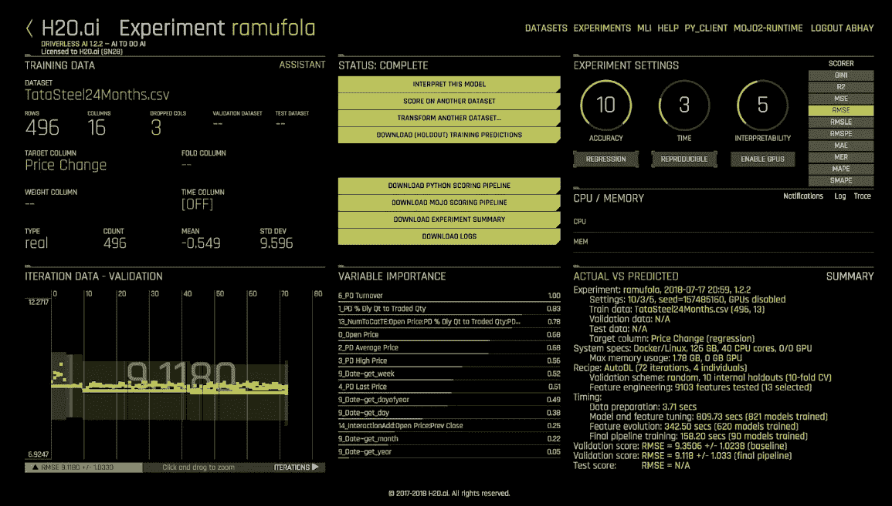
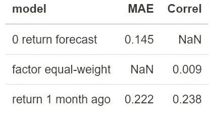
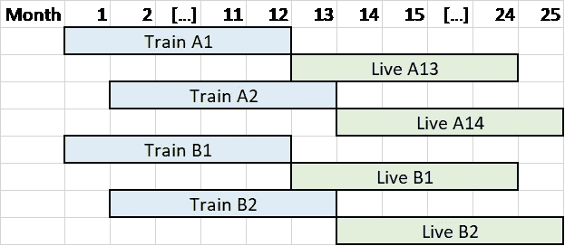

# 我们能相信 AutoML 会完全自动驾驶吗？

> 原文：<https://towardsdatascience.com/can-we-trust-automl-to-go-on-full-autopilot-ab76dc061833?source=collection_archive---------21----------------------->



# AutoML 的承诺

数据科学家短缺，自动机器学习(AutoML)有望缓解这一问题。 [H2O 无人驾驶人工智能](https://www.h2o.ai/products/h2o-driverless-ai/)在一个易于使用的应用程序中采用专家数据科学家的技术，帮助扩展您的数据科学工作。它让“每个人都能开发可信的机器学习模型”。

# 实验

一名首席数据科学家和四名经验不同的哥伦比亚大学学生在预测股票价格走势的真实问题上测试了这项技术(这是一项具有挑战性的任务！).

这些数据是罗素 1000 指数中 5 年的股票的月度数据。这些特征是 80 个股票特有的因素，如价格动量、市净率、每股收益增长率、净资产收益率。目标是 12 个月的远期股票回报(具体来说是经过 beta 调整的 alpha)。目标是使用股票特征预测股票收益。成功的衡量标准是平均绝对误差和预测与实际回报之间的等级相关性。

**该数据的特点是，它是面板数据，其中某一天的观测值之间有很高的截面相关性。此外，由于输入数据是每月提供的，而目标回报是 12 个月以后的，因此 11/12 个月在两次后续观察之间是相同的，所以时间上有很高的自相关性。**

# 原始基线

在评估一个模型之前，你需要有一个天真的基线，正如在[数据科学家犯的十大统计错误](/top-10-coding-mistakes-made-by-data-scientists-bb5bc82faaee)中所讨论的。第一条基线预测所有观测的回报率为 0，接近中值，这意味着没有办法预测回报率。第二条基线是对所有特性进行排名并取平均值，这意味着所有特性在预测回报时同等重要(这不会生成回报预测，但您仍然可以比较输入和输出排名)。最后一个基线是一个月前的回报-鉴于数据集的性质，这包括前瞻性信息，是评估任何过度训练和前瞻性偏差的良好基线。



Success Metrics for Naive Baselinemodel

# 第一个障碍—技术设置

在我们开始建模之前，第一个障碍是让每个人都与戴建立联系。H2O 建议在配有 GPU、CUDA 支持和 64GB RAM 的现代数据中心硬件上安装无人驾驶 AI。我们按照说明，用推荐的设置在谷歌云平台上安装了软件。

结果:我们在不到一周的时间里就花光了 200 美元的 GCP 积分！我们很快意识到不需要如此高的计算能力，因为我们的数据集只有 1GB 大小。我们在一台规格小得多的 GCP 机器上安装了无人驾驶 AI，它也可以在一台只有 8GB RAM 的本地笔记本电脑上工作。总的来说，安装无人驾驶人工智能需要一定的技术专长，不是团队中的每个人都具备。

# 第二个障碍—数据预处理

下一个障碍是为分析准备好数据，AutoML 对此没有帮助。我们必须预处理和组合来自多个数据源的数据，这是一项巨大的工作。我们使用了数据工作流库 [d6tflow](https://github.com/d6t/d6tflow) 和数据共享库 [d6tpipe](https://github.com/d6t/d6tpipe) 来自[数据科学家犯下的十大编码错误](/top-10-coding-mistakes-made-by-data-scientists-bb5bc82faaee)来帮助我们完成预建模步骤。

**结果**:预处理 [d6tflow](https://github.com/d6t/d6tflow) DAG 如下图所示。它采用来自彭博的股票回报数据和来自 WRDS 的股票因素数据，合并、清理和规范化这两个数据源，以使其适合于 DAI 中的机器学习，DAI 要求将干净的数据都放在一个地方。

```
└─--[TaskFactorComposite-{'idx': 'RIY Index', 'dt_start': '2011-01-01', 'dt_end': '2018-09-01'} (PENDING)]
   └─--[TaskFactorsIdx-{'idx': 'RIY Index', 'dt_start': '2011-01-01', 'dt_end': '2018-09-01'} (PENDING)]
      └─--[TaskFwdRtn-{'idx': 'RIY Index', 'dt_start': '2011-01-01', 'dt_end': '2018-09-01'} (PENDING)]
         └─--[TaskBbgHistory-{'idx': 'RIY Index', 'dt_start': '2011-01-01', 'dt_end': '2018-09-01'} (PENDING)]
            └─--[TaskBbgMembers-{'idx': 'RAY Index'} (PENDING)]
```

# 全自动运行——好得难以置信？

在我们实验的开始，我们直接使用无人驾驶人工智能界面，上传数据集，选择目标变量，调整性能和可解释性等旋钮。我们必须说，用户界面很整洁，有点像托尼·斯塔克的贾维斯。虽然所有数据科学新手都在努力选择正确的设置，但至少具有中级数据科学知识的团队成员很容易知道该做什么。

一旦发射按钮被按下，正如它的名字一样，训练就是无人驾驶的。我们观察了这个过程，因为它产生了数百个模型，创建了数千个新功能，并最终创建了一个整洁的实验结果 PDF 报告。

**结果** : MAE 为 4%，相关性为 96%。哇！机器真的比人强，把天真的模型打得落花流水。但它甚至用前瞻偏差击败了天真的模型——可疑！

# 手动添加真实测试集

根据数据科学家在[十大统计错误中对面板数据的样本外测试建议，我们建立了自己的训练/验证/测试集。戴似乎没有任何功能来做到这一点，所以我们必须手动完成。我们按时间划分数据，还做了前滚测试。做这件事的技能栏已经上升到中级。](/top-10-statistics-mistakes-made-by-data-scientists-2d58ccf12ab1)

**结果** : MAE 为 6%，相关性为 90%。仍然比带有前瞻性偏见的天真模型高得多——再次令人怀疑！

# 这东西到底有什么用？？

在这一点上，我们不太确定是什么推动了这种非凡的表现，很明显，它好得令人难以置信。我们得到了一份包含所有技术细节和图像的报告。但是它是怎么建立模型的呢？关着的窗帘后面发生了什么？很难理解它尝试了什么。它设计了哪些参数和功能？有哪些后来被放弃的功能？不仅新手迷路了，专业人士也迷路了。

通过仔细分析输出，我们找出了问题所在:戴自动添加滞后变量和出叠平均值。鉴于我们的数据集的性质，它是具有重叠目标变量的面板数据，这些特征导致了前瞻偏差和显著夸大的结果。

下图更详细地说明了这个问题。假设只有两只股票:A 和 b。我们希望从每月更新的输入数据中预测年回报率。在训练中，由于大量重叠，很容易从 A1 预测 A2。但是在运行模型时，我们没有相同的输入数据，如 A13 和 A14 所示。所以我们在训练中必须小心先前的观察。此外，如果 B 与 A 高度相关，则很容易预测，但同样，当模型在生产中运行时，该数据不可用，因此异常的“测试”性能不会持续。这些问题也让人类数据科学家感到困惑，详见[数据科学家犯的十大统计错误](/top-10-statistics-mistakes-made-by-data-scientists-2d58ccf12ab1)，参见#7+8。



Panel data with overlapping time periods

# 完全手动操作以避免前瞻偏差

我们不得不深入研究 DAI 文档，并使用 DAI python 客户端关闭这些功能，并手动运行每个实验来执行非重叠时段的前滚分析。经过相当多的努力，我们使用针对 DAI 优化的 d6tflow 构建了一个完全自动化的机器学习工作流。做这件事的技能栏现在是在职业。

**结果** : MAE 为 23%，等级相关度为 4%。合理多了！而且还是打零技能和等重模式。

# 结论

首先，戴声称它没有超装，但它确实超装了！无人驾驶人工智能展示了夸大的测试性能，这是我们在生产中实时运行模型永远无法实现的。这是一个案例研究，AutoML 系统可能会给出过于乐观的结果——样本没有经过仔细分析。这可能是由于我们的数据集的独特性质，但如果它发生在我们身上，它也可能发生在其他人身上。因此，理解数据的特征、预测的类型和有效的样本外测试至关重要。

第二，整个数据管道涉及的不仅仅是 AutoML 模型训练。我们需要准备数据，生成测试数据集，通过 python 手动控制 DAI，并提取输出以与原始模型进行比较。我们仍然需要知道如何使用 pandas、d6tpipe、d6tflow 和 DAI python 来运行完整的 ML 管道。

第三，尽管终极模型是透明的，但戴生成了什么特征以及它如何训练模型仍然不清楚，因此新手很难自信地解释方法和输出。

**总之，像 H2O 无人驾驶这样的 AutoML 系统仍然需要一个受过教育的数据科学家来使用、控制、解释和解释机器学习系统。我们把它比作驾驶飞机:仅仅因为飞机有自动驾驶仪，这并不意味着任何奇怪的乘客都能够安全地操作飞机，并在没有经过足够培训的情况下将 200 条生命的信任交到他们手中。**