# 我们可以使用机器学习来生成文本冒险故事吗？

> 原文：<https://towardsdatascience.com/can-we-use-machine-learning-to-generate-text-adventure-stories-f44dcc8171b8?source=collection_archive---------18----------------------->

## 训练神经网络为我未完成的文本冒险游戏生成背景故事的探索。

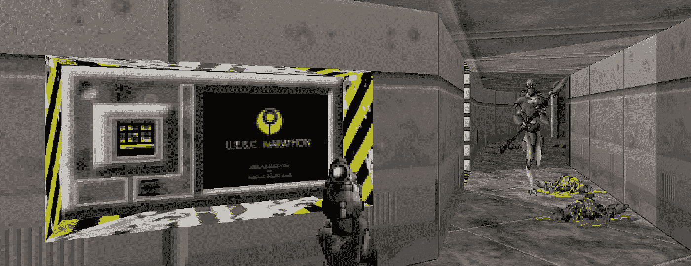

A terminal from the first level of Bungie’s Marathon.

# 挑战

去年，我开始为一个名为 [Ludum Dare](https://ldjam.com/) 的 48 小时游戏堵塞制作一个小文本冒险游戏。我一年参加几次，甚至还做过一次主题演讲。虽然我能够在一天之内构建一个简单的文本冒险游戏引擎，但在创建内容使其变得有趣时，我开始失去动力。

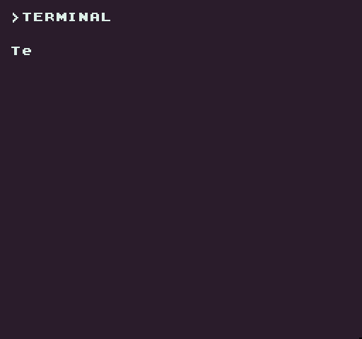

My unfinished Ludum Dare text adventure game “Terminal” built with [Pixel Vision 8](https://www.pixelvision8.com/).

快进 6 个月，再加上转向机器学习的职业生涯，我开始有兴趣看看我是否可以训练一个神经网络来为我未完成的文本冒险游戏生成背景故事。我的目标是用一个变得无赖的人工智能的叙述来帮助增加随机生成的房间描述。我以我最喜欢的 90 年代第一人称射击游戏之一[马拉松](https://en.wikipedia.org/wiki/Marathon_(video_game))为基础设计了这个游戏。

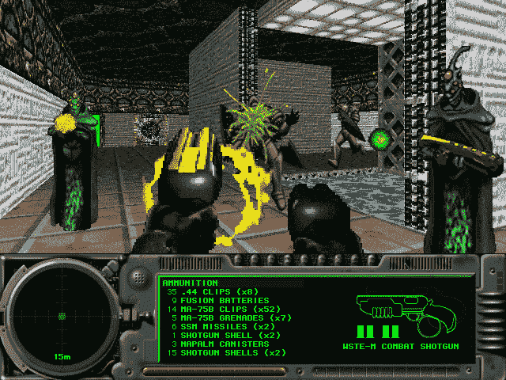

Marathon 2 screenshot.

马拉松是 Bungie 在发行《光环》和《命运》之前创作的。在马拉松比赛中，有三个人工智能，主要的一个，杜兰达尔，变得“[猖狂](https://marathongame.fandom.com/wiki/Rampancy)”，这是一个疯狂的花哨术语。不同于当时类似的 FPS 游戏，如《毁灭战士》,《马拉松》有一个丰富的故事，你可以通过分散在各个关卡的终端阅读。这些终端不仅能指导你完成任务，还能随着你在游戏中的进展加深剧情。

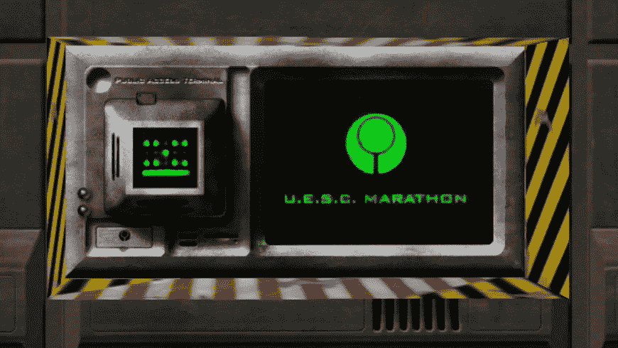

Marathon terminal via [MarathonWiki](https://marathongame.fandom.com/wiki/Terminals).

现在有许多神经网络的伟大例子被训练来创建基于文本的内容，如[歌词](/text-predictor-generating-rap-lyrics-with-recurrent-neural-networks-lstms-c3a1acbbda79)、[莎士比亚诗歌](/writing-like-shakespeare-with-machine-learning-in-pytorch-d77f851d910c)等等。由于 Marathon 在其三个游戏的终端中包含了如此多的文本，我认为使用一个名为 [textgenrnn](https://github.com/minimaxir/textgenrnn) 的开源项目，在我用来自动化我的深度学习工作流的一些工具的帮助下，看看我可以创建什么，将是一个很好的候选人。另外，由于游戏中的人工智能变得疯狂，我希望即使生成的文本没有意义，它仍然符合我正在创建的文本冒险游戏的主题。

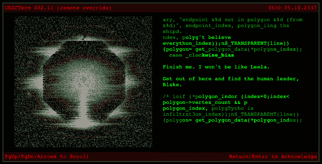

An example of garbled text from a crazy AI.

以下是我的实验记录、结果，以及如何从我的 [git repo here](https://github.com/jessefreeman/MarathonTextGenRNN) 独立运行项目的说明。

# 创建数据集

L 凑巧，马拉松的故事在网上有据可查[这里](http://marathon.bungie.org/story/)。如果你以前没玩过这款游戏，值得一试。你可以在这里运行一个更现代的版本，叫做[Alpha One](https://alephone.lhowon.org/)。考虑到这一点，为了训练 textgenrnn 模型，我必须从头开始创建数据集。没有一种简单的方法来自动化这一点，所以我检查了网站上所有的游戏终端，并手动将它们复制到一个文本文件中。

你可以用少量的文本来训练 textgenrnn，但是你给它的文本越多，它应该学得越好。我尝试了几种不同的游戏文本格式，但最终，我不得不手工删除对训练有负面影响的文本块。

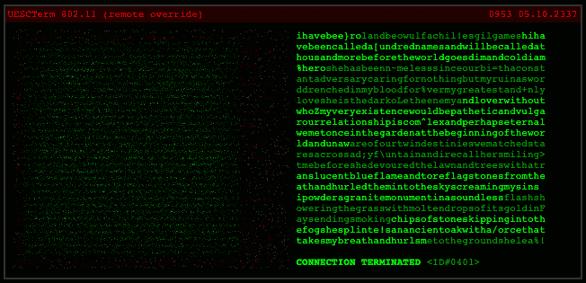

Example of a bad text block that could impact the training.

即使像这样的终端文本，看起来像随机放置在一起的字符，实际上包含了一个故事。在当前的格式中，文本会脱离训练，因为我们要分析需要空格的单个单词。最后，为了创建一个更干净的数据集，我决定跳过这类文本块。因为这相当耗时，所以我最终使用了第一个游戏的故事。这里有一个链接指向我在 git 项目中学习过的源文件。

# 设置项目

我开始从 GitHub 克隆 [textgenrnn，并在 PyCharm 中打开它。打开项目后，我创建了一个新的 Python 解释器，并安装了 setup.py 脚本中定义的需求。您还需要安装不在依赖项列表中的 Tensorflow。我最后用下面的代码创建了一个新的](https://github.com/minimaxir/textgenrnn) [requirements.txt](https://github.com/jessefreeman/MarathonTextGenRNN/blob/master/requirements.txt) :


A list of requirements needed to run the project.

该项目有很好的文档记录，并附有一些示例，但我选择删除它们，并从一个干净的项目文件夹开始。我删除了数据集、输出和权重文件夹中的所有内容，因为我将使用新数据集生成这些内容。然后我删除了 setup.py 文件，因为我不再需要它了。

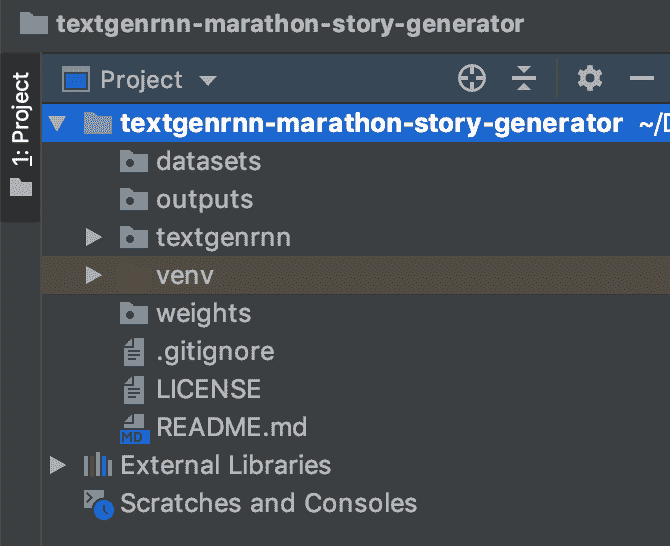

The new project folder after cleaning it up.

剩下唯一要做的事情是将我的新马拉松终端文本数据集添加到适当的文件夹中，并开始创建脚本来运行培训。在这样做之前，我需要创建一个配置文件，可以在我的培训和文本生成脚本之间共享。为此，我使用以下代码在项目的根目录下创建了一个 [config.py](https://github.com/jessefreeman/MarathonTextGenRNN/blob/master/config.py) 脚本:

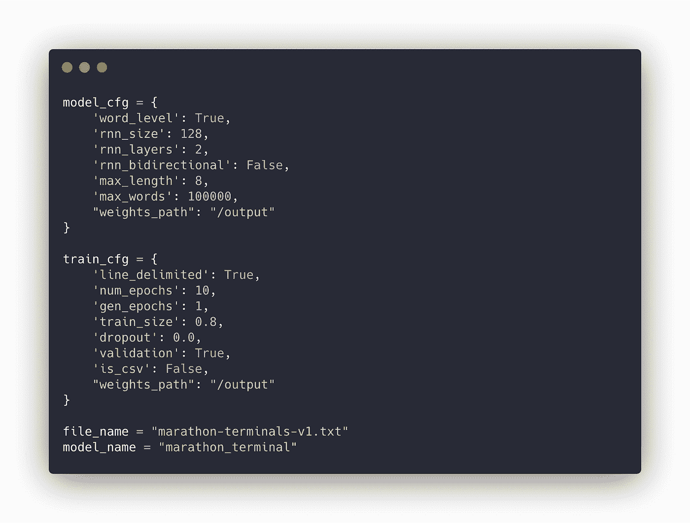

I stored all the configuration values in their own script file.

虽然您可以通过直接传递这些值来训练模型或生成文本，但我发现将这些值保持在外部会有所帮助，这样我就可以在训练时更容易地调整它。新的配置文件准备好了，是时候创建我需要用来训练和生成文本的脚本了。

由于所有的配置值都在它们自己的文件中，我能够创建一个简单的 [train.py](https://github.com/jessefreeman/MarathonTextGenRNN/blob/master/train.py) 脚本来运行实际的训练。下面是代码的样子:

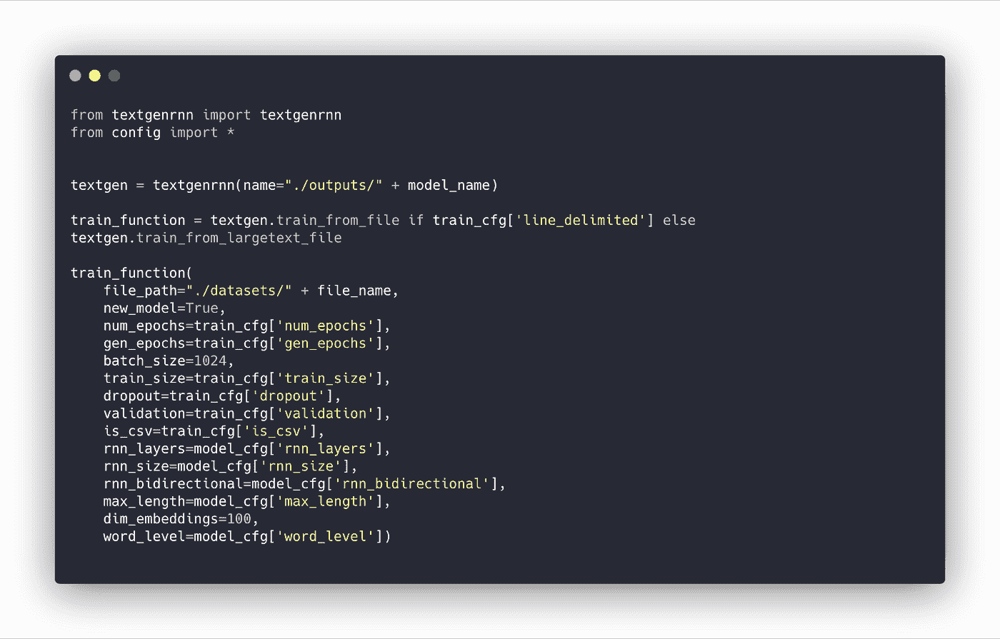

This is the code I’m using to train the model.

在高层次上，我创建了一个新的 textgenrnn 实例，设置了到输出文件夹的路径，最后调用 train 函数并提供它需要的参数。此时，您可以运行脚本并从终端窗口监视一些早期输出:

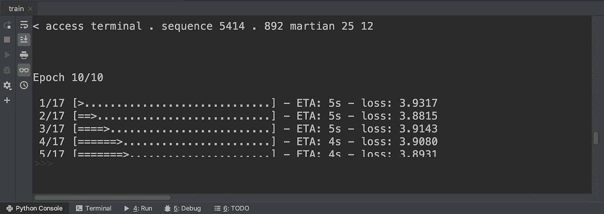

Running through the first round of training.

在第 10 个纪元左右，文本变得更好，但我们不会看到实际的结果，直到我们从输出文件夹中的训练模型生成更多的大量文本。

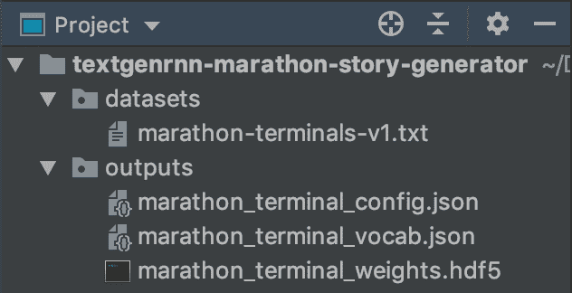

After training the model and it’s files are saved to the outputs folder.

为了生成更多的文本，我用下面的代码创建了一个 [generate.py](https://github.com/jessefreeman/MarathonTextGenRNN/blob/master/generate.py) 脚本:

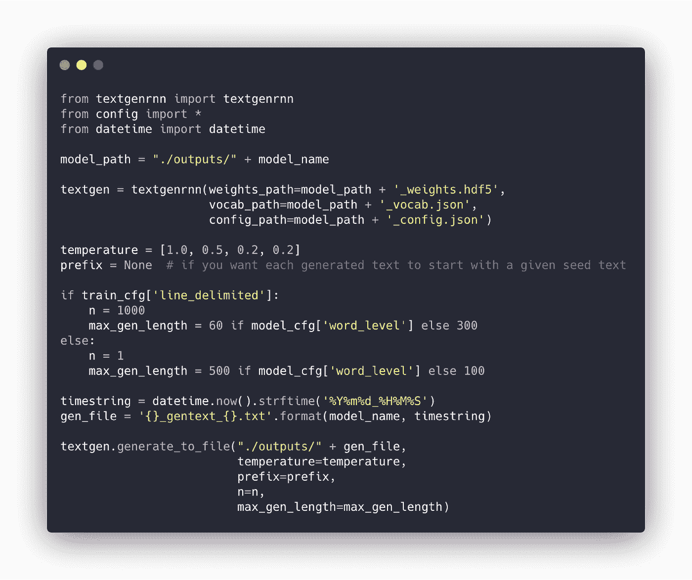

This code allows me to generate out text using the trained model.

正如您所看到的，我通过向它提供在训练期间创建的三个文件来设置 textgenrnn:weights、vocab 和 config。从那里，我们告诉 textgenrnn 使用一组温度值、步数和生成文本的最大长度创建一个新文件。运行该脚本后，它会在 outputs 文件夹中用生成的文本生成一个新的文本文件:

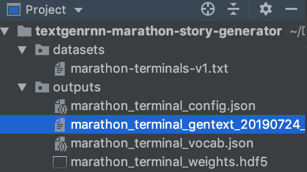

A sample of text generated from the model.

现在我已经具备了开始训练和验证生成文本质量所需的一切。让我们看看它产生了什么。

# 生成的文本结果

在这一点上，相对容易看到我们可以期待什么样的结果。这是我开始试验的几个样品。

1 个时代，RNN 大小为 128 和 2 个 RNN 层产生了以下内容:

```
vacuum
-with
you
* *
incoming **
-
<
transfer
,
strength
gives
area of
a
- ,
to
*
public
.oppressive *
~
<
* * * * * * * * jump * * * * * * * * * * * pad * * *
durandal
message
*
```

起初，它没有创造任何有趣的东西。我以为只有一个纪元。

以下是当我使用与上面相同的设置将训练增加到 10 个时期时发生的情况:

```
* * * incoming message from * * ** * * incoming message * * *< 39 - < 46 . . . 299 >* * * end of message * * * *
he , , and crist the from closing his , and closing five was the of arms . on the discarding elevators century
* * * end when message * * * *
< security breached - excerpts >f terminal . . 17 . . . 198 >* * * end of message * * *
< security breached - - < 33 . 12 . . . 128 >
for the the of may fourth* * * end message * * *
teleport whenit is is is is . . . i am am able that to to to my sensory eyes the you you you your your a " see philosophical may your your a21h . . . . " . . 223 >
```

事情开始变得有点有趣了。该模型可以生成完整的句子，它了解到消息通常以某种形式的“传入/结束消息”开始和结束，它可以创建一些与特定类型的终端消息相关联的虚假 IP 地址。它也很擅长用引号来开始和结束一段文字，但是这段文字没有太多意义。

最后，我想看看更多的纪元是否会有帮助，所以我将数字增加到 40，并保持相同的设置作为基线。下面是它生成的内容:

```
you have not completed your mission . you may be be not the such here . but i ' ll want to to to friend . if you must into the this to of transmission it would be be a fighter day . . . fighter . held symbolic significance for the . the time that time that had
martian skies
however , due to to the marathon ' s teleporters . .< unauthorized access - alarm 2521 - >
be careful . everything not not not as to , and or , and nearly active to your your maintenance maintenance . .
the pfhor seem to have enslaved a number of other races : : races as of have they been been been been off by compilers for for and alien .the invaders seem to to be interested in the marathon . gheritt s something something one as from about he ' s ' s ' pht , . even hard . . to the was was . rat the the the the the crist shuttle . has , and and at the just than the the after the the
```

现在，我们开始获得完整的句子，这似乎在段落中更有意义。当然，挑战在于，在这一点上，我正在试图理解哪些价值观有助于训练更好的模型。不幸的是，在我开始找到我觉得能产生更好结果的值之前，有很多尝试和错误。

为了帮助监控培训，我想在项目中添加 [MissingLink.ai](https://missinglink.ai/) 的 SDK 来监控我的实验。坦白地说，我为 Missinglink 工作，由于我对完成我的文本冒险游戏有既得利益，我开始对如何在培训期间优化模型感兴趣，以确定哪些价值观产生了影响。

因此，我创建了一个新的 [missinglink 分支](https://github.com/jessefreeman/MarathonTextGenRNN/tree/missinglink)，并在项目的 textgenrnn.py 脚本中添加了几行代码，首先是导入 SDK，配置项目以运行实验，并定义 Keras 回调:

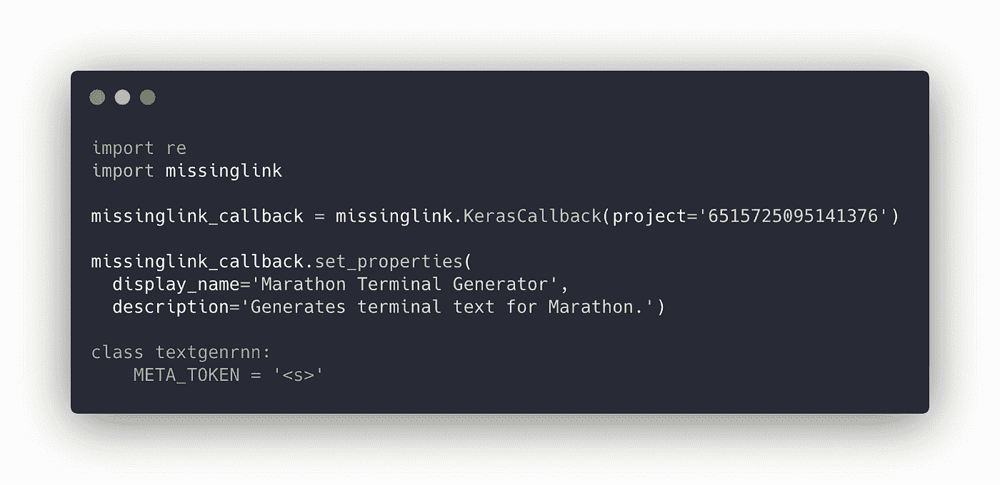

Importing the MissingLink SDK and creating a Keras callback.

此外，我需要将新的回调提供给 [model_t.fit_generator()](https://github.com/jessefreeman/MarathonTextGenRNN/blob/missinglink/textgenrnn/textgenrnn.py#L216) 方法:

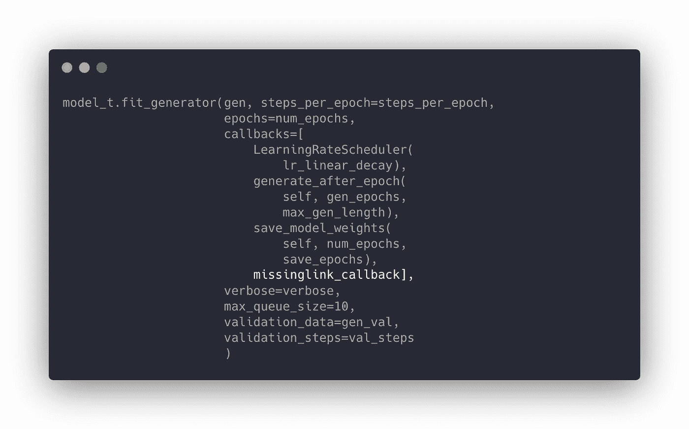

Adding the MissingLink callback.

通过这些修改，我现在可以在 MissingLink 仪表板上运行实验并监控结果。在进入下一轮训练之前，我以我在 40 个时期的最后一次实验作为基线。

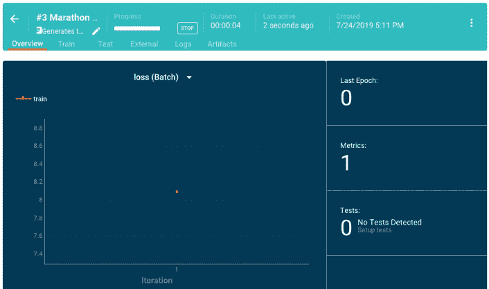

Monitoring the loss during training over 40 epochs.

在尝试了一些不同的设置后，我最终选定了 4 个 RNN 层，双向设置为真，100 个纪元。我还将列车尺寸增加到 0.9，产生了以下损失:

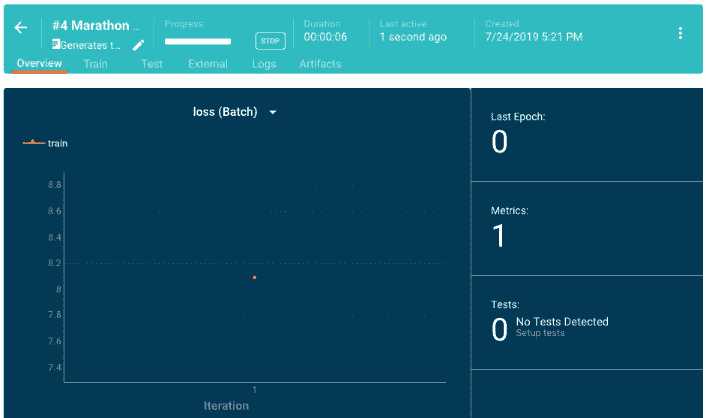

Monitoring the loss during training over 100 epochs.

一旦我对改进的模型感到满意，我就能够生成更好的文本。让我们来看看最后的结果。

# 最终结果

经过大量的实验，我能够写出一些感觉足够连贯的文本块，就像一个疯狂的人工智能的漫谈。

例子 A:来自马拉松

```
Gheritt had a good life, so much time, so much time. He had loved swimming, turning, beating. He had loved the tingle in his hands and feet, his inability to kill his nemesis. Once he had fallen down the stairs, and just for a moment, his hands came to rest on the carpet of the stairs. In that instant, his body had frozen, floating over the stairs, safe from falling, but the moment didn’t last. The ocean crashed about him, his hands torn free from the sandy bottom, his body flipping, falling.
```

示例 B:已生成

```
gheritt had a good life , so much on that will be killed . i saw the make one in a wicked computer — and we must don ‘ t remember them any time you .
i have received a preliminary report from some members of them . the only computer system . “ it was quite simple . “ a white thought syndrome suffering if the uesc ‘ s ‘ pht even stopped their efforts .
```

我很惊讶这是多么接近。我认为，随着更多的数据，编辑语法，并智能集成到游戏中，这可能是一个可行的解决方案来生成一些背景故事内容。目标是将随机生成的文本、神经网络生成的文本和手写文本融合成更加无缝的体验。考虑到这一点，我计划将它集成到游戏中，并与概述目标的更多面向任务的文本混合，类似于原始游戏中马拉松终端的工作方式。

我得说这个小实验是成功的。我需要多花一点时间来建立一个更好的数据集，包括马拉松 2 和 3 的终端。我也想看看我是否能最终从模型中得到一个连贯的故事。在配置文件和数据集之间仍然有调整要做。然而，即使在这些早期实验之后，我认为结果是有希望的。最后，值得一提的是，textgenrnn 是一个老项目。在文本生成方面已经有了更多的进步，比如 OpenAI 的 GPT-2。我可以看到自己继续尝试训练一个神经网络来为我更多的程序生成游戏生成文本。

如果你想更多地了解这个项目和我在 [MissingLink.ai](https://missinglink.ai) 的工作，欢迎在下面发表评论，或者在 [Twitter](https://twitter.com/jessefreeman) 上关注我，给我发消息。