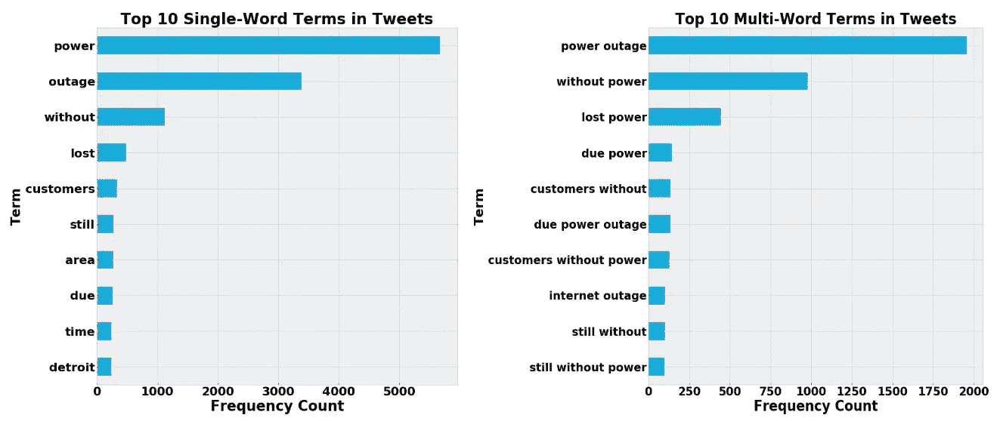
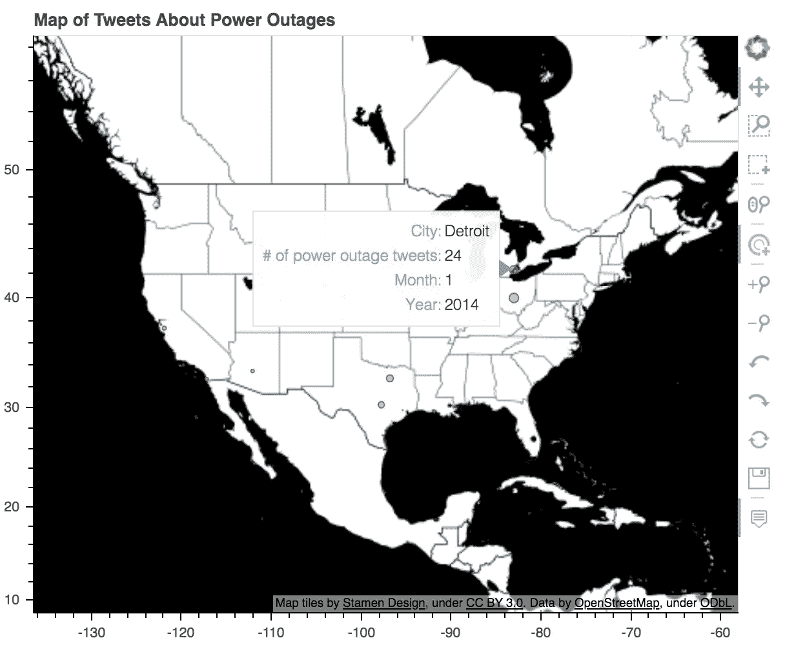

# 我们可以使用社交媒体来定位合法的停电吗？

> 原文：<https://towardsdatascience.com/can-we-use-social-media-to-locate-legitimate-power-outages-7b7409708447?source=collection_archive---------17----------------------->

## 基于余弦相似度的自然语言处理推文分类初探。

我们都知道停电会给我们的生活带来多大的破坏性。停电不仅每年影响我国数百万人，根据停电跟踪者的年度报告，每年还会损失数十亿美元的收入。正因为如此，我们需要更好的机制来跟踪它们，以便在它们发生时能够快速处理。

电力公司的停电管理系统已经推出了新的[智能电网技术](http://people.stern.nyu.edu/kbauman/research/papers/2015_KBauman_WITS.pdf)，以补充检测和报告停电的传统方法。然而，新技术要到 2030 年才能完全推广。

虽然这项新技术已经推出，但还需要额外的努力来帮助识别和报告停电情况。我们中的一个团队决定看看我们是否可以建立一个工具来提供帮助。我们想看看我们是否可以使用社交媒体来正确识别停电。

**数据收集**

我们的方法是首先决定从哪些社交媒体平台中选择。我们发现 Twitter 是最可行的平台，就我们可以访问的数据和在平台上分享新闻的速度而言。我们使用 TwitterScraper 搜索基于位置的目标关键词，收集了 12 个城市 5 年的数据。虽然我们更愿意在这里使用 Twitter 的 API，因为它包括地理位置，但它只提供一个月的历史数据。

为了选择我们的关键词，我们花时间深入了解人们如何在网上谈论权力。我们探索了能源公司和消费者在网上发布停电信息时的词汇差异，确保注意潜在的错误分类(例如:[停电](https://www.playstation.com/en-us/games/call-of-duty-black-ops-4-ps4/blackout/)是视频游戏，而[电力](https://www.starz.com/series/power)是电视节目)。

为了缩小地区范围，我们选择了美国十大人口最多的城市，但是我们不得不稍微调整一下。纽约市的噪音很大，我们不想用它来训练我们的模型。所以我们把那个城市从我们的列表中删除，加入了人口第十一多的城市，奥斯汀。我们还决定包括底特律和哥伦布，因为根据停电跟踪报告，密歇根州和俄亥俄州的年停电率排名很高。

通过查看我们提取的推文，我们假设天气是停电的最大影响因素。我们使用 NOAA API 包装器按日期提取我们选择的城市的历史天气数据。不是所有的气象站都收集相同的数据，所以我们把重点放在所有州一致收集的数据上，高温、低温和降水。我们根据温度和降雨量的范围将这些数字转换成文字，以便能够将这些文字添加到我们的推文中。我们知道我们想要使用自然语言处理，并且需要单词而不是数字来做到这一点。

**探索性数据分析**

一旦我们有了一个完整的数据集，我们想检查我们收集的数据告诉我们什么样的故事。为了做到这一点，我们观察了单词的频率。我们删除了常用的停用词，包括提及 Twitter、Instagram 和任何与 url 相关的内容，因为这些都妨碍了我们了解数据告诉我们的真实情况。

在下面的图表中，你会在左边看到前 10 个单字术语，而在右边你会看到多字术语。我们两个都看了，因为它以这种方式讲述了一个更完整的故事。我们并不惊讶地看到“电源”、“断电”和“没有”出现了很多，因为这些都符合我们的目标网络抓取关键字。但是深入挖掘，我们还可以看到，我们引入了许多我们认为是两种类型的信息，客户投诉和能源公司报告客户断电。

Frequency of Words in our Tweet Dataset

我们还发现有趣的是，底特律突然出现在那里，因为密歇根州是每年停电次数最多的州之一。此外，请注意，“互联网中断”在这里显示得很高，这不是停电。它的外观有助于我们识别一个错误分类类型，当我们继续我们的模型时，我们一直记在心里。

**造型**

基于我们在回顾数据时所学到的东西，我们开始为建模准备文本，将所有单词小写，并删除标点符号和停用词。我们还在标记化之前删除了完整的 url 字符串，以确保我们捕获了所有的 url 片段，尤其是链接缩写。

对于建模，我们选择使用 Word2Vec，因为它关注单词之间的关系，并为该值赋予权重。它将单词选择的上下文带入到游戏中，这将让我们更好地理解在推特上谈论停电时使用的一组单词。

虽然机器理解高维空间没有问题，但在使用 Word2Vec 之后，我们需要使用 t-SNE 模型将其转换回二维空间，以便检查和理解它。然后，我们使用余弦相似度将我们的词与目标关键词列表进行比较，以帮助确定该词是否与合法的停电有关。余弦相似性得分结果被手动检查以发现错误分类并调整我们的模型。

下图显示了 t-SNE 图，我们在图中选择了“龙卷风”这个词。蓝色的点代表与停电有关的单词，而灰色的点则与不合法的停电有关。圆点的大小也显示了它的余弦相似性得分有多高。点越大，分数越大，意味着与其分类的关系越强。这个剧情的交互 html 文件可以在 Github 上下载[。](https://github.com/jenrhill/Power_Outage_Identification/tree/master/visualization)

**评价**

为了评估我们模型的性能，我们必须手动确认它是否被正确分类。理想情况下，我们应该能够浏览所有的推文来证实这一点，但我们没有时间了。我们查看了 1000 条推文，发现了 6 个错误分类。我们需要进行更多的审查，以确认这是否是错误分类的数量或异常情况。从那里我们需要微调模型以减少错误分类。

当我们开始这个过程时，我们认为天气在停电中起了很大的作用，事实也确实如此。然而，我们也发现“蛇”这个词与标记合法断电的高相关。这就是我们如何得知蛇可以爬进变压器并导致停电。如果你对其他导致停电的怪事感兴趣，你应该看看[停电跟踪者的年度报告](https://switchon.eaton.com/plug/blackout-tracker)。这是一个有趣的兔子洞。确实如此。

**映射**

因为我们必须使用一个刮刀来收集 Twitter 数据，所以我们无法提取比城市更详细的位置。把它标在地图上意味着我们会有很多点重叠在一起，这并不理想。但是，我们认为按时间绘制我们选择的城市的停机时间会很有趣。下图显示了一个高亮显示的城市，底特律。你可以看到，根据我们搜集的数据，在 2014 年 1 月，有 24 条与停电有关的推文。这张地图的交互 html 文件可以在 Github 上下载[。](https://github.com/jenrhill/Power_Outage_Identification/tree/master/visualization)

**结论和后续步骤**

总之，我们能够成功地创建一个原型，可以将一条推文归类为合法的停电。但是，在推广它以分类更多数据之前，需要解决它的一些限制。因为我们不得不使用 Twitter scraper，而不是 Twitter 的 API，所以我们的位置数据并不尽如人意。即使我们可以使用 API，也不是所有用户出于隐私考虑都会在他们的 Twitter 个人资料上列出位置数据。此外，准确性评估过程是一个手动过程，在全国范围内推广将需要资源和时间进行审查。

然而，基于实时数据，我们确实看到了更广泛推广的巨大可能性。如果我们有更多的时间，我们会采取并建议考虑以下步骤:

1.  在实时数据上测试该模型:来自 Twitter 的 API 的推文和来自 Dark Sky 的 API 的天气数据。
2.  使用 K-means 聚类对停电调查结果进行分组，以便能够更好地确认整个区域停电。按地区和天气划分星团也很有意思。我们只使用了我们所有选择的城市一致可用的天气选项，但在这里查看其他选项(例如:风速)的更多细节将是有益的。
3.  探索除了 t-SNE 之外的其他维度/数据缩减方法，例如在数据预处理之前使用主成分分析。

该项目的完整代码可在 [GitHub](https://github.com/jenrhill/Power_Outage_Identification) 上获得。干杯！