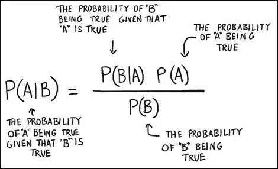
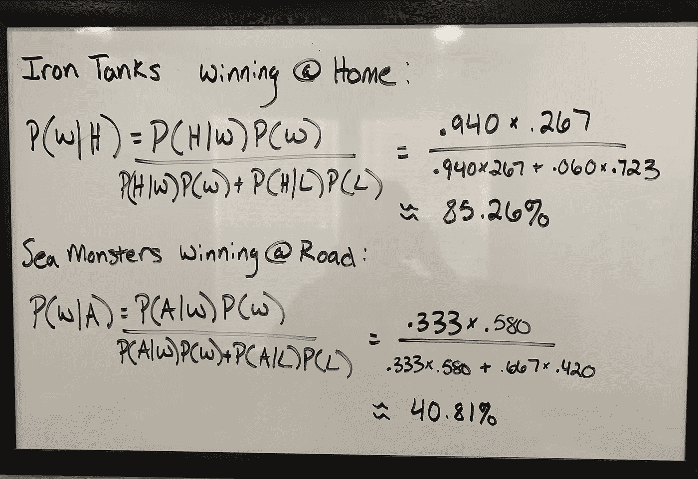
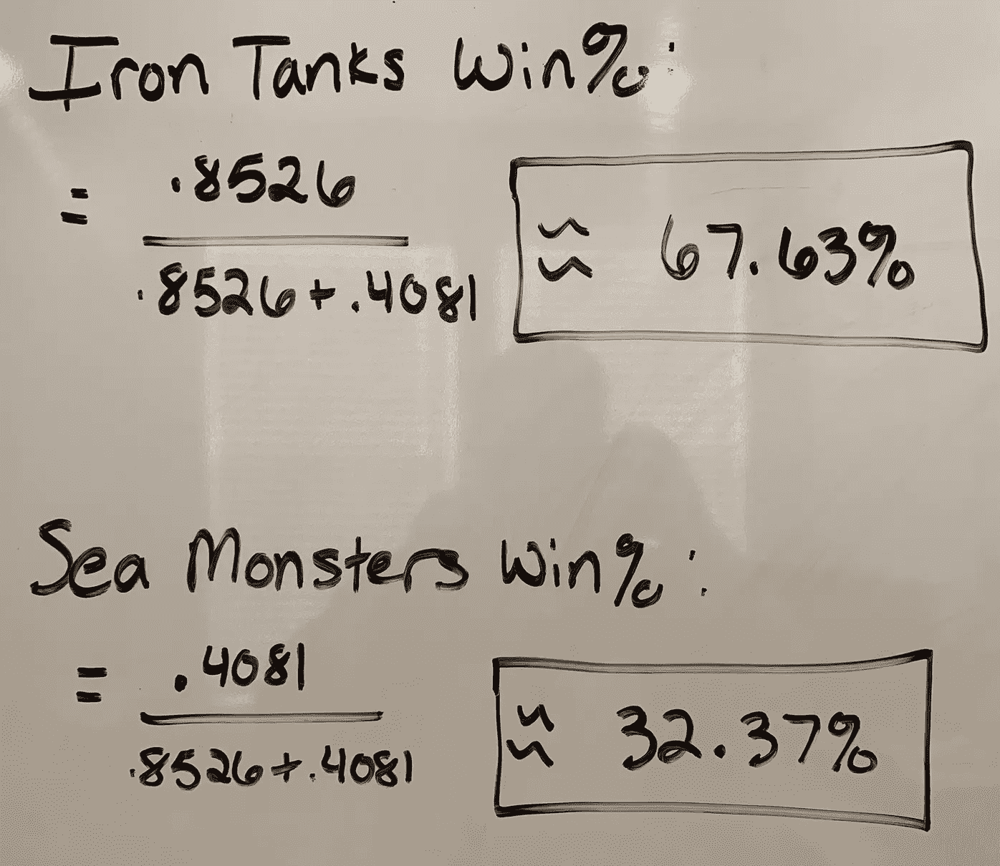
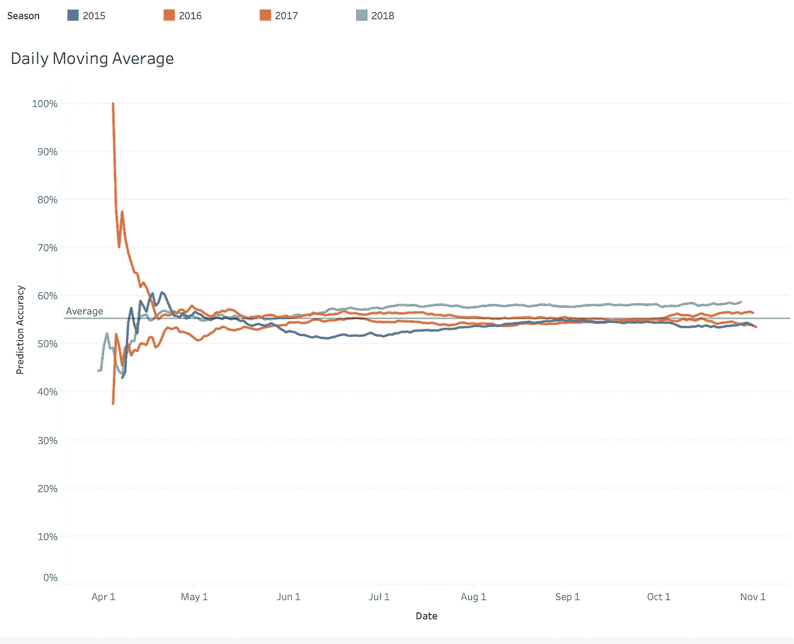
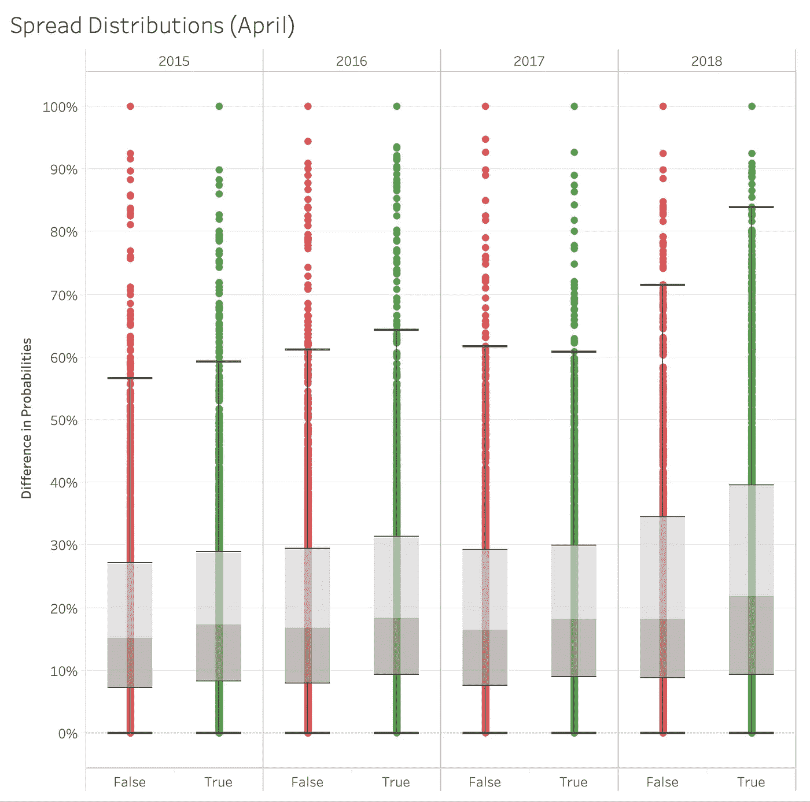
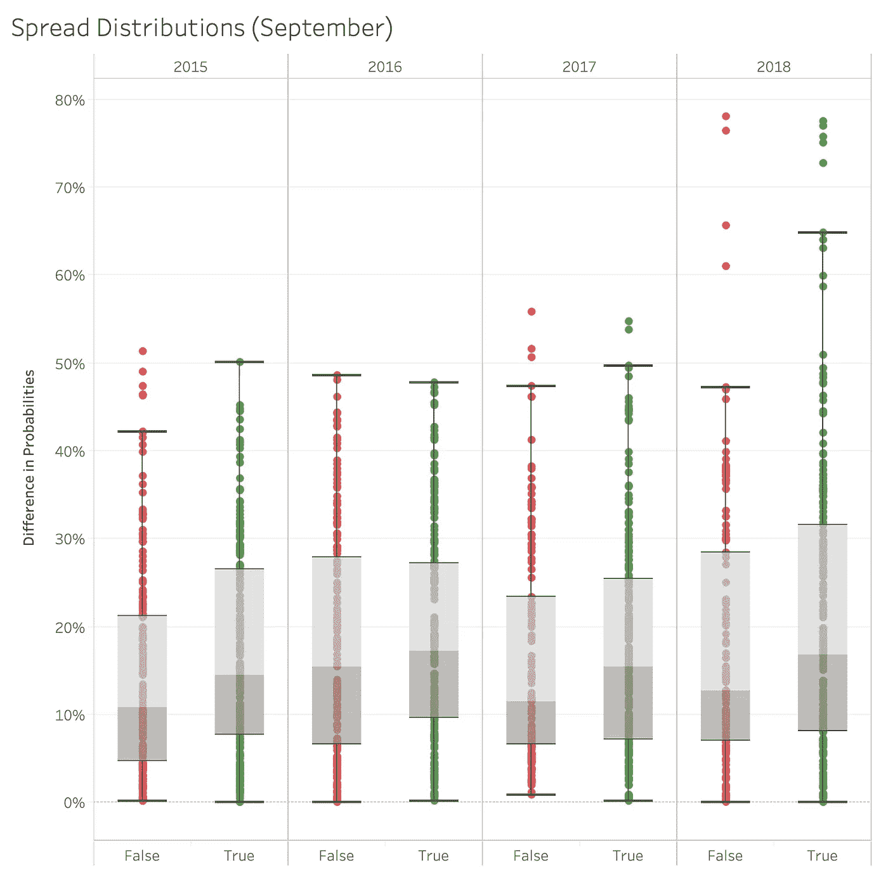
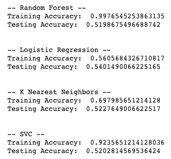

# 你能根据主客场记录准确预测 MLB 的比赛吗？

> 原文：<https://towardsdatascience.com/can-you-accurately-predict-mlb-games-based-on-home-and-away-records-8a9a919bad29?source=collection_archive---------18----------------------->

## 拿出工资单，击球率，自责分率，以及任何你能想到的其他数据。让我们用一分钟的老方法:赢和输。

假设你是一个职业体育赌徒，在九月的一天观看两个队的比赛，海怪队对铁坦克队。海怪的胜率是 87–63(. 580%胜率)，而坦克的胜率是 40–90(. 267%胜率)。理论上，你似乎会把钱押在海怪身上，让它们碾过坦克，但这里面有一个陷阱。铁坦克以 37–3(. 940 胜率)的主场战绩在主场战无不胜，海怪以 20–40(. 333 胜率)的战绩在客场苦苦挣扎。如果你把钱押在海怪身上，因为你相信他们是整体上更好的团队，你的赌注有多大风险？

这个问题的答案可以用贝叶斯定理。贝叶斯定理用于计算条件概率，这意味着在你知道一些潜在信息的情况下，试图预测一个事件*。*在这个例子中，你可以对比赛结果做出更明智的决定，因为你知道每个队赢得比赛的总体可能性以及比赛的地点。在这篇文章中，我解决了这些问题:

1.  使用过去 4 年的 MLB 数据，使用贝叶斯定理可以做出多精确的预测
2.  在这个季节，你可以确定有足够的信息来保证预测的准确性。
3.  有没有一种方法来对冲哪些应该下注，哪些不应该下注？
4.  与其他机器学习算法相比如何？

和往常一样，你可以在这里查看我的代码:【https://github.com/anchorP34/Bayesian-Baseball-Results 

你可以在这里查看我的公共仪表盘:【https://public.tableau.com/profile/payton.soicher#! /viz home/MLBBayesianAnalysis/story 1

# 贝叶斯定理

为了快速回顾贝叶斯定理是如何计算的，你可以看看左边的公式。在这种情况下，我们可以将 P(A|B)改为 P(W|H ),这将意味着赢得比赛的概率，因为我们知道球队在主场。然后我们也可以用 P(W|A)作为球队客场比赛获胜的概率。现在，让我们插入海怪和铁坦克的信息:

P(W) = Probability of Winning, P(L) = Probability of Losing, P(W|H) = Probability of Winning given the team is at home, P(W|A) = Probability of Winning given the team is away

从这个分析我们可以看出，铁坦克在主场给定战绩有 85.26%的胜算，海怪在客场给定战绩有 40.81%的胜算。由于这两个概率并不 100%匹配，我们可以将它们加在一起，并找到它们在整体匹配中的份额。

Taking the partial winning percentages of both teams can give us a better head to head matchup prediction

我们可以看到，对于这场比赛，即使铁坦克的战绩比海怪差很多，但他们有 67.63%的贝叶斯概率赢得对决。作为职业体育赌徒，你可以利用这些信息，对照游戏的金钱线进行检查，并确定如果你正确预测结果，以 35%的价差(67.63%-32.37% = 35.26%)押注这场游戏的风险是否值得。

# 美国职业棒球大联盟案例研究

由于每场比赛都可以参考整体战绩，再加上球队主客场表现的记录，你可以认为随着一个赛季的进行，预测的准确性的结果应该会随着时间变好。使用每个团队的最终获胜百分比，我们可以看到我们预测哪个团队会获胜，以及预测结果是否正确。首先，让我们看看随着时间的推移，精确度是否会收敛到特定的结果:

The rolling average of the accuracy of Bayesian probabilities vs time of a MLB season

我对这张图表的最初反应并不是我想象中的样子。我假设准确性的方差在赛季开始时很大，在赛季结束时很小，这是正确的，因为赛季开始时有很多关于球队的未知信息，但赛季结束时应该有很多信息，不会在重要的方向上移动准确性。然而，我认为有了额外的信息，随着时间的推移，预测会变得更好，但事实似乎并非如此。从 5 月到 10 月，预测没有低于 50%，也没有达到 60%，只是在 55%左右徘徊。

虽然它没有惊人的准确性，但全年所有游戏中大约 55%的正确率已经很不错了！这比盲目抛硬币来决定结果要好，但下一个问题应该是*在赢和输之间，预测有多糟糕*？

Difference in Probabilities (Home Winning % — Away Winning %) and the outcome (Dark Blue is correct prediction, light blue is incorrect prediction)

这是我认为分析最有趣的地方。看一下主队的胜率%与客场胜率%的差异，贝叶斯概率并不是由于赢时的小失误和输时的大失误，它们大致在两者之间。例如，如果你错误预测了很多比赛，如果两队之间的胜率低于 10% (55%比 45%)，那么这是可以理解的。但是，如果模型错误地选择了胜率差异很大的游戏(85%比 15%)，那就不是一件好事。从图中可以看出，无论预测结果如何，成功和失败的概率分布大致相同。

这是我们看待这个问题的另一种方式。这是正确和错误预测概率分布的盒须图。在理想情况下，正确的预测将具有大的分布，而不正确的分类将具有小的分布。这第一个情节显示在季节的早期。你可以看到很多游戏有巨大的传播差距，有些分类错误，有些分类正确。

Spread Probabilities Box and Whisker Plots of False and True Predictions

然而，如果我们看看 9 月份的比赛，正确和错误预测之间的差距并没有明显的不同，仍然有一些非常糟糕的预测(看看 2018 年的错误预测)。

# 捆绑机器学习

大多数人在这一点上可能会想“好吧，佩顿，这很有趣，但我很确定机器学习算法会比你的贝叶斯计算好得多。嗯……让我们看看他们是如何搭配的。

Default models for Random Forest, Logistic Regression, K Nearest Neighbors, and Support Vector Machine classifiers

提醒一下，我们的贝叶斯模型每年的准确率为 55%，没有一个测试准确率的机器学习模型达到那个水平。当**我在模型中使用贝叶斯结果时，这更相关！**即使有一些成功的模型输出的额外帮助，它似乎也没有帮助。我使用测试精度，因为这相当于查看新的预测数据。机器学习模型往往在训练集上表现得更好，因为它可以尽可能接近这些数据点，但在新数据上，它往往不会那么成功。尽管逻辑回归的训练精度最差，但它的测试精度最好，这是有道理的。这个数据集没有任何太深入的东西来做出这些机器学习模型将在哪里蓬勃发展的质量预测，所以简单的贝叶斯模型可能会胜过机器学习模型。

# 结论

贝叶斯统计可以在进行预测时占上风，但在这样做时应该谨慎。正如我们看到的全年预测的准确性，从 5 月到今年剩余时间，您可以预计大约 55%的预测是正确的，从体育博彩的角度来看，这是一个非常好的长期使用案例。然而，相对于较小的价差，不应该增加对较大价差的押注，因为正确和错误预测的价差金额的方差大致具有相同的分布。

这种分析逻辑可以用于所有类型的运动。由于主客场比赛的样本量如此之小，足球将很难做，但曲棍球和篮球都有足够多的比赛来做出有用的预测。

最后一点是，当你使用像输赢这样简单的数据时，像贝叶斯预测模型这样的简单模型可能是比更复杂的机器学习模型更聪明的选择。机器学习模型在大量数据以及对结果有重大影响的深度数据点上茁壮成长。如果你有一个数据集，它有更多的数据点(谁是投手，天气，连胜，头对头的历史，等等)，机器学习模型可能会优于贝叶斯模型。但是，如果你想出一些简单的方法，并且会得到正确的预测多于错误的预测，那么像贝叶斯定理这样的模型是一个很好的选择。