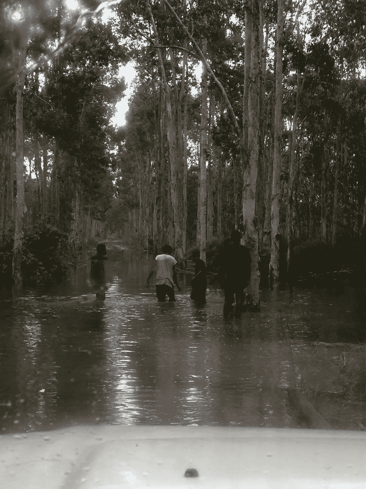
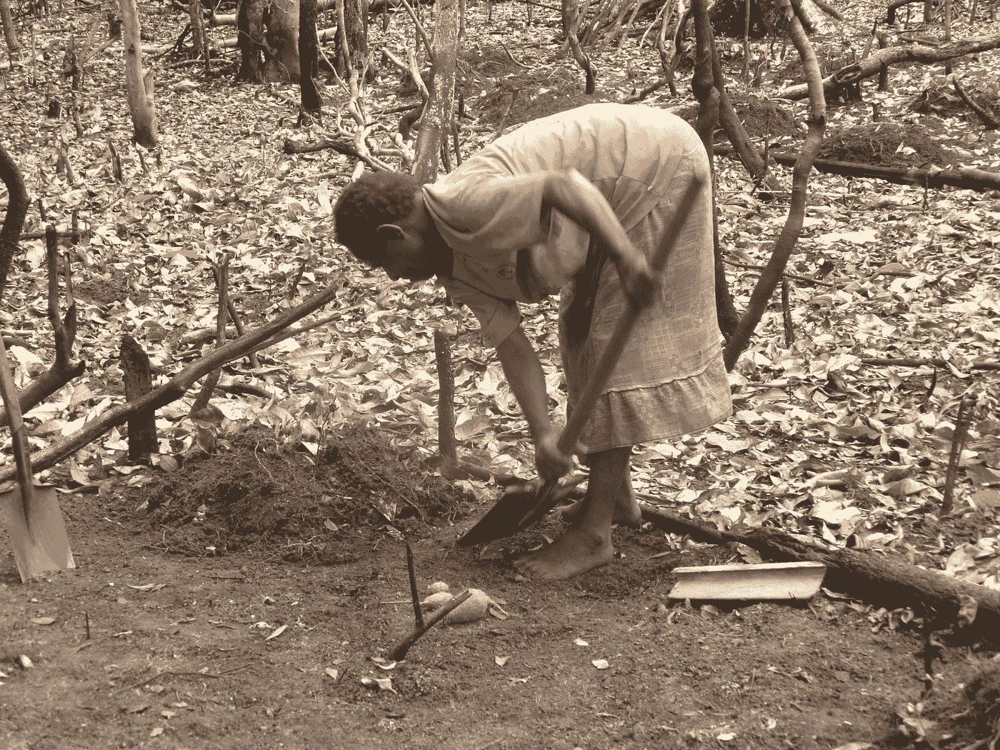

# 没有量化学位能成为数据科学家吗？

> 原文：<https://towardsdatascience.com/can-you-become-a-data-scientist-without-a-quantitative-degree-8046e254fa48?source=collection_archive---------5----------------------->

Yenthoroto village, Western Province, Papua New Guinea

## 一个故事和一些见解

我想在这篇文章的开头说，我无意利用这个空间来最小化定量学位在大多数数据科学家的工作和成功中的作用，也不是我的目标是“过度鼓励”(或阻止)任何没有坚实的定量背景但对以数据科学为职业有着浓厚兴趣的人。作为一名来自有人所说的“非正统”背景的数据科学家(我拥有理论语言学博士学位)，我觉得自己有资格为那些可能发现自己既被进入一个行业的想法所诱惑又被这种想法所吓倒的人提供一些有用的、潜在可行的见解，这个行业的工作岗位主要提到如下学历:

> 你的学术背景是在一个定量领域，如计算机科学、计算语言学、数学/统计学、工程学、经济学或物理学。**高级**学位优先。
> 
> 相关**技术**领域(计算机科学、统计学、应用数学、计量经济学、运筹学)的学士、硕士或博士学位。
> 
> 在**高度量化**领域(CS、机器学习、数学、统计学)获得学士或硕士学位或同等经验。
> 
> 你应该在**定量**领域有**广泛的**背景。
> 
> 获得计算机科学、经济学、统计学、物理学或相关领域的研究生学位。

如果你没有这些“高度量化”领域中的一个学位，你是否会立即被取消数据科学家职位的考虑资格？我认为答案是一个令人不满意的“视情况而定”但如果有所帮助的话，我自己的数据科学之路始于任何这些“定量”学术领域的承诺和保证。事实上，当我第一次接触到我很久以后才能够称之为第一次接触“大数据”的东西时，我离任何现代技术都有数千英里远，更不用说花哨的定量分析工具了。

首先，我想分享一个故事。这是一篇独一无二的文章，旨在阐述一位数据科学家的旅程，而不是指导或概括——这部分在故事之后。

Landing on the village airstrip

当我被巴布亚新几内亚南部低地一个遥远的森林村庄的巨大魅力和神秘所吸引时，我是一名三年级的语言学研究生，这里是世界上最丰富的语言多样性的家园，数百种未记录在案或研究不足的语言——有些濒临灭绝——对世界各地的语言学家、人类学家和语言活动家有着不可抗拒的吸引力。在一年多的时间里，我花了几个月的时间在新几内亚丛林中用手持电池供电的录音机收集人类讲话的录音，捕捉这种鲜为人知的语言的歌曲、故事和动词范式，其迷人的形态句法属性和过程后来成为我论文的基础。

My escorts wading the knee-deep water after a flood

到我最后一次去那个村庄的时候，我已经有了将近 20 GB 的数字录音，由于只完成了最少的野外方法课程，并且之前没有接受过语言数据管理方面的重要培训，我有时会努力保护我的数据和设备免受低地雨季的洪水袭击，并且在将它们存档到太平洋濒危语言数字档案馆之前，只能勉强成功地用手转录一小部分录音。(如果你是一个领域语言学家，你的下巴掉了下来，我后来使用了半自动转录和数据管理工具，如 ELAN 和 Toolbox，但老实说，我发现它们太笨重，效率太低，无法与它们建立长期的关系。)

事后看来，我觉得我对这种性质的工作准备不足，但我经历的挑战和困难给了我很多教训，并让我深刻反思我所在领域的方法和途径(下文将详细介绍)。不言而喻，这是我一生中最具形成性、最显著、最丰富的经历之一，回顾这段经历，我既自豪又遗憾(或许改天再讲)。

Ruth and her baby

## 语言学中数据收集的挑战

幸运的是，我没有感觉到我的*理论*工作受到处理大量非结构化数据的挑战和限制的太多阻碍——这是我第一次接触“大数据”，除了在非常小的范围内(即千兆字节而不是兆兆字节)。这主要是因为我已经将我论文的范围定义得足够狭窄，围绕着几个重要的语言现象，这些现象恰好符合我当时非常熟悉的类型学文献。因此，我只需要少量的数据——我所收集的一小部分——来发展我的论文，让我和我的论文委员会满意。

与此同时，作为一个使用一种从未被如此少的人描述和使用过的语言的人，我感到被传统的语言学方法论严重束缚，这种方法论本质上是内省的。也就是说，为了构建语言理论，在[生成语法](https://en.wikipedia.org/wiki/Generative_grammar)框架内工作的语言学家通常依靠母语人士对语言形式和表达的意义和结构的直觉(也称为“语法判断”)。(这与实验语言学相反，实验语言学是语言学的一个分支，它使用定量方法来评估语言学理论，因此与认知心理学和神经科学等领域有联系。)

> 与此同时，作为一个研究从未被如此少的人描述和使用过的语言的人，我感到被理论语言学的传统方法严重束缚，这些方法本质上是内省的。

在[语言内省](https://www.acsu.buffalo.edu/~talmy/talmyweb/Handouts/introspection2.pdf)中，说本族语的人(通常是语言学家本人)有意识地将注意力引向“在他的认知中表现出来的”语言的特定方面。所以基本上，你需要的所有数据都在你的脑子里。您不需要从文件中“读取”数据，也不需要注释成千上万的句子来创建训练集。

一个典型的语言学家的数据集可能包括几对句子，这些句子对目标语言属性的对比最小。例如，如果我们假设以下示例中的 wh 短语( *what* )已经从其基本位置(由下划线指示)发生了句法移动，则(1a)与(1b)和(1c)之间的语法差异表明，并列结构构成了提取的“孤岛”，即，你不能将名词连词移出并列短语。

约翰买了什么？
(1b)*约翰买了什么土豆和 __？
(1c)*约翰买了什么 __ 和蘑菇？

这种概括适用于所有的坐标结构——我们可以不通过成百上千的示例数据就得出这种概括。

Children in front of Yenthoroto Elementary School

所以你可以想象当我签约写一篇论文的语言文献的缺乏迫使我采取一种几乎完全自下而上的归纳方法时，我不得不做出的心理调整，在这种方法中，通过结构化启发、讲故事和自然主义语音收集获得的“原始数据”构成了我的语言分析的经验基础。这与我作为生成语言学学生所熟悉的方法形成了鲜明对比:自上而下的演绎方法，在这种方法中，“理论反思可以给我们提供我们应该寻找的新想法”(贝克，*凯斯:其原则和参数*，2015 年，第 129 页)。

鉴于我正在处理的数据的数量和速度，我无法完全依赖任何一种方法，我开始想知道语言学作为一门实证科学是否会受益于工具和数据科学的更广泛应用——这是我只听说过的事情。正如我所想象的那样，他们的影响将超越为特定品牌的语言学家(即产生大量原始数据的领域语言学家)服务，以帮助实现该领域更广泛的目标，即揭示所有*语言的共性及其跨语言差异的制约因素——这是一项肯定需要*大量*数据的事业——以构建语言能力作为遗传禀赋的广义理论。*

> 鉴于我正在处理的数据的数量和速度，我无法完全依赖任何一种方法，我开始想知道语言学作为一门实证科学是否会受益于工具和数据科学的更广泛应用——这是我只听说过的事情。

我要说的是:我从研究生项目毕业后，感到该领域当前工具和方法的挑战和局限性给我带来了很大压力，这些工具和方法似乎足以服务于自己的研究目标，但在学术界之外的世界中却相对没有什么影响力。这种思考让我开始问，是否有替代的语言研究方法可以为语言学理论提供信息，同时让语言学与世界更加相关。我想，只是也许，数据驱动的方法可以。

毕业后不久，我拒绝了一所文理学院的兼职教授职位，作为一名该领域的完全新人，参加了为期 10 周的大数据和分析课程，从大数据的[四个 v](https://www.ibmbigdatahub.com/infographic/four-vs-big-data)开始。我只是想学习。

几年后，我作为一名 NLP 数据科学家在一家成长中的科技公司工作，在那里，我感到自己处于独特的地位，可以为我们的机器学习系统带来语言的严谨性和可问责性，同时在这个过程中学习了大量的技术知识并提高了技术熟练程度。

所以我认为这是一个很好的地方来最终回答这个让你一直读到现在的问题:*没有定量学位，你能成为一名数据科学家吗？我确实是这么想的，但我想很快承认，“数据科学家”是一个如今被广泛解释的术语(这是正确的)，我认为正是由于这种松散的解释，我才能够在一定程度上提供以下见解。*

**

*A Papuan monitor (*Varanus Salvadorii*), captured and killed*

# *如果你没有定量的学位*

## *1.把自己定位成专家而不是多面手。*

**

*Posing with a bush knife*

*我在上面分享了我的故事，希望它能真正推动第一点:如果你想成为一名数据科学家，你绝对必须能够阐明数据在你的(非定量)领域中的作用，无论是[政治学](https://www.reddit.com/r/datascience/comments/aurojn/why_are_there_so_many_data_scientists_with/)还是[新闻学](https://fivethirtyeight.com/how-to-listen-to-fivethirtyeight-podcasts/)，以及你的领域知识如何为你的组织更广泛的业务目标服务。*

*如果你有机会向招聘委员会陈述你认为你的研究或行业经验如何影响公司的数据科学应用并产生商业价值，这肯定会有所帮助。不要忘了提及**你的领域专业知识如何改进特性工程**。准备好传达你是唯一有资格决定构建和提取什么样的特征的人，这是正确利用机器学习算法的能力的必要条件，以及你将如何利用你的领域知识来决定收集什么样的数据，使用什么样的目标标签，以及删除什么样的[异常值](https://pdfs.semanticscholar.org/36c6/3a0effe1c12e6010b8c8d004d65b0ca4fdd5.pdf)。*

*所有这些都等于说，把自己定位为专家，而不是多面手。展示自己是团队现有技能的补充，并强调你作为拼图中“缺失的一块”所能带来的巨大价值。*

## *2.找一个很棒的团队。这很重要。*

*我几乎把这个放在第一位，因为根据我自己的经验，能够与认识到你的独特价值并真诚希望看到你成功的优秀人士一起工作，是我作为一名年轻的数据科学家感到满意和成长的最重要因素。在带着一种醒悟的状态离开我的第一份工作前不久，我花了大量的时间寻找、研究和面试，不是公司，而是*团队，*直到我找到了一个我觉得最重要的是存在一种健康、充满活力的文化的公司。*

*在我入职的两周时间里，我当时的经理意识到我有限的编程技能，安排我每天早上 30 分钟签到，这样我就可以问*任何*技术问题和/或复习一些我前一天写好的代码。从一开始就提供这样一个结构化、个性化的学习环境，为我在这个团队中创造了一种“安全空间”，让我可以无所畏惧地成为自己——一个在技术领域有发展空间的专家。这些会议的影响持续到我入职后的几周:我仍然觉得问“愚蠢”的 Python 问题非常舒服，因为他们总是得到深思熟虑的回答，从而将他们的状态提升到“聪明”结对编程是被鼓励的，我们可以随意把拉请求的作者拉到一边，让他们用适当的语言解释他们的代码到底在说什么。我为我们作为一个团队建立的尊重文化感到自豪，我真的不认为这是理所当然的。*

**

*Children delousing each other*

*除了他们帮助你在软件工程领域具体成长的能力之外，你的团队也非常重要，因为只有在你的数据科学家同事的工作背景下，你才能找到自己的位置，成为一名[特定类型的数据科学家](/what-type-of-data-scientist-are-you-84c3c2b9fc16)，产生[特定类型的影响](/finding-your-flavor-of-data-science-career-1353ff9dc4e7)，*包括*，这可能需要较少的统计或机器学习知识，更多的其他知识。*

*您独特贡献的价值通过您整个团队工作的*协作*和*互补*性质展现出来。一个数据科学家可能花费大部分时间构建 ML 管道，而另一个则主要从事数据探索或预处理。还有一个可能主要致力于将模型部署到产品中，或者为特性测试建立一个 A/B 测试平台。为同一目标工作的人之间的这种分工反过来会决定每个数据科学家未来从事什么样的项目。*

*为了更好地理解这一点，下面是一篇非常好的 Medium [文章](/a-framework-for-evaluating-data-scientist-competency-89b5f275a6bf)的摘录，该文章讨论了评估数据科学能力:*

> *我开始认为“好的数据科学”是在个人层面上并不真正存在的东西**:虽然单个团队成员都非常擅长某些技能，但建立**强大的数据科学能力是任何个人都无法完成的事情**。我看到的大多数关于数据科学技能的讨论都没有明确承认这一点。我们所有人的技能都有差距，但是**只要团队没有任何差距，那就没问题**:这确保我们能够共同做我们需要做的事情，并且**仍然给我们所有人留下许多成长的机会**。***

***上面的陈述确实引起了我的共鸣，同时也让我有了正确的认识。如果你的团队以这种以团队为中心(而不是以个人为中心)的心态运作，你缺乏量化学位*可以通过以下组合充分弥补:(1)你自己不断发展技术和量化技能的奉献精神，(2)你的队友在协作环境中提供深思熟虑的反馈、指导和方向的能力，以及(3)你的公司致力于改善知识共享系统以推动集体生产力和有效性。****

***例如，我经常咨询我的经理和其他更高级的数据科学家，关于首先尝试什么算法，以什么评估指标为目标，以及关注什么超参数，尽管我经常被告知要尝试一切，看看什么最有效！这是一个伟大的赛格威进入下一个点。***

## ***3.要知道建模只是数据科学家工作的一小部分。***

******

***Preparing to count yams***

***得知 ML 数据科学家工作中一些听起来最可怕的部分，如算法选择和超参数优化，实际上是他们工作流程中非常小的一部分，我感到非常欣慰。有如此多的工具可以自动化这些过程(以及学习它们的资源),以至于几乎总是有可能在没有数学、统计或机器学习方面的正式培训的情况下实现复杂的算法。***

***虽然我不否认强大的数学基础在 AI/ML 专家培训中的价值，但我发现**真正对数据科学应用的实际开发产生最大影响的是他们通过*试错*经验*获得的*直觉*，而不是他们所受的*教育。*****

***另一个相关的观察结果是，一个高效的数据科学家投入大量的时间和精力在**构建一个强大的*通用* ML 管道**上，这样那些需要参数化的元素，比如超参数调整、特性转换器需求和模型选择，就可以自动且轻松地重复。好消息是，当您加入团队时，这样的管道通常已经为您构建好了，或者如果您幸运地需要构建一个新的管道，有许多 ML 库可以支持这种努力。***

***以下是使用 scikit-learn 构建 NLP 管道的两个示例指南:***

*** [## 如何使用 Scikit-Learn 构建可重用的自定义 NLP 管道

### 重点是功能工程和培训

towardsdatascience.com](/how-to-build-a-reusable-nlp-code-pipeline-with-scikit-learn-with-an-emphasis-on-feature-504f8aa14699)  [## 基于 Scikit-Learn 流水线的文本特征提取

### 使用 2010 年初选辩论记录

towardsdatascience.com](/the-triune-pipeline-for-three-major-transformers-in-nlp-18c14e20530) 

作为一名数据科学家，我成熟的一部分是接受这样一个现实，即依靠“理论思考”来执行 ML 任务是很尴尬的，并学会每当有人告诉我“试一试，看看性能是否有所提高”时不要畏缩。我开始认识到，由于我们拥有的自动化工具，这种试错法实际上是我们可以使用的，其核心是不断进行*实验*，这是每一项发现和创新背后的力量。

## 4.你必须编程——你可以做到。

这最后一点与最后一点密切相关。如果你是数据科学家，你必须编程。这是无可避免的。数据科学管道的每个阶段都需要它。从数据接收开始，您必须以编程方式读取文件、设置 ETL 管道、查询数据库等。对于特征工程，你需要使用 ML 包应用特征选择技术，为特征提取编写手动函数，等等。对于建模，您需要配置算法和参数，执行网格搜索，挑选最佳估计器，等等。诸如此类。

也就是说，我想给你留下一些关于数据科学编程的令人鼓舞的评论:

1.  拥有一个量化的学位与拥有编程技能是完全正交的。换句话说，没有量化学位并不会妨碍你成为一名优秀的程序员。大多数有能力的程序员是在工作中而不是在学校里学会如何编写好程序的。不管你的学位如何，你都会遵循同样的轨迹。
2.  你不必理解整个代码库来完成你的工作。我认为你可以从很小的事情开始，例如，为你团队的代码库贡献一个脚本，甚至一个函数——然后从那里开始。我开始在我团队的代码库中小的、不连贯的部分工作，花了几个月的时间，我才能够*开始*看到我的代码如何融入更大的结构。我仍然没有一个完整的视图。这完全没问题，也不会妨碍我每天的工作。
3.  核心**编程概念确实是有限的**，并且在不同的语言中是相当不变的，在开始的时候，你只需要很好地了解这么多事情就可以胜任你的角色。如果你在 Python 中工作，你应该对它的五六个数据结构了如指掌，并且能够自如地操作它们，编写函数和创建对象——而**其他的一切都是建立在这些有限事物**之上的*。在那之后，前 10 名左右的数据科学库，如 Numpy、Scikit-Learn、PyTorch、TensorFlow、Pandas、Matplotlib、Seaborn 等，将会拯救你。导入它们，让它们为你做艰苦的工作。*

Everyday garden work

# 总之，还是申请吧。

出于某种原因，在我写这篇文章的时候，一个统计数据不断浮现在我的脑海中:

> 女性只有在百分百合格的情况下才会申请工作。另一方面，男性倾向于在只有 60%合格的时候申请。

这句话摘自惠普公司的一份内部报告，在互联网上被重复了无数次，道出了该行业性别差距的严峻现实。我知道这个话题完全超出了这篇文章的范围，但我觉得最终必须把它包括进来，因为我想，你知道，这篇文章*毕竟是关于*资格*的*。

请记住，数量学位是一种资格，并不是每个成功的申请人都符合工作描述中的每一项资格。如果你是女性或男性，如果你在工作岗位描述的其他领域合格，不要让学位要求阻碍你申请。换句话说，如果你有 60%的资格，就去申请。你真的永远不知道一家公司会在候选人中寻找什么最最 T21 的人。

总而言之，如果你想进入这个行业，但没有定量学位，无论如何都要申请，一旦你接到招聘人员的第一个电话，

1.  将自己定位为一名专家，能够清楚地说明你的**领域知识如何服务于组织的业务目标**，尤其是通过改进特征工程。
2.  花时间寻找一个可以帮助你成长的优秀团队**。作为一名数据科学家，整个团队对彼此的承诺及其文化的健康对你的成功至关重要。发展对数据科学家角色的多元化理解，以及承认**伟大的数据科学是团队合作，而不是最好的数据科学家的工作**，对于组织的成功和发展至关重要。**
3.  不要被数据科学工作中听起来吓人的部分吓倒，比如“建模”和“优化”。它们不是数据科学家的主要工作，这些过程通常归结为能够利用现有的库来**构建可重用的 ML 管道**(或者使用现有的管道)来帮助你完成核心的 ML 任务。
4.  毅力，而不是 CS 学位，会让你成为一名优秀的程序员。记住编程技能是通过时间和经验发展**和** **完善的。**

谢谢你让我分享我的故事。祝你好运，一路顺风！

An aerial view of Western Province***