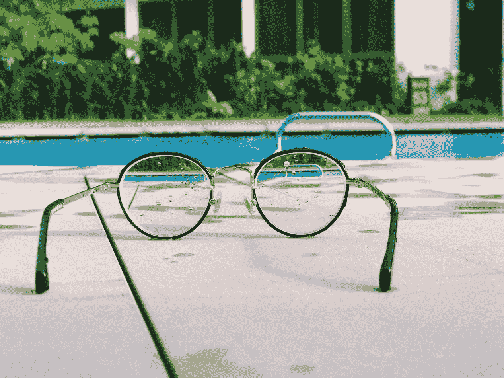
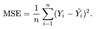
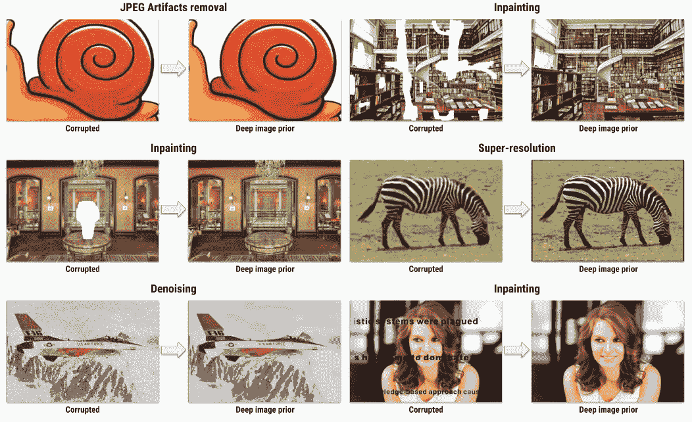

# 你能增强吗？—使用 1 幅训练图像进行图像恢复

> 原文：<https://towardsdatascience.com/can-you-enhance-that-image-restoration-with-1-training-image-b54989a57b4d?source=collection_archive---------13----------------------->

> 我为学习者写了一份名为《强大的知识》的时事通讯。每一期都包含链接和最佳内容的关键课程，包括引文、书籍、文章、播客和视频。每一个人都是为了学习如何过上更明智、更快乐、更充实的生活而被挑选出来的。 [**在这里报名**](https://mighty-knowledge.ck.page/b2d4518f88) 。

电影太棒了。但是计算机视觉可以让它们变得更棒——呃(我们就把它变成一个单词)！

电影使用计算机视觉进行各种各样的事情，如动作捕捉、特效和计算机生成图像(CGI)。最常见也是最老套的用法之一是“你能增强它吗？”在动作片里。这通常是一些美国联邦调查局/中央情报局/酷特工在看着他们正在追捕的人的照片时说的。图像失真，很难看到，所以他们告诉技术人员“增强”，这样他们就可以看到坏人的脸。这种“增强”效果在电影中看起来相当激烈，几乎就像戴上一副眼镜，没有它你什么也看不见！



但是你可能已经猜到了，这并不总是像电影一样简单！人工智能(AI)和计算机视觉还没有达到那个地步，但我们越来越接近了。

通常，当我们训练一个深度神经网络进行那种图像恢复时，我们需要训练数据……大量*训练数据，大约有数千甚至数百万张训练图像。由于训练数据的获取在时间和金钱上都很昂贵，这使得个人和组织都很难建立健壮的图像恢复系统。*

幸运是，大规模训练数据集的成本和需求有望降低。最近的计算机视觉研究，称为 [*深度图像先验*](https://dmitryulyanov.github.io/deep_image_prior) 将帮助我们解决这个问题。

# 具有深度图像先验的图像恢复

标准的图像恢复流水线如下工作。我们收集一个大数据集的损坏和未损坏的图像对；简单来说，这基本上是难看的和好看的图像对。接下来的想法是训练一个深度网络来学习坏图像和好图像之间的映射。一旦经过训练，网络应该已经很好地了解到，当你给它一个糟糕的图像时，它应该输出一个同样图像的更好的版本:更清晰，更锐利，更美观。

这些网络很容易训练。使用 Keras、TensorFlow 或 Pytorch 在 Python 中对它们进行编程非常简单，我们使用简单的均方误差作为损失函数，定义如下



其中 *n* 是训练集中图像的数量，Y 是地面真实好图像，Y-hat 是网络预测的好图像。传统上，训练网络需要收集大约无数的训练图像，然后等待网络完成训练很长时间。

这就是深度图像优先的用武之地。作者仅使用*一个损坏的图像*来训练他们的网络。网络的输入是被破坏的图像，输出是同一个被破坏的图像。我们训练网络来优化这种预测其自身输入的映射。

那么，这为什么会奏效呢？以下是作者的巧妙观察。

当我们试图恢复一幅图像时，我们实际上是在试图平衡两件事:(1)使我们被破坏的图像不那么被破坏，例如通过减少噪声；这使得图像看起来更**自然**，因为它是无噪声的(2)仍然保持整体图像结构。

例如，如果我们想消除输入图像中的所有噪声，我们可以从技术上使输出图像全黑；全黑图像没有任何噪声！但是我们不仅仅是想去除噪声，我们还想保持图像的结构；如果我们的输入图像是一辆汽车，我们仍然希望输出看起来像同一辆汽车，只是去掉了噪声。

均方误差函数将确保图像结构得到保持，并且我们的汽车看起来仍然像一辆汽车，因为当像素与地面真实情况相似时，误差将很小。

为了消除噪声并使图像看起来自然，我们实际上可以利用深层网络的结构来迫使输出自然。作者指出，他们观察到网络本身的结构驱动输出自然，无污染的图像。这篇论文的总体本质是，卷积神经网络(CNN)在某种程度上*像*自然图像，或者至少偏向于自然图像。

所以当你进行训练的时候，选择你想要恢复的任何一个被破坏的形象。把它作为你的单一训练图像，既作为输入又作为基础事实。你的误差函数是预测图像与你的地面真实(与你的输入相同)之间的 MSEMSE 负责维护图像结构。由于我们的网络倾向于输出自然图像，我们可以相信它会输出我们想要的无噪声图像。当只使用一个*单个*图像进行训练时，请查看以下不同恢复任务的一些结果。



Examples results from Deep Image Prior. (This image is borrowed from the [official Deep Image Prior project page](https://dmitryulyanov.github.io/deep_image_prior), for educational purposes)

# 代码

感谢 AI 社区中开放源代码思想的美丽，在这里有一个公开可用的深度图像优先[实现！这是你如何使用它。](https://github.com/DmitryUlyanov/deep-image-prior)

首先克隆存储库

```
git clone [https://github.com/DmitryUlyanov/deep-image-prior](https://github.com/DmitryUlyanov/deep-image-prior)
```

安装所需的库

```
pip install numpy
pip install scipy
pip install matplotlib
pip install jupyter
pip install scikit-image
pip install torch torchvision
```

这里不需要任何预先训练好的模型，因为只用一张图片训练会超级快！

像这样启动 Jupyter 笔记本

```
jupyter notebook
```

现在，您可以选择一台笔记本电脑来完成您想要尝试的任何一项任务！笔记本超级短，好用！如果您想要恢复您自己的损坏的映像(并将其用于训练)，那么您将想要用您自己的映像替换 **net_input** 数组。读入损坏的图像并将其传递给 **net_input** 。

瞧啊。只有 1 幅训练图像的图像恢复！

# 喜欢学习？

在[推特](https://twitter.com/GeorgeSeif94)上关注我，我会在那里发布所有最新最棒的人工智能、技术和科学！