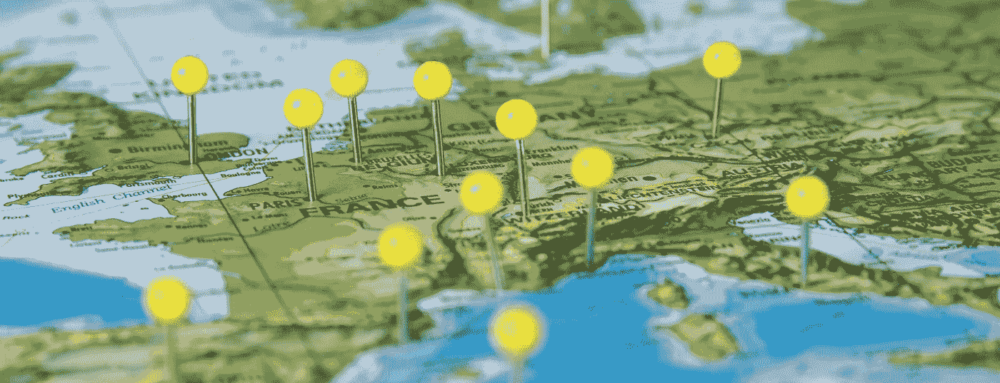
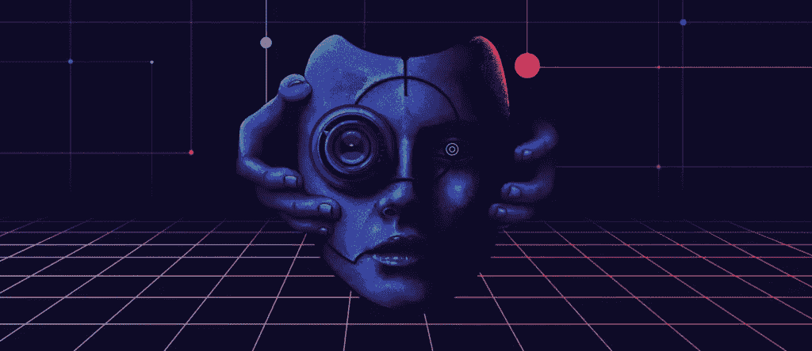
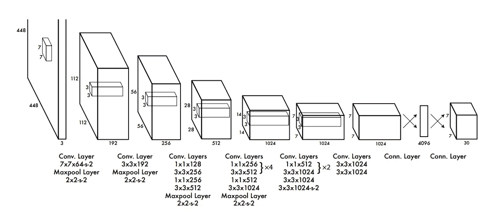
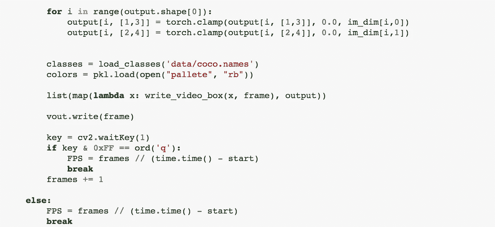
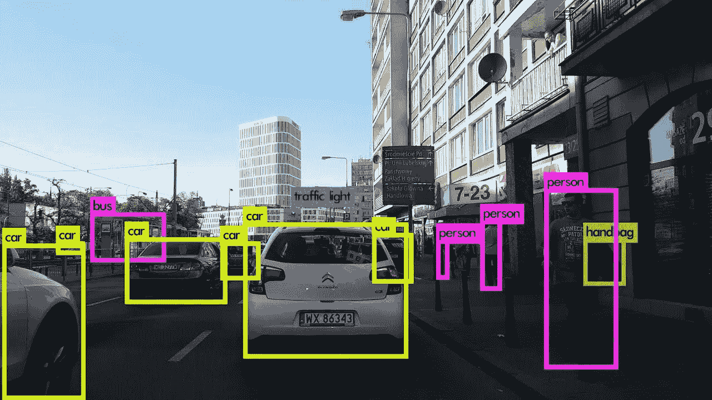

# 你能比电脑更快找到沃尔多吗？剧透:不能。

> 原文：<https://towardsdatascience.com/can-you-find-waldo-faster-than-a-computer-spoiler-you-cant-ff382e601c31?source=collection_archive---------5----------------------->

## 用计算机视觉检测物体

仿佛就在昨天，我还在一位数的年纪，在飞机上和教堂里用充满随机记忆和活动游戏的书自娱自乐。最具代表性的是《沃尔多在哪里》的巨幅插图；我甚至一直和我的朋友和家人比赛，看谁能更快找到他。

我不得不说，在所有的练习之后，我变得相当不错。这并不像看起来那么简单。你可能会认为一个穿着蓝色裤子和条纹衬衫的瘦子很容易被发现，但事实并非如此！

Did you try to find Waldo? Even if you did… your time was up a long, long while ago. Too bad! If only there was something you could do to be faster…

这项运动的重点是速度、注意力和集中。它应该让孩子们主动思考，锻炼他们的大脑肌肉。“准备上学”，或者别的什么。

> 但是如果我告诉你你不需要这些就能在游戏中获得成功呢？

看，另一部分是胜利。是的，我知道，我已经听到了关于“最重要的是玩得开心！”但是听着。**从技术上讲，想出有效策略的人是最稳定的赢家。** ***那就是你想成为的*家伙！你所要做的就是智胜他人(显然，没有作弊)，你就成功了。而这其实也适用于生活中的大部分事情。因为“沃尔多在哪里”没有真正的规则，除了你必须是第一个找到他的人才能赢，所以每次你都可以选择不同的道路来成为第一个。**

如今的孩子们也能接触到如此多的科技产品——是时候让他们用这些产品做点好事了。关键是，电脑比你聪明。这是因为当他们看一张非常复杂的图片时，他们可以一下子看到整个事情，并在几秒钟内找到瓦尔多。

作为人类，我们没有能力拥有这种处理能力，除非你通过基因改造让自己变得异常聪明(这并不完全不现实……但那是另一回事了)。反正你电脑的能力超过了人类。这到底是怎么发生的？

# 计算机视觉:能看见的技术

你的普通博客们对计算机视觉的看法可能是，计算机有一双超级眼睛时刻监视着你，就像你的网络摄像头里的联邦调查局一样。但这是错误的。也许有一天…

对象检测(作为计算机视觉的一个分支)实际上是指计算机能够解释数字图像或视频的内容，而无需您手动输入这些信息。这项技术可以分解图像的不同部分，并找出存在的对象。这是面部识别的动力，就像你在 iPhoto 中的家人和朋友一样，并将罪犯与安全镜头进行匹配。

> 计算机视觉不仅仅是能够看到正在发生的事情，而且能够理解它。

# YOLO……但这不是你想的那样

你只看一次，又名 YOLO，是一个实时检测物体的系统。不骗你，当我第一次知道 YOLO 不是“你只能活一次”时，我很失望，但一旦我知道了什么是真正的 YOLO，我保证它会有趣和酷一百万倍。

该系统不同于经典模型(例如快速 R-CNN ),因为您不会对图像上的相同区域进行多次预测，而是在单个回归问题中将数据集通过完全卷积神经网络(FCNN)仅一次。

## 以下是 YOLO (V3)模型的工作原理:

1.  **网格:**图像被分成一个 S x S 网格(你可以从左边的图像中看到)。这是为了把不同的部分分解开来，让图像作为一个整体被“阅读”。如果一个物体落在一个网格的中心，该网格负责检测该物体。
2.  **包围盒:**整个图像的特征作为一个整体被用来确定包围盒，它基本上只是物体可能所在位置的轮廓。值得注意的是，它们覆盖了图像的每个部分，并且**与**重叠。它也更有可能比电网本身更大。想象一下，你正在努力寻找藏在床罩下的手机——你床上不同突起的轮廓就是你的边界框！
3.  **置信度得分:**置信度得分表示模型预测的实际存在程度。它基于宽度、高度以及对象中心相对于单元格边界的位置。这是当你在看床的不同块(边界框)的**尺寸**时。你将手机的大小与肿块的大小进行比较，然后基于此确定你认为你的手机实际上有多少。
4.  **条件类概率:**这些是以包含对象的网格单元为条件的概率。使用以前的 YOLO 模型，每个网格单元只能预测一组类别概率。由此，你可以区分不同的物体(见上图底部)。但是 YOLO V3 对每个类使用**独立的**逻辑分类器。这基本上可以让你对一个相同的物体有多个标签:计算机找到瓦尔多，他被贴上“瓦尔多”、“人”、“男孩”的标签。

下面是如上所述收集和解释数据的一段代码(它还记录了物体被检测到的速度！):

> 这只是代码的摘录。我用 YOLO V3 编写了一个完整的物体检测模型，你可以在这里找到[的链接](https://github.com/nathaliejeans/yolo_v3)。

This is the architecture of the model — you can see the different layers.

## 操纵数据

由于单一回归，客观性和分类的损失需要单独计算——但仍在同一个网络中。你通过逻辑回归得到你的客观性分数:1 表示边界框和地面真实对象(图片实际上是什么)完全重叠。该模型将仅预测 1 个这种类型的包围盒，但是误差将受到客观性和分类损失的影响。

YOLO (V3)模型也以 3 种不同的尺度预测盒子，以支持尺度变化。看起来会像这样:

为了测试该模型，我们必须将条件类概率与单个盒子置信度预测相乘。这个等式返回一个类在盒子中的概率，以及预测的盒子与对象的匹配程度。

下面是另一段代码摘录，它加载了预先训练的对象名称类，以及它如何处理数字图像的不同帧的编写/注释:

你只看一次(YOLO V3)模型的输出如下图所示。你到底想从这个模型中得到什么，以及如何在不同的应用中使用它，比如道路地图，这一点非常清楚。

**现在我希望你明白为什么找到沃尔多会这么容易！你甚至不用看第二遍…**

## 我们为什么使用它

*   它被认为是实时的，因为它很快——每秒钟能够捕捉 45 帧。还有一个速度更快、架构更小的版本，每秒可以捕捉 155 帧，但精度较低。
*   所使用的 FCNN 可以理解和使用通用对象表示的功能。你可以使用真实世界的图像和艺术品来使用和训练它。

# 展望未来；胸怀大志

这项技术已经过了初级阶段:人们在日常生活中使用计算机视觉。越来越多的技术正在该领域发展，这是令人兴奋的，因为它有如此多样的现实世界应用。

将物体检测软件与语音反馈结合起来也是非常强大的。今天它已经被使用了——人们只是不知道它的存在。失明的人将能够获得对他们周围环境的描述，不必太依赖他们所有的其他感觉，24/7。他们甚至会开车！虽然，我不确定当我们有自动驾驶汽车时，这有多必要！

另一个可能的用例是对大型零售店或杂货店的库存进行分类、确定和辅助。在处理外部伤口、骨折、斑点或损伤时，医疗诊断也可以从中受益。但最重要的是，是技术帮我找到了沃尔多！

不管怎样，这个领域有着惊人的潜力，我迫不及待地想成为未来的一部分。

让我知道你的想法！

*关注我上* [*领英*](https://www.linkedin.com/in/nathalie-jeans-1316b2172/) *和* [*中*](https://medium.com/@nathaliejeans7) *了解更多。*

> 感谢来自 GitHub 的 Ayoosh Kathuria 和 Aviv Sham，以及来自华盛顿大学、艾伦人工智能研究所和脸书人工智能研究所的 Joseph Redmon、Santosh Divvala、Ross Girshick 和 Ali 法尔哈迪发表的论文，您可以在此处找到。