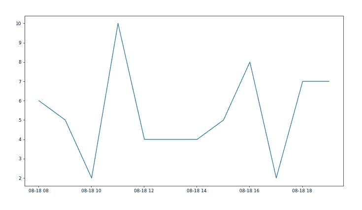
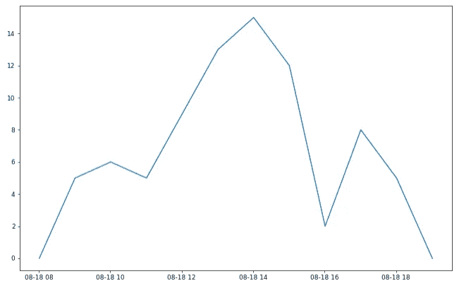
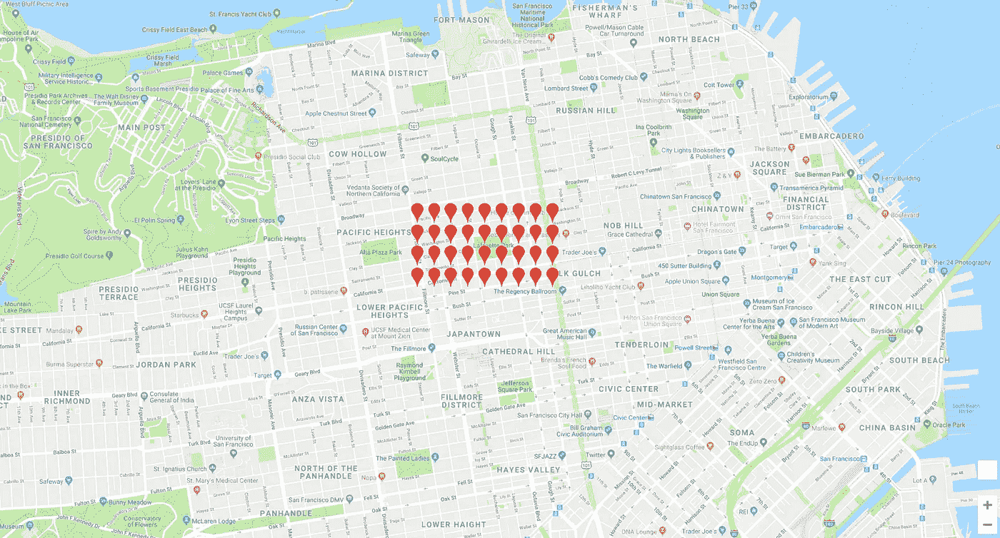
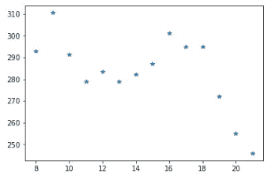
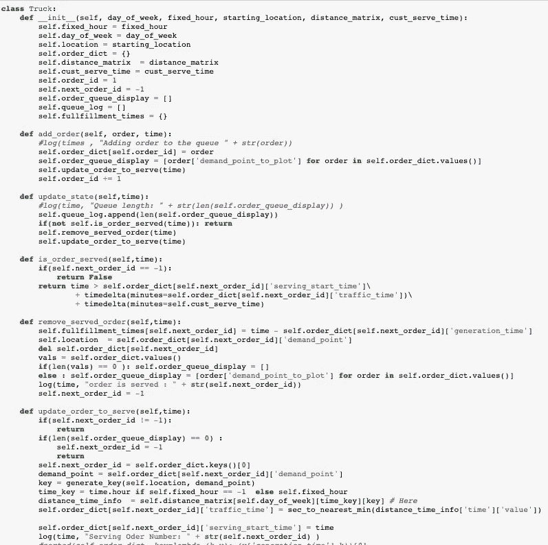
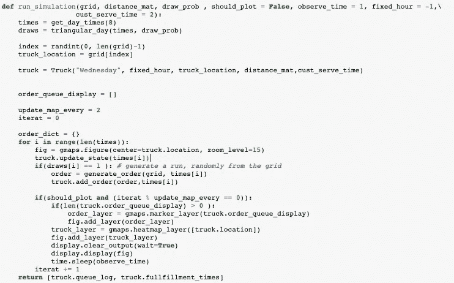
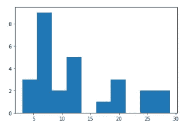
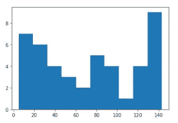
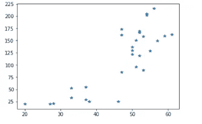

# 你能在 15 分钟内把你的杂货送到吗？

> 原文：<https://towardsdatascience.com/can-you-have-your-groceries-delivered-in-under-15-minutes-14f7b3b3f714?source=collection_archive---------26----------------------->

*针对快速交货的快速模拟和优化研究。*

Instacart、Amazon Prime now、Farmstead 和更多送货领域的初创公司正在解决非常有趣的供应、需求、模拟和物流优化问题。早在 2018 年，我的联合创始人王维基和我就想验证一个激进的杂货配送想法:**让杂货在 15 分钟内送达，对用户来说没有配送成本。**

这听起来几乎不可能。这个想法是将 SKU 放在一辆卡车上，在附近盘旋，集中响应需求，而不是众包交付。

显然，要验证这个想法，还有很多问题需要讨论:

1.  这种服务的需求有多大？
2.  要在 15 分钟内交付，您需要做些什么？
3.  您如何选择最佳的 SKU 来响应这种需求？
4.  有多少需求会使这有利可图？在当前的路况下，你真的能满足这种需求吗？
5.  还有更多…

所有这些都是非常有趣的问题，但我想把重点放在本文的第二个问题上，因为它有点容易快速模拟，看起来也很有趣。你可以在这里找到这个帖子[的代码](https://github.com/ugur47/MobileStoreSimulation)。

## 要在 15 分钟内交付，您需要做些什么？

让我们想象一下这种情况。我们有一辆卡车负责服务一个区域(比如说诺布山)。假设这辆卡车有无限的 SKU 供应来响应任何杂货请求。我们的模拟将产生随机需求，并让我们的卡车在一个选定的社区为该需求服务。我们试图回答的主要问题是:

尾部交货时间看起来像什么

*   不同的需求体系
*   白天不同的交通状况。

我们希望有尾部交付时间(用户等待接收杂货的最长时间)，因为这将决定我们为卡车选择的邻域边界。这反过来可以与现实生活中邻里产生的需求进行比较，以了解这是否是一个现实的商业模式。为此，我们需要为模拟生成数据。我们来讨论一下，数据生成，模拟和可视化。

# 生成数据

我们可以想象白天有统一的需求，交通也是一样的。这将是最好的情况，因为我们的卡车将全天得到充分利用。**我们将选择我们的区域，以便卡车可以在一小时内响应请求，这些请求之间的距离在 15 分钟以内。**



Number of requests for each hour (random draws from uniform demand)

不幸的是，现实生活更具挑战性。在现实中，我们可以很容易地想象需求将呈三角形分布:在高峰时间(下午 5 点到 8 点)将有 n 个订单，在上午 10 点有 m 个订单，其中(m<



Number of requests for each hour (random draws from triangular demand)

除此之外还有路况。高峰需求时间的交通状况可能会更糟。幸运的是，我们有一个很好的数据来源。[谷歌地图距离矩阵 API](https://developers.google.com/maps/documentation/distance-matrix/start) 。基本上，我们可以批量获取一天中选定小时的点到点旅行时间。

假设我们正在模拟拉斐特公园区域。我们首先生成均匀分布在定义区域上的请求点。

```
grid_lafayatte =  create_grid(
37.7886685, 37.7939118,-122.4343621,-122.4223142, 
step_size = 0.0015)fig = gmaps.figure()
marker_layer = gmaps.marker_layer(grid_lafayatte)
fig.add_layer(marker_layer)
display.display(fig)
```



Demand points per block for Lafayatte park area

如果我们可以打包一个好的步长，比如说每个块 1 个点，我们可以有把握地假设将该块的所有需求集中到该点不会使模拟偏离现实太远。

现在我们有了这些点，我们可以从[谷歌地图距离矩阵 API](https://developers.google.com/maps/documentation/distance-matrix/start) 中获得它们之间的旅行时间，并获得在一天中特定时间到达该社区某个地方所需时间的图片。

我们通过对该邻域内所有点到该时间点的旅行时间进行平均来实现这一点。



Average travel times from all points to all points by hour of day

距离矩阵的结果和我们预期的一样。上午 9 点在拉斐特公园逛一圈平均需要 5 分钟(300 秒)，到晚上 9 点就下降到 4 分钟。特定的路线会比平均拥挤，我们将在模拟中看到它们的效果。

# 模拟

现在，我们有了进行模拟研究所需的数据。这是模拟地平线的样子

每一分钟

*   根据给定的需求分布(如果有)从任意点提取需求。
*   卡车根据其使用的算法满足需求。我们可以选择先进先出，最近的优先，或者更复杂的。

下面是一个简单的先进先出卡车类的样子



Truck class for simulation

然后，我们用循环进行模拟。



Simulation loop

## 形象化

虽然我们不需要花哨的可视化来获得我们想要的结果，但我们将使用服务于地图上的请求点的卡车作为一种调试方法，以确保一切正常工作。

Fast and sloppy visualization (updates every 2.5 mins in simulation time

热图风格点是卡车，需求像大头针一样冒出来。我们不模拟卡车在道路上行驶，但在模拟中会进行计算。当卡车到达请求点时，我们只需将卡车位置更新到请求点。

# 结果

我们想知道随着需求的增加，尾交货时间什么时候变得太长。



Histogram of delivery times for a total of 27 orders

对于 Mission Bay 和 Portrero Hills 地区，对于每天生成 27 个订单的三角形需求曲线，我们有上面的交付时间直方图。基本上，所有订单都在 30 分钟内送达，3 个在 5 分钟内送达，14 个(9+2+3)在 10 分钟内送达。如果我们通过改变需求参数来增加每天的订单数量，我们会得到如下结果:



Histogram of delivery times for a total of 45 orders

哇，45 个订单，事情变得很糟糕。现在我们只有 13 个订单在 20 分钟内送达，最糟糕的情况是人们等了 2 个多小时。所以，如果我们要为 45 个订单服务的话，15 分钟以下的交货在这里似乎不行。但是这种断裂发生在哪里呢？换句话说，在我们开始让人失望之前，我们可以服务多少订单。

为此，我们针对不同的需求参数运行模拟，并查看第 90 个百分位数的交付时间。对于上述情况，我们将

27 个订单-> 90%到 25 分钟

45 个订单-> 90 %~ 120 分钟



90th percentiles for different # orders per day

正如我们所看到的，该地区在接到 35-40 份订单后出现了大幅增长。请记住，这是最简单的卡车算法(FIFO ),我们假设的是硬需求分布。尽管如此，有趣的是，使用这种型号，我们可以为几乎所有人提供 25 分钟而不是 15 分钟的送货服务。(对于每天产生少于 35 个订单的社区)

希望你喜欢，请[检查代码](https://github.com/ugur47/MobileStoreSimulation)，如果你发现任何错误/问题或有任何建议，请让我知道。