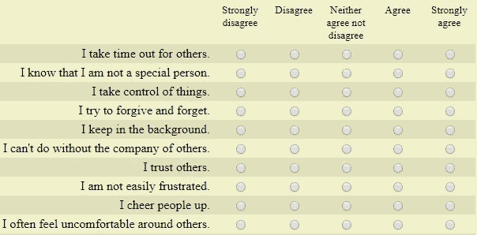
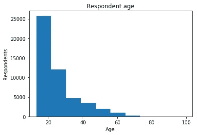
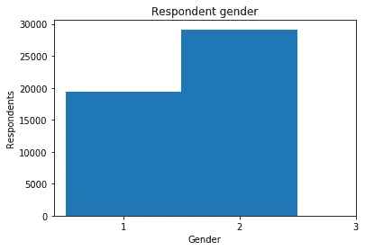
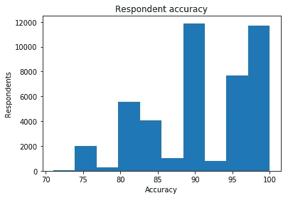
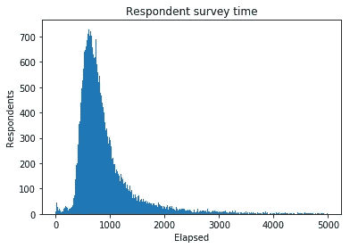
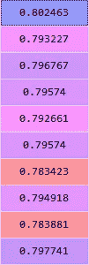
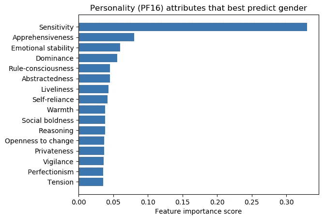
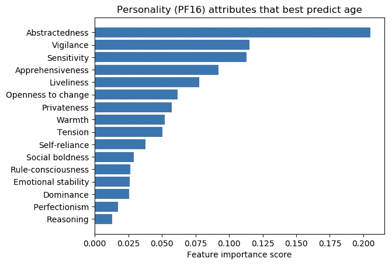

# 能从性格测试结果预测性别吗？

> 原文：<https://towardsdatascience.com/can-you-predict-gender-from-personality-test-results-e1b06828627c?source=collection_archive---------27----------------------->

这个月 reddit 上弹出了一个有趣的机器学习分类问题。一名用户发布了来自 openpsychometrics.org[的](https://openpsychometrics.org/_rawdata/)的[免费人格测试结果，该用户声称他们成功预测了回答者的性别，准确率高达 80%。我决定接受挑战，看看我还能从数据集中找到什么有趣的东西。](https://openpsychometrics.org/_rawdata/)

# 总结(剧透)

1.  根据一个人的性格测试结果来预测他的性别是相对容易的，也不奇怪。经过几轮模型改进后，我达到了 82%的准确率。使用包含一些经过清理和工程处理的数据的 SVM 返回最佳结果。
2.  性格也会随着年龄变化。事实上。16PF 测验中的每一个人格特征都随着年龄和性别而变化。
3.  从模型精度中挤出额外的百分之几需要很大的努力。sklearn 或 XGBoost 提供的普通模型对于快速简单的解决方案来说通常已经足够好了。

# 数据

数据来自 openpsychometrics.org 的。根据《塞奇人格理论和评估手册》，该测试被称为 16 种人格因素(T7)，"一种全面且广泛使用的正常成人人格测量方法"。该测试包含 164 条关于你自己的陈述，并使用这些陈述来衡量 16 种性格特征。这些特征是相关的日常术语:

*   温暖
*   论证
*   情绪稳定
*   优势
*   活泼
*   规则意识
*   社交大胆
*   灵敏度
*   警戒
*   抽象性
*   私人性
*   恐惧
*   对变化的开放态度
*   自力更生
*   至善论
*   紧张

该数据包含 49159 个测试结果，每个结果还提供年龄、性别、准确性、国家、来源和运行时间。

# 探索性数据分析和剔除不良数据

数据集包含每个个性测试答案的标签栏，按个性特征分组。例如，“A1”标志着“温暖”特质的第一个问题。

它还包含关于年龄、性别、准确性(由回答者自评)、国家、来源(数据来自哪里——有不同的机构在进行这项测试)和时间流逝的数据。

年龄分布在 13 到 80 岁之间，并且不出所料地以 13-30 岁为主。有数百个空值，我必须删除它们。

性别可以是值 0、1、2、3。

1 和 2 对应于男性和女性，尽管我从来没有费心去弄清楚哪个是哪个，因为那与这个分析无关。我删除了性别值 0 和 3，因为它们非常少，它们会使这个项目变得更加困难和值得讨论。重要的是，有足够多的男性和女性可以从中得出有统计学意义的结果。

被调查者自我评估的准确率在 85%左右。有些回答者给测试打了很低的分数，有些人的准确率为零。我去掉了精度最低的 5%,因为我不想要评级很差的数据。

调查时间专栏提出了一个有趣的问题。有一条很长的尾巴，可能是那些没有关好浏览器窗口的人，或者是那些苦苦思索这个问题的人。我选择保留所有这些数据。也许最好的结果来自那些真正思考问题并花了 5000 秒做测试的人。然而，有两个不到 300 秒的明显峰值，几乎可以肯定是由作弊的人组成的，他们很快通过测试，看看到底是什么。

我删除了所有完成时间少于 300 秒的调查——基本上是从上面的数据中去掉了左“肘”。

数据现在有 43000 行。我删除了大约 6000 份调查，其中许多是测试作弊，或者选择不指明他们的性别或年龄。当然，这里会有一些好的数据，但是没关系——43000 已经足够了！

# 第一个模型——vanilla XGBoost

代码: [GitHub](https://github.com/rian-van-den-ander/explorations/tree/master/personality_traits/personality_traits_xgboost_tree_no_data_prep.py)

这个问题似乎是一个非线性问题。我知道这一点，因为所有这些性格特征之间肯定存在着复杂的关系。换句话说，一个心理学家在他认为有意义的几个“特征”周围画了任意的线。另一个心理学家会建立不同的模型。这些特征不是线性可分的，尽管人格测试试图这样做。某些特征之间肯定有联系，例如，x7，社交大胆，x11，隐私。

我从我通常的回归或分类问题的起点开始:一个普通的 XGBoost。据我所知，这使用了决策树和梯度推进，当面对这样的非线性问题时，这通常是一个好主意。

我根据模型能够正确猜测性别的百分比来确定模型的性能。我使用 k-fold 交叉验证来实现这一点，该算法在不同的数据切片中运行多次，以获得一个平均结果，以防您的模型幸运地拥有一个测试集。换句话说，验证不是从一组测试数据中返回一个准确性分数，而是返回许多可以平均的分数。

**基线结果**:在分类或回归问题中，数据准备通常会让你走得更远。在没有我的数据准备的情况下，我从数据集中删除了坏数据，XGBoost 的成功预测率为 **78%** 。

**与数据准备**:vanilla XGBoost 分类器的成功预测率为 **79%** 。

# 用网格搜索改进模型

代码(用我最终的 XGBoost 模型): [GitHub](https://github.com/rian-van-den-ander/explorations/tree/master/personality_traits/personality_traits_xgboost_tree_best.py)

79%已经是一个不错的成绩了，但我显然想超过 redditor 的 80%。

我做了两轮网格搜索，用不同的参数多次运行上面的 XGBoost 模型，对 XGBoost 最重要的参数通常是 max_depth 和 gamma。

经过两轮网格搜索，这将模型得分提高到了**81.5%**——预测提高了 2.5%。比从数据集中删除所有坏数据更好的结果。然而，在这两轮之后，我可以看到收益递减，所以停止了 XGBoost 的工作，看看是否有其他算法可以做得更好。

# 用支持向量机(SVM)改进模型

代码: [GitHub](https://github.com/rian-van-den-ander/explorations/tree/master/personality_traits/personality_traits_svc_best.py)

我以前读到过，对于只有轻微可微数据的非线性问题——换句话说，男人和女人非常相似——支持向量机(SVM)是一个很好的模型。除了很好地忽略异常值，它还采用了与其他模型非常不同的方法。简单地用这个问题来解释，大多数算法会寻找男性和女性之间的细微差别，并试图画出那条线。大多数人会犯错误，因为很难找到一个好的界限。

“不，谢谢，”SVM 说。它选出了最具男子气概的西尔维斯特·史泰龙和最具女性魅力的斯嘉丽·约翰松。它用这些作为比较点来决定一个人是男是女。在一个性别差异非常模糊的世界里，这比另一种方法稍微好一点。对于更多的二进制问题，它就不太适用了。

然而，如果我的问题是*过于*非线性，SVM 将会受到影响，因为它仍然需要一些线性空间来运行它运行的大多数“内核”——内核本质上是它用来在性别之间绘制的形状类型，比如围绕男性的一个圆。但是，您可以通过添加该形状要环绕的尺寸来使其更具线性。

为了做到这一点，我增加了每个人格特征之间关系的栏目。

首先，这意味着平均每个特征的所有答案，得到 16 列。

其次，我给每个关系都加了一栏，比如敏感和支配的关系。16 列变得更多。

最后，我通过网格搜索，找到 SVM 分类器的最佳参数，并再次进行 k 倍交叉验证。

**结果:82%！**

这不是一个很大的改进，但对于一个快速而肮脏的解决方案来说，这仍然是一个改进。成功！

# 哪种性格特征最能预测性别？

代码: [GitHub](https://github.com/rian-van-den-ander/explorations/tree/master/personality_traits/gender_feature_importances.py)

当然，做了这个预测后，我想看看哪些性格因素能很好地预测性别。为此，我使用了 XGBoost 的特性重要性算法。感谢确认偏差，这些不会让你惊讶！不过，请注意，这些是*模型*认为合适的个性特征。有可能存在一个更好的模型，它提出了一组不同的重要特征。然而，鉴于我得到的良好精度，这是不太可能的。

预测绝对受敏感性支配。然而，重要的一点是，模型认为所有的特征都很重要:所有的特征都用于预测，因此所有的特征在性别之间都不同(或者它们之间的关系不同，因为这是非线性的)。

# 额外收获:哪种性格特征最能预测年龄？

代码: [GitHub](https://github.com/rian-van-den-ander/explorations/tree/master/personality_traits/age_feature_importances.py)

无意中搭建了一个年龄*分类器*(对，分类器，所以试图预测一个具体的年龄)，得到了一个有趣的结果。到目前为止,“我马上做完家务”这个问题是特定年龄的最大预测因素。

然而，当切换到年龄回归变量时，即试图建立一个从个性预测年龄的方程时，结果却很好。“抽象”人格因素描述了一个人如何倾向于陷入沉思，或者现实和脚踏实地。

这出乎意料地令人难过。随着年龄的增长，我们大大失去了想象的倾向。

# 结论

1.  根据一个人的性格测试结果来预测他的性别并不奇怪。我说这并不奇怪，有三个原因，首先是因为性格测试是由一个寻找将我们分开的最大特征的人开发的。男人和女人通常是分开的，他会选择一些他注意到的性别。其次，因为社会仍然是围绕性别规范构建的。为了证明这一点，一个非常有趣的后续研究将是，考虑到该数据集提供了回答者的国家，如果性别规范更灵活的国家(比如欧洲国家)比性别规范非常严格的国家更难预测性别。第三，因为有证据表明女性在生理上比男性更敏感。
2.  性格随年龄变化！同样，出于上述第一个原因，这并不奇怪。年龄受抽象性支配，抽象性描述了我们想象事物的倾向，而不是强烈地活在当下。
3.  如果是为了解决业务问题而构建的，那么一段没有任何进一步模型优化的 10 行代码对于大多数情况来说已经足够好了。它会让我们达到 78%的准确率。应用我所有的相关知识只让我达到了 82%。令人害怕的是，普通算法有多好，而对于一天诚实的工作来说，这种改进相对来说又有多小。

# 代码和工具

代码: [GitHub](https://github.com/rian-van-den-ander/explorations/tree/master/personality_traits)

工具:Python，xgboost

我的网站:【https://rian-van-den-ander.github.io/ 

*原载于 2019 年 8 月 23 日*[*https://rian-van-den-ander . github . io*](https://rian-van-den-ander.github.io/Classifying-Gender-From-A-Personality-Test/)*。*