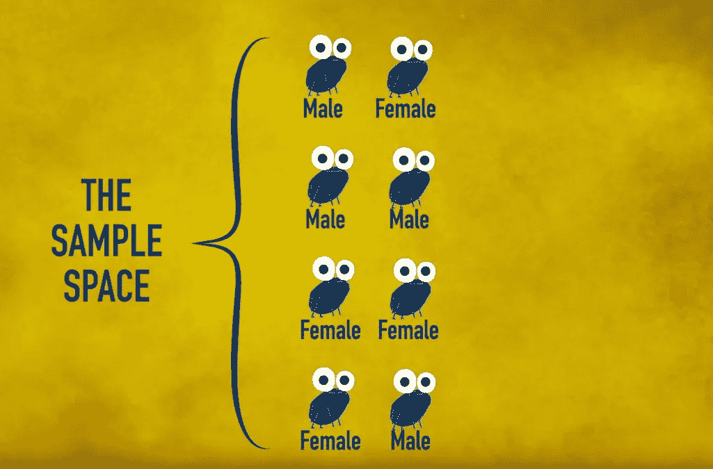
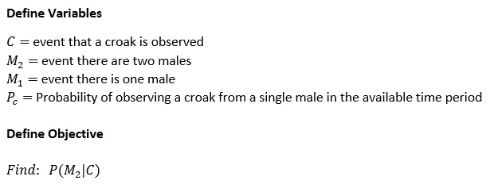
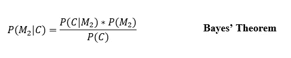
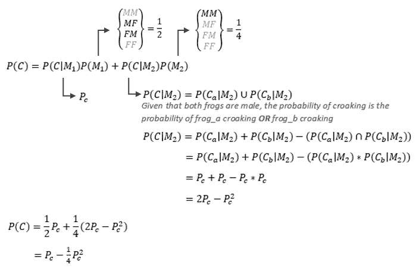
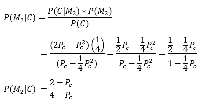
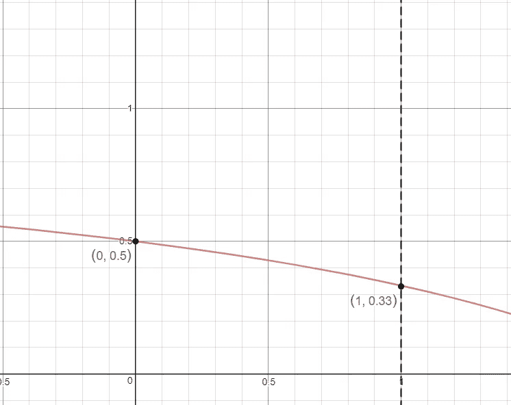
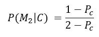

# 你能解开泰德的青蛙之谜吗？泰德能吗？

> 原文：<https://towardsdatascience.com/can-you-solve-teds-frog-riddle-can-ted-249db4f33c56?source=collection_archive---------12----------------------->

## 用贝叶斯法则解决一个有争议的问题

作为谜语系列 TED-Ed 的一部分，TED 的青年与教育倡议发布了一个名为“你能解开青蛙谜语吗？”视频呈现了一个关于条件概率的谜语，用简单的方式解答。但是，解决方法正确吗？批评家认为事实并非如此。如果你想详细了解这个问题，你可以在这里观看视频[并阅读下面的评论来了解这场辩论。对于其余的人，我将用一种简化的方式来展示基本的东西。](https://youtu.be/cpwSGsb-rTs)

*   有两个树桩，A 和 B
*   树桩 A 抱着一只青蛙
*   Stumb B 装着两只青蛙
*   青蛙有 50%的概率是雄性(M)或雌性(F)
*   你要选择抱雌蛙概率最高的树桩

在没有其他信息的情况下，人们显然会选择树桩 B，因为它包含两只青蛙而不是一只。然而，在你做出选择之前，你听到树桩 B 发出的叫声，这是一只雄性青蛙的声音。你现在知道树桩 b 上至少有一只雄性青蛙。**你选择哪个树桩，那个树桩里有一只雌性青蛙的概率是多少？**

让这个问题特别有趣的是，关于如何正确解决这个问题，以及它的解决方案实际上是什么，存在争议。具体来说，有两行非常合理的推理产生了相互矛盾的答案。一个是 ted 在视频中展示的(你可以在这里听那个[或者继续阅读摘要)，另一个是评论家在评论区展示的。](https://youtu.be/cpwSGsb-rTs?t=141)

# 答案 1: TED 的解决方案

TED 的解决方案背后的想法是，在你听到青蛙呱呱叫之前，你从考虑初始样本空间开始。样本空间是树桩 b 上青蛙性别的可能性集合。这些可能性是(MM)、(MF)、(FM)和(FF)，其中字母 M 和 F 表示雄性和雌性。每种可能性都是一样的。

Sample space of frogs. Image from TED-Ed’s video “Can you solve the frog riddle? — Derek Abbott”

听到叫声后，我们用获得的新信息更新样本空间。也就是听到一声呱呱，我们就知道树桩 B 不可能有两只雌蛙，因为雌蛙不会呱呱。因此，我们从样本空间中消除(FF)。我们现在有剩余的可能性:(MM)、(MF)和(FM)。这三种可能性中有两种包含雌性青蛙，所以雌性青蛙在树桩二上的概率是三分之二，或 66.7%。显然，树桩 A 上有一只雌性青蛙的概率只有 50%,因为我们对此一无所知。因此，我们选择树桩 b。

# 答案 2:批评家的解决方案

泰德的解决方案很有道理。然而，这也与一些简单的直觉相矛盾。假设我们考虑有两只青蛙的树桩 B，这两只青蛙可以是公的也可以是母的。一旦我们听到叫声，我们就知道至少有一只雄性青蛙。我们不知道哪一个是男性，但这并不重要。现在有一只我们知道是雄性的青蛙和一只我们真的一无所知的青蛙。因为青蛙是独立的，第二只青蛙是雌性的概率仍然是 1/2，即 50%，因此树桩 B 包含雌性青蛙的概率是 50%。所以，你选树桩 A 还是树桩 b，没什么区别。

这是主导 YouTube 评论部分的论点。用户已经想出了很多方法来解释为什么这种概率是 50%。其中一些解释和 TED 的解释一样令人信服。

# 答案 3:贝叶斯的解决方案

我们现在有两种不同的解决方案，看起来都是正确的，但提供了相互矛盾的答案。我们怎么能确定哪个是真的呢？一个好的方法，尽管不那么有趣，是将问题简化为透明和客观的东西。为了做到这一点，我们将问题转化为数学友好的符号。如果你不熟悉概率，也不想陷入公式中，可以直接跳到“解决争论”一节。对于你们其他人，我建议拿出你们的概率笔记，自己算出来。

一如既往，第一步是为不同的事件定义变量，并定义我们想要确定的量。这个量是*‘假设观察到一声呱呱叫声，树桩 b 上有两个雄性的概率’，*写 P(M₂|C)。马上，我们可以使用贝叶斯定理将我们期望的概率转换成更容易找到的值的组合。对于那些不熟悉贝叶斯法则的人(很高兴你还在阅读！)，一个定义可能会有所帮助。公司金融研究所的一篇文章指出，贝叶斯法则**T3**

> …是一种数学公式，用于确定事件的条件概率…基于可能与事件相关的条件的先验知识

关于贝叶斯规则，要理解的最重要的事情是，它允许我们将条件概率 P(M₂|C 转化为 P(C|M₂，如下所示。

注意我说过这个表格*比较容易*求解，不容易。找到 P(C)，即观察叫声的概率，需要运用总概率定律和其他一些步骤。如下所示。一个重要的注意事项是，P(C)是观察叫声的*无条件*概率。人们经常想写 P(C)=1，因为人们知道有人听到了呱呱的叫声，但这是不正确的，因为 P(C)代表了一般情况下听到呱呱的概率。此外，假设一只青蛙呱呱坠地的概率与另一只青蛙呱呱坠地的概率无关。这是一个常见的概率假设，对这个问题来说似乎是合理的。

我们找到了。P(C)=Pc - 0.25Pc。很简单，对吧？但显而易见的问题是“Pc 是什么？”我们在上面将其定义为*在给定的时间段内观察到一只青蛙呱呱坠地的概率。*我们稍后将讨论其含义。首先，让我们把 P(M₂|C)的最终形式。

*如果您不清楚 P(M* ₂ *)或 P(C|M* ₂ *)的值来自哪里，那就回头看看我们是如何解决 Pc 问题的。P(M* ₂ *)和 P(C|M* ₂ *)我们一路上被解决了。*

# 解决争论

我们现在已经完成了为 P(M₂|C 解决问题的目标)！然而，这个答案并不是像 66.7%这样的数字。这是一个等式。这似乎不正确，但问题并不能以其呈现的方式得到解决。获得一个数字解需要人们做出一个重要的假设:使用 Pc 有什么价值！因此，**两个不相容的解实际上是*两个*都是正确的**，这取决于观察到一只雄性青蛙发出呱呱叫声的可能性有多大。下图显示了不同 Pc 值(0 和 1 之间)的 P(M₂|C 值范围。

Graph of P(M₂|C) on the Y-axis versus Pc on the X-axis.

当 Pc 接近 0 时(即观察到雄性青蛙发出呱呱叫声的概率非常罕见时)，两只雄性青蛙的概率接近 50%。这与 YouTube 的解决方案一致。随着 Pc 接近 1(即观察到雄性青蛙呱呱坠地的概率非常普遍)，两只雄性青蛙的概率接近 33%。这对应于 TED 的解决方案，尽管他们将问题描述为至少有一只雌性的概率，即 1–0.33 = 0.67。由于 Pc 的实际值不可避免地介于 0 和 1 之间，因此树桩 B 处至少有一只雌性的概率将高于 50%，因此树桩 B 是更好的选择。

为什么听到呱呱叫的概率会影响任何事情？好吧，如果呱呱叫真的很少见，那么当有两只雄性时，我们观察到的几率是只有一只的两倍。然而，当呱呱声非常普遍时，观察到一组两只雄性的呱呱声的概率与观察到一只雄性的呱呱声的概率大致相同。当有两个雄性时观察到呱呱叫声的可能性会影响到当观察到呱呱叫声时有两个雄性的可能性。这种关系可能会让人感到困惑，但这种相互作用可以在我们对上述 P(C|M₂方程的解决方案中看到。

如果你在今天之前从未听说过贝叶斯定理，或者如果这个问题让你相信你需要复习一下，看看汗学院的这个视频。

# 最后一点:更多有问题的假设

TED 和 YouTube 并不是唯一犯有未声明的假设的人。在上面的解决方案中，我假设在给定的时间内不可能听到或区分两种叫声。我把听到一声和两声的情况归为一类。这在问题的上下文中是有意义的，但是可能不现实。如果我们去掉这个假设，并指定在给定的情况下只听到一声蛙鸣，我们得到下面的 P(M₂|C 等式，其中 c 具体指听到一声蛙鸣的事件。

这个函数在 Pc=0 时也给出 0.5 的值，但是在 Pc=1 时比第一个函数更快地下降到 0 的值(如果当有一只雄青蛙时你总是听到呱呱声，那么当有两只雄青蛙时你就不会只听到一只呱呱声。)由于 Pc 的实际值不可避免地介于 0 和 1 之间，所以树桩 B 上两个雄性的概率将比 50%低*，因此至少一个雌性的概率将大于 50%。因此树桩 B 是更好的选择。此外，因为这个函数比第一个函数下降得更快，所以对于 Pc > 0 的所有值，它给出了树桩 B 上有雌性青蛙的更高概率。*

*[1]公司金融研究所，什么是贝叶斯定理？(2018 年)，corporatefinanceinstitute.com*