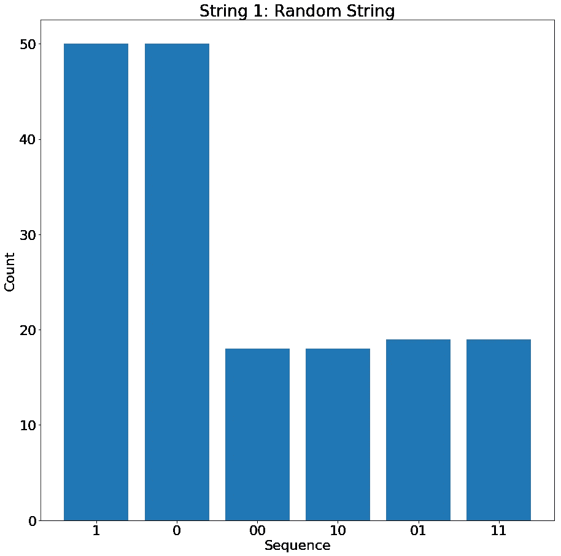
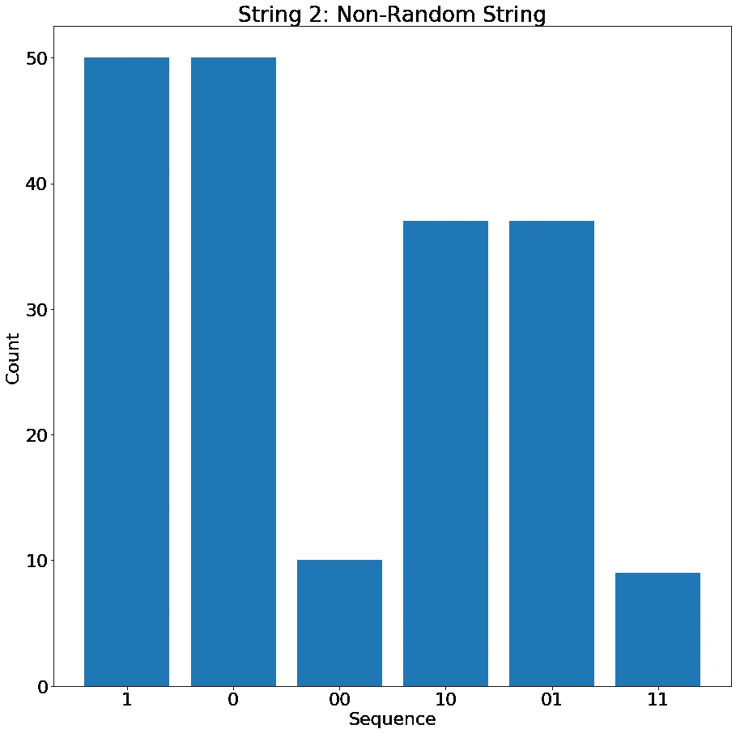
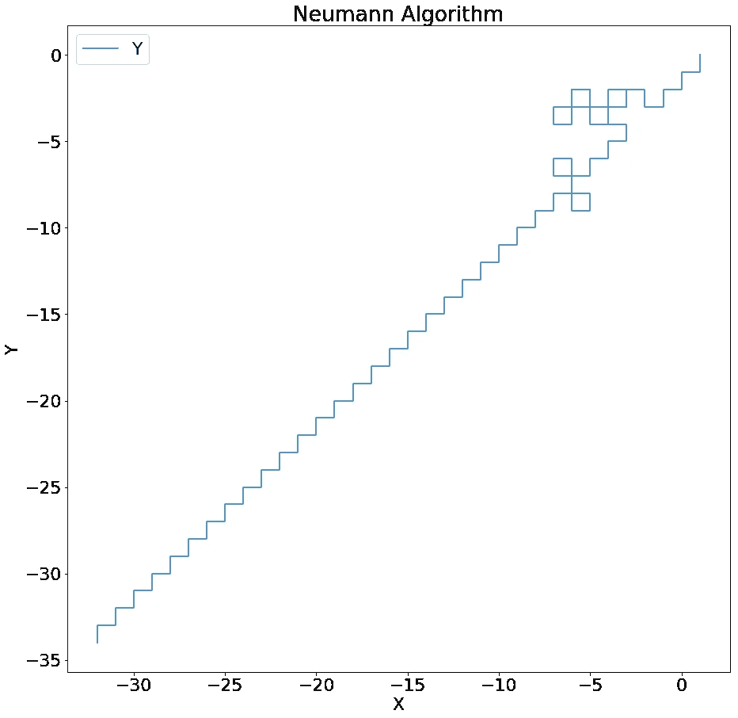
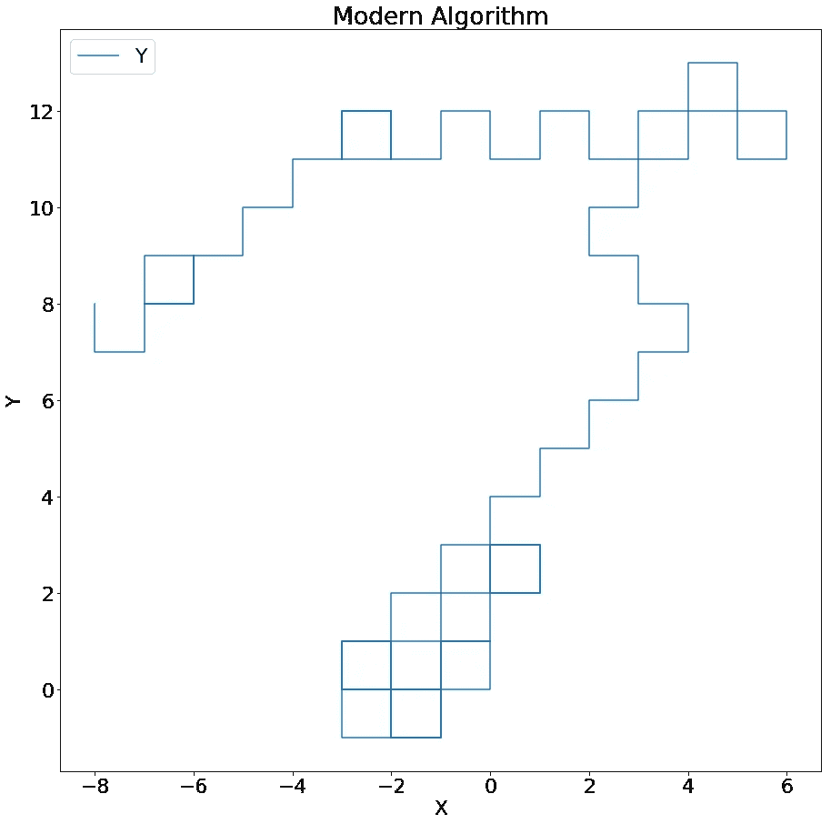

# 你能区分随机和非随机吗？

> 原文：<https://towardsdatascience.com/can-you-tell-random-and-non-random-apart-e83e31e8592e?source=collection_archive---------11----------------------->

Photo by [Alejandro Luengo](https://unsplash.com/@aluengo91?utm_source=medium&utm_medium=referral) on [Unsplash](https://unsplash.com?utm_source=medium&utm_medium=referral)

Apophenia 或“错误感知不相关事物之间的联系和意义的倾向”。事实证明，人类在区分随机事物和非随机事物方面相当垃圾。事实上，我们有时会看到不存在的模式，而对其他人来说，他们可以说某些东西是随机的，但没有科学的方法来解释它。当人们认为彩票号码“1 2 3 4 5 6”比“12 3 15 82 90”出现的可能性更小，或者如果一个数字序列出现了，它再次出现的可能性更小时，这种情况最常见。

不相信我？然后看看下面的问题。

我有两个由两个进程生成的二进制字符串:

1.  0001011000111110011111000000100101111110110111111111010111111011010000010001000100110000000001100001
2.  1010101001011011001011100001101010101111001000101001010010100101000101011011010101011101010101010101

如果我告诉你一个是随机过程产生的，另一个是有偏差的过程产生的，你能分辨出哪个是哪个吗？

## 如果我说有一个简单的方法可以找到答案，你会相信吗？

如果我告诉你有一个简单的方法来区分它们，并且是一个真实的方法，怎么样？

事实上，我把这个问题给了大约 60 名受过高等教育的顾问，最常见的答案是直觉估计，顶部的一个(字符串 1)似乎没有底部的那么结构化，所以字符串 2 是非随机的。

我的意思是，他们没有错，他们选择的是[、【频率稳定性】、](https://www.khanacademy.org/computing/computer-science/cryptography/crypt/v/frequency-stability)(这里还有另一个链接[、](https://en.wikipedia.org/wiki/Random_sequence))，但似乎很难说服一个只有经验的人做出决定。举个例子，如果他们说是字符串 1，而我说不是，我们怎么判断谁在撒谎呢？我们需要一些更有力的证据。这就是我之前忽略的这个简单方法发挥作用的地方。

如果你要计算字符串中 1 和 0 的数量，你会发现它们的数量都一样，所以告诉你的不多。然而，对于任何随机过程，其中的任何序列(例如“11”或“101”)与另一个相同长度的序列相比应该具有相等的概率。这是因为字符串中前面的数字不应该影响后面的数字。

如果我把不同的序列绘制成长度为 2 的图形，那么它们看起来像这样:

Sequence Counting of String 1 (Random) and String 2 (Non-Random)

如您所见，现在很明显哪个是非随机的，因为“10”和“01”比“11”和“00”更有可能。这使得字符串 2 具有一定的确定性，因此是可预测的，因为如果我知道字符串的前一个值，我就可以相当准确地预测下一个数字是什么。在这种情况下，如果我上一次得到 1，我有 80%的机会下一次得到 0，反之亦然。这导致了人们开始关注的结构。我发现这种计数序列的方法是检查你使用的任何随机数发生器的随机性并定量测量其随机性的好方法。

**注意:**对于任何感兴趣的人来说，这个非随机的字符串是我用食指快速敲击按键得到的，这就是为什么 1 跟在 0 后面，反之亦然。另一个字符串是使用 python 中的随机包制作的。

# 但是我们为什么要在乎呢？

基本上，在数据科学中，我们在模型中使用了许多随机数生成器。一个[随机森林](https://en.wikipedia.org/wiki/Random_forest)模型因我们使用随机性来生长树木而得名，一个 [K 均值聚类](https://en.wikipedia.org/wiki/K-means_clustering)算法将使用随机性来设置其初始位置。如果我们用来获取随机性的算法不是非常随机，那么我们可能会陷入数据的局部极小值，或者我们没有完全探索数据中的样本空间，从而错过问题的解决方案。

这种非随机性的影响是密码学中的一个大问题，因为任何可预测性都可以用来帮助解构事物，并给你关于事物如何被加密的信息。例如，在 Enigma 机器中，它可以将任何字母编码为另一个[字母，但它本身](https://en.wikipedia.org/wiki/Cryptanalysis_of_the_Enigma)，这有效地降低了加密的强度，因为与它可以是任何字母相比，解决方案样本空间显著减小。

我们在数据科学工作中使用的获取随机数的算法被称为伪随机数生成器(其他随机数生成器确实存在，但不在长期讨论的范围内)。数字是使用计算机内部的算法生成的，因为计算机天生具有确定性，所以生成器本身并不是随机的。我的意思是，它们可能最终会重复，或者如果您使用相同的起始数字开始，您总是会得到相同的数字序列(这就是在代码中设置种子的作用)，而在设计不良或基本的序列中，它们会重复或被卡住。

为了证明这一点，我们可以看看约翰·冯·诺依曼发明的第一个随机数生成算法([中平方方法](https://en.wikipedia.org/wiki/Middle-square_method))，他需要大量的随机数用于他的核研究。它的工作方式是:

1.  你取一个四位数的起始数(或者在前面填充零，直到长度为 4)
2.  把它和它自己相乘
3.  用零填充结果数字的前面，直到它是原始种子大小的两倍(8 位数)
4.  提取中间的四位数
5.  以此为种子生成下一个数字(转到步骤 2)

听起来很棒，对吧？正如我之前所说，一些生成器可能会卡住，我们可以看到，如果我将该算法用作一个[随机漫步](https://en.wikipedia.org/wiki/Random_walk)程序的输入，并将其与现代伪随机生成器进行比较。

Comparison of a modern and old random number generators used to generate random walks.

正如你所看到的，虽然诺依曼图开始很好，但最终卡住了，并重复自己，而另一个继续。因此，诺依曼算法只对比现代算法短得多的随机数序列有用。

我的观点是什么？

*   伪随机发生器不是真正随机的；然而，在我们使用它们的时间范围内，它们是随机出现的。在许多情况下，这已经足够好了
*   我们在数据科学工作中大量使用它们，即使您没有在代码中明确使用它们
*   设置种子将导致可重复的结果，这对设计机器学习算法非常有用，但要知道在生产中这可能是不可取的
*   设计一个好的伪随机发生器是很辛苦的！确保你用的是人们严格审查过的

如果在这之后你还和我在一起，那么我推荐你，你现在知道一点产生真正随机数的重要性(和困难)。