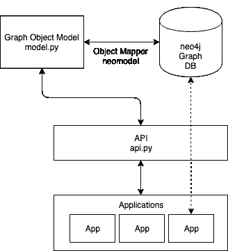
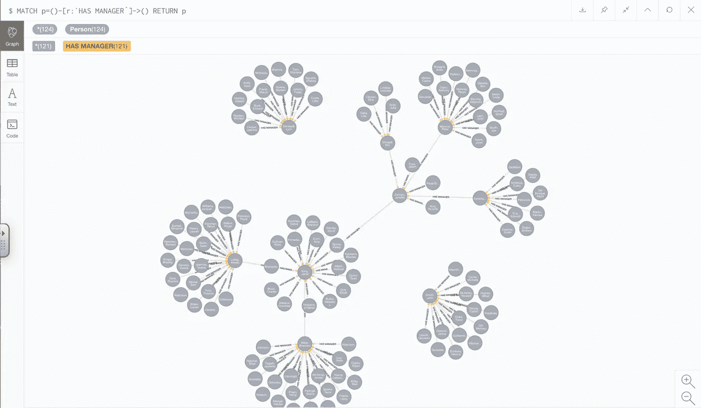
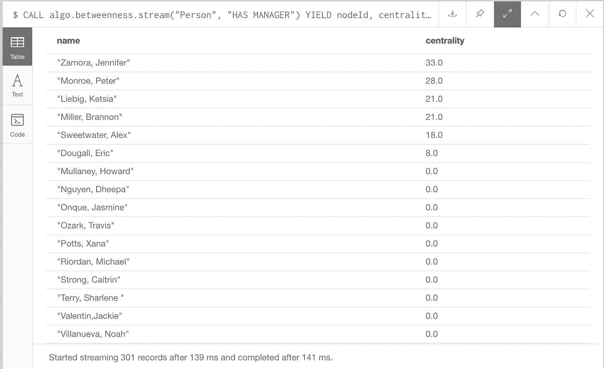
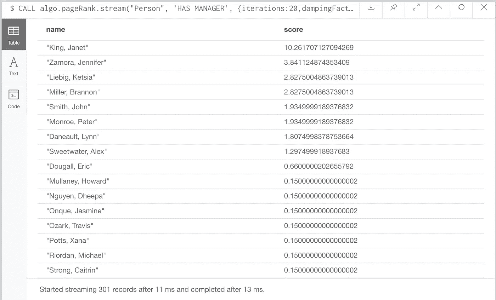
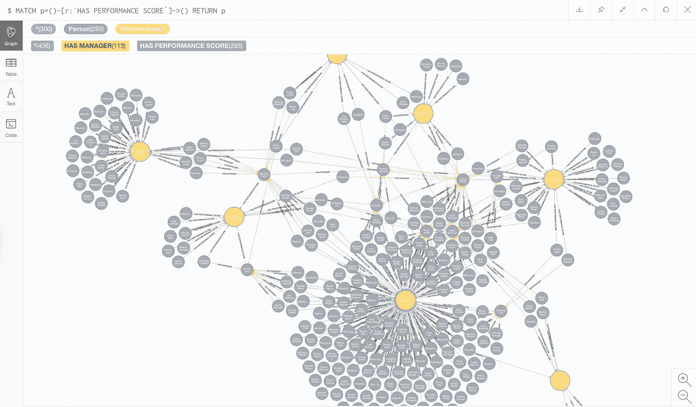
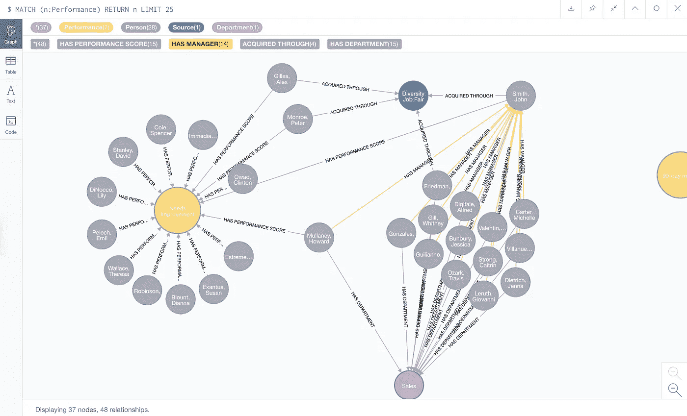
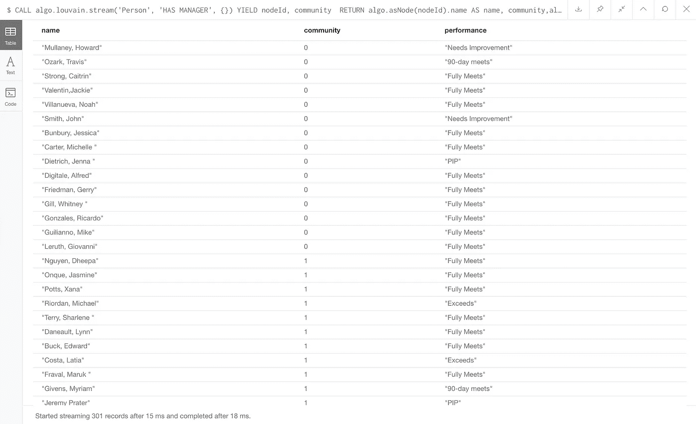
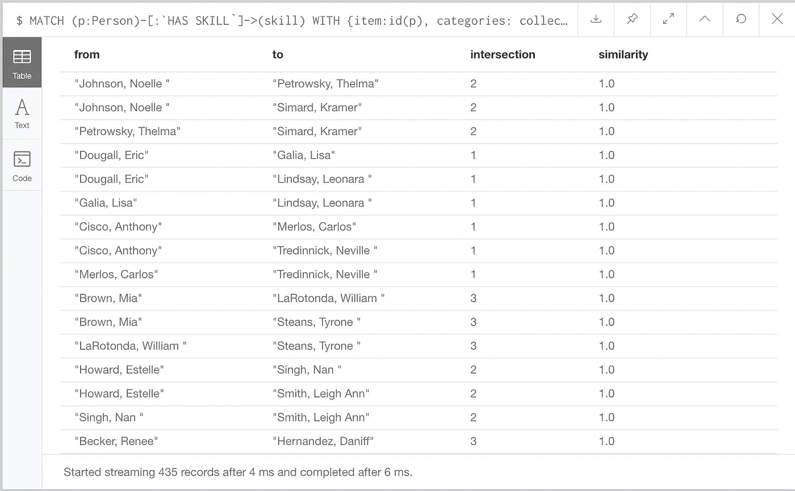

# 你的人员分析能做到这一点吗？

> 原文：<https://towardsdatascience.com/can-your-people-analytics-do-this-739afa714f1a?source=collection_archive---------23----------------------->

## 用图表技术建立组织智能能力


在之前的一篇文章中，我解释了图表技术在人员分析中的价值。你可以在这里阅读帖子:[https://towards data science . com/the-dawn-of-a-new-era-for-people-analytics-9a 748 f 7 FD C2](/the-dawn-of-a-new-era-for-people-analytics-9a748f7fdc2)。在这篇文章中，我将更深入地研究图表技术，并给出一个实际的演示，说明人物图表如何在三个关键领域帮助您的组织:*了解组织网络，解决表现不佳的问题*和*发展人才*。

图表技术特别适合人员数据应用程序，在这种应用程序中，底层数据高度关联，并且被建模和分析的关系一直在变化和发展。我将展示图表对于关联数据的探索性分析是如何的理想。我还将展示*社区检测*和*中心性*的*图算法*如何提供对组织网络的有价值的洞察——这种洞察很难从关系表结构中获得；沿着战略路线图将组织转变为*高级预测分析*。

我将使用新英格兰商学院提供的人力资源指标和分析数据；包含 300 条员工记录的合成数据集。我将只使用可用数据的子集来构建图表，包括员工姓名、经理、部门、技能以及如何获得该员工的参考。

# 构建图表

为了托管图形，我将使用 neo4j desktop，并且我将使用 neomodel 库和 API 构建一个 OGM(对象图形模型),以便应用程序与图形模型对象进行交互。在深入图表本身之前，我将首先更详细地解释 OGM 的概念，以及为什么我认为这种方法特别适合于构建“人物图表”的挑战。

## 对象图模型

当然，我也可以使用 cypher 直接创建图形，但是，花时间用我们的应用程序可以与之交互的数据库感知(Python)对象构建 OGM(对象图模型)有两个好处。首先，它允许我们随着时间的推移，随着新的数据点和关系的发现，添加到我们的模型定义中。我们可能从一开始就不知道每一个数据点，因此我们几乎肯定会想要添加到模型定义中，以使“人员情况”更加丰富。我们可以迭代地构建图表，不断地从业务用户那里得到反馈，这样我们就知道这个模型将会适合我们的目的。其次，应用程序将用来与图模型对象交互的 API(应用程序编程接口)将有助于确保用户通过查询获得的结果总是准确的。我们最终得到的解决方案架构如下所示:



Solution Architecture Diagram

为了保持图表简单，我不会使用 HR 数据集中提供的所有数据，而只是定义足够的节点和关系，以便我们可以生成一些有用的见解，并展示 neo4j 中的算法。OGM 将包含以下节点类型的类:

```
*Person* — the employee, with properties for name, department, manager, source and skills.*Source* — where the person was acquired from*Skill* — the skill the person has*Department* — the department the employee belongs to
```

..以及以下关系类型。

```
HAS SOURCE — Employee has a SourceHAS DEPARTMENT — Employee has a departmentHAS MANAGER — Employee has a managerHAS PERFORMANCE SCORE — Employee has a performance scoreHAS SKILL — Employee has a skill
```

## API

API(应用程序编程接口)是应用程序和图形之间的接口。它将有许多功能，用于为节点和关系创建对象，以及在图中搜索节点。当您构建您的图来启用社会企业应用程序和工具时，您将希望通过 API 使更多的功能对应用程序可用，以从图中获取各种不同的子图、节点、关系和属性。

现在我们已经定义了模型，并且在 neo4j 中有了一个图表实例，我们可以将注意力转向我们的图表将帮助我们回答的问题，以及我们可能希望构建到 API 中的各种查询。

# 了解人际网络

对 HCM(人力资本管理)越来越感兴趣的一个领域，也是敏捷交付的基础，是能够理解*组织网络*。事实上，个人和团队应该如何围绕项目集合变得容易得多，因为我们理解了我们的组织网络中人和团队之间的关系。

我们可以使用 neo4j 浏览器查询我们的图表，以查看带有关系 HAS MANAGER 的节点。这种对正式管理结构的可视化是有用的，但在我们的图表中，如果有其他类型的职业关系——项目中的同事、学员/导师等等——网络的画面会丰富得多。



matching person nodes against relationship HAS MANAGER in neo4j browser

## 谁让我们最脆弱？瓶颈在哪里？

中间中心性是发现组织网络中瓶颈、控制点和弱点的有效算法。该算法通过遍历每对节点并找到通过该节点的最短路径数来计算每个节点的中心性得分。假设最中心的节点——瓶颈或使网络最易受攻击的节点——沿着最短的路径。我们使用以下查询返回图中人员节点的介数中心性，其中具有最高中心性得分的个体可能被视为瓶颈或漏洞点:

```
CALL algo.betweenness.stream(“Person”, “HAS MANAGER”) YIELD nodeId, centrality RETURN algo.getNodeById(nodeId).name AS name, centrality ORDER BY centrality DESC
```



Betweenness Centrality of People Nodes

## 谁最有影响力？

PageRank 是一种流行的算法，用于了解网络中节点的整体影响。虽然中间中心性测量节点的直接影响，但是 PageRank 考虑节点的邻居以及它们的邻居的影响。我们使用以下查询返回图表中人员节点的 PageRank，其中得分最高的个人可能被认为是对整个组织具有最大影响力的人:

```
CALL algo.pageRank.stream(“Person”, ‘HAS MANAGER’, {iterations:20,dampingFactor:0.85}) YIELD nodeId, score RETURN algo.getNodeById(nodeId).name AS name, score ORDER BY score DESC
```



随着不同类型的关系(正式的、信息的、专业的和社会的)添加到图表中，人的形象变得更加丰富。我们可以找到一些问题的答案，比如，*一些团队比其他团队更有联系吗？*还有，*有些团队比其他团队内部联系更紧密吗？*如果我们也考虑图表中的其他节点，如绩效得分节点，我们可以确定*个人的连通性是否对绩效得分有影响。*使用关系模型获得这些问题的答案非常耗时，但是使用图表，获得这些问题的答案相对简单。

# 解决表现不佳的问题

在我们的图中，性能分数表示为节点和关系，因此我们可以执行一个查询来匹配具有性能分数的关系，以显示下面的子图。



neo4j 浏览器 GUI 对于节点数量有限的探索性分析非常有用。可以分解节点以实现进一步的遍历(或者您可以称之为“向下钻取”)，子图扩展如下所示:



解决表现不佳问题不仅仅是解决个人问题，也是解决一种文化问题，在这种文化中，不良的个人行为或态度创造了一种环境，在这种环境中，表现不尽如人意。*社区检测*的图形算法可以在这里应用，以检测显示负面特征的员工群体。

例如，我们可以使用 neo4j 内置的 *Louvain 模块化*算法来识别正式管理结构中的社区，并报告社区中每个人的绩效得分。查询看起来是这样的:

```
CALL algo.louvain.stream(‘Person’, ‘HAS MANAGER’, {})
YIELD nodeId, communityRETURN algo.asNode(nodeId).name AS name, community,algo.asNode(nodeId).performance AS performance
ORDER BY community;
```

我们在 neo4j 浏览器中获得的结果如下:



Louvain algorithm

看到正式管理结构(由 Louvain 确定的社区)内的绩效分数分布当然是有帮助的，但是当我们开始查看我们的模型中定义的某些类型的节点和关系时，这种方法更能揭示问题。例如，Louvain 模块性可以让我们识别同组或同组中表现不佳的社区，不仅可以查看管理关系，还可以查看管理结构之外的关系。这里的社区检测算法提供了一种工具来识别网络中的负面行为和不需要的文化。

# 管理人才

我们也可以使用社区检测算法来识别我们组织网络中更有才华的个人和团队。但是，由于技能和表现数据已经在我们的图表模型中，我们可以做更多的事情来培养人才。例如，我们可能希望确定具有相似技能的员工，以填补空缺或推荐具有相似背景和技能的员工认为有用的学习。Neo4j 允许我们使用一种叫做 *Jaccard Similarity* 的距离度量计算，几乎实时地提供图表中节点的相似性。通过下面的查询，我们可以确定具有相似技能的员工。

```
MATCH (p:Person)-[:`HAS SKILL`]->(skill)
WITH {item:id(p), categories: collect(id(skill))} as userData
WITH collect(userData) as data
CALL algo.similarity.jaccard.stream(data)
YIELD item1, item2, count1, count2, intersection, similarity
RETURN algo.asNode(item1).name AS from, algo.asNode(item2).name AS to, intersection, similarity
ORDER BY similarity DESC
```



将职位空缺定义为图表中的节点，以及职位空缺和员工在这些角色中需要的技能之间的关系，图表变得更加有用。通过使用 Jaccard 相似性，我们可以*向空缺职位推荐*名员工。然后，更进一步，我们可以定义课程的节点，以及这些课程和学习者获得的技能之间的关系，使我们能够*向员工推荐*课程。我们现在不仅将图表用于运营报告，还用于*预测分析；*我们从图表中获取的数据意味着我们可以*个性化*与员工的互动，并支持他们在学习和发展方面做出正确的选择。

# 接下来去哪里？

随着新的数据点和关系被发现并添加到图表模型中，我们从图表中获得的价值会提高。我已经展示了有限的图形和 neo4j 中可用的一些图形算法如何为解决 HCM 一些最具挑战性的领域提供有价值的见解。在 HCM，图表的潜力是巨大的。欲了解更多信息或查看人物图表，请通过 Twitter DM @jamesdhope 联系。

# 参考

[1] Cypher 查询语言用 Neo4j，[https://neo4j.com/developer/cypher-query-language/](https://neo4j.com/developer/cypher-query-language/)

[2] Jaccard 相似度[https://neo4j . com/docs/graph-algorithms/current/algorithms/Similarity-JAC card/](https://neo4j.com/docs/graph-algorithms/current/algorithms/similarity-jaccard/)

[3] Louvain，[https://neo4j . com/docs/graph-algorithms/current/algorithms/Louvain/](https://neo4j.com/docs/graph-algorithms/current/algorithms/louvain/)

[4]介数中心性，[https://neo4j . com/docs/graph-algorithms/current/algorithms/between ness-Centrality/](https://neo4j.com/docs/graph-algorithms/current/algorithms/betweenness-centrality/)

[5] PageRank，[https://neo4j . com/docs/graph-algorithms/current/algorithms/page-rank/](https://neo4j.com/docs/graph-algorithms/current/algorithms/page-rank/)