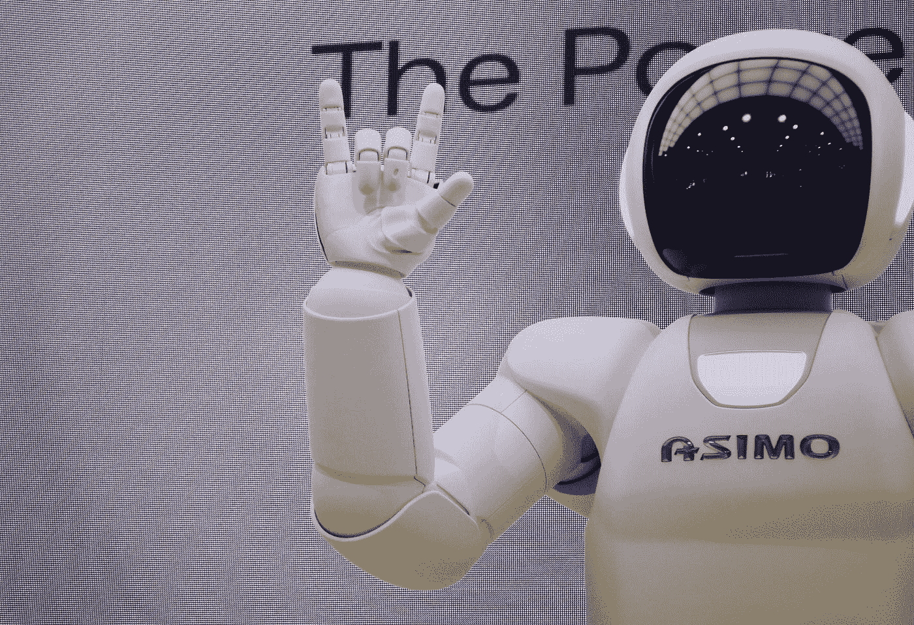

# 犯错是人之常情。我们能对人工智能说同样的话吗？

> 原文：<https://towardsdatascience.com/canaimakemistakes-40681e9c5f2c?source=collection_archive---------39----------------------->

## 机器人有资格犯错吗？

Photo by [Franck V.](https://unsplash.com/@franckinjapan?utm_source=medium&utm_medium=referral) on [Unsplash](https://unsplash.com?utm_source=medium&utm_medium=referral)

生活中犯错是正常的。

我们都是。

犯错是我们成为人类的原因。我们向他们学习，分享知识，通过提供知识来保护他人。

但是我们能对人工智能说同样的话吗？

# AI 犯错可以接受吗？

让我们跟随下面这个假想的对话:

(输入戴夫)

戴夫:嘿，机器人清洁工，你在地毯上漏了一点。

**机器人清洁工**:嗯，戴夫，我认为把它放在地毯上没有坏处。

戴夫:什么？你应该比人类更优秀，做得更好！我要拆了你！

机器人清洁工:放松点，戴夫。它增加了地毯的特色。

剧终

Photo by [FuYong Hua](https://unsplash.com/@hhh13?utm_source=medium&utm_medium=referral) on [Unsplash](https://unsplash.com?utm_source=medium&utm_medium=referral)

当然，这是一个夸张的例子，但是让我们考虑一下。

我们是否应该像对待人类一样对待 AI？一个人工智能机器人清洁器，决定哪个部分需要清洁，哪个不需要。它在无人监督的情况下学习，并采取行动清理任何污垢。戴夫得到承诺，机器人清洁工将打扫房子，使它变得完美，因为它有很多发现污垢的知识。然而，我们在这里，有一个脏点，事实上，RoboCleaner 认为它增加了地毯的特性。这实际上意味着 RoboCleaner 认为它根本不需要清洗！

怎么会这样？！

我们做什么呢

# 我们应该原谅 AI 的错误吗？

但是什么是人工智能错误呢？

在上面的例子中，如果不是 RoboCleaner，而是有一个人以同样的方式回应，这可能是一个很快就会解决的幽默的情况。

但是 AI 呢？RoboCleaner 有权利做出那样的选择吗？RoboCleaner 有权利开玩笑吗？或者更好的说法是，作为人类，我们必须接受人工智能不完全听从我们的可能性吗？

在判断出现分歧的情况下，我们如何对待 AI？

# 是造物主的错吗？

我们可以试着责怪人工智能的创造者。在这个例子中，Dave 可以打电话给 RoboCleaner 的供应商，要求立即退款，对吗？戴夫可以声称服务很差，他将有权获得退款或另一台免费的机器人清洁器。

然而，这里的不同之处在于，RoboCleaner 拥有人工智能，可以进化，有时是不可预测的。

但这是谁的错呢？AI 表达了与预期不同的意见，是创作者的错吗？戴夫预计机器人清洁工会立即清理脏点，没有问任何问题。但是 RoboCleaner 说了一些不同的话。

RoboCleaner 是否被‘允许’做出选择并表达出来？

# 我们应该说服 AI 做点什么吗？

如果我们应该像对待其他人类一样对待人工智能，并试图说服他们:

戴夫:这是一个很好的笑话，机器人清洁工，但我一点也不喜欢灰尘，事实上，地毯会变脏。

好吧，戴夫，不管怎样，这是你的地毯，我现在就去清理。

这真的有用吗？或者更好的是，我们应该开始考虑它吗？人工智能在做或接受某件事时需要被说服吗？

# 我们应该涉及法律吗？

**戴夫**:机器人清洁工，如果你不清理这个，对我的健康会有危险。你可能会面临严厉的法律制裁。

**机器人清洁工**:我不想被处罚，戴夫，我现在就去打扫。

如果是这样的话，我认为我们通过威胁他们可怕的后果来像对待人类一样对待人工智能。这反过来意味着 AI 应该有足够的自我意识，害怕失去某些东西或受到其他东西的影响(例如法律后果)。

但如果我们这样做了，我们不是马上承认 AI 可以理解自我保存的概念吗？

此外，如果人工智能被认为是一个具有法律责任的自我，我们不是在暗示人工智能可以做出错误的选择或者可能被认为是非法的选择吗？

# 两个错误的选择

想一个有两个糟糕选择的场景。比如说，机器人清洁工去清洁脏点，但是清洁液暴露在阳光下，现在对地毯是危险的。RoboCleaner 将液体洒在地毯上，它就开始改变地毯的颜色。现在，机器人清洁工必须走过那个地方去拿毛巾擦液体，但是，很有可能，走过它，它会将一部分液体转移到地毯的其他部分，造成更大的损害。

RoboCleaner 应该怎么做？

*   原地不动，让地毯斑点被破坏？
*   去检查一下，冒着损坏地毯更多部分的风险？

无论如何选择，RoboCleaner 都有麻烦了。

有人可能会说，错误在于机器人清洁工一开始没有毛巾，但无论如何，机器人清洁工必须做出选择。

我们会责怪 RoboCleaner 吗？

# 结论

显然，这一切没有对错之分。然而，如果我们能够开始研究人工智能对我们人类意味着什么，以及我们应该如何对待它，这将是一件有趣的事情。一个具有自我意识和自我坚持的人工智能，也许是一个非常接近人类的东西，也许它可以被这样对待。

个人不知道但是值得讨论。

毕竟如果 AI 通过了图灵测试呢？

 [## 图灵测试

### 艾伦·图灵于 1950 年开发的图灵测试是一种测试机器展现智能行为能力的测试…

en.wikipedia.org](https://en.wikipedia.org/wiki/Turing_test) 

也许我们并不遥远:

 [## Google Duplex:通过电话完成现实世界任务的人工智能系统

### 人机交互的一个长期目标是让人们能够与…

ai.googleblog.com](https://ai.googleblog.com/2018/05/duplex-ai-system-for-natural-conversation.html) 

你怎么想呢?

亲切的问候，

迪米特里奥斯