# Python 中的谨慎边缘检测——计算机视觉

> 原文：<https://towardsdatascience.com/canny-edge-detection-step-by-step-in-python-computer-vision-b49c3a2d8123?source=collection_archive---------0----------------------->

当谈到图像分类时，人眼具有在几毫秒内处理图像并确定其内容(标签)的惊人能力。太神奇了，不管是画图还是画图，它都能做到。

Drawing of a car (Left) — Real car picture (Right): The human eye is able to classify both.

今天的想法是建立一种算法，可以使用 Canny 边缘检测算法绘制出图片上任何对象的边缘。

首先，我们来描述一下什么是 Canny 边缘检测器:

> **Canny 边缘检测器**是一个[边缘检测](https://en.wikipedia.org/wiki/Edge_detection)算子，它使用多阶段[算法](https://en.wikipedia.org/wiki/Algorithm)来检测图像中的各种边缘。它是由约翰·f·坎尼于 1986 年发明的。Canny 还提出了边缘检测的计算理论，解释了这项技术的工作原理。(维基百科)

Canny 边缘检测算法由 5 个步骤组成:

1.  降噪；
2.  梯度计算；
3.  非最大抑制；
4.  双门槛；
5.  滞后边缘跟踪。

应用这些步骤后，您将能够获得以下结果:

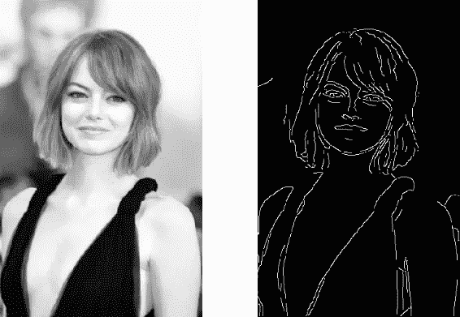

Original image on the left — Processed image on the right

最后要提到的重要一点是，该算法是基于灰度图片的。因此，先决条件是在执行上述步骤之前将图像转换为灰度。

# 噪声降低

由于场景背后涉及的数学主要基于导数(参见步骤 2:梯度计算)，边缘检测结果对图像噪声高度敏感。

去除图像上的噪声的一种方法是应用高斯模糊来平滑它。为此，图像卷积技术应用于高斯核(3x3、5x5、7x7 等)。内核大小取决于预期的模糊效果。基本上，内核越小，模糊越不明显。在我们的例子中，我们将使用一个 5 乘 5 高斯核。

大小为(2*k*+1)×(2*k*+1)的高斯滤波器内核的等式由下式给出:

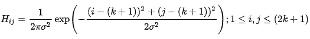

Gaussian filter kernel equation

生成高斯 5x5 内核的 Python 代码:

Gaussian Kernel function

应用高斯模糊后，我们得到以下结果:

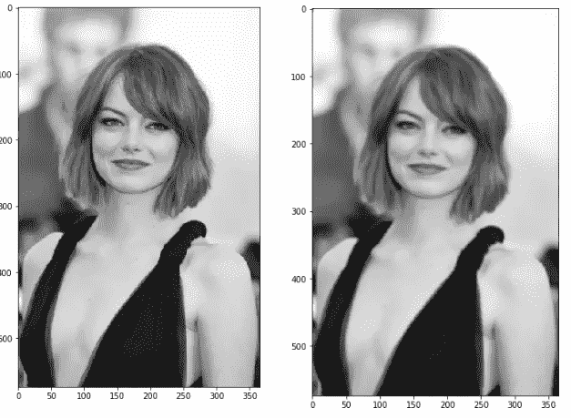

Original image (left) — Blurred image with a Gaussian filter (sigma=1.4 and kernel size of 5x5)

# 梯度计算

梯度计算步骤通过使用边缘检测算子计算图像的梯度来检测边缘强度和方向。

边缘对应于像素强度的变化。要检测它，最简单的方法是应用在两个方向上突出这种强度变化的过滤器:水平(x)和垂直(y)

当图像平滑后，计算导数 ***Ix*** 和***Iy***w . r . t .***x***和 ***y*** 。可以通过将 ***I*** 分别与索贝尔核 ***Kx*** 和 ***Ky*** 进行卷积来实现:

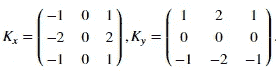

Sobel filters for both direction (horizontal and vertical)

然后，梯度的幅度 ***G*** 和斜率 ***θ*** 计算如下:

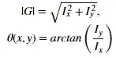

Gradient intensity and Edge direction

下面是 Sobel 滤波器如何应用于图像，以及如何获得强度和边缘方向矩阵:

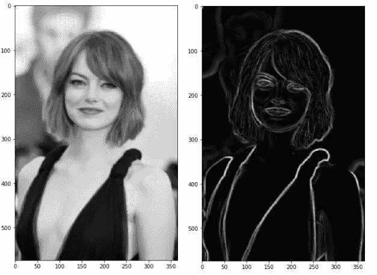

Blurred image (left) — Gradient intensity (right)

结果和预想的差不多，但是我们可以看到有的边比较厚，有的边比较薄。非最大抑制步骤将帮助我们减轻厚的。

此外，梯度强度水平在 0 和 255 之间，这是不均匀的。最终结果上的边缘应该具有相同的强度(即白色像素= 255)。

# 非最大抑制

理想情况下，最终图像的边缘应该很细。因此，我们必须执行非最大值抑制来细化边缘。

原理很简单:该算法遍历梯度强度矩阵上的所有点，找到边缘方向上具有最大值的像素。

让我们举一个简单的例子:

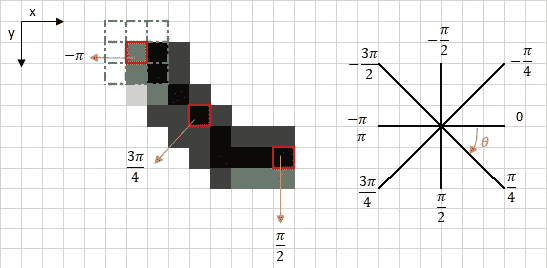

上图左上角的红框代表正在处理的梯度强度矩阵的强度像素。相应的边方向由角度为-π弧度(+/-180 度)的橙色箭头表示。

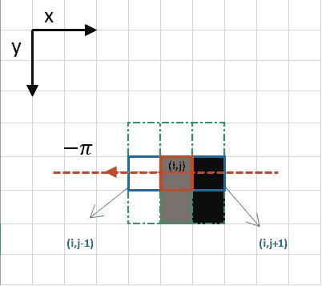

Focus on the upper left corner red box pixel

边缘方向是橙色虚线(从左到右水平)。该算法的目的是检查相同方向上的像素是否比正在处理的像素更强或更弱。上例中，正在处理的是像素 ***(i，j)*** ，同一方向的像素用蓝色突出显示 ***(i，j-1)******(I，j+1)。*** 如果这两个像素中的一个比正在处理的像素更强烈，那么只保留更强烈的一个。像素 ***(i，j-1)*** 似乎更强烈，因为是白色(值 255)。因此，当前像素 ***(i，j)*** 的亮度值被设置为 0。如果在边缘方向上没有像素具有更强的值，则保持当前像素的值。

现在让我们关注另一个例子:

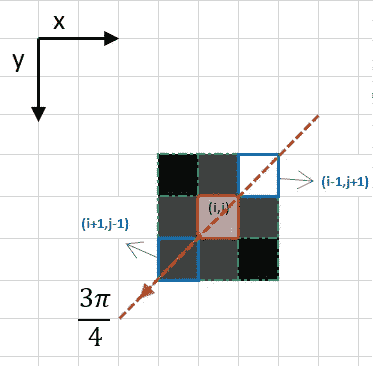

在这种情况下，方向是橙色虚线对角线。所以这个方向最强烈的像素就是像素 ***(i-1，j+1)。***

让我们总结一下。每个像素有两个主要标准(以弧度表示的边缘方向和像素强度(0-255 之间))。基于这些输入，非最大抑制步骤为:

*   创建与原始梯度强度矩阵大小相同的初始化为 0 的矩阵；
*   基于来自角度矩阵的角度值识别边缘方向；
*   检查相同方向上的像素是否比当前处理的像素具有更高的亮度；
*   返回用非最大值抑制算法处理的图像。

结果是相同的图像具有更薄的边缘。然而，我们仍然可以注意到一些关于边缘强度的变化:一些像素似乎比其他像素更亮，我们将尝试用最后两个步骤来弥补这个缺点。

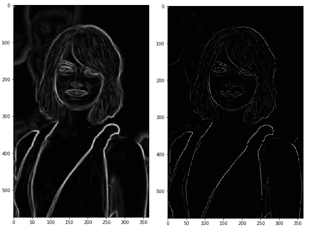

Result of the non-max suppression.

# 双阈值

双阈值步骤旨在识别 3 种像素:强、弱和不相关:

*   强像素是具有如此高强度的像素，以至于我们确信它们对最终边缘有贡献。
*   弱像素是强度值不足以被认为是强像素，但又不足以被认为与边缘检测无关的像素。
*   其他像素被认为与边缘不相关。

现在您可以看到双阈值的含义了:

*   高阈值用于识别强像素(强度高于高阈值)
*   低阈值用于识别不相关的像素(强度低于低阈值)
*   强度在两个阈值之间的所有像素都被标记为弱，滞后机制(下一步)将帮助我们识别哪些像素可以被认为是强的，哪些像素被认为是不相关的。

该步骤的结果是只有 2 个像素强度值(强和弱)的图像:

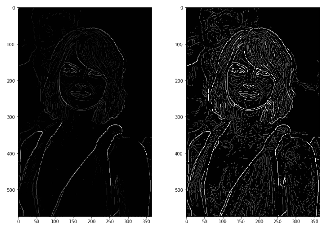

Non-Max Suppression image (left) — Threshold result (right): weak pixels in gray and strong ones in white.

# 滞后边缘跟踪

基于阈值结果，滞后包括当且仅当正被处理的像素周围的至少一个像素是强像素时，将弱像素变换为强像素，如下所述:

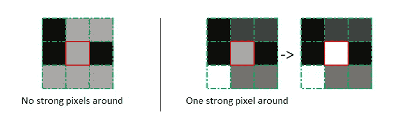

Hysteresis function

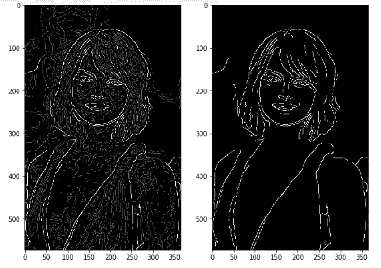

Results of hysteresis process

使用的所有代码都可以在下面的 Git 存储库中找到

 [## FienSoP/canny_edge_detector

### Canny 边缘检测器库。在 GitHub 上创建一个帐户，为 FienSoP/canny_edge_detector 的开发做出贡献。

github.com](https://github.com/FienSoP/canny_edge_detector) 

## 文献学

*   [https://opencv-python-tutro als . readthedocs . io/en/latest/py _ tutorials/py _ imgproc/py _ canny/py _ canny . html](https://opencv-python-tutroals.readthedocs.io/en/latest/py_tutorials/py_imgproc/py_canny/py_canny.html)
*   https://homepages.inf.ed.ac.uk/rbf/HIPR2/canny.htm
*   【http://justin-liang.com/tutorials/canny/ 
*   [https://en.wikipedia.org/wiki/Canny_edge_detector](https://en.wikipedia.org/wiki/Canny_edge_detector)