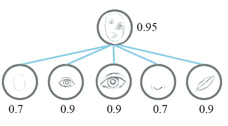

# 胶囊网络:新的深度学习网络

> 原文：<https://towardsdatascience.com/capsule-networks-the-new-deep-learning-network-bd917e6818e8?source=collection_archive---------1----------------------->

## 理解和使用胶囊网络的指南和介绍。

卷积网络在深度学习领域取得了巨大的成功，它们是深度学习现在如此受欢迎的主要原因！它们非常成功，但是它们的基本架构存在缺陷，导致它们不能很好地完成某些任务。

CNN 检测图像中的特征，并学习如何利用这些信息识别物体。靠近起点的层检测非常简单的特征，如边缘，而更深的层可以检测更复杂的特征，如眼睛、鼻子或整张脸。然后，它使用所有这些它已经学会的特征，做出最终的预测。这就是这个系统的缺陷所在——没有在 CNN 的任何地方使用的**空间信息**,并且用于连接层的池功能**真的真的效率很低吗**。

> 卷积神经网络中使用的池操作是一个很大的错误，它如此有效的事实是一场灾难。[来源](https://www.reddit.com/r/MachineLearning/comments/2lmo0l/ama_geoffrey_hinton/clyj4jv)。

## 最大池化

在最大池化的过程中，许多重要信息丢失，因为只有最活跃的神经元被选择移动到下一层。这种操作是有价值的空间信息在层间丢失的原因。为了解决这个问题，Hinton 建议我们使用一个叫做“协议路由”的过程。这意味着较低级别的特征(手指、眼睛、嘴)将只被发送到与其内容相匹配的较高级别的层。如果它包含的特征类似于眼睛或嘴巴，它将被发送到“脸”，或者如果它包含手指和手掌，它将被发送到“手”。这一完整的解决方案将空间信息编码为要素，同时还使用动态路由(协议路由)，由深度学习领域最有影响力的人之一 Geoffrey Hinton 在 NIPS 2017 上展示；**胶囊网络。**

## 胶囊

当我们在计算机图形学中通过**渲染**来构造对象时，我们必须指定并提供某种几何信息，告诉计算机**在哪里**绘制对象、该对象的**比例**、其**角度、**以及其他空间信息。这些信息都在屏幕上显示为一个对象。但是，如果我们仅仅通过观察图像中的一个物体就能提取这些信息，那会怎么样呢？这是胶囊网络所基于的过程，**逆渲染。**

让我们看看**胶囊**以及它们如何着手解决提供空间信息的问题。

当我们看到 CNN 背后的一些逻辑时，我们开始注意到它的架构的失败之处。看看这张照片。

它看起来不太适合一张脸，尽管它拥有组成一张脸的所有必要成分。我们知道这不是人脸应该有的样子，但是因为 CNN 只在图像中寻找特征，而不注意他们的**姿势**，所以他们很难注意到那张脸和真实脸之间的区别。

How a CNN would classify this image. [Source](/a-simple-and-intuitive-explanation-of-hintons-capsule-networks-b59792ad46b1).

胶囊网络如何解决这个问题是通过实现神经元的**组来编码空间信息以及物体存在的概率。**胶囊向量的长度是特征存在于图像中的概率，向量的方向将代表其 [**姿态信息**](https://en.wikipedia.org/wiki/Pose_(computer_vision)) **。**

> 胶囊是一组神经元，其活动向量表示诸如对象或对象部分的特定类型的实体的实例化参数。我们用活动向量的长度来表示实体存在的概率，用它的方向来表示实例化参数。— [来源](https://arxiv.org/abs/1710.09829)。

在设计和渲染等计算机图形应用程序中，通常通过给定某种参数来创建对象，对象将根据这些参数进行渲染。然而，在 capsules 网络中，情况正好相反，网络学习如何**反向渲染**图像；观察一幅图像，并试图预测它的实例化参数是什么。

它通过尝试重现它认为它检测到的对象并将其与来自训练数据的标记示例进行比较，来学习如何预测这一点。通过这样做，它在预测实例化参数方面变得越来越好。Geoffrey Hinton 的论文****提出了使用两个损失函数，而不是只有一个。****

****这背后的主要思想是在胶囊之间产生**等变。**这意味着在图像中移动一个特征也会改变它在胶囊中的矢量表示，但不会改变它存在的概率。在较低水平的胶囊检测到特征之后，该信息被向上发送到具有良好拟合的较高水平的胶囊。****

********

****How a Capsule Network would classify this face. [Source](/a-simple-and-intuitive-explanation-of-hintons-capsule-networks-b59792ad46b1).****

****如图所示，特征的所有姿态参数用于确定最终结果。****

# ****胶囊内的操作****

****您可能已经知道，神经网络中的传统神经元执行以下标量操作:****

1.  ****投入的加权****
2.  ****加权输入的总和****
3.  ****非线性****

******这些操作在胶囊内略有变化，执行如下:******

1.  ****输入向量与权重矩阵的矩阵乘法。这编码了图像中低层特征和高层特征之间非常重要的空间关系。****
2.  ****加权输入向量。这些权重决定了当前胶囊将把它的输出发送到哪个更高级别的胶囊。这是通过**动态路由、**过程完成的，稍后我会详细介绍。****
3.  ****加权输入向量之和。(这个没什么特别的)****
4.  ****使用“挤压”函数的非线性。该函数获取一个向量，并将其“挤压”为最大长度为 1，最小长度为 0，同时保持其方向。****

# ****胶囊之间的动态路由****

********

****Process of Dynamic Routing. [Source.](https://www.scoop.it/t/data-science-58/p/4090092973/2017/12/03/uncovering-the-intuition-behind-capsule-networks-and-inverse-graphics-part-i)****

****在这个路由过程中，较低级别的胶囊将其输入发送到与其输入“一致”的较高级别的胶囊。对于可以路由到的每个较高的胶囊，较低的胶囊通过将其自己的输出乘以权重矩阵来计算预测向量。如果预测向量与可能较高的胶囊的输出具有大的标量积，则存在自上而下的反馈，其具有增加该高级胶囊的耦合系数并降低其他胶囊的耦合系数的效果。****

# ****MNIST 胶囊网络体系结构****

********

****CapsNet Architecture. [Source](https://arxiv.org/pdf/1710.09829.pdf).****

## ****编码器****

****编码器接收图像输入，并学习如何将其表示为 16 维向量，该向量包含渲染图像所需的所有信息。****

1.  ****Conv 图层-检测随后由胶囊分析的要素。如论文中所提出的，包含 256 个大小为 9x9x1 的内核。****
2.  ****初级(较低的)胶囊层——这一层是我之前描述的较低水平的胶囊层。它包含 32 个不同的胶囊，每个胶囊将第八个 9×9×256 卷积核应用于前一卷积层的输出，并产生 4D 矢量输出。****
3.  ****数字(更高)胶囊层-该层是主胶囊将路由到的更高级别的胶囊层(使用动态路由)。该层输出包含重建对象所需的所有实例化参数的 16D 向量。****

## ****解码器****

********

****Decoder Architecture. [Source](https://software.intel.com/en-us/articles/understanding-capsule-network-architecture).****

****解码器从数字胶囊中提取 16D 向量，并学习如何解码其正在检测的对象的图像中给出的实例化参数。解码器与欧几里德距离损失函数一起使用，以确定重建的特征与训练它的实际特征相比有多相似。这确保了胶囊只保留有利于识别其向量中的数字的信息。解码器是一个非常简单的前馈神经网络，如下所述。****

1.  ****全连接(密集)第 1 层****
2.  ****全连接(密集)第 2 层****
3.  ****完全连接(密集)的第 3 层—包含 10 个类的最终输出****

## ****为什么我们不用胶囊网络呢？****

****虽然 CapsNet 在 MNIST 等简单数据集上取得了一流的性能，但它在 CIFAR-10 或 Imagenet 等数据集上可能存在的更复杂的数据上却举步维艰。这是因为在图像中发现的过量信息从胶囊中释放出来。****

****胶囊网仍处于研究和开发阶段，还不足以可靠地用于商业任务，因为很少有证实的结果。然而，这个概念是合理的，这个领域的更多进展可能会导致深度学习图像识别的胶囊网络的标准化。****

******如果你喜欢我的文章或者学到了新东西，请务必:******

*   ****在 [LinkedIn](https://www.linkedin.com/in/aryan-misra/) 上与我联系。****
*   ****给我发一些反馈和评论(aryanmisra@outlook.com)。****
*   ****查看提出这个想法的[原始论文](https://arxiv.org/pdf/1710.09829.pdf)。****