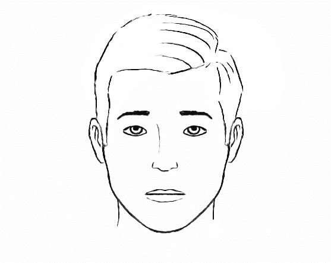
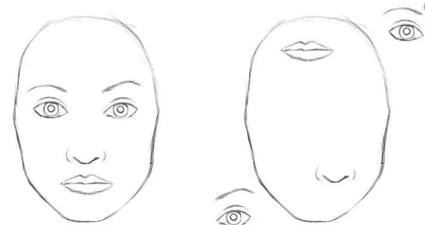
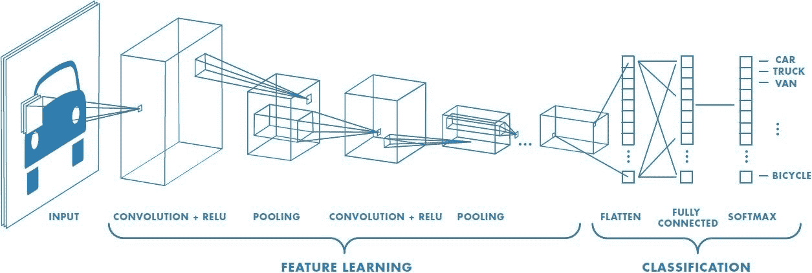
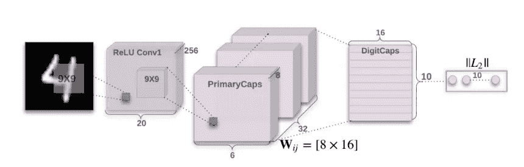
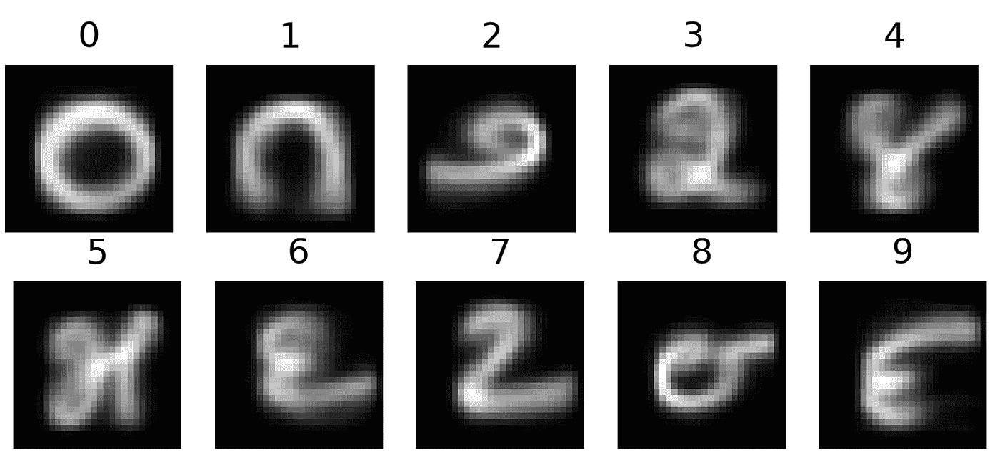
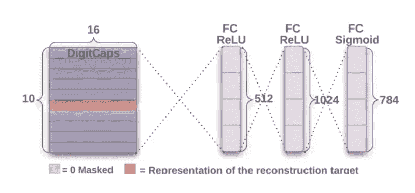
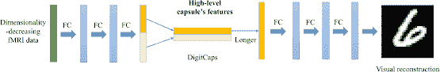
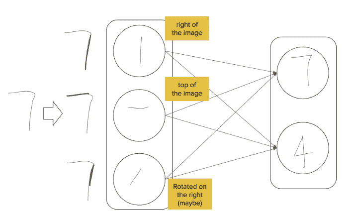
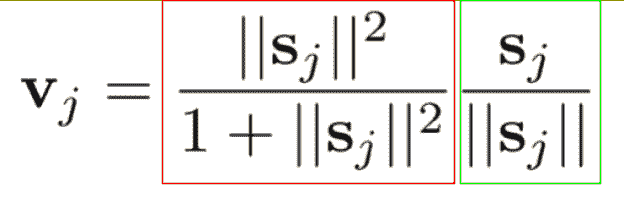
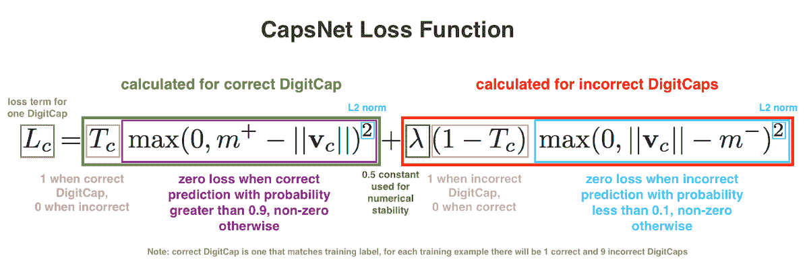

# 胶囊神经网络——自动驾驶汽车的未来

> 原文：<https://towardsdatascience.com/capsule-neural-networks-the-future-for-autonomous-vehicles-f97bc3f7918?source=collection_archive---------10----------------------->

让我们面对现实吧。我们都不擅长拼写(也许你是个例外)🤷).希尔？他们的？确定吗？肯定吗？

无论哪种情况，我们的大脑仍然明白这是单词*他们的*和*肯定是*。

让我们试着以人脸为例。

A normal face

如果我开始把嘴移到前额，眼睛移到下巴，会怎么样？这可能更难分辨，但它仍然是一张**脸**。

A deformed face

卷积神经网络(CNN)通过理解面部的不同特征，在分类图像(如上图)方面做得很好。他们通过检查成千上万的样本图像并从错误中学习来做到这一点。靠近起点的卷积层有助于检测基本特征(即边缘),网络中较深的层有助于检测更详细的特征(即眼睛、嘴等)。)

CNN architecture layout

然而，您可能想知道，*网络如何有效地处理所有这些数据？*

## 最大池层数

每个卷积层之间存在一个 **max-pooling 层。**这些层从每个卷积层中取出最活跃的神经元，并将它们传递给下一个卷积层。这意味着**不太活跃的神经元被丢弃。**丢弃这些神经元是数据在网络中传输时空间信息丢失的原因。

具有讽刺意味的是，max-pooling 层运行得如此之好。通过去除神经元，你可能会认为准确性会下降，但这种做法非常有效，杰弗里·辛顿甚至说，

> *“卷积神经网络中使用的池化操作是一个大错误，它如此有效的事实是一场灾难”*杰弗里·辛顿

这也提出了 CNN 的另一个问题。每个隐藏层中发生了什么，这些层如何相互通信？

我们需要另一种方法，可以帮助我们执行 CNN 的功能，同时改进架构以实现更强大的分类。这就是胶囊神经网络发挥作用的地方。

# 它们是如何工作的？

与标准神经网络中的神经元相比，胶囊网络使用胶囊。胶囊封装了输出向量的图像的所有重要信息。与输出标量的神经元相比，胶囊具有跟踪特征方向的能力。因此，如果我们开始改变特征的位置，向量的值将保持不变，但是方向将指向位置的变化。

## 赞成的意见

> 1.在较小的数据集(如 MNIST)上表现非常好
> 
> 2.更容易解读更强健的图像
> 
> 3.保存**所有**信息(姿势、纹理、位置等。)

## 骗局

> 1.不优于大型数据集(即 CIFAR10)
> 
> 2.协议路由算法需要更多的计算时间

# 建筑:

胶囊网络(CapsNet)包含一个**编码器**和一个**解码器**。编码器和解码器总共包含 6 层。

Encoder Architecture

前三层是编码器，负责获取输入图像并将其转换为 16 维向量。创建顶点网编码器的三个层如下:

> 1.卷积神经网络
> 
> 2.初级资本网络
> 
> 3.DigitCaps 网络

第一层负责**提取图像的基本特征**(即找出组成数字 4 的笔画)。

第二层(PrimaryCaps)负责获取这些基本特征和**寻找它们之间更详细的模式**(即每个笔画之间的空间关系)。该图层中胶囊的数量因数据集而异，但对于 MNIST 数据集，有 32 个胶囊来维护最相关的信息。

就像第二层一样，第三层(DigitCaps 层)中的胶囊数量也不同。特别是，对于 MNIST 数据集，我们有 10 个胶囊；每个手指一个胶囊。

MNIST handwritten digits

为了确定初级胶囊中的哪个胶囊进入数字胶囊，较低级胶囊(初级胶囊)的重量必须与较高级胶囊(数字胶囊)的重量一致。(*我们稍后将对此进行更多讨论*。)

Decoder Architecture

在编码器的末端，我们得到的是一个 16 维向量。这被传递给解码器。**解码器**有三个**全连接层**。解码器的主要工作是获取 16 维向量，**尝试使用 ***数据*** 从头开始重建图像**。这是令人惊讶的，因为它通过基于其 ***自己的*** 知识生成预测，使网络更加健壮。

Decoder architecture breakdown

# 组件:

考虑到这一点，胶囊神经网络中有四个主要计算。

> 1.矩阵乘法
> 
> 2.标量加权
> 
> 3.动态路由算法
> 
> 4.矢量至矢量非线性

## 矩阵乘法。

我们在从第一层传递到第二层的信息之间执行权重矩阵乘法，以编码理解空间关系的信息。该编码信息代表分类正确标签的概率。

## 标量加权。

还记得我说过，低等级胶囊的重量必须与高等级一致吗？在这一阶段，较低层的胶囊调整其重量，以便与较高层的重量相匹配。

你可能想知道:较高级别的胶囊正在接收一堆输入，*它们如何选择正确的较低级别的胶囊*？

嗯，更高级别的胶囊绘制出权重的分布，并接受最大的分布/集群来传递。

他们是如何交流的？

## 动态路由算法。

使用动态路由算法，我们可以让各层相互通信。该算法集中于“**通过协议**路由”的思想，这就是我们前面谈到的使胶囊的重量/内容一致。动态路由算法允许我们更好地在网络的各层之间传递数据，这在理论上会增加时间和空间的复杂性。在实践中，我们使用三次路由迭代，因为过度迭代会导致过拟合和较差的性能。

Contents of lower capsules agreeing with higher-level capsules

## 矢量至矢量非线性。

在执行动态路由算法并将胶囊传递到正确的位置并重建图像后，最后一步需要的是**压缩信息**。我们需要某种方法将所有这些信息浓缩成我们可以重复使用的东西。

我们如何做到这一点是使用一个**挤压功能**。

挤压函数采用最终的向量大小，并将长度压缩到小于 1 的大小，同时仍然保持向量的方向。以下是挤压函数的数学表示:

公式的左侧(红框)执行我们之前讨论的缩放。并且，右侧(绿色框)为挤压向量指定一个单位长度。

**快速回顾:**这个矢量输出(v_j)表示胶囊识别给定特征的概率。

# 损失函数:

就像传统的网络一样，网络从错误中学习。我们可以通过如下所示的损失函数来表示这种错误:

Breakdown of CapsNet loss function [[Source](https://pechyonkin.me/capsules-4/)]

如果网络以 0.9 或更高的概率预测正确的类别，则此损失函数将返回 0。否则，如果置信度小于 0.9，损失函数将返回 0 到 1 之间的数字。

# 外卖食品

*   与最大池层相比，胶囊网络**保留了图像中的大部分信息**
*   **动态路由算法**允许网络中的各层通过**协议路由相互通信。**
*   胶囊网络仍处于开发的早期阶段
*   胶囊网络**在处理大型数据集时性能不足**

# 如果您喜欢我的文章或学到了新东西，请确保:

*   查看我的 [**网站**](https://wlawt.com/) ！
*   通过 [**LinkedIn**](https://www.linkedin.com/in/william-t-law/) 与我联系
*   发送一些反馈(我总是乐于接受建议！)