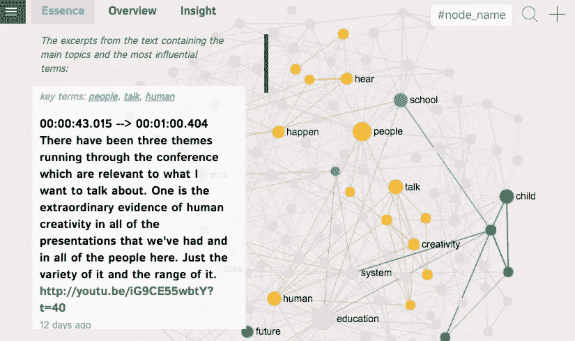

# 捕捉任何视频的精髓:将其字幕可视化为图形

> 原文：<https://towardsdatascience.com/capture-the-essence-of-any-video-visualize-its-subtitles-as-a-graph-5ce565d1820c?source=collection_archive---------25----------------------->

## 如何使用文本网络分析来可视化视频字幕，确定主要主题，到达叙事中最相关的部分，并产生对主题的洞察力。

如果你像我一样喜欢学习新东西，你可能会发现自己经常看视频。在进行更深入的研究之前，这是对一个主题进行概述的好方法。唯一的问题是时间。我喜欢 1.5 倍的速度功能，但它仍然浪费了很多时间，并让我接触到了我不一定需要的信息。

这里有一个解决方案:

1.  将你的字幕视频想象成网络图
2.  确定**最相关的话题**
3.  **提取** **视频中仅包含这些主题的部分**
4.  使用图表**生成洞察力**

保证你在 3 分钟内对这个主题有一个很好的概述。如果你想看得更深，你可以以你喜欢的速度观看剩下的部分(尽管以一种更有效的方式，因为你已经知道了主要的主题)。

TL:DR — visual walkthrough of the process using [InfraNodus.Com](http://infranodus.com)

感兴趣吗？让我演示一下它是如何工作的…

# 步骤 1:网络棱镜——获得视频内容的概述

首先，你需要找到一个你感兴趣的视频。它可以是 MOOC 讲座、TED 演讲或 YouTube 视频。在下面的例子中，我将使用最受欢迎的 [TED 演讲之一，Ken Robinson 关于“学校如何扼杀创造力”](https://www.youtube.com/watch?v=iG9CE55wbtY)。

然后你需要获得这个视频的字幕:这些可以作为一个文件下载，或者直接从 YouTube 上提取(因为它提供了许多不同语言的大多数上传的自动字幕)。

然后可以使用**文本到网络转换算法将字幕可视化。**在这个例子中，我使用了 [InfraNodus 开源软件](http://infranodus.com)，它可以自动从任何 YouTube 视频中提取字幕文件，并将其可视化为网络图。如果您的视频不在 YouTube 上，您可以简单地将字幕从文件中复制并粘贴到 InfraNodus 中的一个新图表中。

这是结果([点击此处查看互动版](https://infranodus.com/ted/iG9CE55wbtY)):

Automatic import of the Ken Robinson talk using the [InfraNodus YouTube Import](https://infranodus.com/import/youtube) feature. You can see an interactive version of this graph on [https://infranodus.com/ted/iG9CE55wbtY](https://infranodus.com/ted/iG9CE55wbtY)

单词被标准化(使用词条化算法)，停用词被排除(这些可以被调整)，主要的主题聚类被识别(用不同的颜色指示)，将这些聚类链接在一起的单词在图上被显示得更大(具有更高介数中心性的节点)。因此，我们可以在几秒钟内很好地展示视频内容:

我们可以看到**主要话题**有:
*教育—制度—观念*
*人—说话—人情*
*听到—发生—女人*
*孩子—舞蹈—未来*

本次演讲中最有影响力的**词汇**是
*教育—人—年—演讲*

这给了我们一个关于演讲内容的很好的想法。

# 第二步:非线性观看——找到视频中最有趣的部分

现在我们有了一个概述，我们可能想要有一个更精确的想法，并把我们提取的这些关键词和主题放在上下文中。

最好的方法是**选择我们感兴趣的话题或关键词**，例如:
*教育|创造力|重要*

并且**在字幕**上执行搜索，以找到包含这些术语的最高浓度的文本部分。如果你点击 InfraNodus 中的这些节点，你将能够找到文本的相关部分:

Click on the nodes you’re interested in on the graph to see the excerpt of video. (Use the interactive version on [https://infranodus.com/ted/iG9CE55wbtY](https://infranodus.com/ted/iG9CE55wbtY) to try it out)

在这张图上，我看到了视频字幕文件的摘录，其中演讲者只是在谈论“教育”、“创造力”和“重要”。

点击摘录中的视频链接，你会直接看到肯·罗宾逊谈论这些话题的视频部分(时间码):[http://youtu.be/iG9CE55wbtY?t=185](http://youtu.be/iG9CE55wbtY?t=185)

然后，您可以选择视频的其他部分，例如:

Select the topic you’re interested in on the graph, find the part of the video where Ken Robinson is talking about the importance of using dance in education, then click on the link to see him speak about this directly: [http://youtu.be/iG9CE55wbtY?t=550](http://youtu.be/iG9CE55wbtY?t=550)

这提供了一种以非线性方式观看视频的新方法，专注于重要的概念，这在信息过载的情况下可以节省大量时间。

# 第三步:智能浏览——获取视频的要点

如果您不喜欢与图表互动，您也可以**进入视频最重要的部分**，前提是您为每个主题选择了主要词汇最集中的主题。

在 InfraNodus 中，这个特性是通过 Essence 选项卡实现的，本质上是一个汇总工具。它按照时间顺序排列包含主要主题的摘录，因此在您观看其中的 4 个(每个 15 秒)后，您可以对视频内容有一个很好的了解。

Too lazy to navigate? Click the “Essence” tab and see the most important stuff: [https://infranodus.com/ted/iG9CE55wbtY](https://infranodus.com/ted/iG9CE55wbtY)

当然，这些数据也可以通过 API 传输到另一个应用程序，这样就可以有一个更加用户友好的界面来播放视频(不是每个人都喜欢这些图表)。[让我知道](https://noduslabs.com/contact/)如果你想建立一个这样的应用程序:)

这个功能很酷，因为你现在可以在几秒钟内以更有效的方式浏览视频，而不是观看 20 分钟长的视频或随意浏览。该算法选择意义循环的主要连接点，并帮助您找到视频中与话语形成最相关的部分。

你可以试试下面几个流行的 TED 演讲视频，看看它是如何工作的。只需打开页面，点击左上角的“精华”标签，然后跟随每个陈述的时间编码 YouTube 链接，即可访问视频的相关部分:

[什么造就了美好的生活？罗伯特·瓦尔丁格关于幸福的最长研究的教训](https://infranodus.com/tedtalks/8KkKuTCFvzI?background=default&&most_influential=bc&)

苏珊·凯恩的《内向者的力量》

*   [Celeste Headlee](https://infranodus.com/tedtalks/R1vskiVDwl4/edit)(视频)提出的 10 种改善谈话的方法

# 步骤 4:产生洞察力—找出网络中的结构性差距

大多数推荐系统基于相似性工作——“喜欢你喜欢的视频的人也喜欢……”这种方法工作得很好，但它受到流行偏见的影响，可能会将观众锁定在过滤器泡沫中。

一个解决方案是开发基于不同基础的推荐系统:使用网络分析帮助从文本中产生洞察力。

基本思想非常简单:在社会科学中有一个众所周知的概念**“结构间隙”**——图中不相连的部分。这是创新发生的地方。如果我们在研究文本时使用这个比喻，结构空白就是新思想诞生的地方。如果你把两个之前不相关的不同话题联系起来，你会产生一种洞察力。这既可以在描述某个叙述的图表内完成，也可以在不同的图表之间完成。

在我们图表的上下文中，最突出的聚类之间的结构差距表明话语的未开发部分。

在 InfraNodus 中，如果您单击图表左上角的“Insight”窗格，可以找到这些结构性缺口:

We find the two topical clusters that are not so well connected and then propose the user to make a connection between them. Usually this leads to new ideas and insight.

如你所见，它显示了图表中的部分，以及话语中的陈述，它们足够突出，但并没有真正联系起来。因此，提出一个将两个陈述(或两组关键词)联系在一起的问题，可能会引出一个与整个话语相关的新颖想法。

*本文作者 Dmitry Paranyushkin 来自*[*Nodus Labs*](http://noduslabs.com)*。如果你有兴趣了解更多关于网络分析的各种应用，请查看我在《走向数据科学:*中的帖子

*   [*利用网络分析识别话语中的偏见*](/measuring-discourse-bias-using-text-network-analysis-9f251be5f6f3)
*   [*如何使用 SEO 和文本挖掘识别公共话语中的空白*](/how-to-identify-gaps-in-public-discourse-using-seo-and-text-mining-f5e468f265da)

*也欢迎大家尝试开源的文本网络可视化工具 InfraNodus。在线版本可以在*[*www.infranodus.com*](http://www.infranodus.com)*上获得，或者你可以下载它并在你自己的机器上运行:*[*www.github.com/noduslabs/infranodus*](http://www.github.com/noduslabs/infranodus)*(如果你想贡献代码，请，* [*告诉我*](http://noduslabs.com/contact/) *！)*