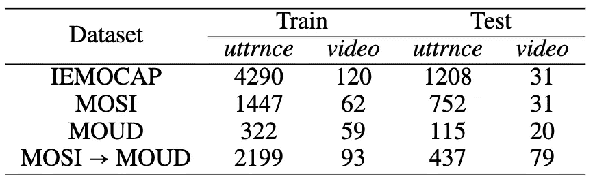
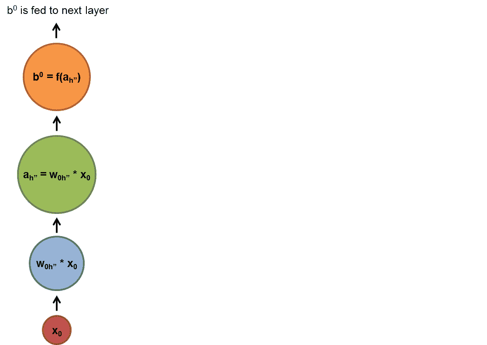
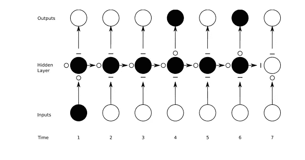
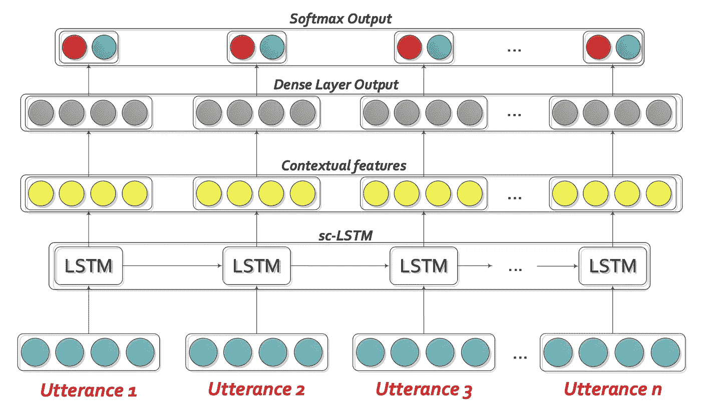
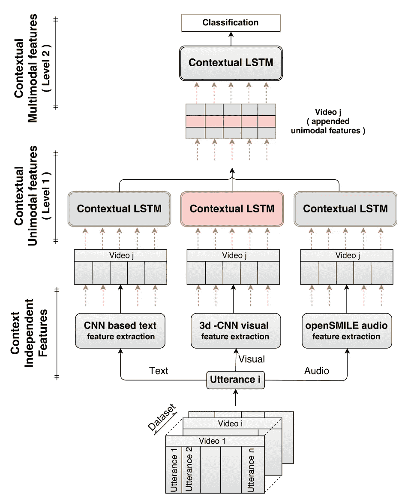
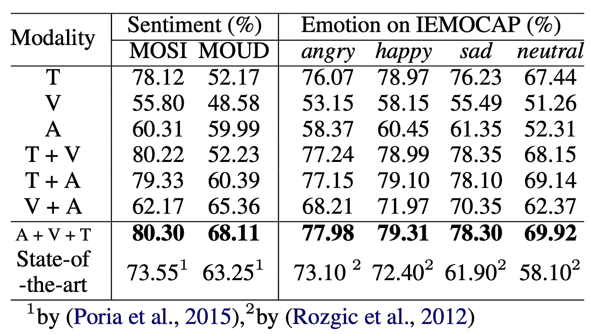

# 在情感人工智能中捕捉上下文:多模态视频情感分析的创新

> 原文：<https://towardsdatascience.com/capturing-context-in-emotion-ai-innovations-in-multimodal-video-sentiment-analysis-65e128ad8a1a?source=collection_archive---------12----------------------->

## 利用捕获多模态上下文信息的深度神经网络进行人性化情感分类

Source: Neurodata Lab

博客基于:“*用户生成视频*中基于上下文的情感分析”。茯苓；坎布里亚；哈扎尔卡；Majumder 扎德；莫伦西(2017)。[链接到完整的技术研究论文](https://aclweb.org/anthology/P17-1081)

# 介绍

我想象你正在 YouTube 上观看一个关于新电视节目首播的反应视频。不管出于什么原因，意见持有人在 5 分钟内的不同时刻表达了兴奋，然后悲伤…他们大声喊叫，然后单调…他们变得惊讶，然后厌恶。是什么让我们可以轻松解读他们的情感表达？仅仅是因为他们选择的词语吗？他们的面部特征？他们的声音强度？很可能不仅仅是声音，不仅仅是屏幕上的图像，或者不仅仅是他们选择的单词的意思。这是关于所有三者的结合，以及每一个如何随着时间的推移相互作用。

先前在“话语”级别的多模态视频情感分析中的研究忽略了视频中连续人类话语(由停顿限定的语音实例)的自然相互依赖性，而是将每个表达视为完全独立于其之前和之后的表达。视频的连续话语实际上是非常上下文相关的，因此，序列本身应该影响时间上近邻的情感分类。例如，在话语“*电影*的更好的名字是什么”中，说话者试图通过给出适当的名字来评论电影的质量。然而，所表达的情感需要关于说话者的举止和他/她对电影的看法的背景。先前的技术水平不能正确地对这样的话语进行分类。

来自美国、新加坡、印度和墨西哥的研究人员在 2017 年共同建立了一个长短期记忆(LSTM)分类模型，该模型整合了每一个视频的听觉、视觉和文本数据中捕捉的周围上下文信息，与之前的最先进模型相比，该模型的准确性提高了 5-10%。

视觉数据中的声音变化和面部表情，以及文本抄本中出现的语言，为更好地识别意见持有人的情感状态提供了重要的线索，从而创建了更强大的情感识别模型。虽然我将在下面总结的实验的主要焦点是对视频中的情绪进行分类(积极、中立或消极)，但他们的发现可以纳入更具体的情绪分类任务中，涵盖更广泛的基本情绪类别(愤怒、快乐、悲伤、中立、兴奋、沮丧、恐惧、惊讶等)。示例业务应用包括虚拟助理的开发、YouTube 和其他数字或社交视频的分析(例如产品评论、广告活动)、新闻视频分析、心理健康专家的个人情绪监测，当然还有很多其他的。

# 方法学

## 数据集

具有不同属性和警告的三个数据集被用于测试尚未描述的模型。 **MOSI** 包含了 93 个人用英语评论话题，并且充满了感性的表达。每个片段由多位评委从-3 到+3(负面情绪到正面情绪)打分。在实验中，取平均值，得到高于 0(积极情绪)或低于 0(消极情绪)的二进制数。 **MOUD** 包含来自 55 个人的西班牙语产品评论视频(用谷歌翻译翻译)，话语被标记为正面、负面或中性。丢弃中性视频后，使用了 59 个视频。

Train-Test Split Number of Samples by dataset

在我看来，使用的最令人兴奋的数据集是 **IEMOCAP** 数据。这组包括 10 名英语使用者，进行双向对话，话语标有情绪:愤怒、快乐、悲伤、中性、兴奋、沮丧、恐惧、惊讶或其他(最终研究人员只选择了前四种来与之前的最先进的研究进行比较)。

## 上下文不可知的单峰话语级特征提取

最初，研究人员在他们的第一次特征提取中没有考虑话语之间的上下文相关性。

***文本:使用 CNN*** 从视频口述文字的文本抄本创建模型输入

使用卷积神经网络(CNN)，研究人员首先将每个话语表示为所用单词向量的串联，其中向量是在谷歌新闻的 1000 亿个单词上训练的公开可用的 300 维 word2vec 向量。简而言之，为了提取每个单词、每个话语以及最终每个视频的情感，CNN 将文本话语转换为逻辑形式:机器可以理解的含义表示。

***音频:使用 openSMILE 的声音描述特征提取***

音频特征是使用 openSMILE 以 30 Hz 的帧速率和 100 ms 的滑动窗口提取的，open smile 是一种开源软件，可以自动提取音调和声音强度等声音描述符。语音强度被阈值化以识别有意义语音和无意义语音的样本。

***视觉:利用 3D-CNN 进行基于图像的特征提取***

在假设 3D-CNN 不仅能够从每一帧中学习相关特征，还能够学习给定数量的连续帧之间的变化的情况下，该团队选择了这一方法来提取每一个话语的视频特征。使用 3D 卷积过滤器、最大池、密集层和 softmax 提取相关特征。

## 上下文相关的特征提取:时间和顺序问题

由于视频中的话语保持一个序列，并假设在识别情感暗示时话语间存在依赖性，研究人员使用了一种基于 LSTM 的递归神经网络(RNN)方案来分类话语。这与传统的前馈神经网络相比有何不同？好吧，一个经过训练的前馈网络可以暴露于任何随机的照片集合，并且它暴露于的第一张照片不一定会改变它如何分类第二张照片。没有时间的概念，因为这些网络只记得他们的训练，而不是他们最近的过去。然而，rnn 不仅接受当前输入，还接受之前感知到的输入。最近的过去事件和 RNNs 更接近于我们如何实际感知我们所见所闻的情感背景。

简单来说:在下面的动画中，每个 *x(红色)*是一个输入示例， *w(蓝色)*通过确定当前输入和过去隐藏状态的重要性来准备输入， *a(绿色)*是隐藏层的激活(过滤后的输入和类似“记忆”的输入的组合)，而 *b(橙色)*是每个时间点的输出，其类似“记忆”的信息在该时间点被转发给 RNN

Recurrent Neural Network Animation ([https://imgur.com/kpZBDfV](https://imgur.com/kpZBDfV))

## 长短期记忆单位(LSTM):人工递归神经网络的一种变体

作为人类，我们不会也不应该记住所有的事情。我们最近的过去更生动，一般来说，我们遥远的过去对我们当前决策的影响略小。为了做到最好，我们会有意识或无意识地决定哪些东西要储存在记忆中，哪些东西要忘记，哪些东西要学习，以及在做决定的时候需要哪些东西。这个比喻可能并不完美，但 LSTMs 是相似的，因为它们通过打开和关闭的门来做出这样的决定。这些门控细胞通过猜测、反向传播误差和通过梯度下降调整权重的迭代过程来学习何时允许数据进入、离开或删除。LSTM 使一种选择性记忆成为可能。它允许递归网络在更多的时间步上继续学习，具有在有意义的时候忘记的灵活性(例如。扫描全新文档上的文本信息，而之前的文档应该被认为是完全不相关的)。这些特征使得它成为随着时间的推移对许多连续的单词、许多连续的话语和许多独特的视频进行情绪和情感分类的首选模型。

Long Short-Term Memory (LSTM) Graphic — Circle = open gate, allows information to pass, Dash = closed gate, blocks information from passing through — ([https://skymind.ai/wiki/lstm#long](https://skymind.ai/wiki/lstm#long))

## “情境-LSTM”架构和模型培训总结

为了避免过于技术化，上下文 LSTM 模型的输入是一个矩阵，该矩阵由所有 3 个单峰特征的每个视频的每个话语的向量构建而成。每个话语向量通过一个 LSTM 单元。然后，将 LSTM 单元的输出引入 **dropout，**正则化方法，通过临时丢弃随机选择的网络节点来减少过拟合并提高模型的泛化能力。然后，输出被传递到一个**密集层**，为 softmax 激活准备上下文相关的功能。最后，输出被传递到一个 **softmax** 激活层，它压缩一个介于 0 和 1 之间的向量，其中所有结果元素相加为 1，产生将决定分类的类概率。

Contextual LSTM network: input features are passed through a unidirectional LSTM layer, followed by a dense and then a softmax layer. The dense layer activations serve as the output features. ([https://aclweb.org/anthology/P17-1081](https://aclweb.org/anthology/P17-1081))

对每个视频的每个话语的 softmax 输出使用**分类交叉熵损失**来执行 LSTM 网络的训练。由于视频具有不同的话语计数，因此使用**填充**作为中性话语。为了避免网络中过多的噪声，对这些填充的话语进行**位屏蔽**以消除它们在网络中的影响。在 80%/20%训练/测试分割之后，在训练集上进行超参数调整。 **RMSprop** 已被用作优化器，它通过使用移动平均值而不是让平方梯度的估计值不断累积来解决 Adagrad 的学习率急剧下降的问题。

与上图中显示的单向 LSTM 细胞不同，报告中表现最好的分类器最终被证明是双向结构。双向 lstm 是两个方向相反的单向 lstm 堆叠在一起。这意味着一个话语可以从视频中出现在*之前和*之后的话语中获得信息，这似乎更接近我们实际感知的表达上下文。

## 模态融合综述

研究人员提出了一个由两个层次组成的分层深度网络，以融合三种模态——文本、视觉和听觉。在第一级中，独立于上下文的*特征*被馈送到上述提出的 LSTM 网络，以获得每个话语的上下文敏感的单峰特征表示。三种模式中的每一种都使用单独的 LSTM 网络。在第二级中，来自第一级中的每个 LSTM 网络的输出被连接并馈入这个新的 LSTM 网络，该网络被独立地训练和计算。

Hierarchical architecture for extracting context-*dependent* multimodal utterance features. ([https://aclweb.org/anthology/P17-1081](https://aclweb.org/anthology/P17-1081))

# 结果和分析

## 上下文改进分类

双向 LSTM 网络变体，以及研究人员测试的许多其他变体(这里没有提到)，在所有数据集上明显优于基线单 SVM，相差 2%至 5%，证明了研究人员最初的假设，即对话语之间的上下文依赖进行建模(单 SVM 无法做到)可以改善分类。 ***在话语级别的情感分类中，需要考虑上下文相关性是很重要的*。**

## 多模态模型优于单模态模型

Accuracy % on textual (T), visual (V), audio (A) modality and comparison with the state of the art ([https://aclweb.org/anthology/P17-1081](https://aclweb.org/anthology/P17-1081))

正如所料，在这种情况下和许多其他类型的实验中，双峰和三峰模型优于单峰模型。总体而言，**音频** **在所有数据集**上的表现都优于视觉 **。在 MOSI 和 IEMOCAP 数据集上，**文本分类器实现了最佳性能**。所有分类器在 IEMOCAP 数据集中分类中性话语时都有困难。文本模态与非文本模态相结合，大大提高了 IEMOCAP 的性能，在这种情况下比在其他数据集中要大得多。**

在 MOUD 数据上，文本表现不如音频，可能是由于西班牙语到英语的翻译。保持其原始语言 **将性能**提高 10%(西班牙语)，但牺牲了与最先进语言(英语)的可比性。在评估可推广性时，研究人员发现 **跨语言场景中的**面部表情比音频和文本模态携带更多的可靠信息**(通过在 MOUD 数据上测试 MODI-fed 模型)。没有任何其他话语级别的多情感数据集来测试 IEMOCAP 模型的可推广性。**

在整个数据集中发现了有意义的上下文关系。为了说明**模态**的相互依赖性，语音“*谁根本没有任何存在或伟大*”被音频分类器分类为肯定的，因为“存在和伟大”是带着热情说出的。然而，语篇情态抓住了“不”所诱导的否定，并将量词推向正确的方向。在一个不同的例子中，文本分类器仅仅根据看到“喜欢看”和“负责任地”，将话语“*喜欢看到漫画人物被负责任地对待*”分类为肯定的。这个人声音中明显的愤怒和生动的皱眉有助于识别这是消极的。有许多例子表明，一个模态的强度压倒了从一个情境较弱的模态中收集的模型的预感，也有例子表明，周围环境错误地压倒了一个微弱或中性的瞬间情绪。

总的来说，该模型并不完美，但它绝对是向前迈出的一步，并增加了复合证据，表明我们生活在一个非常令人兴奋的以情感为中心的人工智能时代！

感谢您的阅读，

亚历克斯

***链接至*** [***全文技术论文***](https://aclweb.org/anthology/P17-1081)

***我们来连线！我鼓励你喜欢、评论、分享或直接给我发消息，告诉我你对这里提出的想法的想法，或者对我今后应该关注的有趣主题的建议。***

[www.linkedin.com/in/alexandershropshire](www.linkedin.com/in/alexandershropshire)

[medium.com/@as6140](http://medium.com/@as6140)

[github.com/as6140](http://github.com/as6140)