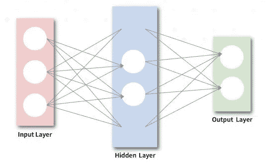
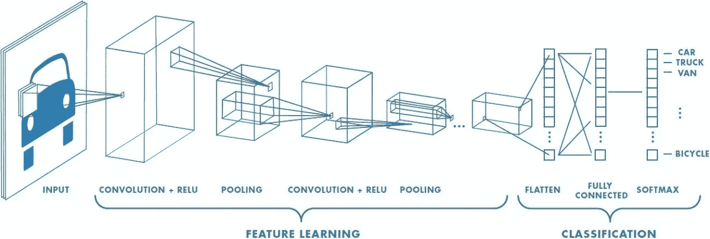
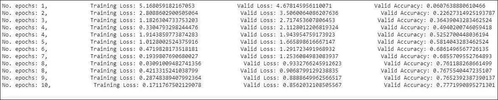
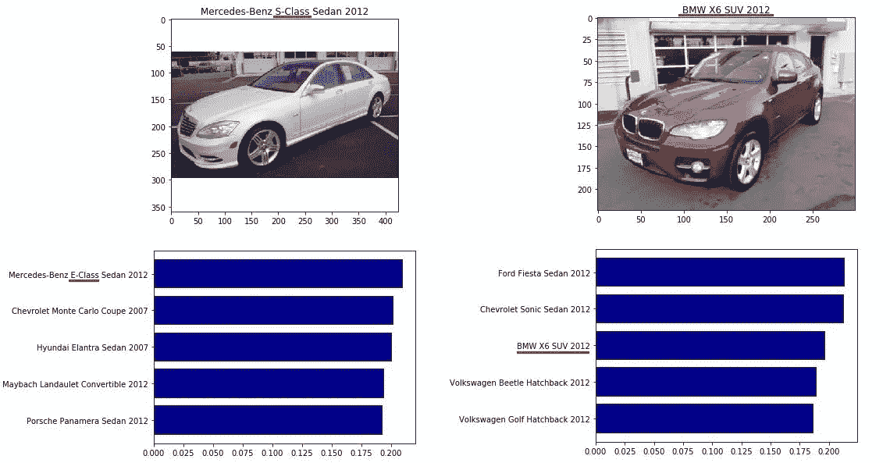
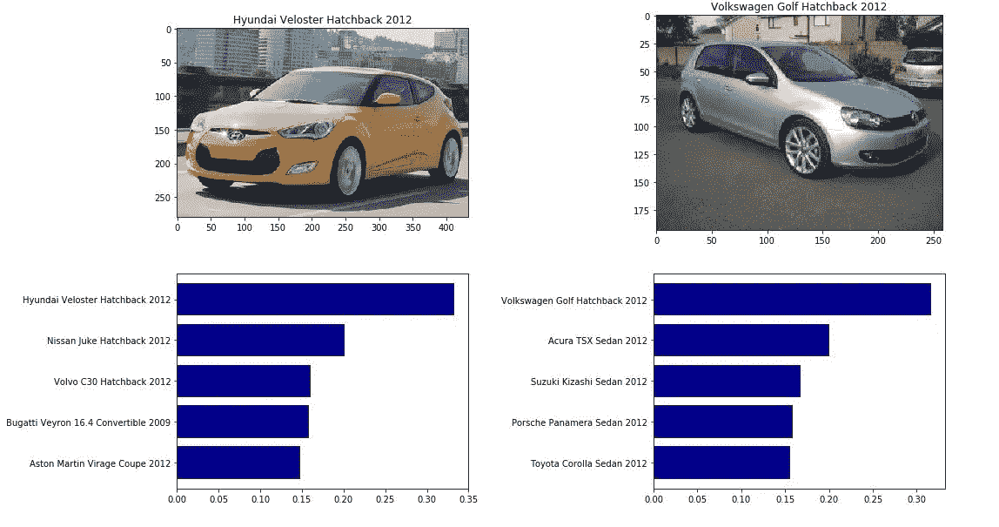
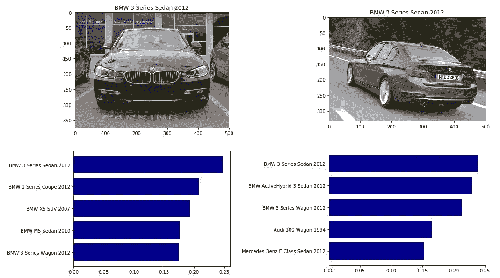
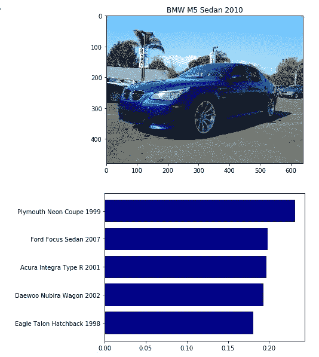
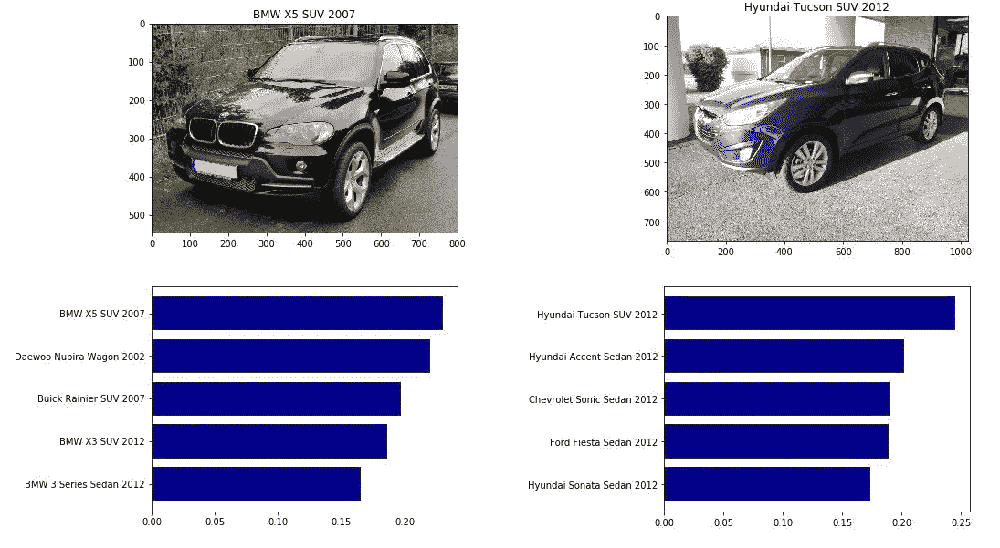

# 汽车型号分类

> 原文：<https://towardsdatascience.com/car-model-classification-e1ff09573f4f?source=collection_archive---------8----------------------->

在这篇文章中，我将展示 ResNet(残差神经网络)汽车模型分类的结果。我使用 Python 和 Pytorch 来构建模型。这些步骤类似于我以前的花卉种类分类器项目，所以我将简要介绍一些关键步骤和结果。

你可以在这里查看我的 github 回购[。](https://github.com/wengsengh/Car-Models-Classifier)

## 数据集

我使用 Kaggle API 从 [Kaggle](https://www.kaggle.com/jutrera/stanford-car-dataset-by-classes-folder) 下载了斯坦福汽车数据集，并保存在我的 google drive 中。

```
# The Kaggle API client expects this file to be in ~/.kaggle,
!mkdir -p ~/.kaggle
!cp kaggle.json ~/.kaggle/# This permissions change avoids a warning on Kaggle tool startup.
!chmod 600 ~/.kaggle/kaggle.json#mount my gdrive
from google.colab import drive
drive.mount('/content/drive')#download the dataset
!kaggle datasets download -d jutrera/stanford-car-dataset-by-classes-folder#unzip the file
!unzip stanford-car-dataset-by-classes-folder.zip
```

汽车数据集包含 196 类汽车的 16，185 张图像。数据被分成 8，144 幅训练图像和 8，041 幅测试图像。

## 迁移学习

迁移学习利用在解决一个问题时获得的知识，并将其应用于另一个不同但相关的问题。
这里的预训练模型是 ResNet(残差神经网络)。



人工神经网络通过对实例和以往经验的学习来预测结果。人工神经网络并行执行计算，并创建自己在学习期间接收的信息表示。在人工神经网络中，只需增加一层，即卷积层。



Image Source: Towards Data Science

关于 ResNet 架构的进一步解释，你可以参考[这里的](/understanding-and-visualizing-resnets-442284831be8)。

回到我们的例子，我们有 196 类汽车作为输出总数，所以我们需要将输出层改为 196。

```
num_ftrs = model.fc.in_features
model.fc = nn.Linear(num_ftrs, 196)
```

## 验证准确性



The Epochs

我尝试了一些参数，并多次运行 epochs。最后，经过 10 个时期，它给了我们 77.72%的验证准确率，这是我迄今为止尝试过的最好的结果。训练过程真的很费时间，只需要耐心。加油！

# 结果呢

让我们看看它实际上做了什么！！



对于奔驰 S 级轿车 2012 年的模型预测奔驰 E 级轿车 2012 年是不准确的。梅赛德斯-奔驰 S 级轿车 2012 也没有出现在预测的前五名中。宝马 X6 SUV 2012 预测不完全正确，因为它出现在第三个顶级车型中。它应该是预测结果中的顶级车型，而不是 2012 款福特嘉年华轿车。



现代 Veloster 掀背车 2012 和大众高尔夫掀背车 2012 预测良好，超过 30%。



两者都是宝马 3 系 2012 款轿车，只是视角不同而已。左图是前视图，右图是后视图。
令人惊讶的是两种不同观点对宝马 3 的预测都正确。左侧的前 5 名预测结果非常好，因为它预测前 5 名都是宝马。在右侧成绩也不错，宝马出现在前 3 名。



然而，在这种情况下，宝马 M5 轿车 2010 年没有表现，它得到了所有前 5 名预测类错误。任何宝马汽车型号都没有出现在结果中。



在这种情况下，两个模型都是 SUV 模型，且预测正确。

就是这样！