# 线性回归模型在二手车市场中的应用

> 原文：<https://towardsdatascience.com/car-selection-and-sales-day-prediction-8c4a474f9dca?source=collection_archive---------12----------------------->

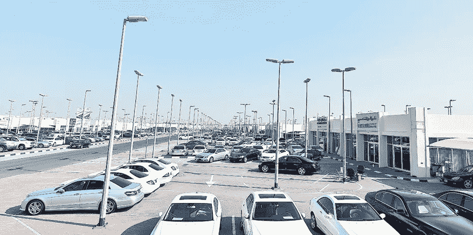

*这个项目的灵感来自托马斯·米勒的书* [*“营销数据科学:用 R 和 Python 进行预测分析的建模技术”*](https://www.amazon.com/gp/product/0133886557?pf_rd_p=c2945051-950f-485c-b4df-15aac5223b10&pf_rd_r=V9Y74NT18RHZ24T4420T) *中的 Drivetime 轿车案例研究。作者只提供数据集和问题陈述。您可以在这里访问数据集和我的 R 代码* [*。*](https://github.com/Fumanguyen/drivetime-sedans-used-vehicle-market)

# **1。简介**

Drivetime 是美国第二大汽车零售商，专门经营二手车。该公司成立于 2002 年，在 8 个州拥有 76 家经销商。Drivetime 的使命是“成为信用不太好的人的汽车经销商和金融公司”，通常每月出售约 4000 辆二手车，处理约 1 万份信用申请。

Drivetime 从拍卖行和批发商那里购买了大部分车辆。车辆包括许多品牌和型号的轿车和卡车。经过检查和维修后，车辆被送往经销商处进行销售。正常的经销商销售发生在交付给经销商的 90 天内。如果这辆车在 90 天内没有卖出去，它就被称为超龄车，这意味着它在停车场待得太久了，无法产生正常的经销商利润。

为了鼓励在 90-119 天内销售，每辆超龄车的销售价格都会降低。此外，如果超龄车辆未能在 120 天内售出，该车辆将被从停车场中取出并拍卖。这些超龄车辆导致利润减少，甚至驾驶时间损失。更具体地，当非超龄车辆以 20%的加价出售时，超龄车辆的价格被设定为 10%的加价，而车辆以-20%的加价拍卖。

进行这种分析是为了在驱动时间支持采购经理的选择过程。主要目标是提高 90 天内售出车辆的比例，降低车辆超龄和拍卖的风险，并使公司利润最大化。

我们的分析包括 3 个主要部分:

1 —数据特征和探索

2 —模型选择、解释和预测

3 —建议和结论

# **2。数据探索**

该数据集中有 17506 个数据点，其中 8753 个被标记为训练数据，5376 个被标记为测试数据，其余为验证数据。数据集中没有缺失的数据。

下表总结了数据集中的所有变量:

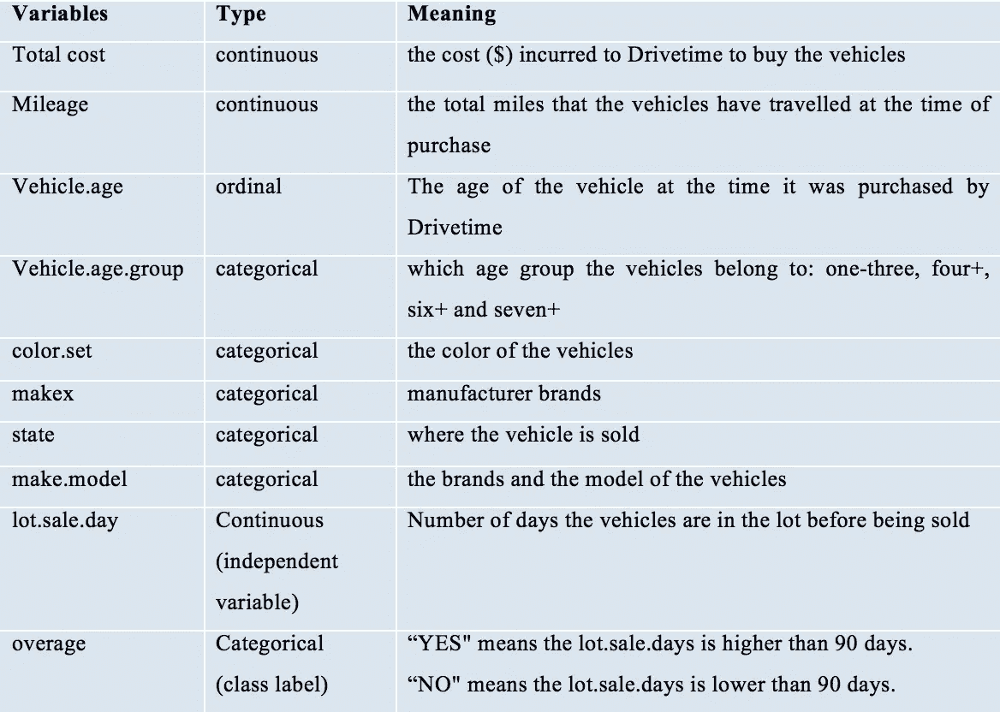

为了更好地理解我们的数据集，我们对我们的单个变量和它们之间的关系进行了探索性分析。

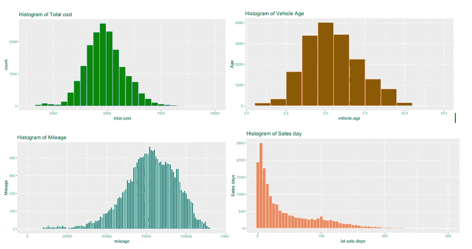

Histogram of Total Cost, Vehicle Age, Mileage and Lot Sales Days

连续变量的直方图显示，虽然总成本、车龄和里程遵循正态分布，但销售天数数据是左偏的。大多数车辆的行驶成本为 4000-6000 美元，购买时的车龄为 3-7.5 年，里程主要在 50000-100000 英里之间。此外，80%的车辆将在 90 天内售出。

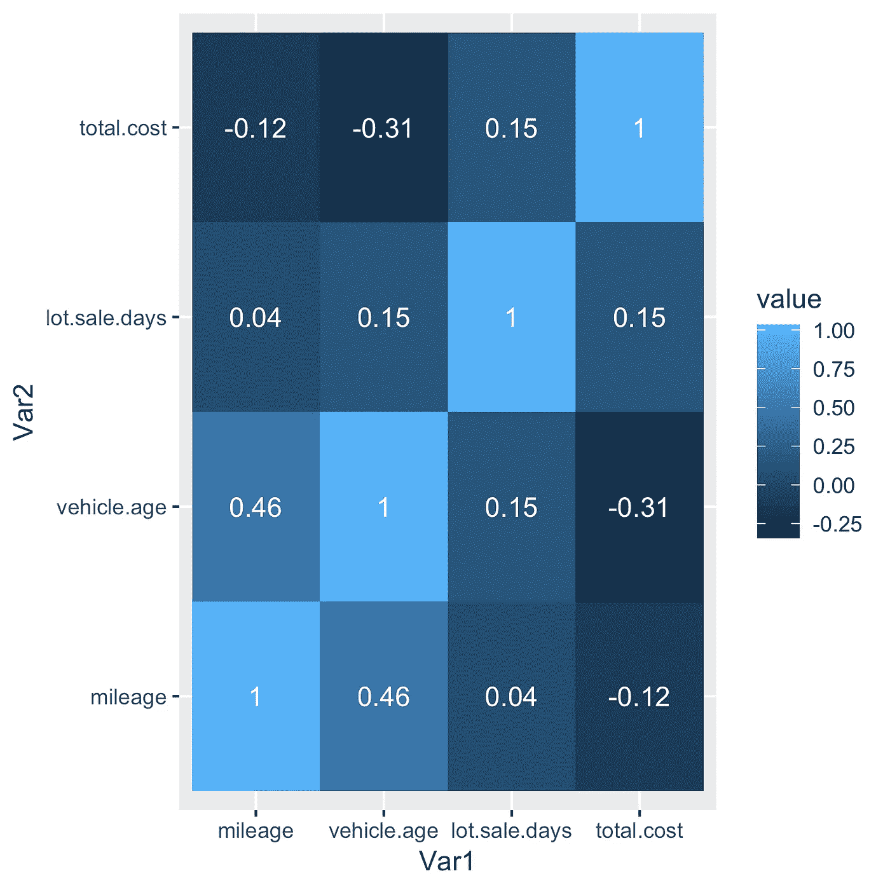

Correlation Heatmap between continuous variables

下面的相关性热图说明了销售天数与里程和车龄的关系并不密切，与总成本的正相关性略好。这意味着，一般来说，如果车辆的成本高于其他车辆，则该车辆往往会在更长的时间内售出。销售天数和其他连续变量之间的散点图证实了我们的观察，即成本、里程和销售天数之间没有强而清晰的线性关系。

接下来，我们查看分类变量，以确定是否有任何影响销售天数的重要因素。

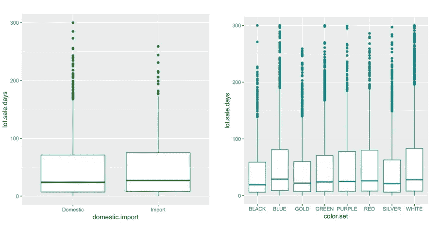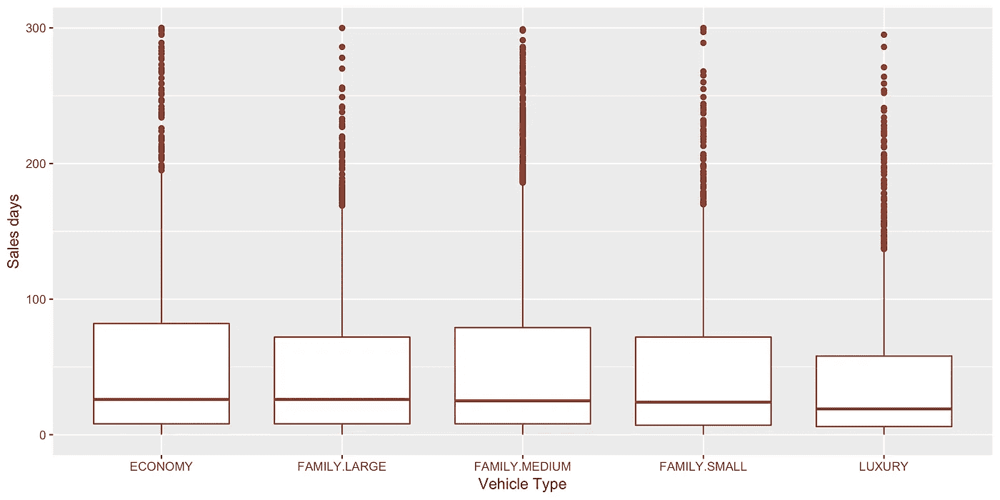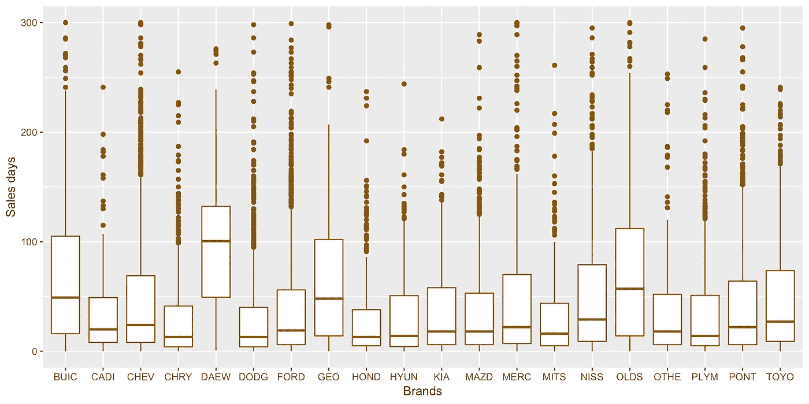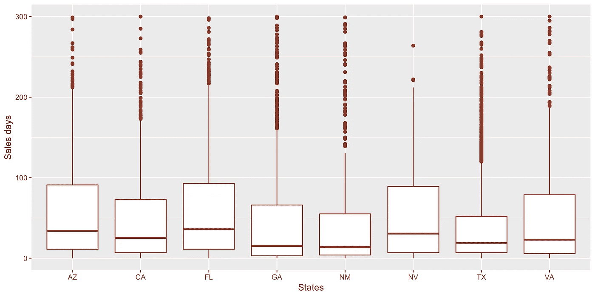

就销售速度而言，国产汽车和进口汽车之间似乎没有明显区别。就车型而言，经济型汽车的销售速度似乎略慢于家庭型汽车和豪华轿车。平均而言，销售一辆经济型汽车需要 51 天，销售一辆豪华型汽车需要 39 天，销售一辆家庭型汽车需要 47 天。

制造商品牌似乎对销售日有很大影响。一些快销二手车倾向于本田、克莱斯勒、道奇、现代、普利茅斯等。而大宇、奥兹莫比尔、别克和 GEO 汽车在出售前会在停车场停留更长时间。这些车辆在使用几年后往往会保值。销售时间取决于许多因素，如折扣、1-3 年后的价值贬值、品牌的可用性和受欢迎程度等。

一些州，如加利福尼亚、乔治亚、德克萨斯的销售天数明显低于其他州，如亚利桑那、佛罗里达、内华达。亚利桑那州和佛罗里达州的车辆平均分别在 53 天和 57 天内售出；德克萨斯州和乔治亚州的车辆分别在 39 天和 42 天内售出。这种差异可能是由于各州关于各种费用(如经销商文件费、注册费、当地州税)的规定不同，这些费用会影响这些州对二手车的需求。此外，各州的人口和失业情况也可能是一个重要因素。例如，佛罗里达州和亚利桑那州是美国著名的退休目的地，因此这两个州的二手车需求通常低于其他州。

数据集中的另一个重要变量是 make.model，表示车辆的品牌和型号。在我们的数据中观察到 110 个模型。一些车型出现的频率非常高，如雪佛兰 Lumina、福特金牛座、日产 Sentra(超过 900 次)，而一些车型很少出现，如讴歌 Vigor、别克 Lasabre 或雪佛兰 celebrity (1 次)。为了在对数据构建预测模型时进行准确的概括和预测，我们将移除模型频率小于 4 的观测值。准备建模数据集包含 17469 个数据点。

# **3。型号选择&预测**

我们将使用训练数据来构建模型，测试数据来评估模型的拟合程度，验证数据来预测利润，并查看模型对利润的影响。

我们将使用回归模型构建两个模型，以了解它们之间的区别:

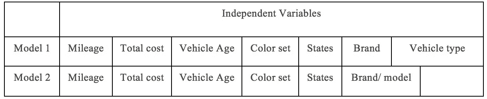

Difference between 2 models

如上所述，品牌/型号有超过 100 个值，它也很好地表明了品牌和车型信息。它还包含其他信息，如燃油效率、电动或混合动力汽车等。因此，在一个回归模型中包含所有品牌/型号、品牌和车型可能是多余的。

这两个模型的结果向我们展示了可以指导 Drivetime 车辆选择流程的见解:

*   每多行驶 10000 英里，平均销售天数就会增加 2.53 天
*   总成本增加 100 美元，销售天数平均增加 2 天
*   车龄每增加一年，销售天数平均增加 9.83 天
*   颜色:与黑色相比，蓝色、绿色、紫色、红色和白色分别增加销售天数 9.29 天、6.47 天、8.72 天、11.5 天和 8.7 天。就销售时间而言，金色和黑色之间、银色和黑色之间没有显著差异。
*   品牌:与别克相比，除了大宇和奥兹莫比尔之外，其他品牌的销售天数更短。一些品牌有许多最短的销售天数是本田(缩短 59 天)，丰田(缩短 36 天)，凯迪拉克(缩短 57 天)，克莱斯勒(缩短 34 天)，马自达(缩短 30 天)。
*   州:亚利桑那州是销售额最高的州。其他州 CA、VA、NV 的销售日缩短了 9-11 天。佐治亚州、佛罗里达州和德克萨斯州的销售时间比亚利桑那州短 2-4 天。
*   车型:经济型汽车销售时间最长。豪华和家庭大型和家庭中型的销售时间最短(比经济型短 40 天)
*   一些销量最快的车型有英菲尼迪 J30、英菲尼迪 Q45、马自达 Millenia、本田雅阁、凯迪拉克赛维莱、丰田凯美瑞、日产千里马等。销售最慢的车型是普利茅斯喝彩，奥兹莫比尔塞拉，Geo 地铁，现代口音，道奇精神…等等。

下表比较了两种型号的性能:

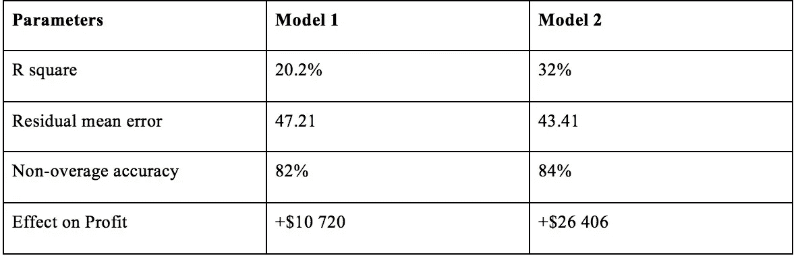

模型 2 在预测销售天数方面似乎更好。模型 1 解释了 20.2%的销售天数变化，而模型 2 可以解释 32%的销售天数变化，剩下 68%无法解释。

非超龄准确性是说明在指导驾驶时间选择过程中使用统计建模的改进的重要因素之一。如数据特征部分所述，Drivetime 购买的约 80%的车辆在没有任何统计模型的情况下在 90 天内售出。在我们将模型 1 或模型 2 应用于测试数据后，我们建议 Drivetime 只购买预计不会超龄的车辆，避免购买预计超龄或拍卖的车辆。这些预测的非超龄车中，82%和 84%实际在 90 天内售出。使用模型 1 和模型 2，精度分别提高了 2%和 4%。

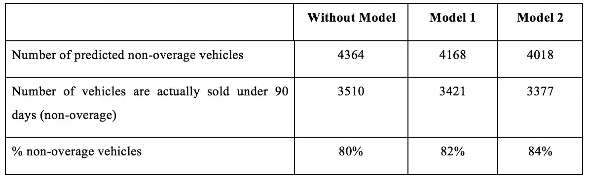

接下来，我们使用验证数据来检验使用统计模型对驾驶时间利润的影响。我们知道，一辆非超龄车以 20%的加价出售，一辆超龄车的价格被设定为 10%的加价，一辆车以-20%的加价拍卖。因此，与在没有统计模型的指导下选择车辆相比，模型 1 预计将增加利润 10，720 美元，模型 2 预计将增加利润 26，406 美元。

# **4。建议&结论**

对于零售商来说，在预测保持利润和降低库存成本的畅销车辆时，二手车市场涉及许多因素。颜色、车辆类型、品牌、型号、里程、成本和车龄是我们有机会分析的影响二手车在停车场停留时间的一些重要因素。一般来说，顾客的偏好是多样而复杂的。然而，Drivetime 可以优先购买二手车中的一些非常理想的特征:

客户似乎更喜欢黑色、银色、金色或白色的车辆

需求量大的汽车品牌有本田、道奇、克莱斯勒、丰田、凯迪拉克、马自达。驾驶时间应该避免大宇，Geo，奥兹莫比尔或别克，因为这些品牌很不受欢迎，需要很长时间才能卖出去

豪华和家庭型汽车比经济型汽车卖得快。

位置对销售日影响很大。在佛罗里达和亚利桑那等销量较低的州买卖二手车时，Drivetime 应该关注颜色、品牌、低里程数和车龄等其他非常受欢迎的特征。

驾驶时间应该更喜欢购买里程少、价格低、车龄短的车，在其他特征方面要在两辆同等的车中进行选择。

列出 20 辆销售最快的车，多买几辆。

从现在开始，Drivetime 应该采用模型 2 来指导他们的选择过程。该模型可将驾驶时间利润提高 1.06%。

建议未来的研究探索影响二手车销售期的其他因素。例如，燃油效率水平、车辆是电动还是混合动力、原价折扣水平……将这些因素纳入分析中可以提高选择非超龄车辆的准确性，并对利润产生积极影响。

我是加州大学戴维斯分校的 MBA 学生。我对营销分析、建模、机器学习和数据科学充满热情。本文属于我 MBA 项目下的独立学习。非常感谢我的同学 Jamie Ho 对这个项目的贡献。如果您有任何意见、反馈或问题，请随时通过 mapnguyen@ucdavis.edu 联系我，或通过 [*、LinkedIn*](https://www.linkedin.com/in/maiptnguyen/) *联系我。快乐造型！*