# 职业转换者对你梦想中的技术工作的指导，第 1 部分

> 原文：<https://towardsdatascience.com/career-switchers-guide-to-your-dream-tech-job-part-1-949b9acff4d8?source=collection_archive---------12----------------------->

## 去你梦想中的公司面试的建议

# 简介——从华尔街到谷歌总部

2019 年 3 月 31 日，我被一家初创对冲基金裁员。在过去的 10 多年里，我一直是金融行业的定量软件开发人员，我不想再做同样的工作。我开始追寻自己的激情，在人工智能/机器学习/深度学习(AI/ML/DL)领域找到下一份工作。在接下来的 6 个月里，我朝着这个目标努力工作。到 2019 年 9 月，我有多个与 ML 相关的现场面试和报价，包括来自谷歌和脸书的报价。以下是我的做法，希望它能鼓励和帮助其他潜在的职业转换者进行这种转变。你换工作的回报是双重的，智力上和经济上。

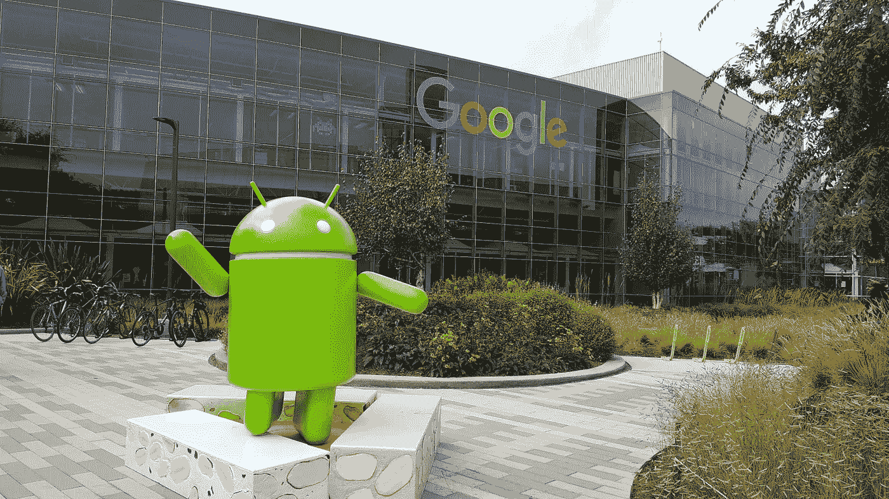

Googleplex: Google’s Worldwide Headquarters. Source Google.com

# 行动纲要

如果你时间不够，这里有一个对我有效的快速 5 步食谱。

*   策划:做一个对你有热情的项目，并在网上展示
*   **学习**:集中练习算法和数据结构编码和系统设计问题
*   **应用**:利用多种渠道落地面试
*   面试:在电话和现场面试中保持冷静
*   **谈判**:在谈判报价和与球队比赛时，知道自己想要什么

正如你所看到的，这是一个非常简单的 5 步食谱。然而，完成每一步都需要付出很多努力。详情请继续阅读。

# 关于我

这里有一点关于我的，因为我认为这个指南对与我有类似背景的人最有帮助，即，在非技术行业有经验的软件工程师/开发人员希望转到西海岸(湾区或西雅图)的顶级技术公司。如果你没有软件工程的工作经验，上面的方法仍然适用于你，你只需要比有编码经验的人更加努力。

我毕业于加拿大滑铁卢大学，是一名计算机工程师。在我早期的职业生涯中，我是微软和甲骨文的软件工程师。然后 MBA 毕业后转行进入量化金融行业。在过去的 10 多年里，我在美国银行、瑞士联合银行、Citadel 和一些小公司担任定量开发人员/分析师。但是从 2016 年开始，当我第一次偶然发现机器学习/深度学习的时候，我就爱上了它。我知道我最终想要一份人工智能/人工智能领域的工作。从 2019 年 4 月开始，我开始了我的全职准备这个职业转换。下周我将搬到湾区，加入人工智能和人工智能领域的领导者之一谷歌。

 [## David Tian 机器学习工程师-个人项目| LinkedIn

### 一个经验丰富的 C++/Python 机器学习工程师，具有大规模系统设计的深入知识，实践…

www.linkedin.com](https://www.linkedin.com/in/dctian/) 

# 成功的 5 个简单步骤

## 第一步。策划:做一个很酷的项目并展示出来

2019 年 2 月，我的好朋友伊戈尔鼓励我创建一个很酷的项目并写下来。当时，我没有任何好的想法，从未在网上发表过任何东西，也不知道从哪里开始。但在 4 月初，当我和家人在墨西哥度假时，一天晚上我突然有了一个启示，我想制造一辆自动驾驶汽车。鉴于我之前没有机器人或电子方面的经验，我开始建造一辆可以在我的客厅里运行的[深度学习/自动驾驶机器人汽车 DeepPiCar](https://towardsdatascience.com/tagged/deep-pi-car) 。一个月后，在成功制造了自动驾驶汽车后，我开始写一篇关于走向数据科学的 6 篇博文，教别人如何制造一辆汽车。几周之内，我的博客就被浏览了 10，000 次，全世界读者的反应是压倒性的。我觉得我两个月的辛苦工作——一个月造汽车，另一个月写博客——非常值得。

DeepPiCar running in my living room

然而，我并没有意识到它对我职业生涯的全面影响，直到我参加面试并提供团队匹配电话，面试官问我“你为什么想从目前的行业跳槽？”我准备好了谈话要点！我不仅能够告诉他们我对 AI/ML 的热情，当我从背包中拿出我的汽车(是的，实际的机器人汽车)并把它放在面试官的手中时，我可以从他们的眼中看到兴奋！他们中的许多人甚至说他们愿意和他们的孩子一起制造这样一辆车。然后我告诉他们，我已经在网上发布了完整的分步说明和源代码(在我的简历中有链接),供他们遵循。我很确定他们之后不会把我的简历放进回收站。；-)

我的一些朋友问我，我建议做什么样的好项目。以下是我的一些建议:

*   如果你想过渡到前端开发，创建一个与流行的开源框架有很多交互性的酷网站，比如 [React](https://reactjs.org/) 和 [Angular](https://angular.io/) 。
*   如果您对服务器端开发感兴趣，尝试使用分布式服务器技术创建一个网络爬虫或搜索引擎，如 [Cassandra](http://cassandra.apache.org/) 、 [ZooKeeper](https://zookeeper.apache.org/) 、 [Memcached](https://memcached.org/) 和 [Elastic Search](https://www.elastic.co/webinars/getting-started-elasticsearch) 等
*   如果你对移动设备感兴趣，试着创建并发布一个苹果/安卓应用。注意，在苹果的 App Store 上发布一个应用，要比谷歌的 Play Store 花的时间长得多。
*   如果你对 AI/ML 感兴趣，就拿现有的计算机视觉或者自然语言处理深度学习模型中的一个，试着用它做一个产品出来。比如我拿了一个预先训练好的[物体检测模型，SSD](https://arxiv.org/abs/1512.02325) ，改编成我的 DeepPiCar 的交通标志检测器。如果你是人工智能/人工智能的新手，一定要阅读 DeepPiCar 的[第 1 部分，在那里我列出了几个人工智能课程和资源来帮助你入门。](/deeppicar-part-1-102e03c83f2c?source=---------5-----------------------)
*   如果你对机器人感兴趣，试着用树莓 Pi 或 Nvidia Jetson Nano 制造一些很酷的机器人。确保使用新的[树莓 Pi 4](https://www.raspberrypi.org/products/raspberry-pi-4-model-b/) 或[杰特森纳米](https://developer.nvidia.com/embedded/jetson-nano-developer-kit)。Raspberry 更广泛地被创客使用，并享有更好的支持，而 Jetson Nano 板载 GPU，因此它可能更适合[深度学习项目](https://www.sparkfun.com/products/15365)。
*   如果你没有任何项目想法，不要绝望。你可以随时为上面提到的开源项目做出贡献，如果你对 AI/ML 感兴趣，也可以为 TensorFlow 或 PyTorch 做出贡献。你可能认为你需要成为一名专家来为这些众所周知的开源项目做贡献。你没有。实际上，在每一个开源项目中，都有相当多的小特性和简单的错误修复是为新手设计的。这样，在处理更复杂的问题之前，您可以熟悉代码库和提交过程。

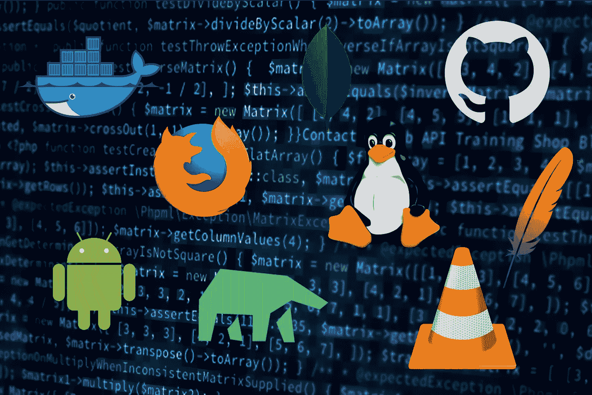

Top Open-Source Projects

一旦你完成了你的项目，一定要让全世界都知道！你只要在 GitHub 上发布你完成的代码就够了吗？不要！因为大多数人更喜欢先阅读关于你的代码做什么的博客。漂亮的、精心设计的博客是你的项目，更重要的是你的营销材料！是的，用漂亮的图片和图表写精美的博客需要很长时间。我花了整个五月的时间写了 6 篇文章。我估计总共大约 200 小时或 30 小时/篇。如果你是全职工作，也许可以写一篇写得很好的博客，作为你项目的概述。(顺便说一句，我花了 10 多个小时写这篇文章，这只是第一部分。)

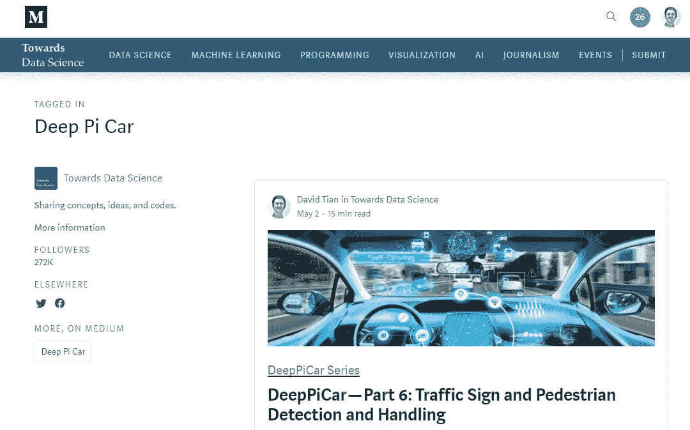

DeepPiCar’s Blog Series

有一点要记住，你必须享受你正在做的事情，而不是仅仅为了找到一份工作而做这个项目。如果你对你所建立的东西有热情，当你和面试官交谈时，它会闪耀出来。

## 第二步。努力学习，聪明学习

> **算法和数据结构**

如果你需要掌握一项技术面试技能，那就是算法和数据结构(A&DS)编码技能。不管你面试的是大公司还是小公司，他们都会询问你的编码技能，尽管大多数公司不会在意你使用哪种编程语言。我最喜欢的编程语言是 C++和 Python，但对于编码面试，我推荐 Python，因为它非常简洁，与非常冗长的 C++相比，你可以用这么少的代码行做这么多的事情。有大量的资源可以让你为 A&DS 做好准备。我使用了以下资源:

*   [**《破解编码面试书》(CtCI)**](https://amzn.to/2LLxmSm) :这本书大约 700 页，仅售 30 美元。如果你需要重温一下& DS 的概念，这是一个很好的起点。除了概念之外，它给出了一系列带有完整解决方案的从简单到中等水平的练习题。我花了大约 2 到 3 周的时间在这上面，每一章都花了 1 到 2 天的时间。我跳过了数学/脑筋急转弯/OOD/C++/Java/SQL 的章节，因为它们与 DS 无关。

[CtCi Book](https://amzn.to/2LLxmSm)

*   **:我也大量使用 LeetCode (LC)，因为我觉得 CtCI 没有给我足够的练习。Leetcode 可能是最全面和最有组织的编码面试问题的在线数据库，拥有超过 1000 个简单、中等和困难的问题。每个问题都有一个唯一的编号。(例如 LC#1 是 TwoSum)很多网上的帖子只是简单地把自己的面试问题称为 LC #xxx，而不是把整个问题打出来。我强烈建议每月花费 30 美元注册 LeetCode Premium，因为它可以让您访问所有的 LC 问题和解决方案。我觉得这很有帮助，我注册了 99 美元的年度会员，因为我认为这是“我大脑的健身房会员费”。我完成了超过 100 个 LeetCode 问题(35 个简单问题，60 个中等问题，14 个困难问题)。我实际面试中 90%的问题，或者它们的细微变化，都可以在 LeetCode 上找到。大多数情况下，直到事后我才知道它们来自 Leetcode。但是由于我练习了足够多的 LC 中等题，我能够解决相同难度的问题。实际上，我觉得我永远做不够 LC 中等题，因为直到今天，我仍然在一些 LC 中等题中挣扎。**

**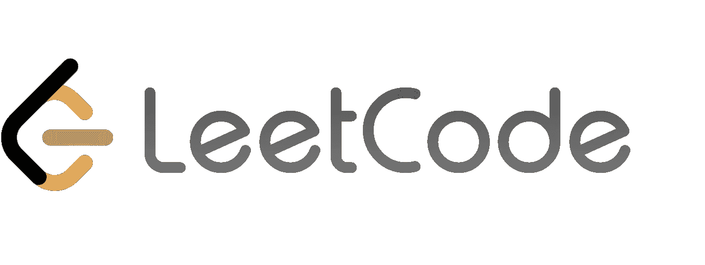**

*   **[**图沙尔罗伊的 LeetCode 硬解**](https://www.youtube.com/watch?v=l3hda49XcDE&list=PLrmLmBdmIlpuE5GEMDXWf0PWbBD9Ga1lO) :图沙尔其实是苹果公司的一名工程经理。他在还是软件工程师的时候就制作了这些视频。我想说，观看他的视频不仅教会了我这些算法，还教会了我如何**清晰地呈现**复杂的想法/算法。当我在现场面试中做白板编码时，这对我帮助很大。**

**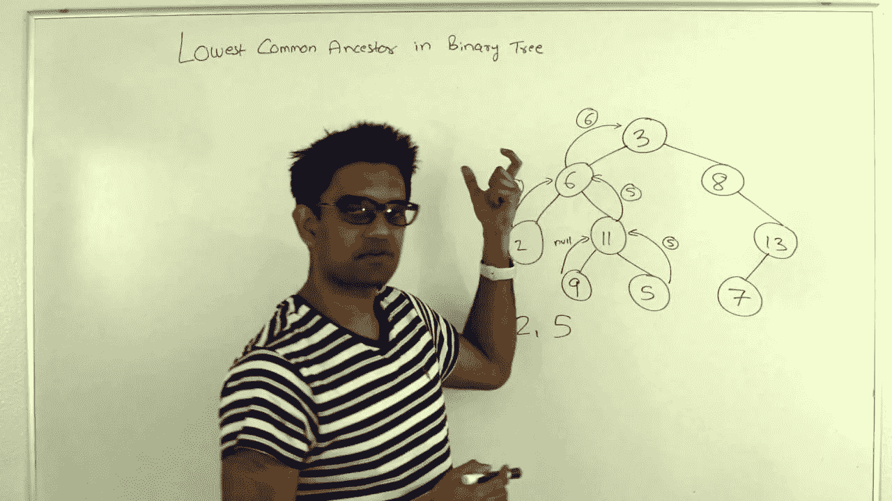**

**Tushar Roy doing Leet Code**

**请注意，大多数面试官会给 LC 中等水平的问题，因为要求某人在 20-30 分钟内解决中等水平的问题是非常公平的。我建议在你第一次电话面试之前，至少做 20 个简单的和 30 个中等难度的问题。我在完成 CtCI 的书之后和开始 LC 之前做了我的第一次电话采访，并立即被屠杀。**

**此外，我会为每个练习题计时，就好像我在面试一样。然而，我使用一个 IDE，带有自动完成和一个调试器。你不会在实际的面试中得到这些，所以我通常会在练习时设置更严格的时间限制，大约 30 分钟/问题，而不是 45 分钟。您可以选择仅使用常规的文本编辑器或者甚至使用白板来模拟真实的测试环境。这是个人喜好。**

> ****系统设计****

**你需要掌握的第二重要的技能是系统设计。通常，一次现场面试会要求你设计一个大型分布式系统，如网飞视频服务系统，或 WhatsApp 即时通讯系统，或 Instagram stories 等。这是一个软硬技能混合的测试。这是一个很难的技能测试，因为你需要了解很多常用的分布式系统组件，如分布式数据库、分布式内存缓存、分布式配置管理器、分布式文件存储和分布式搜索引擎等。，以及何时是使用它们的合适时机。这也是一个软技能测试，因为你需要能够画出清晰的图表来说明你的设计，并口头讨论和辩护你的设计。有人告诉我，如果你通过现场面试，系统设计面试会极大地影响你的水平。(也就是说，它可能会决定是否向你提供 4 级或 5 级工程职位，等等。)**

**以下是我使用的资源:**

*   **[**《破解编码访谈录(CtCI)**](https://amzn.to/2LLxmSm) :有一章讨论了系统设计，但都是非常基础的内容**
*   **[**高拉夫·森的系统设计 YouTube 频道**](http://youtube.com/watch?v=quLrc3PbuIw&list=PLMCXHnjXnTnvo6alSjVkgxV-VH6EPyvoX) :看完 CtCI 的系统设计章节，感觉很没有成就感。然后偶然发现了高拉夫的频道，里面有 22 个视频。我把他所有的视频下载到我的笔记本电脑上，在漫长的飞机旅途中观看。伙计，这家伙太好了(而且很有趣)，把事情解释得这么清楚！大约 10 个视频是对单个分布式系统组件的深入描述，其余的是关于如何构建网飞、Tinder 或脸书系统等的实际用例讨论。**

**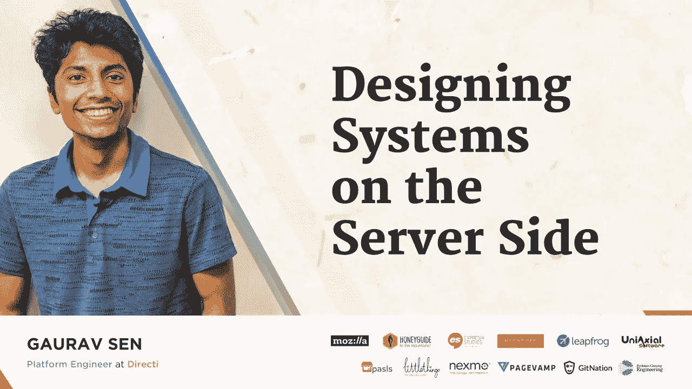**

**[Gaurav Sen’s blog](https://www.hackerearth.com/blog/author/gaurav-sen/)**

*   **[**图沙尔罗伊的系统设计视频**](https://www.youtube.com/watch?v=UzLMhqg3_Wc&list=PLrmLmBdmIlps7GJJWW9I7N0P0rB0C3eY2) **:** 虽然图沙尔在 LC 难题上非常出色，但他也有 5 个很棒的系统设计视频。我建议在 Gaurav 的视频之后观看这些视频，因为 Gaurav 为您提供了系统设计的坚实基础，而 Tushar 的视频假设了一些这方面的知识。**

**对我个人来说，由于我以前在相当多的分布式系统上工作过，所以我能够很快地掌握总体思想，即使我没有使用过上面视频中提到的一些新技术。看了足够多的视频后，我能够将大多数分布式系统归纳为以下几层:**

*   **客户端(PC/移动应用程序、浏览器)**
*   **处理客户端请求的分布式负载平衡器**
*   **基于位置的内容交付网络(CDN)或内存缓存，可将大量相对静态的内容(视频和图像)快速交付给地理位置更靠近 CDN/缓存的客户端。**
*   **一系列处理各种业务逻辑的微服务，如认证、服务/保存用户内容、在用户之间传递消息。**
*   **微服务之间的通信通过分布式消息传递系统发送。**
*   **保存用户内容和消息的分布式数据库。或者，在数据库之前添加一个分布式缓存层，以提高读/写吞吐量。**

> ****行为问题****

**对我个人来说，行为问题是面试中最容易的部分。不幸的是，它在面试评估中也是最不重要的。果然，科技公司知道，在行为面试中摆出“好男人/女孩”的个性并说正确的话很容易，但把自己训练成一名优秀的程序员要难得多。对于一个职业转换者来说，要准备的最重要的问题当然是，“你为什么想转行？”希望有了你在第一步中建立的项目，你可以通过展示你的项目和你对新行业和你申请的公司的热情来解决这个问题。**

****

**以下是一些需要准备的其他行为问题:**

*   **你为什么想为我的公司/集团工作？**
*   **举一个你达成的目标的例子，告诉我你是如何实现的。**
*   **举例说明一个你没有达到的目标，以及你是如何处理的。**
*   **描述一下工作中的压力情况，以及你是如何处理的。**
*   **你有没有遇到过没有足够工作可做的情况？**
*   **你犯过错误吗？你是怎么处理的？**
*   **描述一个你和同事/老板/下属意见不合的情况，你是如何处理的？**

**所有行为问题的关键是以积极的方式结束。例如，即使你被问到与同事的分歧或职业生涯中的失败，也要如实提及发生的事情，但更重要的是提及你从中吸取的教训，以及当类似情况再次出现时，它如何帮助你成为更有效的团队成员/工程师。**

## **第三步。通过多种渠道申请**

**6 月初，就在我在 DeepPiCar 上发表博客之后，我开始密切关注湾区的 ML 工程师就业市场。与此同时，我开始了我为期 1 个月的密集全职编码准备(总共约 200 小时)。到了六月底，尽管我还没有完全准备好，我还是开始向公司申请。原因是在我投简历和电话面试之间有 1-2 周的准备时间。通过多种渠道，我联系了 20 多家公司，进行了 30 多次电话采访。有时候同一个公司的多次电话面试。**

> **R **esume —首先列出相关的内容****

**我不会过多讨论简历写作，因为已经有很多关于简历写作的好文章了。我的重点是如何从职业转换者的角度来做这件事，这样招聘人员就能很快发现你非常适合新的行业/工作职能。请记住，我是从金融领域的 quant 开发人员转变为技术领域的 ML 工程师，所以这是一个双重的棘手问题，因为这既是角色转变，也是行业转变。再次，我的项目来拯救。我把它列在我工作经历的顶部，作为“个人项目”。是的，尽管这不完全是“工作”，但这是我的工作，而且与我下一份工作的目标高度相关。你应该知道大多数招聘人员都不会看第一页。如果他们不能在 10-20 秒内找到他们想要的关键词，你的简历就会被扔到一边。我还会在简历第一页的上半部分列出与新工作相关的技能(以及所有关键词)。见下文。**

**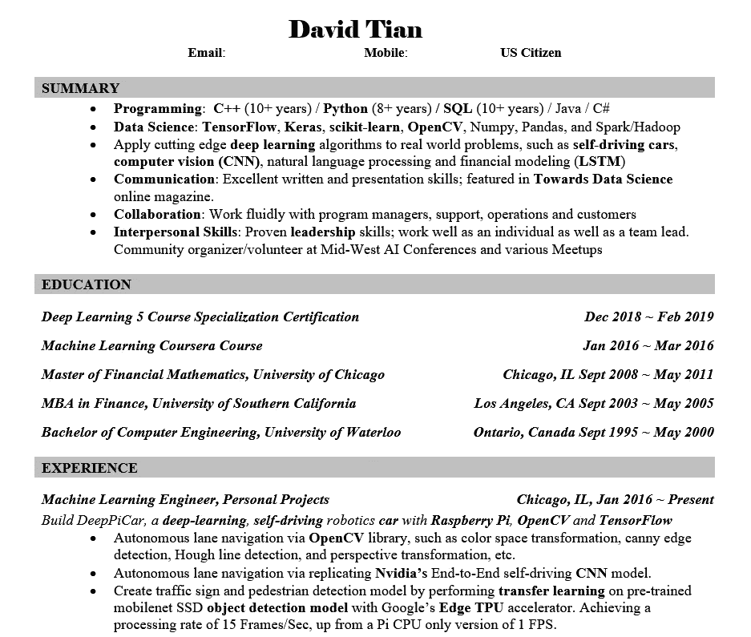**

> ****LinkedIn——让他们来找你！****

**最好的求职申请是那些你永远不必寄出的申请。在我在 LinkedIn 上发布了我的 DeepPiCar 博客帖子之后，我很兴奋地收到了这么多来自招聘人员的消息/电话，包括一些大型自动驾驶公司的消息/电话，问我是否对他们的 ML 工程师角色感兴趣。我对 Medium 博客和 LinkedIn 帖子的力量感到惊讶。但是一定要在 LinkedIn 的隐私设置中将自己标记为“对机会开放”，这样招聘人员就可以很容易地找到你。当招聘人员联系我时，我几乎总能得到一次电话面试。**

**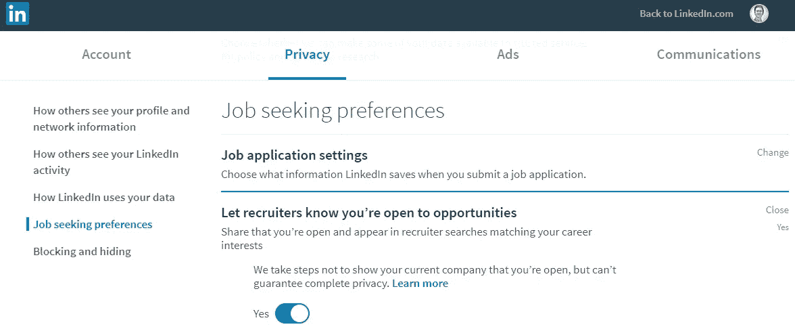**

**[https://www.linkedin.com/psettings/jobs/profile-shared-with-recruiter](https://www.linkedin.com/psettings/jobs/profile-shared-with-recruiter)**

> ****内部推荐——有一个强有力的拥护者****

****

**我认为第二好的工作申请是由内部推荐提交的。我在脸书和谷歌都有一个内部推荐人。我在脸书的第一次面试非常失败，但因为我的推荐给了我一份强有力的推荐信，脸书让我再试一次。幸运的是，一个月后我通过了第二次电话筛选。对于谷歌，这更令人惊讶，部分是因为我的强烈推荐，部分是因为我告诉他们我有其他现场面试，他们直接跳过我去现场面试，即使我是一个远程候选人(顺便说一句，我住在芝加哥)。**

**所以我建议你找任何一个在你想加入的科技公司工作的家庭成员/朋友/同学。如果他们都不在那里工作，也许他们知道谁在那里工作。请让你的朋友把你介绍给他们，也许让他们通过内部推荐提交你的简历。这样你获得电话面试的机会就高多了。**

**另一个方法是明智地使用你的 LinkedIn 网络。你可以寻找在特定公司工作的人，请你们共同的朋友介绍你们两个认识，如果不行，给这个人发一封 LinkedIn 邮件。注意，如果你发送大量 LinkedIn 邮件，你需要 LinkedIn Premium。我注册了大约 3 个月的 LinkedIn Premium(大约 30 美元/月)，能够直接与更多的人联系。一些联系导致了面试。附带的好处是，我收到了比以前更多的招聘信息，因为我相信 LinkedIn 算法将我排在了非付费用户之前。**

> ****第三方招聘机构****

**总的来说，我觉得这次大多数第三方机构都没有很好地为我找工作。作为参考，当我过去寻找金融工作时，我专门使用高管猎头公司，结果很好。但大多数科技巨头都不使用第三方招聘机构。唯一对我有效的代理是 [TripleByte](https://triplebyte.com/iv/Wzwz8pq/cp/header) 和 [DeepLearning.ai](http://DeepLearning.ai) ，我将在下面讨论。**

> **[**三字节**](https://triplebyte.com/iv/Wzwz8pq/cp/header) **—跳过电话面试****

**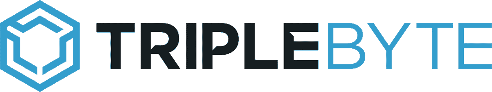**

**TripleByte 是一家非常独特的招聘机构。它对候选人的吸引力在于，一旦候选人通过 TripleByte 全面的 2 小时现场技术筛选测试，他/她就可以直接去许多公司现场工作。它对公司也很有吸引力，因为 TripleByte 将为他们淘汰大多数弱候选人，节省他们的工程师几个小时的电话筛选时间。当我通过 TripleByte 的测试时，我可以从大约 200 家公司中进行选择。他们大多是小型创业公司，但也有不少大公司，如苹果、Adobe、美国运通等。最后面试的是[苹果 Siri 组](https://www.apple.com/siri/)(巨大) [Zoox](https://zoox.com/) (中等) [Determined.ai](https://determined.ai/) (小)现场。他们都在做惊人的工程工作。我强烈建议通过三字节的过程，因为它确定了我的弱点，并使我从许多小时的电话筛选和相关的头痛中解脱出来。[在这里参加 TripleByte 的在线测试](https://triplebyte.com/iv/Wzwz8pq/cp/header)。**

**更新(2020 年 3 月):自 2019 年末起，TripleByte 除了其赛道——软件工程师赛道之外，还增加了一个机器学习工程师赛道。这很好，因为如果你是一名 ML 工程师/数据科学家，你将不需要回答任何前端/Javascript 相关的问题，而是可以专注于 Python、ML 和其他数据科学相关的问题。**

> **[**deep learning . ai**](http://DeepLearning.ai)**和**[**worker a . ai**](http://workera.ai)**—有志于数据科学家/ML 工程师的福音****

**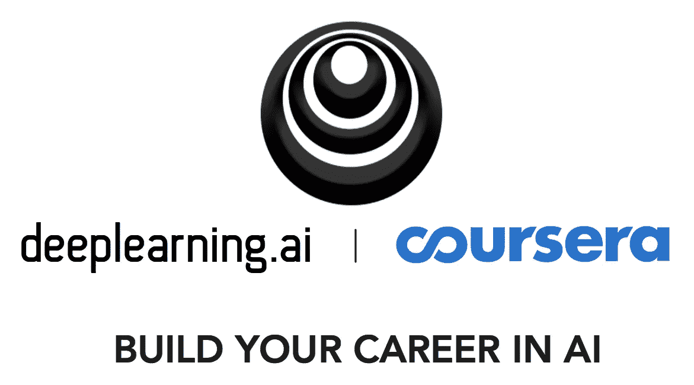**

**如果你是一个有抱负的数据科学家/ML 工程师，你一定听过或上过吴恩达的一门机器学习/深度学习课程，由 Coursera/Deep Learning.ai 提供，实际上 Deep Learning.ai 有两部分，一部分是教育，这是非常众所周知的，另一部分( [Workera.ai](http://Workera.ai) )是招聘，这是比较鲜为人知的。那是因为 Workera.ai 相当新，2019 年年中才开始。他们没有 TripleByte 那么多附属公司，但我相信他们正在迅速加大这方面的努力。他们还会让你做个测试。Workera.ai 和 TripleByte 的测试之间的差异有两个方面。首先，它是为数据科学家(DS)/ML 工程师设计的测试，其中 TripleByte 为一般软件工程师以及 ML 工程师设计了测试。第二，Workera.ai 测试没有约束力，这意味着通过测试不会让你直接进入现场面试。相反，Workera.ai 会把你介绍给一些附属公司的 DS/ML 小组，并把你带到队列的前面，但你仍然需要经历整个电话/现场面试过程。我觉得它仍然非常有价值，因为吴恩达在湾区深度学习领域的声誉和网络相当广泛。我最后采访了 [Pinterest](http://pinterest.com) 和 [Scale.ai](http://scale.ai) 的 ML 团队。如果我直接申请的话，我想我不会得到任何一家公司的面试机会。[点击此处申请 Workera.ai 的经验丰富的工程师人工智能项目](https://workera.ai/candidates/)。**

> ****在线求职板——不要过分依赖它们****

****

**为了扩大搜索范围，我还在 Linkedin、Glassdoor、Indeed 和 ZipRecruiter 等网站上设置了求职提醒，这样只要有符合我搜索标准的新职位发布，他们就会通知我。随着时间的推移，我确实在申请后接到了一些电话面试。总的来说，我发现信噪比有点低，这意味着我会收到很多日常电子邮件，但很少有顶级公司的好工作职能。但是不要完全忽略这个渠道。你需要广撒网，也许你会通过这条渠道抓到一些鱼**

> ****直接应用—实际上不起作用****

**在过去，人们会给公司寄一封漂亮的附有简历的求职信，并期望得到人力资源部的回复。但是这一次，这种方法对我完全不起作用！我确定了大约 10 家我想去工作的公司(大多是自动驾驶汽车公司)，并直接在他们公司的网站上求职页面下申请。令我惊讶的是，我没有收到任何回复，甚至没有一封拒绝邮件！幸运的是，在网上申请每家公司并不需要那么长时间。我会说，仍然适用于任何你感兴趣的公司，但不要屏息等待回音。**

> ****分阶段申请工作****

**试着申请一些你不太感兴趣或者你认为在第一阶段更容易进入的公司。然后在稍后阶段申请你梦想的工作/公司。如果你得到了工作机会，你可以利用第一阶段来练习、提高，甚至利用这些机会从你梦想中的公司获得更好的工作机会。这听起来可能很有争议，似乎非常“唯物主义”，但想想看，许多人会在一个不太知名的公司工作，计划获得经验，然后在几年后进入一个更知名的公司。谁知道呢，如果你没有得到你梦想中的工作，至少你有一些机会可以从你的第一阶段公司中选择。**

> ****变得有条理:记一本日志****

**当你通过这么多渠道申请时，很难跟踪你申请了哪些公司，以及你在每个公司处于哪个阶段。我有详细的面试日志。它按面试阶段(申请、面试、录用、拒绝等)组织，然后按公司组织。每个公司本质上都是一个页面，有背景信息和按时间顺序排列的事件列表，比如电话和面试。这样，我可以看到我申请和面试了哪些公司，这样我就可以做适当的跟进。**

**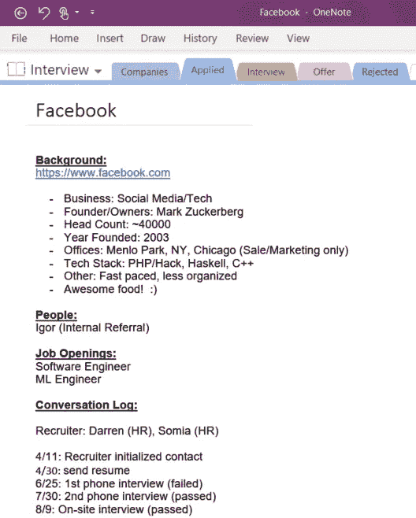**

**My Interview Log for Facebook**

**这个博客已经很长了。我将在[第二部分](https://medium.com/@dctian/career-switchers-guide-to-your-dream-tech-job-part-2-103a97e58c99)和[第三部分](https://medium.com/@dctian/career-switchers-guide-to-your-dream-tech-job-part-3-91d2838058c6)中讲述面试技巧和提供谈判机会。**

**保持冷静，继续学习！**

## **资源**

**这是我在求职过程中使用的资源附录。其中一些在[第 2 部分](https://medium.com/@dctian/career-switchers-guide-to-your-dream-tech-job-part-2-103a97e58c99)和[第 3 部分](https://medium.com/@dctian/career-switchers-guide-to-your-dream-tech-job-part-3-91d2838058c6)中有详细介绍。希望你也会发现它们很有帮助。**

****:这是一款允许不同公司(大多是科技公司)的员工匿名发布问题和答案的应用。人们通常会讨论职业决策、公司文化、面试和薪酬等。我发现这个平台有好有坏。这很好，因为你得到了更坦诚的回答/回应，有时还能得到内部消息。这是不好的，因为有些人因为匿名而写下攻击性的回应，而且环境有时可能是有毒的。你已经被警告了。****

****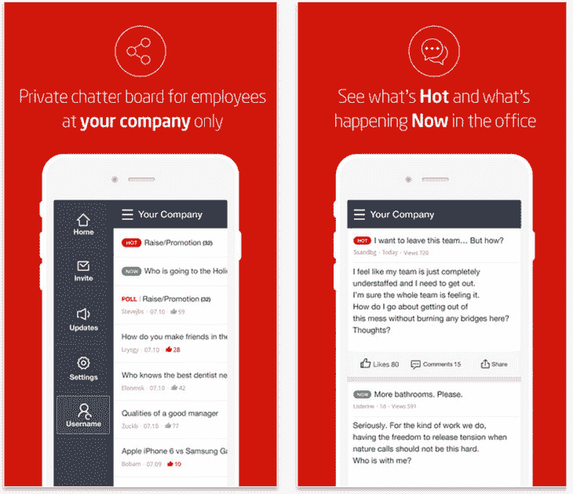****

****Blind.com****

****[**Coursera**](https://www.coursera.org/) :了解自己热衷的学科。这是免费的或象征性收费。我在那里修了 ML 和 DL 课程。****

****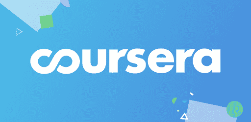****

****[**deep learning . ai**](http://DeepLearning.ai)**和**[**worker a . ai**](http://Workera.ai)****

*   ****如果您对计算机视觉(CV)或自然语言处理(NLP)中的深度学习技术感兴趣，请参加深度学习系列的 5 门课程****
*   ****通过他们的筛选测试，被推荐给顶级科技公司 ML 团队的招聘经理****

****[**编程面试要素**](https://amzn.to/31O2JBe) **书:**这是另一本优秀的面试准备书，类似于 CtCI 书，只不过它更面向有经验的工程师，而 CtCI 则可供没什么算法背景的初学者阅读。****

****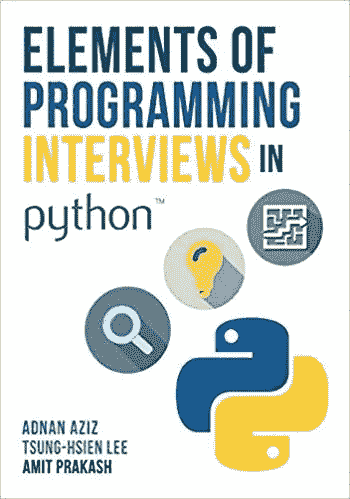****

****[**geeks forgeeks**](https://www.geeksforgeeks.org):和 LeetCode 一样，这也是一个非常全面的 A & DS 问题和解答的网站。这个网站是免费的，有时包含 LeetCode 中没有的实际面试问题。****

****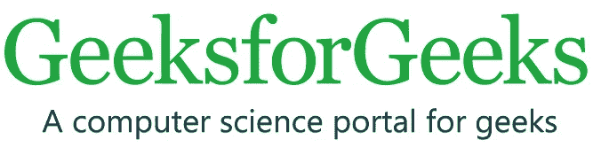****

****[**玻璃门**](https://www.glassdoor.com/index.htm)****

****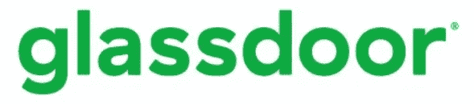****

*   ****查看公司的员工评价****
*   ****查找以前的面试问题****
*   ****设置职务提醒以接收新的职务更新****

****[**谷歌搜索**](https://www.google.com) :人生任何问题的起点。还需要我多说吗？****

****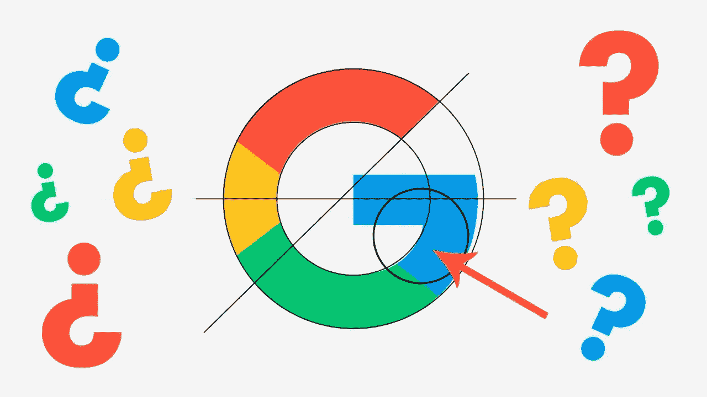****

****Google.com****

****内部员工:永远试着联系你的朋友，或者朋友的朋友，他们在你想申请的公司工作。他们将是你最有效的线人和拥护者。[在 LinkedIn](https://www.linkedin.com/in/dctian/) 上联系我，如果你很合适，我很乐意推荐你。****

****[leet code](http://leetcode.com)****

*   ****练习 A&DS 问题****
*   ****使用 leet code Premium(35 美元/月或 99 美元/年，带优惠券)来查找特定公司过去提出的面试问题。我建议支付年度会员费。就当是你编码大脑的健身房会员吧。****

****参考消息:这个网站按公司、资历、地点和工作职能列出了众包薪酬信息，因此你会知道你是否得到了公司的公平报价。当然，这只对大公司有效，因为有更多的数据点。****

****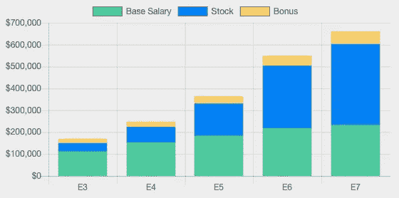****

****levels.fyi****

****[**LinkedIn**](http://Linkedin.com) :****

*   ****查找人员的专业和教育背景****
*   ****打开“向新机会开放”设置，以便招聘人员可以找到您。****
*   ****使用 LinkedIn Premium 联系你感兴趣的人****
*   ****设置职务提醒以接收新的职务更新****

****[**中型博客网站**](https://medium.com) :****

*   ****阅读教程和方法来帮助你的个人项目****
*   ****在 Medium 上写博客，展示你自己的个人项目****

********

****[**TripleByte**](https://triplebyte.com/iv/Wzwz8pq/cp/header) :跳过电话面试，如果你通过了他们的技术筛选，直接去现场。参见上面的详细描述****

****[**YouTube**](https://youtube.com)****

********

*   ****当您处理个人项目时，请观看教程和操作指南****
*   ****观看系统设计和算法视频****
*   ****注意:在面试准备期间，不要分心，看几个小时的视频来找乐子！****

****声明:除非另有说明，否则照片和图像来自 Unsplash 或 Pixabay。公司标志和商标是合理使用。我不隶属于上述任何公司或产品，除了我目前在谷歌公司工作。****