# CASM =分形

> 原文：<https://towardsdatascience.com/casm-fractals-2b9835f71c53?source=collection_archive---------29----------------------->

## 计算机、艺术、科学和数学。

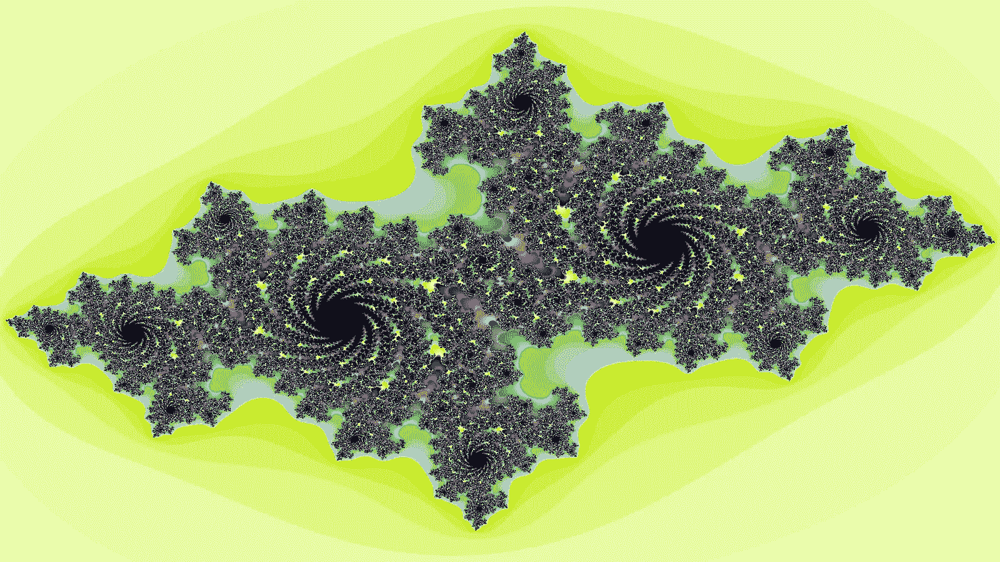

Just to catch your attention

在高中，我们接触到了几何。尤其是欧几里得几何。即使在我们的大学经历中，欧几里得几何也是那些不是主修需要更高水平数学的领域的学生的重点。然而，还有更多我们通常不会深入研究的几何范畴。

任何不是欧几里得几何的类型都被称为非欧几里得几何。虽然非欧几里得几何告诉我们，我们正在看的不是我们熟悉的东西，但它并没有告诉我们我们正在观察的几何的具体类型。

riefly，欧几里得几何是一个基于一小组假设的系统。这些假设被称为公设或公理。欧几里德在他的书《原本》的开头给出了五个公理，所有的定理或真陈述都可以从这些公理中推导出来。在我们可以在另一个证明中使用一个额外的定理之前，我们必须首先使用最初提供的五个公理来验证它。这篇文章实际上并不是关于欧几里德几何的，所以现在描述一下就够了。

下面这个模型是基于欧几里德几何的。但是，请注意它是如何遍历各种圆圈和颜色来创建一个漂亮的图像的。现在想象一下你能用非欧几里得几何做什么。

下面是一个列表，无论如何也不全面，列出了其他存在的几何图形:

*   双曲线几何
*   椭圆几何学
*   球形几何
*   抛物线几何
*   离散几何
*   希尔伯特几何
*   **分形几何**(这是我们博客第一部分的重点)

为了找到其他类型的几何图形，维基百科有一个很好的列表:【https://en.wikipedia.org/wiki/List_of_geometry_topics 如果你想了解更多，你可以在那里点击每一个。

分形几何是一个令人着迷的探索课题。这确实是数学的一个分支，但他们的渲染是如此美丽，他们已经成为艺术世界不可或缺的一部分。分形在计算机发明之前就已经被探索过了。想象一下。它们是在英国制图员试图测量英国海岸长度时被偶然发现的。他们看得越仔细，海岸线就变得越详细越长。他们实际上发现了分形的一个主要特性。

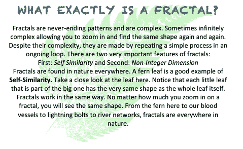

What is a Fractal?

使用一个简单的等式，我们可以确切地看到迭代是如何发生的。

我们首先用一个值代替 x。求解 y 的方程。然后取 y 的值，并将其作为新的 x。说明这一点的最佳方式是实际使用真实值。

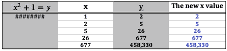

Iteration

我们的第一个值是 x 的 1，这给了我们 y 的 2，这给了我们坐标(1，2)。现在我们用 2 代表 x，这样我们得到 5 代表 y，我们的下一组坐标是:(2，5)。这里的五组坐标分别是 **(1，2) (2，5) (5，26) (26，677) (677，458330)。这个迭代继续下去，如果我们选择的话，会给我们一个无限的坐标集合。**

这是一个简单的等式，但如果我们有 z = z + C，C 是一个常数，但让我们把“z”变成一个复数(a + bi)。

正是这个复数创造了我们所看到的分形之美。这些复杂的数字和公式在我们的世界里随处可见。一个这样的例子是心电图，也称为 EKG 或 ECG。医生们经常在他们的办公室里使用 EKG 来读取一个人的心脏功能。这只是详尽清单中的一个例子。

**非整数维**可以通过使用经典几何来最好地解释。经典几何使用整数维的对象。例如，一维直线和曲线，二维平面图形。想想长方形和圆形。像骰子和篮球这样的三维立体。分形不像经典几何那样直接。它们处理更复杂的数字，并具有迭代函数。

以上是我在这里真正想做的事情的背景。我想向你展示计算机创造分形的能力以及由此产生的美。一些使用数据集来创建多个分形，另一些使用递归来迭代函数。这里所有的分形都是用 Python 创建的。

让我们从一些 Julia 集分形开始。我这里有一个系列，每个渲染之间有一个简单的区别。在放大最初的数字后，你仍然可以获得惊人的细节。

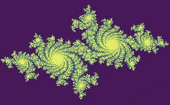

Full Fractal

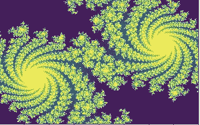

Zoomed In by two

**我在这里只用了 2 倍的变焦。让我们看看当我进一步放大时会发生什么。**

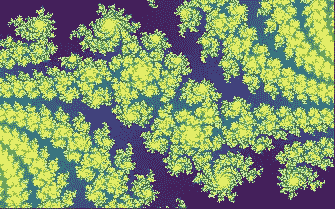

Zoomed in by four

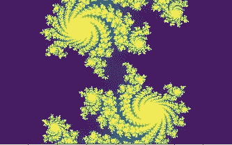

Zoomed in by sixty

你在这里看到的东西真是令人难以置信。从第一张图片到第二张图片，我使用了 2 倍的缩放。第三张图片，我用了 4 倍的变焦。换句话说，是原始图像的四倍，但只是第二个图像的两倍。最后一张图像的缩放比例为 60。想想我们在放大 60 倍的情况下深入分形有多深。细节不亚于原来，设计继续重复自己。事实上，看起来我们几乎是缩小了而不是放大了。这有点令人着迷。

我用 Mandelbrot 集合创建了一些类似的东西，但是这里我只有两个图像。看看第二个图像与第一个图像相比有多精确。这不是模糊或静音，而是刚刚放大的第一张图像的确切细节。从第一个到第二个研究细节。

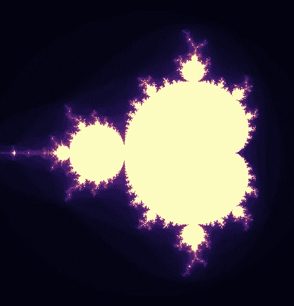

Full Fractal

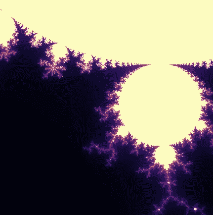

Zoomed In

只是为了一些有趣的颜色，我为你创造了另外两个图像。它们都是 mandelbrot 集。你可以在这里看到，仅仅通过改变所使用的颜色，你就可以改变一幅图像的外观。

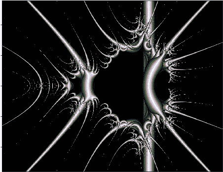

Simple Colors

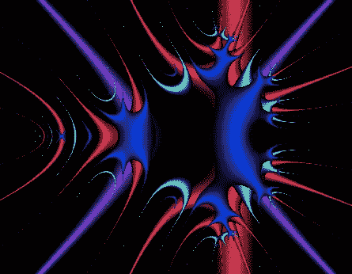

A bit more colorful

当我开始这篇文章时，我打算只展示分形。在研究分形和公式产生的图像时，我遇到了另一种完全来自数学和数据的艺术。视觉混沌吸引子甚至比你在这里看到的分形更加非凡。这是我下一篇文章的预告片。这被称为 Clifford 吸引子。使用数据集和 python，创建了以下视觉效果。这只是黑白的阴影。在我的下一篇文章中，我将向您展示如何使用吸引子来创建各种颜色的杰作。

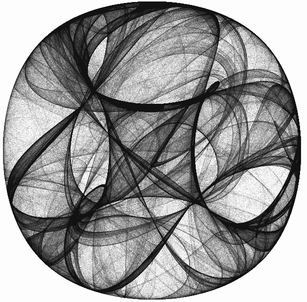

Fascinating Shades

为了让你看得开心，下面是一个一小时的视频，放大了曼德勃罗分形。催眠，上瘾，或放松…你选择。