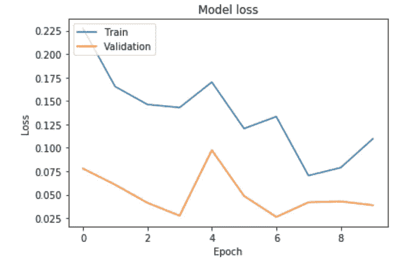

# 猫，狗，还是埃隆马斯克？

> 原文：<https://towardsdatascience.com/cat-dog-or-elon-musk-145658489730?source=collection_archive---------7----------------------->

## 终极 DIY 机器学习初学者指南

## 了解如何用 Python 和 Keras 在不到 15 分钟的时间内构建一个图像识别卷积神经网络！


G 从机器学习起步的尝试令人望而生畏。底层的概念是高级的，相关的术语是特定于领域的和技术性的。除此之外，机器学习恰好是研究和实践中发展最快的领域之一，这使得跟上时代变得更加困难。

本文为您提供了一个简单的(附带代码的)介绍，介绍如何设置、训练和运行卷积神经网络来对图像进行分类。到本文结束时，你将已经建立了一个卷积神经网络，可以区分猫、狗和埃隆·马斯克。它非常容易采用，如果你喜欢，你可以在组合中加入一棵树或一辆车。我强烈建议你自己完成这些步骤，因为这样做会在记忆和满足感方面产生最好的效果。

> 随着技术的进步，它一次又一次地逆转了每一种情况的特征。自动化时代将是“自己动手”的时代。—马歇尔·麦克卢汉

注意:为了简短起见，我会跳过有时过于简单的话题。我们的目标是让你开始学习，而不是取代正式的关于机器学习的计算机科学课程。

# 文章的结构:

1.  先决条件和设置
2.  什么是 ImageNet 和 MobileNet？
3.  迁移学习
4.  自定义您的 MobileNet 版本
5.  训练模型
6.  做预测

# ①先决条件和设置


Photo by [dylan nolte](https://unsplash.com/@dylan_nolte?utm_source=medium&utm_medium=referral) on [Unsplash](https://unsplash.com?utm_source=medium&utm_medium=referral)

一个 Python 环境(建议 Jupyter 笔记本)。如果你还没有设置这个，不要担心。这是毫不费力的，不到 10 分钟。

[](/get-started-with-python-e50dc8c96589) [## 所以你想成为一名数据科学家？

### 到底是什么阻止了你？下面是如何开始！

towardsdatascience.com](/get-started-with-python-e50dc8c96589) 

我们将使用 [TensorFlow](https://www.tensorflow.org/) 和 [Keras](https://keras.io/) 。由谷歌大脑团队创建的 TensorFlow 是一个用于数值计算和大规模机器学习的开源库。Keras 是一个位于 TensorFlow 之上的高级神经网络 API。Keras 最近已经集成到 TensorFlow 中，可以通过`tensorflow.keras`访问。所以还是装 TensorFlow 吧。

```
pip install tensorflow**# For progress visualization when training the model**
pip install keras_tqdm**# Required for keras_tqdm**
pip install ipywidgets
jupyter nbextension enable --py widgetsnbextension
```

我建议在专用的 Python(虚拟)环境中运行笔记本，以防止与您可能有的其他项目发生潜在冲突。随着你职业生涯的进展，虚拟环境将变得更加重要。你会有一些偶尔会回来的项目。对于那些项目，您可能已经使用了您想要继续使用的特定库的特定版本，而不是重构您的整个旧代码来使用新版本。

到训练一个机器学习网络，你需要数据。由于我们正在建立一个图像分类器，我们将需要图像。你需要为每门课下载至少几百张你想要预测的图片。幸好我一直未雨绸缪，为你准备了快速下载图片的指南。

[](/image-scraping-with-python-a96feda8af2d) [## 使用 Python 进行图像抓取

### 学习如何用 Python 从 Google 下载图片的代码指南！

towardsdatascience.com](/image-scraping-with-python-a96feda8af2d) 

为了让所提供的 Jupyter 笔记本能够完美地工作，你的文件夹结构应该是这样的，每个文件夹应该包含大约 200-300 张图片。图片的名称和大小并不重要。


# ②什么是 ImageNet 和 MobileNet？


Photo by [Anastasia Dulgier](https://unsplash.com/@dulgier?utm_source=medium&utm_medium=referral) on [Unsplash](https://unsplash.com?utm_source=medium&utm_medium=referral)

## MobileNet

我们将使用 [MobileNet](https://ai.googleblog.com/2017/06/mobilenets-open-source-models-for.html) 作为基础模型。MobileNet 是 Google 开发的轻量级卷积神经网络，已经在 Imagenet 上进行了训练。原文[可以在这里](https://arxiv.org/abs/1704.04861)找到。谷歌最近发布了新版 MobileNet， [MobileNetV2](https://ai.googleblog.com/2018/04/mobilenetv2-next-generation-of-on.html) 。

## Imagenet

I [magenet](http://www.image-net.org/) 是一个约 1500 万的大范围标记图像数据库，按照 [WordNet](http://wordnet.princeton.edu/) 层次结构(目前只有名词)组织。成百上千的图像描绘了层次结构的每个节点。Imagenet 通常用于训练图像识别模型。模型的质量通常通过它们在[**ils vrc**](http://image-net.org/challenges/LSVRC/)**(ImageNet 大规模视觉识别挑战)上的表现来评估。ILSVRC 非常好，因为它保证了一个公共基线，并提供了模型之间的一些可比性。**

# **③迁移学习**

****

**Photo by [Jonathan Borba](https://unsplash.com/@jonathanborba?utm_source=medium&utm_medium=referral) on [Unsplash](https://unsplash.com?utm_source=medium&utm_medium=referral)**

**到最好解释迁移学习，让我们快速看一下卷积网络的典型架构。**

****

**An exemplary architecture of a convolutional neural network, highlighting feature extraction and classification**

## **特征抽出**

**T 在典型的卷积神经网络中，较低层(更接近输入的网络层次)可以被认为是逐片扫描整个图像的过滤器。然后，将这些扫描的结果组合起来，创建每个都有单个值的节点。**

## **分类**

**在网络的分类部分，我们使用由特征提取部分生成的单值节点的最后一个长列表来将它们映射到我们想要的输出。也就是说，如果我们的输出是一些货币值，那么我们可能只有一个最终节点，表明该值(回归)。如果我们试图对多个对象进行分类，我们将需要和我们拥有的类一样多的最后节点。**

## **训练一个神经网络意味着什么？**

**这有助于将神经网络视为一个大的功能。它有一个输入(图像)和一个输出(预测)。
在网络训练过程中，优化器不断优化该函数。优化网络意味着改变网络节点之间连接的权重。该优化基于损失函数。本质上，该损失函数是通过将预测与实际结果进行比较，为每个输入的函数结果分配损失值的函数。更高的损失值是不好的，优化器知道最近的更改不是一个好主意，会尝试其他方法。**

## **迁移学习**

**转移学习只能应用于以前训练过的模型。通常，这些模型会在运行数天的大型 GPU 上进行训练，以找到最佳权重来生成尽可能好的预测。**

****

**The architecture of a VGG16 convolutional neural network**

**虽然上图描述的是 VGG16 模型的架构，而不是 MobileNet 网络，但它的相似性足以说明这一点。输入图像有三个通道(红色、绿色和蓝色)。然后，图像经过大量的转换、过滤、合并、卷积等等，最终在一个包含 1000 个结果值的层中结束(类别为[**ils vrc**](http://image-net.org/challenges/LSVRC/)**)**)。**

**当使用迁移学习时，我们本质上说:**

> **“去你的结果，但谢谢你的工作”**

**换句话说，我们将切断网络的最后一部分(在上面的例子中，是 1x1000 层)，并用一个更适合我们需要的层来代替它(对于猫、狗或 Elon 问题，是 1x3 层)。实质上，我们保留了为网络的特征提取部分寻找最佳权重的所有工作，同时为我们的自定义分类层替换掉网络的最后一部分。虽然并不完美，但这种方法产生了惊人的好结果，只需要训练时间的一小部分。这种不完美源于这样一个事实，即你的模型可能已经学会了，除了别的以外，识别像毛发一样的表面。当你想要区分不同种类的树时，识别像皮毛一样的表面可能没有帮助。然而，能够定位原始形状和模式——这是在网络的较低部分学习的——对于区分树木非常有帮助。**

# **④定制您的 MobileNet 版本**

****

**Photo by [Aaron Huber](https://unsplash.com/@aahubs?utm_source=medium&utm_medium=referral) on [Unsplash](https://unsplash.com?utm_source=medium&utm_medium=referral)**

## **进口**

```
import tensorflow as tf
import PIL
```

## **助手功能**

**我们稍后会用到的两个辅助函数。**

## **加载 MobileNet 基本模型**

**L et 首先加载默认模型，以了解当我们应用迁移学习时，后来到底发生了什么。**

```
model = tf.keras.applications.mobilenet.MobileNet()
model.summary()
```

**运行前面的代码片段将产生一个模型中所有层的长列表，从最低层(InputLayer)到最高层(这里称为 act_softmax)。**

****

**Screenshot of the lowest and topmost layer of the MobileNet model.summary(). I omitted the middle layers for space reasons.**

**我们可以看到最后一层的输出形状为(无，1000)，这意味着它将产生 1000 个值。让我们通过运行以下命令来快速验证:**

```
dog_image_id = os.listdir('images/dog')[0]dog_image = load_image(os.path.join('images/dog',dog_image_id))print(f'shape: {dog_image.shape}')
print(f'type: {type(dog_image)}')model.predict(dog_image)
```

**这个命令将创建一个包含 1000 个值的 Numpy 数组。**

****

**A random image of a dog fed to the default MobileNet configuration**

## **加载用于迁移学习的 MobileNet 模型**

```
model = tf.keras.applications.mobilenet.MobileNet(
  input_shape=(224, 224, 3), 
  include_top=False, 
  pooling='avg'
)
```

**我们加载模型的主要区别是我们现在使用参数`include_top=False`。当使用这个参数时，我们还必须指定 input_shape 和 pooling，这可以在[文档](https://keras.io/applications/#mobilenet)中读到。通过指定`include_top=False`，我们实例化了没有最高层的模型(即，1000 个类的预测)。**

**运行`model.summary()`给了我们:**

****

**MobileNet model with include_top=False**

**我们现在可以清楚地看到，模型的最顶层是 global_average_pooling，而不是我们之前看到的 softmax 层。此外，参数的总数已经显著下降。为了确认新的结果值，我们可以运行`model.predict(dog).shape`来查看我们现在将获得 1024 个而不是 1000 个值。考察这些数据也表明，它们与之前的预测大相径庭。区别是因为还没有进行分类，那些 1024 值表示一些抽象特征的存在。**

## **添加附加层**

**为了预测猫狗和埃隆马斯克，我们必须替换原始模型中的预测层。为此，我们添加了三个新层:**

*   ****删除:**在训练过程中删除节点，以防止过度拟合**
*   ****密集:**全连接层(即该层中的每个节点都连接到前一层中的每个节点)**
*   ****Softmax:** 指定输出值的函数。Softmax 意味着层中所有节点(我们的三个密集节点)的总和必须为 1。可以理解为一种概率**

```
from tensorflow.keras.models import Model
from tensorflow.keras.layers import (Dropout, Dense, Softmax)x = Dropout(rate=0.4)(model.output)
x = Dense(3)(x)
x = Softmax()(x)
model= Model(model.inputs, x)
```

**再次运行`model.summary()`将在模型顶部显示新图层。**

# **⑤训练模型**

****

**Photo by [Josh Riemer](https://unsplash.com/@joshriemer?utm_source=medium&utm_medium=referral) on [Unsplash](https://unsplash.com?utm_source=medium&utm_medium=referral)**

**这开始变得令人兴奋了！我们快到了。**

## **指定要训练的层**

**如果我们从头开始，我们现在将训练整个网络和随之而来的数百万个参数。但幸运的是，我们不必那样做。所有下层都是之前训练过的！所以让我们确保只训练新的层。对于生产模型，您通常还会在初始磨合阶段后训练较低的层，此时您只训练新的层。**

```
for layer in model.layers[:-3]:
    layer.trainable = False
```

## **编译模型**

**让我们通过运行带有优化器和损失函数的`model.compile`来配置我们的训练模型。有很多不同的优化器和损失函数，但是`[Adam](https://keras.io/optimizers/#adam)`和`[categorial_crossentropy](https://keras.io/losses/)`是很好的默认值。如果你好奇，就去读读它们，但是不要在丛林中迷路。**

```
from tensorflow.keras.optimizers import Adam
model.compile(
    optimizer=Adam(lr=0.001),
    loss='categorical_crossentropy'
)
```

## **构建数据生成器**

**答差不多了，我们已经指定了训练和验证数据，我们可以开始了！**

**我们首先构建一个数据生成器`datagen`，并指定几个参数来定义我们想要在训练过程中应用于图像的增强。我们还为`training`和`validation`指定了一个`save_to_dir`文件夹，并预先保证它们的存在。这样做将允许我们检查在训练过程中创建的增强图片。如果你不想那样，就把线拆了。**

## **训练模型**

**A 好了，该训练模特了！我们使用`fit_generator`是因为我们之前已经创建了两个生成器，一个用于训练数据，一个用于验证数据。我们还使用回调来直观地显示我们训练的进度。**

**运行这个意味着，我们要等一会儿。在我的 MacBook Pro 上，大概是 10 分钟。您的里程可能会因硬件而异。如果你想走过场，你也可以设置`epochs=1`，这样会快很多。**

**在培训过程中，您应该会看到类似这样的内容:**

****

**训练完成后，我们可以通过运行以下命令来检查进度:**

```
import matplotlib.pyplot as plt
plt.plot(history.history['loss'])
plt.plot(history.history['val_loss'])
plt.title('Model loss')
plt.ylabel('Loss')
plt.xlabel('Epoch')
plt.legend(['Train', 'Validation'], loc='upper left')
plt.show()
```

**这将为我们提供:**

****

**Typical model training progression, loss decreases quickly at first and then flattens out after some epochs**

# **⑥进行预测**

****

**Photo by [Jen Theodore](https://unsplash.com/@jentheodore?utm_source=medium&utm_medium=referral) on [Unsplash](https://unsplash.com?utm_source=medium&utm_medium=referral)**

**酷，我们已经成功训练了模型！让我们看看它在预测图像方面的表现如何。让我们加载一个随机的猫、狗和 Elon Musk 图像。**

```
elon_with_disguise = load_image('elon_with_disguise.png')
elon_without_disguise = load_image('elon_no_disguise.jpg')random_cat = random.choice(os.listdir('images/cat/'))
cat_path = os.path.join('images/cat',random_cat)
cat = load_image(cat_path)random_dog = random.choice(os.listdir('images/dog/'))
dog_path = os.path.join('images/dog',random_dog)
dog = load_image(dog_path)
```

**要检查图像运行(在每个单独的单元格中):**

```
tf.keras.preprocessing.image.load_img('elon_with_disguise.png', target_size=(224,224))tf.keras.preprocessing.image.load_img('elon_no_disguise.jpg', target_size=(224,224))tf.keras.preprocessing.image.load_img(cat_path, target_size=(224,224))tf.keras.preprocessing.image.load_img(dog_path, target_size=(224,224))
```

**对于实际预测，我们得到:**

****

**伪装伊隆的尝试不错，但我们的模特看穿了这一点！**

# **结束语**

**在[推特](https://twitter.com/boslerfabian)上关注我，在那里你可以见到我可爱的机器人给你发送最新最棒的当然也是随机的内容。我可能很快会写一篇关于这个的文章。**

**更严重的是，如果你想聊天，请联系 LinkedIn。**

**看看我在 Medium 上写的其他文章，如果你喜欢这篇文章，请留下一两个掌声。**

****不断学习、探索、建设，自己动手就好！****