# 猫或狗——卷积神经网络图像分类

> 原文：<https://towardsdatascience.com/cat-or-dog-image-classification-with-convolutional-neural-network-d421a9363c7a?source=collection_archive---------12----------------------->

## 基于 Keras 和 TensorFlow 的卷积神经网络(CNN)图像分类实验

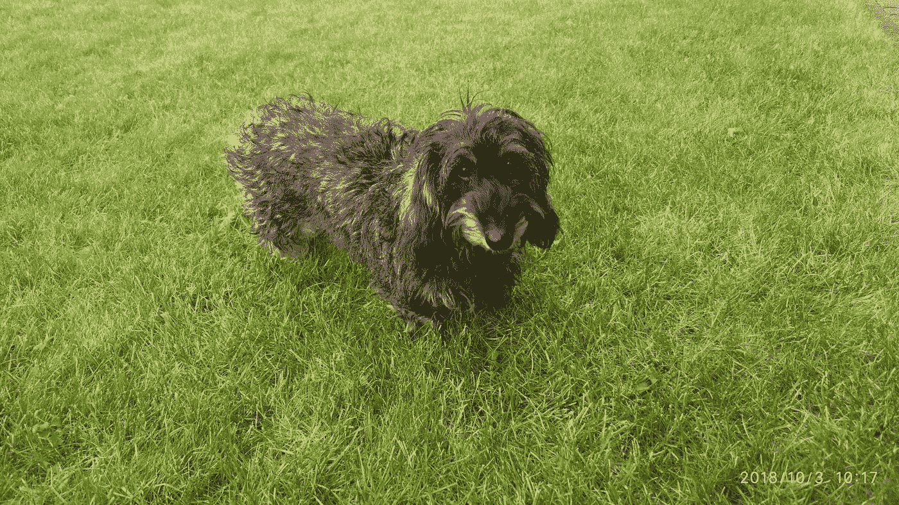

Our dog — Dachshund (Miniature Wire Haired)

这篇文章的目标是展示 conv net(CNN——卷积神经网络)是如何工作的。我将使用 Franç ois Chollet 的书— [用 Python 进行深度学习](https://www.manning.com/books/deep-learning-with-python)中描述的经典猫/狗分类示例。这个例子的源代码可以在 Fran ois Chollet[GitHub](https://github.com/fchollet/deep-learning-with-python-notebooks)上找到。我用这个源代码来运行我的实验。

Convnet 的工作原理是将图像特征从细节中抽象为更高层次的元素。可以用人类的思维方式来进行类比。我们每个人都知道飞机看起来是什么样子，但最有可能的是，当想到飞机时，我们并没有想到飞机结构的每一个细节。以类似的方式，convnet 学习识别图像中更高级别的元素，这有助于在新图像看起来与用于训练的图像相似时对其进行分类。

应该使用这个[笔记本](https://github.com/fchollet/deep-learning-with-python-notebooks/blob/master/5.2-using-convnets-with-small-datasets.ipynb)训练图像分类模型(你会在那里找到关于从哪里下载带有猫狗图像的图像数据集的描述)。该[笔记本](https://github.com/fchollet/deep-learning-with-python-notebooks/blob/master/5.4-visualizing-what-convnets-learn.ipynb)中正在使用模型并调用分类预测。为了方便，我把自己的笔记本(基于*深度学习用 Python* 书的代码)上传到了 [GitHub](https://github.com/abaranovskis-redsamurai/automation-repo/tree/master/convnet) 。

我在 Jupyter Docker image 中运行 notebook 时，应该更新图像数据集的路径(请参考我的 GitHub repo 中的代码示例)，您应该使用 Docker 配置的路径作为根来从磁盘中获取数据集图像:

```
# The path to the directory where the original
# dataset was uncompressed
original_dataset_dir = '/home/jovyan/work/study/python/dogs_vs_cats/train'# The directory where we will
# store our smaller dataset
base_dir = '/home/jovyan/work/study/python/dogs_vs_cats_small'
os.mkdir(base_dir)
```

使用数据子集构建模型:

1.  用于训练的 1000 只猫和 1000 只狗的图像
2.  用于验证的 500 只猫和 500 只狗的图像
3.  用于测试的 500 只猫和 500 只狗的图像

第一次模型训练尝试直接使用来自数据集的可用图像来完成。Convnet 训练使用 Keras 和 TensorFlow 后端识别猫和狗。但是过拟合发生在早期迭代中。这是我执行的培训的结果——验证性能没有提高，当培训性能提高时——conv net 根据培训数据进行调整，但在验证数据方面表现不佳:

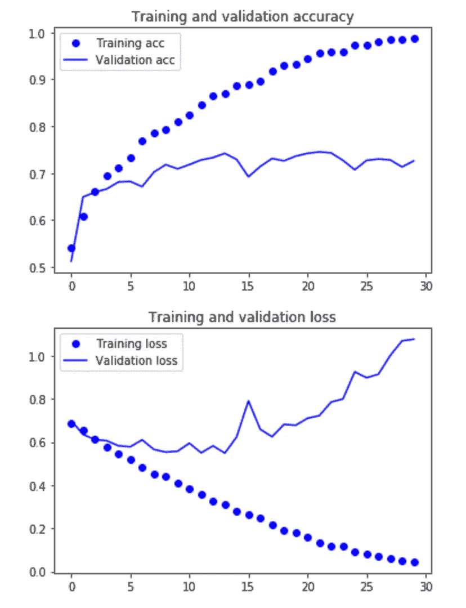

Convnet model training results

为了对抗过度拟合，通过应用数据扩充技术来提供更多的训练数据。扩充过程允许通过改变现有数据从现有数据生成更多的训练数据。应用随机变换来调整现有图像，并从一个图像中创建多个图像(参考来源于使用 Python 的*深度学习*一书)。

数据扩充后，convnet 的训练效果明显更好，验证质量与训练质量非常接近:

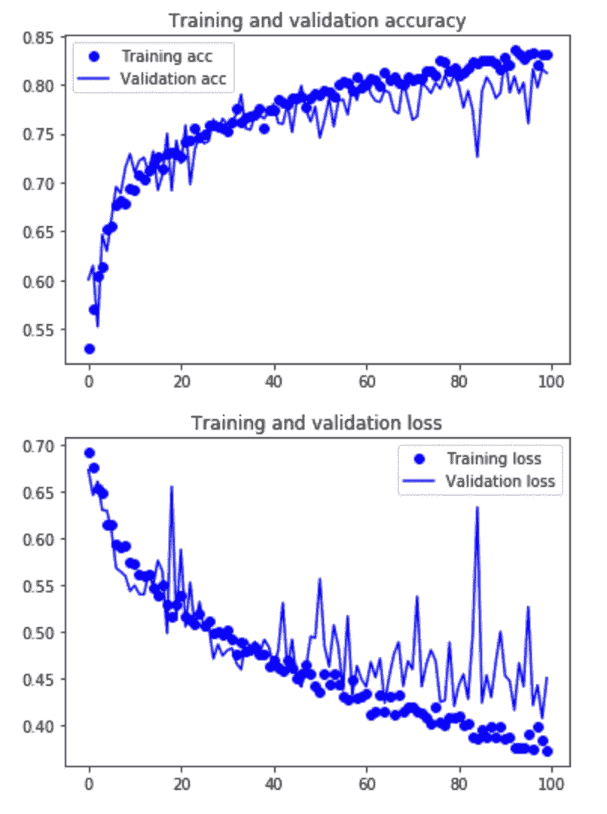

Convnet model training results after data augmentation

基于 convnet 模型的图像分类在端点[笔记本](https://github.com/abaranovskis-redsamurai/automation-repo/blob/master/convnet/cats_dogs_endpoint.ipynb)中完成。一个好的做法是保存训练好的模型，稍后重新打开它用于分类任务:

```
from keras.models import load_modelmodel = load_model('cats_and_dogs_small_2.h5')
```

我将用我们的狗图像测试模型。让我们基于模型分类结果来看看我们的狗看起来和狗有多接近:)(好吧，至少基于用于 convnet 训练的那 1000 张狗图片)。

我将使用 11 张图片，所有图片都将与 Python 笔记本一起上传到 GitHub repo。第一张图:

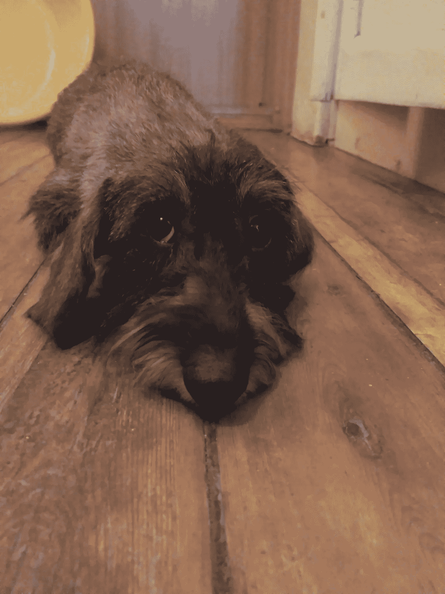

Our dog — Jelly

使用来自*深度学习与 Python* 书的代码将图像转换成发送给 *model.predict* 函数的格式:

```
img_path = '/home/jovyan/work/study/python/dogs_vs_cats_small/test/dogs/dog.2000.jpg'# We preprocess the image into a 4D tensor
from keras.preprocessing import image
import numpy as npimg = image.load_img(img_path, target_size=(150, 150))
img_tensor = image.img_to_array(img)
img_tensor = np.expand_dims(img_tensor, axis=0)
# Remember that the model was trained on inputs
# that were preprocessed in the following way:
img_tensor /= 255.# Its shape is (1, 150, 150, 3)
print(img_tensor.shape)
```

显示 150x150 像素的变换图像可能很有用:

```
import matplotlib.pyplot as pltplt.imshow(img_tensor[0])
plt.show()
```

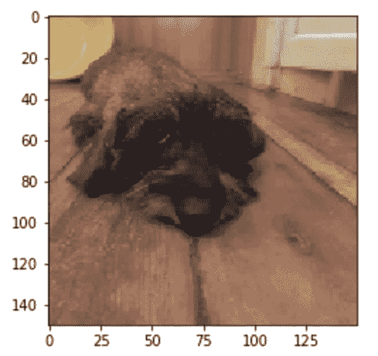

Transformed image

分类结果:58%是狗。我认为这是一个很好的结果，超过 50%对狗来说是好的，低于 50% = >对猫来说是好的。

```
prediction = model.predict(img_tensor)
print(prediction)[[ 0.5823279]]
```

我们用更多的图片重复同样的步骤(调用 *model.predict* 函数)。

*   狗:53%(好)

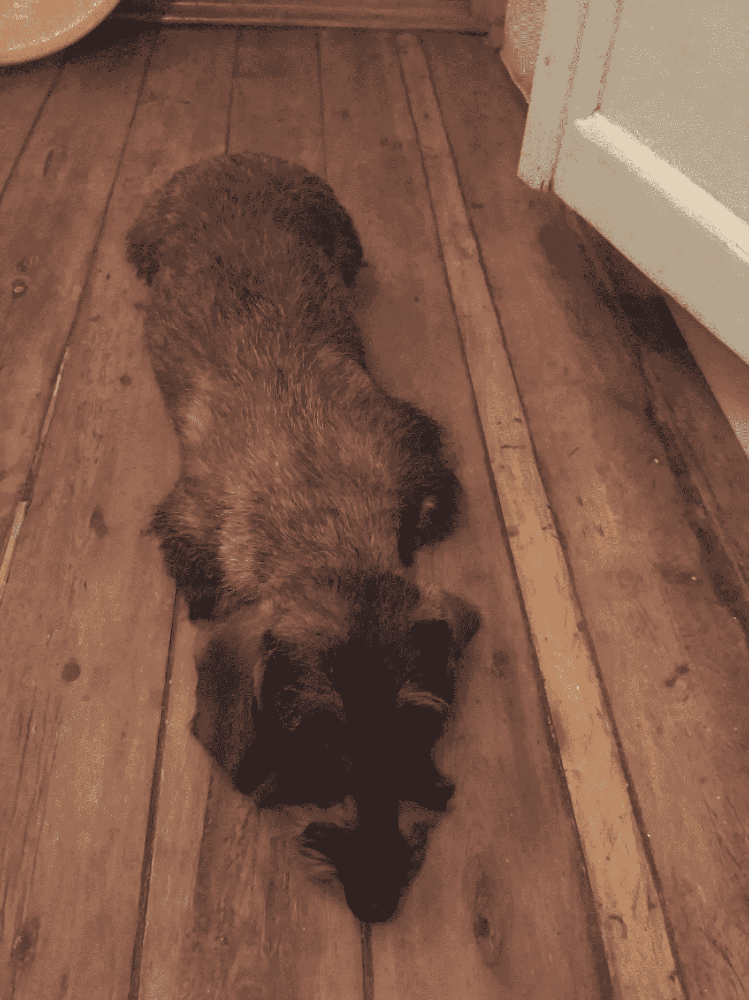

Our dog — Jelly

*   狗:53%(好)

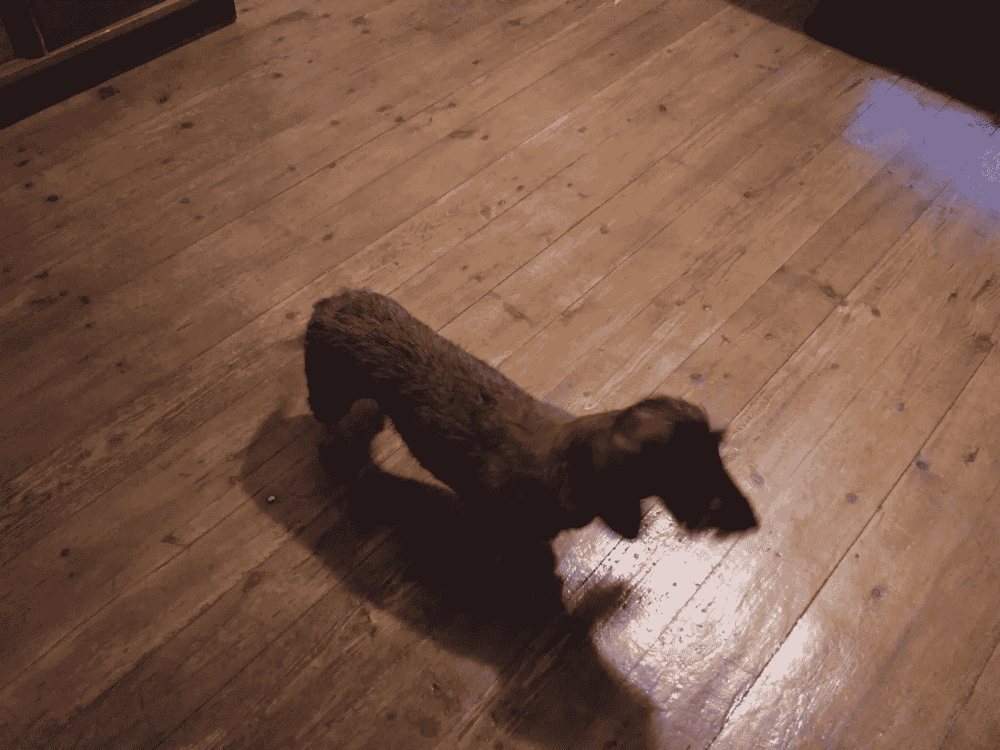

Our dog — Jelly

*   猫:43%(不好)。从这张照片中，康文内特无法判断这是一只狗。嗯——有道理，也许在那张图中它看起来更像一只猫。

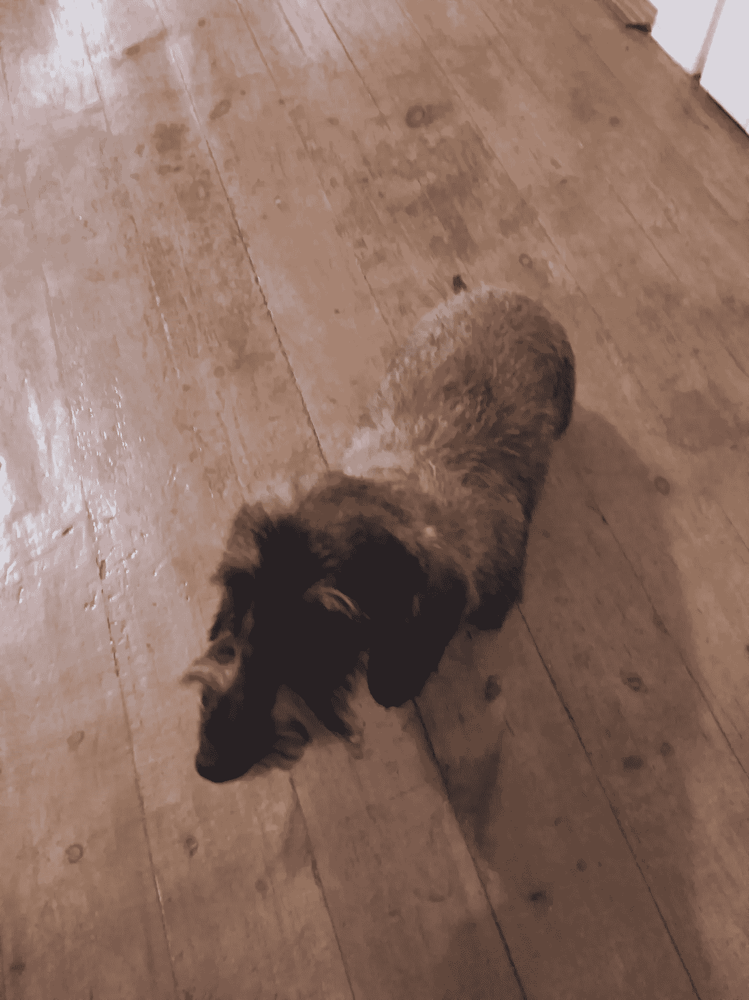

Our dog — Jelly

*   狗:88%(非常好)。除了各种分散注意力的颜色，convnet 能够清楚地识别这里的狗。好像狗的脸显示得更清楚——因为 convnet 更容易识别狗。

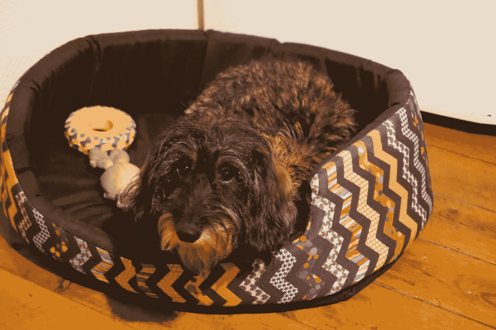

Our dog — Jelly (needs haircut)

*   狗:55%(好)

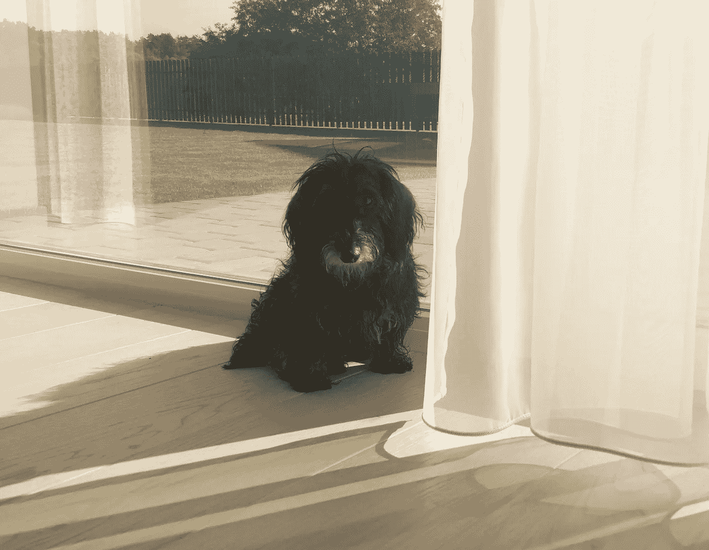

Our dog — Jelly (needs haircut)

*   狗:100%(优秀)。


Our dog — Jelly (needs haircut)

*   狗:89%(非常好)。即使有黑色背景，分类也非常有效。

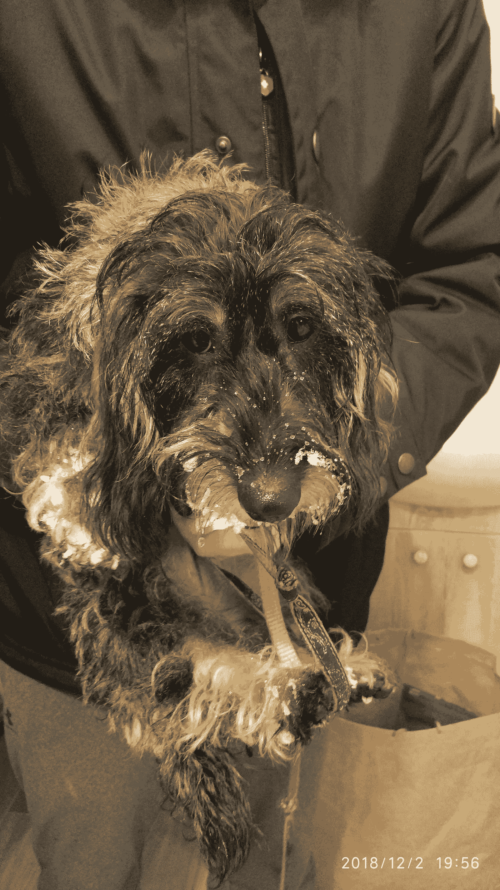

Our dog — Jelly (winter time)

*   猫:19%(很差)。在这张照片中，我们的狗看起来更像一只猫。

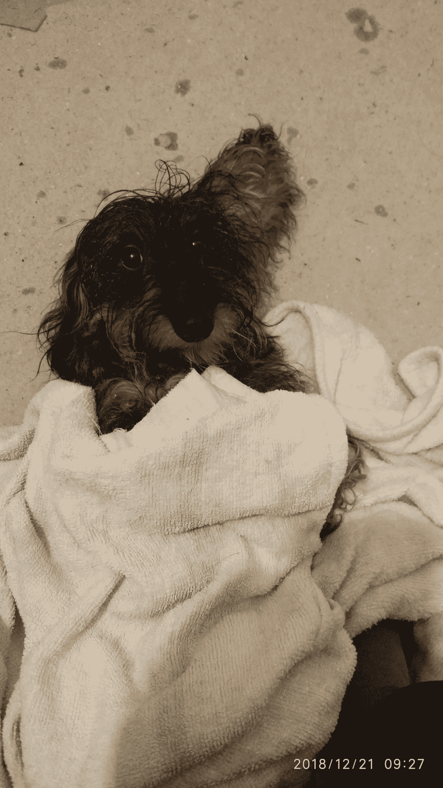

Our dog — Jelly

*   狗:51%(好)

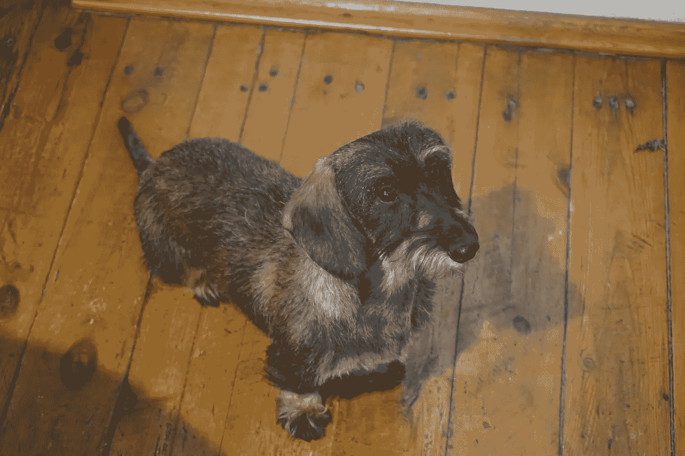

Our dog — Jelly (after haircut)

*   狗:74%(非常好)。与上一张图片稍微不同的角度(脸部更清晰)使得效果更好。

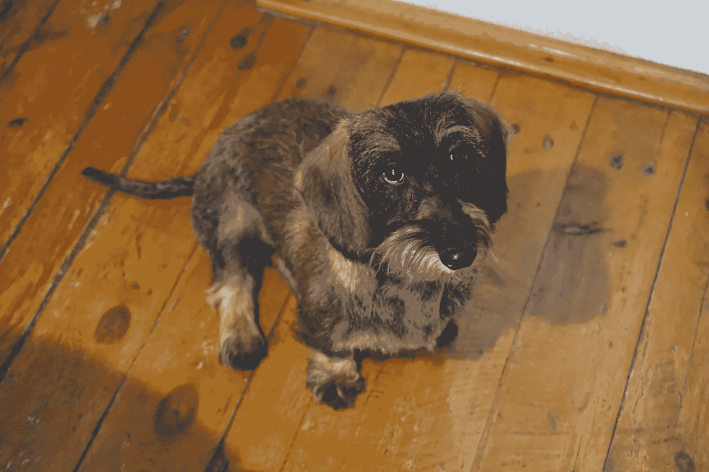

Our dog — Jelly

摘要:convnet 是在一个小数据集上训练的，它仍然可以提供非常好的分类结果(用我的狗图片验证:)