# 使您的模型更好地工作的变量转换目录

> 原文：<https://towardsdatascience.com/catalog-of-variable-transformations-to-make-your-model-works-better-7b506bf80b97?source=collection_archive---------3----------------------->

## 本书"[赢得 KAGGLE](https://www.amazon.co.jp/dp/4297108437) 的数据分析技巧"

## 10 多个数字变量转换和 7 个分类变量转换

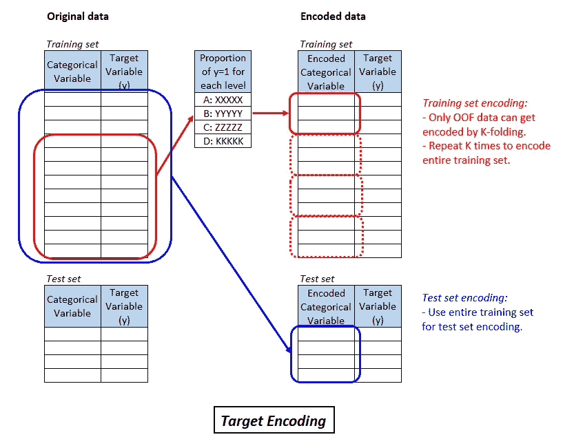

变量转换是使数据在模型中更好工作的一种方式。数据变量可以有两种形式:*数字变量*和*分类变量*，它们的转换应该有不同的方式。

> **-数值变量转换** : *将一个数值变量转换成另一个数值变量。通常，这意味着通过某种“单调变换”来改变值的标度和/或将偏斜的数据分布调整为类似高斯的分布。*
> 
> *基于决策树的模型对比例和倾斜不太敏感，这些技术可能贡献不大，但对于其他模型(如神经网络、SVM、线性模型等。)，它们可能会改变游戏规则，或者在某些情况下甚至是强制性的，例如在 L1/L2 规范中使用惩罚条款的情况。*
> 
> **-分类变量转换** : *将分类变量转换为数值变量。分类变量转换对于大多数机器学习模型是强制性的，因为它们只能处理数值。*
> 
> *它也被称为*编码，*或者在文本挖掘中，*嵌入*也是为了处理类似的情况，但是嵌入通常被认为是返回包含原始数据语义的数值。*
> 
> *分类变量变换对任何模型都很重要，分类变量变换的选择对模型性能有很大影响。*

在这篇文章中，我将介绍转换数值变量和分类变量的基本到高级技术。

# 目录

**1。关于变量变换的一般注意事项**

**2。数值变量转换**

*   2.1.标准化
*   2.2.最小-最大缩放
*   2.3.对数变换
*   2.4.博克斯-考克斯变换
*   2.5.约-约翰逊变换
*   2.6.剪报
*   2.7.扔掉
*   2.8.军阶
*   2.9.兰克高斯
*   2.10.其他非线性变换

**3。分类变量转换**

*   3.1.一键编码
*   3.2.标签编码
*   3.3.特征散列
*   3.4.二进制编码和基本编码
*   3.5.频率编码
*   3.6.目标编码
*   3.7.只有测试集中包含的水平时的特殊处理
*   3.8.更多分类变量转换

**4。结论**

这是另一篇帖子接的一本新书中介绍的技巧*[*数据分析技巧赢 Kaggle*](https://www.amazon.co.jp/dp/4297108437) *”，*由三位高阶 Kaggle 作者执笔(不包括我自己)由此可见这不是个人推广！:) )*

*关于这本书本身的完整目录，请参见我的[其他帖子](https://medium.com/@daydreamersjp/a-new-book-data-analysis-techniques-to-win-kaggle-is-a-current-best-and-complete-for-table-data-4af66a88388)。*

# *1.对变量变换的普遍关注*

*有许多用于建模的转换技术，许多在 `[scikit-learn](https://scikit-learn.org/stable/modules/classes.html#module-sklearn.preprocessing)`和`[categorical_encoders](https://contrib.scikit-learn.org/categorical-encoding/index.html)`中实现。*

*其中使用*参数*的有很多，比如标签编码中标准化或换算表的均值和标准差。**使用变量变换的一个常见错误是使用不同的参数分别变换训练集和测试集**。训练数据和测试数据的转换应该使用相同的参数，并且**它们通常单独从训练集中获得**；否则，我们无法比较苹果之间的结果。`scikit-learn`转换器类可以通过使用`fit`和`transform`函数来处理这个问题。*

*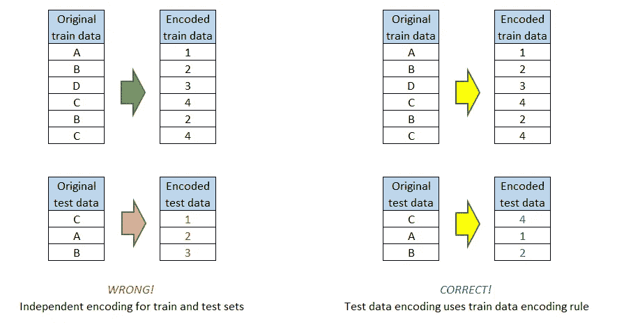*

*Do not encode test data separately!*

*有些人会更严格地声称，当使用交叉验证时，转换参数将仅从训练折叠中导出，然后验证折叠数据将由这些参数转换，而不是在交叉验证之前转换整个训练数据。当您预计褶皱之间的数据分布存在巨大差异时，这种方法可能是必要的。**异常值的存在是给出不同参数的一个可能原因**，特别是在对异常值敏感的变换技术中，如最小-最大缩放。*

*或者其他一些人可能声称，只要数据分布差异不大，在交叉验证之前转换整个训练数据就足够了，并且可以避免数据流水线的混乱。此外，我们的最终模型将基于整个训练数据，因此使用整个训练数据来转换数据可能是有意义的。*

*无论哪种方式，分析师总是要问自己，对于他们面对的数据，什么是最合理的方法。`scikit-learn`通过在`[Pipeline](https://scikit-learn.org/stable/modules/generated/sklearn.pipeline.Pipeline.html)`中分配 scaler 函数，支持跨验证内转换。比较下面示例代码中的方法 1 和方法 2。*

**

*Photo by [Matt Duncan](https://unsplash.com/@foxxmd?utm_source=medium&utm_medium=referral) on [Unsplash](https://unsplash.com?utm_source=medium&utm_medium=referral)*

# *2.数字变量转换*

## *2.1.标准化*

*最典型的数字变量转换是使用减法和除法将列值转换为另一组值，其中*均值=0* 和*标准差=1* ，这样:*

*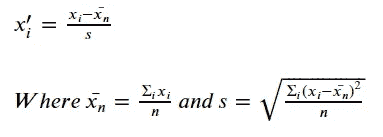*

*Formula for standardization*

**标准化*广泛应用于许多 ML 技术，如线性回归、SVM、神经网络等。一些 ML 模型在某种程度上要求它。**默认情况下，许多分析工具甚至会自动执行此操作**。如果是这种情况，您甚至不必编写代码来进行转换。**我们需要注意什么是默认转换，以及它是否与您选择的方法相关。***

*`scikit-learn`的`preprocessing`模块的`[StandardScaler](https://scikit-learn.org/stable/modules/generated/sklearn.preprocessing.StandardScaler.html)`可以处理标准化。*

## *2.2.最小-最大缩放*

**最小-最大缩放*是简单数字变量转换的另一个常见疑点。使用最小-最大缩放，值将被转换为 0 到 1 之间的值。*

*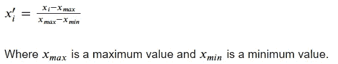*

*Formula for min-max scaling.*

*这种转换高度依赖于最大数和最小数，因此**对异常值**特别敏感。**如果值可能非常大，而许多值却不是，则标准化更为常见。**最小值-最大值缩放更常见于数值范围在固定区间内，且数据不太可能在区间内的特定子范围内聚集的情况；**最常见于图像数据**中，其中一个元素的 RGB 颜色值在 0 到 255 之间。*

*`scikit-learn` `preprocessing`模块的`[MinMaxScaler](https://scikit-learn.org/stable/modules/generated/sklearn.preprocessing.MinMaxScaler.html)`可以处理最小-最大缩放。*

## *2.3.对数变换*

*当价值分布具有长尾分布时(如个人收入、个人医疗费用等。)， ***对数变换*可以将数据分布调整到更少的偏斜，希望是类似高斯的分布**。*

*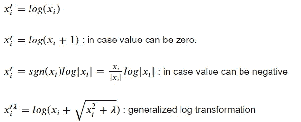*

*Formula of log transformations*

*`numpy`有一个原生函数将 log(x+1)计算为`[np.log1p(x)](https://docs.scipy.org/doc/numpy/reference/generated/numpy.log1p.html)`。*

*广义对数变换应该调整数据分布的参数λ，使其更接近正态分布。现在你要记住，你不应该如我在 *"1 中所讨论的那样更改训练集和测试的参数。关于变量转换的一般注意事项见上文*。*

## *2.4.博克斯-考克斯变换*

*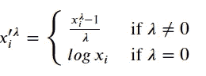*

*Box-Cox transformation*

**Box-Cox 变换*是 log(x)变换和 x-1 变换之间的变换**，取决于λ**的值。`scikit-learn` `preprocessing`中的`[PowerTransformer](https://scikit-learn.org/stable/modules/generated/sklearn.preprocessing.PowerTransformer.html)`模块可以处理这种转换，**自动选择λ使数据最接近高斯**。*

*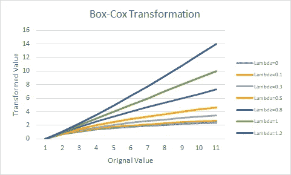*

*Box-Cox Transformation*

## *2.5.约-约翰逊变换*

*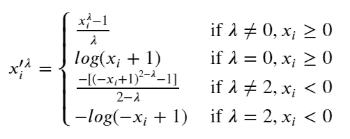*

*Yeo-Johnson transformation.*

**Yeo-Johnson 变换*是允许负值作为初始值的变换，与 Box-Cox 变换不同。lambda=1 时，变换几乎是恒等变换。如下图所示，lambda 的变化会影响变换后的值。*

*以及 Box-Cox 变换，`scikit-learn` `preprocessing`模块中的`[PowerTransformer](https://scikit-learn.org/stable/modules/generated/sklearn.preprocessing.PowerTransformer.html)`可以处理这种变换，**自动选择 lambda 使数据最像高斯**。*

*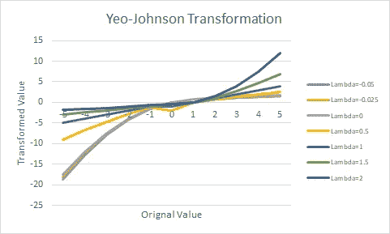*

*Yeo-Johnson Transformation.*

## *2.6.剪报*

**限幅*是一种在特定值点限制或降低值的方法。这可以移除异常值，代价是可能丢失原始数据信息。*

*通过`pandas`或`numpy` `clip`功能可以轻松完成裁剪。以下代码剪辑了 1%平铺点和 99%平铺点的值。*

## *2.7.扔掉*

*在*宁滨中，*您将值分组到不同的区间，并将组索引用作分类变量。您可以将它用作有序分类变量或数值变量作为等级。作为分类变量，你也可以通过一键编码或其他分类变量转换来转换它(见下一章！)*

*宁滨区间的确定是参数选择，可以通过规则区间、百分点或基于数据领域知识的手动设置来确定。*

*宁滨可以通过`pandas` `cut`功能或`numpy` `digitize`功能来完成。*

## *2.8.军阶*

*将原始数值转换为数值等级。通过除以记录数，等级还可以转换为 0 到 1 之间的值，这使得转换后的数量与记录数无关。*

*这本书介绍了一个有趣的例子:在分析一家商店的顾客数量时，假日的顾客数量很可能比工作日的顾客数量多很多。然后，使用原始的顾客数量可能会把假期看得太重。将数字转化为排名可以抵消客户绝对数量的影响。*

*`pandas` `rank`函数或`numpy` `argsort`函数可以处理这种转换。*

## *2.9.兰克高斯*

**RankGauss* 是一种先将数值转化为等级，再按照高斯分布将等级转化为另一个数值的方法(见下图。)**这是用于** [**Porto Segro 的安全驾驶员预测第一名解决方案**](https://www.kaggle.com/c/porto-seguro-safe-driver-prediction/discussion/44629) **为其神经网络模型**。第一名得主 Michael Jahrer 声称**对于他们的神经网络模型来说，这比标准化或最小-最大缩放更有效。***

*`sklearn.preprocessing`中的`[QuantileTransformer](https://scikit-learn.org/stable/modules/generated/sklearn.preprocessing.QuantileTransformer.html)`可以通过设置参数`n-quantiles` large 和`output_distribution = ‘normal’`来处理这种变换。*

*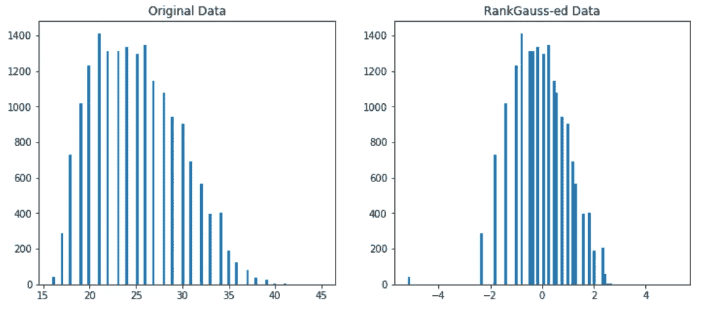*

*Comparison between original data and transformed data by RankGauss*

## *2.10.其他非线性变换*

*书中还介绍了以下非线性变换:*

*   *取绝对值*
*   *求平方根*
*   *平方或取 n 次方*
*   *制作一个二进制变量，表示原始值的属性，如正或负、零或零等。*
*   *取原始值的分数，如小数部分*
*   *舍入，向上舍入，截断*

**

*Photo by [Andrew Buchanan](https://unsplash.com/@photoart2018?utm_source=medium&utm_medium=referral) on [Unsplash](https://unsplash.com?utm_source=medium&utm_medium=referral)*

# *3.分类变量转换*

*机器学习模型只能处理数值型变量。因此，如果一个列有分类变量，那么只有当它被*编码为*数字变量时，模型才会工作。如何编码是建模中的关键性能驱动因素之一。*

## *3.1.一键编码*

**One-hot encoding* 是一种将一个分类列转换为多个二进制(0 或 1)列的方法，其数量与原始列中不同级别的数量相同。如果分类变量有四个级别，one-hot 编码将创建四个新列，每个列都有 0 或 1，并表示原始列是否有级别。*

*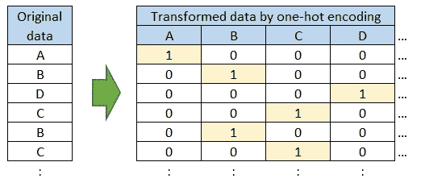*

*Illustration of one-hot encoding (four-level column (A-D) creates four new columns)*

***one-hot 编码的一个明显缺点是列的数量很容易随着许多不同的级别而膨胀**。一个可能的解决方案是根据领域知识对一些级别进行分组，或者将不常见的级别分组到“其他”级别中。*

*您可以使用`pandas` `[get_dummies](https://pandas.pydata.org/pandas-docs/stable/reference/api/pandas.get_dummies.html)`功能或`scikit-learn` `preprocessing`模块的`[OneHotEncoder](https://scikit-learn.org/stable/modules/generated/sklearn.preprocessing.OneHotEncoder.html)`进行一键编码。后一个可以返回带`sparse=True`参数的稀疏矩阵，在原列有很多级的情况下可以节省内存消耗。*

*一键编码看起来类似于传统统计建模中的*虚拟变量*。一键编码和虚拟变量之间的区别在于，在使用虚拟变量时，通常会从生成的新列中删除一列，以避免*线性相关性*，并且可以稳定估计。这种差异的原因是在 ML 环境中，*

*   *有比统计建模多得多的变量，并且一个变量的影响被稀释了。*
*   *由于各种原因，许多 ML 算法并不关心线性相关性，如使用正则化项，或者选择部分变量来训练模型，从而丢失了线性相关性。*

## *3.2.标签编码*

**标签编码*是一种将等级转换为整数的方法，例如等级:['A '，' B '，' C '，…]转换为整数:[0，1，2，…]。*

*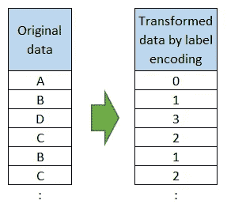*

*Illustration of label encoding*

***这种方法在大多数机器学习算法**中并不合适，因为转换值的数量实际上与目标变量无关，**基于决策树的模型**除外，该模型可能能够通过分层树节点拆分来多次拆分转换后的数值列。此外，**如果分类变量具有“序数”性质**，例如 C*old<Warm<Hot<Very Hot*，标签编码可能比其他编码技术工作得更好。*

*可以用`scikit-learn` `preprocessing`模块的`[LabelEncoder](https://scikit-learn.org/stable/modules/generated/sklearn.preprocessing.LabelEncoder.html#sklearn.preprocessing.LabelEncoder)`实现标签编码。*

## *3.3.特征散列*

**特性散列*是一种使用散列技巧将一个分类列转换为多个列的方法。您可以定义要转换到的新列的数量，该数量可以少于分类列中的级别数。不同于像一键编码那样分配 0 或 1，特性哈希使用两个以上的值(在下面的例子中是-1、0 或 1)。*

*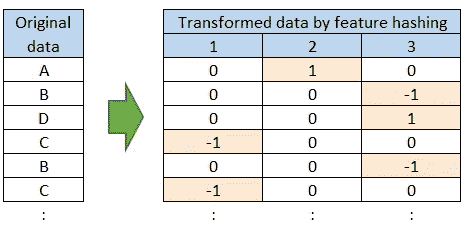*

*Illustration of feature hashing (four distinct levels to three new columns)*

***这种标记可以掩盖一键编码在转换后产生过多列的缺点**。然而，在最近的高级建模技术中，拥有太多的列不再是致命的问题，因此**特征散列没有被广泛使用**。*

*此外，在一个新列中有两个以上的可能值可能对某些模型不利。*

*您可以通过`scikit-learn.feature_extraction`模块的`[FeatureHasher](https://scikit-learn.org/stable/modules/generated/sklearn.feature_extraction.FeatureHasher.html#sklearn.feature_extraction.FeatureHasher)`或`category_encoders.hashing`模块的`[HashingEncoder](https://contrib.scikit-learn.org/categorical-encoding/hashing.html)`对特征散列进行编码。*

## *3.4.二进制编码和基本编码*

**二进制编码*是一种将分类列转换为多个二进制列，同时最小化新列数量的方法。*

*首先，按照一定的顺序将分类值转换为整数(例如，按字母顺序或最上面一行的出现顺序)。接下来，将其转换为二进制数字，例如 1 到 1，2 到 10，5 到 101，等等。最后，将二进制数字拆分成单独的列，每一列都有一个数字。*

*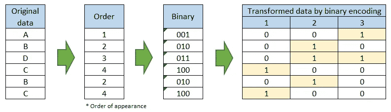*

*Illustration of binary encoding*

***二进制编码可以将新列数减少到 *log_2(级数)*阶**。正如你在上面的例子中看到的，其中一个新列在不同的原始级别中有 1，这**不是一件好事**因为在同一列中有 1 的级别将被模型视为共享一些属性，而实际上它们在同一列中有 1 只是出于技术原因。*

*`[category_encoder](https://contrib.scikit-learn.org/categorical-encoding/index.html)`模块的`[BinaryEncoder](https://contrib.scikit-learn.org/categorical-encoding/binary.html)`可以处理这些编码。*

**BaseN 编码*是二进制编码的推广，BaseN 不使用基数 2，而是使用任意数作为基数。*

*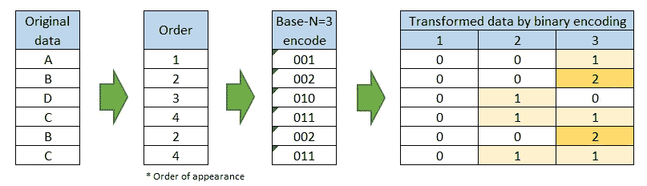*

*Illustration of Base N encoding when N = 3*

*随着 N 的增加，新列的数量越来越少，但这也意味着新列中的重叠信息比我们在二进制编码情况下看到的更多，这可能会使最终的模型变得更糟。如果 N 是无穷大，BaseN 编码和 label 编码完全一样。正如我上面所讨论的，标签编码对于大多数模型都是不合适的。*

*`[category_encoder](https://contrib.scikit-learn.org/categorical-encoding/index.html)`模块的`[BaseNEncoder](https://contrib.scikit-learn.org/categorical-encoding/basen.html)`可以处理这些编码。*

## *3.5.频率编码*

**频率编码*是一种将**分类列转换为新列的方法，新列中的整数表示原始列中**级别的频率。当水平的频率对目标变量有影响时，这可能很有效。*

*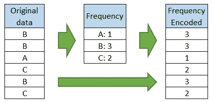*

*Illustration of frequency encoding.*

***你也可以把频率变成等级**，就像序列化频率编码和等级转换一样。请注意，级别的频率比原始数据的排名更有可能导致平局。*

*python 中没有支持这种编码的库，但这可以通过`pandas.Series`本机函数`[value_counts()](https://pandas.pydata.org/pandas-docs/stable/reference/api/pandas.Series.value_counts.html)`轻松实现。*

## *3.6.目标编码*

**目标编码*是一种基于目标变量的值**将分类列转换为新的数字列的方法。***

*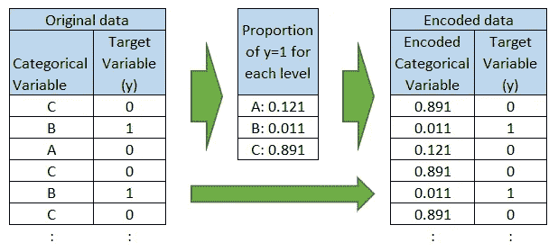*

*Illustration of target encoding (in case target variable is binary (0 or 1)).*

*最典型的是，它采用每个级别的目标值的平均值来创建一个新列，但是它可以是您认为合理的任何值，比如当有异常值时的中值，或者当评估度量是 [RMSLE](/11-evaluation-metrics-data-scientists-should-be-familiar-with-lessons-from-a-high-rank-kagglers-8596f75e58a7#5185) 时的对数值的平均值。*

***目标编码可能会成为强有力的预测工具**，但正如本书作者反复警告的那样，**除非小心处理，否则它很容易导致数据泄露。***

*因为目标编码使用来自目标变量的信息，所以我们必须避免包含要编码的同一行。为此，**我们应该**[**k-folding**](https://scikit-learn.org/stable/modules/generated/sklearn.model_selection.KFold.html)**(其中 k=4~10)** 数据:训练折叠中目标值的平均值被指定为出折叠数据中的编码值。对每个折叠重复此操作，为整个训练数据生成编码值。测试数据通常使用整个训练数据进行编码。*

*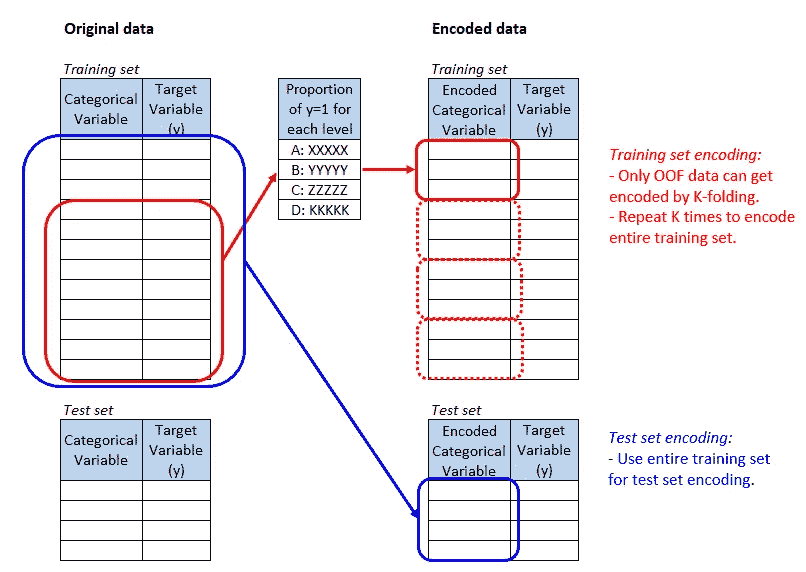*

*Illustration of K-folding for target encoding (in case target variable is binary (0 or 1)).*

*`[category_encoders](https://contrib.scikit-learn.org/categorical-encoding/targetencoder.html)`模块有目标编码处理器`TargetEncoder`，但即使这样，你也必须自己完成 K-fold。*

*作者还声称**你不应该使用******(LOO)进行目标编码，因为这太有可能导致数据泄露**。***

## ***3.7.只有测试集中包含的水平时的特殊处理***

*****当某些级别仅包含在测试数据中时，模型可能会返回错误，或者即使没有返回错误，预测也可能是错误的。*****

***以下是处理这种情况方法:***

*   ***如果只是预测精度的问题，而不是返回一个技术错误，那么检查一下糟糕的预测对最终得分的影响有多大。如果它足够小，忽略它是一个可行的想法。***
*   ***用训练数据中包含的另一个级别替换，例如使用训练数据中最常用的级别。***
*   ***基于其他变量建立预测模型以预测一个水平来代替未知水平。***
*   ***在将分类变量编码为数值变量后，将其输入，例如，用目标编码变量的数据平均值进行输入。***

## ***3.8.更多分类变量转换***

***[Baijayanta Roy 的这篇文章“关于分类变量编码的一切”](/all-about-categorical-variable-encoding-305f3361fd02)涵盖了更多的编码技术。***

***另外，`[categorical_encoders](https://contrib.scikit-learn.org/categorical-encoding/index.html)` [模块](https://contrib.scikit-learn.org/categorical-encoding/index.html)涵盖了白加炎塔帖子中介绍的大部分技术的实现。您可以通过使用本模块中的功能来进一步学习。***

******

***Photo by [Robert Katzki](https://unsplash.com/@ro_ka?utm_source=medium&utm_medium=referral) on [Unsplash](https://unsplash.com?utm_source=medium&utm_medium=referral)***

# ***4.结论***

***在这篇文章中，我们讨论了从基本方法到高级方法的 10 多个数字变量转换技术和 7 个分类变量。***

***虽然有些技术比其他技术更好，例如*目标编码*比其他编码技术有更好的跟踪记录，但没有一种方法总是在任何数据的每个模型中都工作良好。因此，研究什么样的编码在什么情况下工作良好是很重要的，当你面临一个新问题时，你可以使用本文中介绍的尽可能多的方法，直到你发现哪种方法工作得最好。***