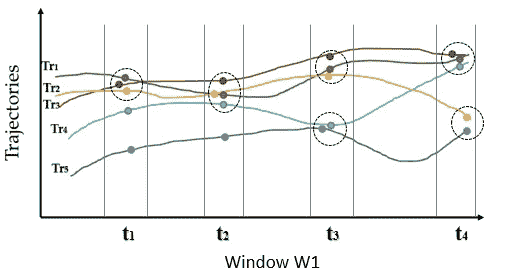
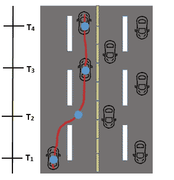
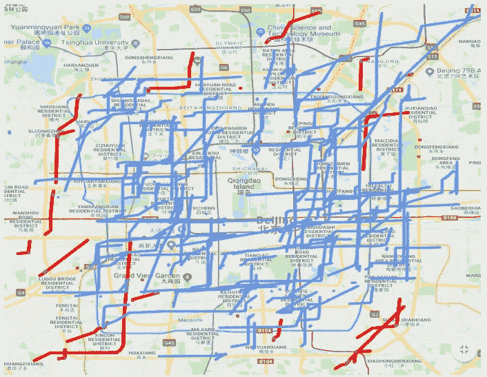

# 如果你能抓住我:流数据中的异常检测

> 原文：<https://towardsdatascience.com/catch-me-if-you-can-outlier-detection-taxi-trajectory-streams-1bb6df584db0?source=collection_archive---------24----------------------->

## 使用流数据(轨迹流)进行优步需求预测


Photo by [Zhipeng Ya](https://unsplash.com/@zhipeng_ya?utm_source=medium&utm_medium=referral) on [Unsplash](https://unsplash.com?utm_source=medium&utm_medium=referral)

离群点检测是一项有趣的数据挖掘任务，广泛用于检测数据中的异常。异常值是显示出与大多数点明显不同的属性的点。为此，离群点检测具有非常有趣的应用，例如信用卡欺诈检测(可疑交易)、交通管理(醉酒/鲁莽驾驶)或网络入侵(黑客攻击)等。由于这些应用的时间关键特性，需要可扩展的异常检测技术。

在这个项目中，我们的目标是检测出租车数据集(北京)中的异常值，使用一种仅使用时空特征来检测超大型数据集中的异常值的技术。我们将使用这些出租车上的地理坐标和 GPS 收集的时间戳。

# **数据集**

对于这个项目，我们将使用 [T-Drive](https://www.microsoft.com/en-us/research/publication/t-drive-trajectory-data-sample/) 数据集。该数据集有 1500 万个点，覆盖北京总共 10，357 辆出租车的 900 万公里总距离。这是一个很好的样本数据集，因为它包含大量的点，模拟了我们上面讨论的真实场景。该数据集中的每一行都对应于出租车的地理坐标和时间戳。

# **算法**

我们将在这个问题上使用的算法是大规模轨迹流上的[异常值检测。为了实现这个算法，我们需要一些技术术语的背景信息。](https://dl.acm.org/citation.cfm?id=3013527)

**轨迹**

移动物体 O 的轨迹被定义为在时间元 t *1* ，t *2* 产生的轨迹点序列..t *j* 表示为 Tri = {P *1i* ，P *2i* ，…..纪

**点邻居**

如果两个轨迹点 P *ij* ，P *ik* 在同一时间点 T *i* 中，彼此的距离在 *d* 之内，其中 *d* 是距离阈值，那么这两个点被认为是彼此的点邻居。

**轨迹邻居**

在特定窗口 W *c* 中，当且仅当对于至少 *thr* 时间元，轨迹在这些时间元的每一个中共享点邻居时，轨迹被称为邻居轨迹。

**轨迹异常值**

如果至少在 *thr* 时间仓中，作为点邻居的点的数量少于 *k* 个，则轨迹 T *ri* 被认为是窗口 W *c* 中的异常值，其中 *k* 是邻居计数阈值。

这个定义试图抓住这样一个概念:如果一个轨迹是正常的，那么它应该在空间和时间上有相近的点。换句话说，这些轨迹需要表现得非常相似和一致，才能被归类为特定窗口中的内层。



Example Trajectories | Tr4 is an outlier

为了解释算法，让我们看一下上面的例子。我们将分析轨迹 Tr3 和 Tr4。虚线圆表示轨迹的相邻点。让我们取 *thr=2* 和 *K=3:*

Tr4 至少具有 *thr (2)* 个仅与 Tr1 (t2，t4) & Tr3 (t2，T4)相邻的点。因为它只有少于 *K* 轨迹的 *thr* 点邻居(在这种情况下只有 2 个轨迹)，所以它是异常值。

Tr3 与 Tr1 (t1，T2，t3，t4)，Tr2 (t1，T2，t3) & Tr4 (t2，T4)至少有 *thr (2)* 个数的点邻居。由于它对于至少 *K=3* 轨迹(Tr1，Tr2，Tr4)具有 *thr* 点邻居，所以它是*而不是*异常值。更多信息，你可以阅读[论文](https://dl.acm.org/citation.cfm?id=3013527)中的例子。

# **实施**

**加载数据**

第一步包括加载数据集(*。txt)。因为数据集分为。txt 文件，我们需要读取 T-Drive 文件夹中的所有文件。

```
path = 'C:\\Users\\User\\Downloads\\T-drive Taxi Trajectories\\release\\taxi_log_2008_by_id\\*.txt'
files = glob.glob(path)for file in files: f = open(file,'r') #2nd element contains date(yyyy-mm-dd)            
            date = x[0].split(',')            #1st element contains time(HH:MM::SS) 
            time1 = x[1].split(',') lat = time1[1]  #Latitude
            lon = time1[2]  #Longitude

            day = date[1].split('-')[2]      #Day
            hour = time1[0].split(':')[0]    #HOUR
            min_ = time1[0].split(':')[1]    #MINS
            secs = time1[0].split(':')[2]    #SECS
```

我们还需要提取时间戳(月、日、小时、分钟)、纬度和经度的值。 **Split()** 是拆分每行中各个值的最快方法

**数据准备**

与任何数据任务一样，下一步是清理数据。快速浏览数据集可以发现数据集中出租车的采样速率不一致。一些出租车每分钟记录一次位置，而另一些则跳过几分钟。为了解决这个问题，我们将使用线性插值来填充缺失的值。下面的示例显示了时间戳(T *2* )的一个缺失值。缺失值的计算方法是，取 T1 和 T3 之间的平均差值，并将其加到 T1 上。



**距离功能**

如你所知，每个样本的位置标记都是地理坐标。但是，我们需要也需要计算两个坐标之间的距离来检查这些点是否是邻居( ***d*** 阈值)。为了解决这个问题，我们使用[哈弗辛近似](https://www.movable-type.co.uk/scripts/latlong.html)。

```
def distance(lat1, lon1, lat2, lon2):R = 6373.0   #Radius of earth lat1 = radians(lat1)
    lon1 = radians(lon1)
    lat2 = radians(lat2)
    lon2 = radians(lon2) dlon = lon2 - lon1
    dlat = lat2 - lat1 a = sin(dlat / 2)**2 + cos(lat1) * cos(lat2) * sin(dlon / 2)**2
    c = 2 * atan2(sqrt(a), sqrt(1 - a)) distance = R * c

    return distance*1000
```

**异常值检测**

看一下算法，很明显算法中最慢的部分是搜索查询。为了实现优化的性能，我们将使用 KD-tree 来处理多维点(在我们的例子中是 lat/long)。我们可以使用 Scipy 库来构建带有地理坐标的 kd 树。

```
from scipy import spatial
tree = spatial.KDTree(geocoordinates)def tree_once(tree,traj_arr): final = [] for i in range(0,len(traj_arr)):
    neighbors = tree.query_ball_point([traj_arr[i][0],traj_arr[i]    [1]], 0.0001)
    final.append(neighbors) return final
```

树构建完成后，我们将使用***query _ ball _ point()***函数来查找我们的 ***d*** 阈值内的邻居。

**输出**

T-Drive 数据集没有为我们提供基本的真实值。将结果可视化的一种方法是在谷歌地图上绘制出来。我使用了谷歌地图 API Web 服务的 Python 客户端库来绘制轨迹，如下所示。



Trajectory Outliers in a single window. The red lines represent trajectories that were identified as outliers where as blue lines represent normal trajectories. Most of the isolated trajectories, as shown, are correctly identified as outlying.

从图中可以看出，大多数拥塞轨迹都被正确识别为内点。时空不接近的轨迹被识别为异常值，存在一些误差，如地图所示。

# **结论&未来工作**

该算法还可以用于其他场景，如信用卡欺诈检测或股票监控。例如，就像地理坐标一样，我们可以使用股价/成交量作为特征来确定一支股票的表现是好是坏。

其他工作包括使用分割和分区来改善离群点检测结果。在另一篇文章中，我将介绍如何使用多个内核在多个 CPU 之间分配工作负载，以实现更高的性能。

你可以在我的 Git:h[ttps://github . com/UsmanGohar/Trajectory-Outlier-Detection](https://github.com/UsmanGohar/Trajectory-Outlier-Detection)中找到完整的代码