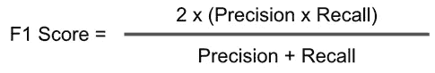

# 抓住一个骗子:对信用卡违约者进行分类

> 原文：<https://towardsdatascience.com/catching-a-welcher-classifying-a-credit-card-defaulter-f4b21547a618?source=collection_archive---------19----------------------->

[Photo Credits](https://www.financialexpress.com/money/defaulted-on-loan-credit-card-payments-you-can-still-take-a-loan-heres-how/1704996/)

在我们开始之前，一如既往，我的项目代码可以在我的 [github](https://github.com/xianjinseow92/projects/tree/master/Project_3_Credit_card_default_classifier) 上找到，如果你有任何关于这个项目的问题，请随时通过 [linkedin](https://www.linkedin.com/in/seow-xian-jin/) 与我联系。

# 介绍

## 信用卡违约意味着什么(从信用卡用户的角度)

如果你不清楚拖欠信用卡是什么意思，要点如下:在你 180 天(或由你的信用卡公司决定)没有支付信用卡款项后，你的发卡机构认为你可能永远不会还款。此时，发卡行可以(通常会)关闭你的卡，将你的欠款作为坏账注销，并将你的账户出售给收款机构。

## 为什么重要？

现在你的信用卡发行人出局了。你的债务属于一个讨债人，你将开始接到大量要求你付账的电话。尽管你可以发出书面通知，要求他们停止给你打电话，而且 T4 法律限制讨债人联系你时的言行，但你仍然欠着债。如果你不处理好这件事，你可能会被起诉。

此外，违约将被报告给**三大信用局(或更多，取决于你的国家)**。你的信用评分会急剧下降，这个污点会留在你的信用报告上长达七年。

简而言之，拖欠信用卡账单会带来严重后果。你应该优先考虑尽快处理这件事。

## 从银行的角度来看，这意味着什么？

嗯，如果有人向你借钱，却从来不还你，这是一种类比(我把它看得过于简单了，但你明白)。你将会少 100 美元，而另一个人会多 100 美元(我真的需要在类比上多下功夫)。

因此，如果出现违约，银行的不良贷款会导致巨大的财务损失，因此需要在这个问题上采取重大的风险缓解措施。此外，银行贷款过程可能是一个相当手工和令人厌倦的任务，以确定谁可能是潜在的违约者。贷款过程也相当依赖于贷款处理者本身，留下了很多主观性，这可能在未来变成不良贷款。

但另一方面，银行也可以从真正还贷的人身上赚很多钱。此外，我们不希望拒绝那些真正可以用这笔钱让生活重回正轨或实现梦想的人(例如，创办他们一直想要的企业)。

> 那么，我们如何正确评估一个人是否会有信用风险呢？

一个人的行为有哪些迹象表明他/她是一个一贯的骗子？*(是的，我知道我在引用城市词典)*

# 项目目标

因此，该项目旨在利用数据驱动的方法，通过使用 ***的信用卡客户过去的数据，结合机器学习*** ，来预测消费者是否会拖欠他们的信用卡，从而弥合这种不确定性的差距。

使用该模型的目的是实现两件事:

*   提高贷款流程的一致性；
*   调查潜在违约者背后的关键驱动因素

除了回答这些紧迫的问题，我个人也想关注学习过程；让数据科学项目工作流程变得更好/更高效，并进入我不熟悉的领域(因为我是机械工程出身，所以不太适应)，走出我的舒适区。话虽如此，让我们深入研究如何着手一个分类器数据科学项目。

# 第一部分:数据

## 第 1.1 节:数据集描述

本分析中考虑的数据集是在 *Creative Commons* 的公共许可证下发布的*“信用卡客户违约”*数据集，可在 [Kaggle 网站](https://www.kaggle.com/uciml/default-of-credit-card-clients-dataset)上获得。

该数据集包含来自一家银行(以及台湾的一家现金和信用卡发行商)的 25 个变量的 30000 个观察值。其中每个观察对应于一个特定的信用卡客户。在总共 30000 条观察中，6636 条观察(22.1%)是有违约付款的持卡人。

该数据集中的 25 个变量包括人口统计变量(性别、教育水平、婚姻状况和年龄)和从 2005 年 4 月到 2005 年 9 月的 6 个月付款数据的财务变量(给定信贷金额、每月还款状态、每月账单金额和每月先前付款金额)。下一节将详细说明每个变量的含义。

## 第 1.2 节:理解变量

**ID** :每个客户端的 ID

**LIMIT_BAL** :以新台币为单位的给定额度(包括个人和家庭/补充额度

**性别**:性别(1 =男性，2 =女性)

**学历**:(1 =研究生院，2 =大学，3 =高中，4 =其他，5 =未知，6 =未知)

**婚姻**:婚姻状况(1 =已婚，2 =单身，3 =其他)

**年龄**:以年为单位的年龄

— —

**PAY _ 0**:2005 年 9 月还款情况(-1 =按时还款，1 =延迟一个月还款，2 =延迟两个月还款，…8 =延迟八个月还款，9 =延迟九个月及以上还款)

**PAY _ 2**:2005 年 8 月还款情况(规模同上)

…;

**PAY _ 6**:2005 年 4 月还款情况(规模同上)

— —

**BILL _ am t1**:2005 年 9 月账单金额(新台币)

**BILL _ am T2**:2005 年 8 月账单金额(新台币)

…;

**BILL _ AMT 6**:2005 年 4 月账单金额(新台币)

— —

**PAY_AMT1** :上次 2005 年 9 月付款金额(新台币)

**PAY_AMT2** :上次 2005 年 8 月付款金额(新台币)

…;

**PAY_AMT6** :上次 2005 年 4 月付款金额(新台币)

**Default . payment . next . month**:默认付款(1 =是，0 =否)

## 第 1.3 节:数据清理

有些专栏对我来说没有意义，所以我决定用更容易理解的术语重新命名它们。

我们还可以看到，这些列不包含空值——干净的数据框架总是非常受欢迎。

虽然在非空的邻域中一切都很好，但是在其他区域中事情就不那么顺利了(从来不会这样——这只是数据清理中的一个事实)。

我们从一个简单的`df.describe().T`中看出两件事很突出:教育和婚姻。

## 教育

## 结婚

根据数据集的[，这些与变量分解不一致，因此我决定将奇怪的条目分组为“ *others* ”。](https://www.kaggle.com/uciml/default-of-credit-card-clients-dataset)

## 汇总数据预处理

这里是我们做的预处理操作的快速回顾。

1.  `deault.payment.next.month`到`DEFAULT`
2.  `SEX`到`GENDER`
3.  `PAY_0`至`PAY_1`
4.  将未知的`EDUCATION`类别(0，5，6)分组并重新分配给 4(其他)
5.  对未知的`MARRIAGE`类别(0)进行分组，并将它们重新分配给 3(其他)

# 第 2 部分:数据探索

## 第 2.1 节:映射目标

Pretty skewed data if you ask me

在进一步检查我们的数据集后，我们可以看到存在一些类别不平衡，在评估我们的模型的有效性时，我们必须记住这一点(即，我们不能使用准确性来衡量我们的模型的有效性)。此外，不平衡的类也会影响训练模型的性能。然而，有几种方法可以解决阶级不平衡的问题:

1.  对数据集进行过采样
2.  SMOTE 数据集
3.  对数据集欠采样
4.  什么都不做(是的，你没听错。什么都不做。有时，它会给你比摆弄数据集更好的结果)

# 第 3 节:方法

## 第 3.1 节:使用的普通(未接触的)数据集和模型

既然我们已经准备好了数据集并最终确定了要素，我们就可以进行一些训练/交叉验证，以获得我们的模型如何处理数据的基本感觉。

我选择使用的型号有:

1.  高斯朴素贝叶斯
2.  逻辑回归
3.  k-最近邻
4.  决策图表
5.  随机森林
6.  线性 SVC

## 第 3.2 节:模型评估指标

正如我们上面提到的， ***准确性*** 不是一个准确的(双关语)度量标准，不能用来评估每个模型之间的表现。将使用 F1 分数来代替。

我选择根据 F1 分数来评估这些模型，因为它同时考虑了精确度和召回率。本质上，我们可以将 F1 分数作为精确度和召回率的调和平均值。

通俗地说， ***罢免*** ，在信用违约者的情况下是指:

> 在所有的缺省者(真阳性和假阴性)中，我们的模型实际上正确了多少？

***精密*** 是指:

> 我们的模型基于它自己的预测(真阳性和假阳性)有多正确？

另外，在对违约者进行分类时，*比*更重要，因为我们希望能够抓住尽可能多的潜在违约者，以免给银行带来损失。这将在下面的章节中更加清楚。**

## **第 3.3 节:初步模型测试—使用普通数据集获得基线性能**

****

**从我们在普通数据集上测试我们的模型得到的初步结果(没有对特征进行转换或缩放)，我们可以看到 F1 分数非常低。**

**现在我们有了一个基线，我们可以继续努力提高 F1 的分数。**

## **第 3.3 节:使用 F1 分数选择模型**

****

**Model train/5-fold cross-validation on various processing done on dataset**

**5 个模型中的每一个都在数据集的不同变化上进行训练；缩放和未缩放过采样、欠采样、SMOTE 和 vanilla 数据集。如前所述，有几种方法可以处理不平衡的数据集。在这个项目中应用了过采样、欠映射和 SMOTE。**

****

**Scaled Vanilla Dataset**

**在完成所有训练/cv 测试后，给我们最高 F1 分数的数据集是缩放的香草数据集，高斯朴素贝叶斯在 **0.518 处领先。**然而，这些模型都是根据它们的默认设置进行训练的。因此，我选择进一步超参数调整领先的两个最高 F1 得分模型( **k-NN** 在 **0.417** 和 **RandomForest** 在 **0.41** )，以获得比 **0.518 更高的 F1 得分。****

****

**尽管对 k-NN 和 RandomForest 进行了超参数调整，但它们各自给出的 F1 分数仍低于高斯朴素贝叶斯的 0.51。因此，选择高斯朴素贝叶斯作为模型对违约者进行分类。**

## **第 3.4 节:优化高斯朴素贝叶斯信用卡违约分类**

****

**Train/CV Split: Gaussian Naive Bayes Confusion Matrix (**Threshold = 0.5**)on scaled dataset**

**在绘制默认阈值为 0.5 的高斯朴素贝叶斯的混淆矩阵时(F1 值为 0.517)，我们观察到它给出了非常差的召回分数。上面的矩阵告诉我们，该模型只抓住了所有违约者的 56%(1019 人中的 570 人)。也就是说 ***遗漏了*** ***所有*** 的 44%。这对我们假设的银行来说绝对不是好消息(非常类似于信用卡欺诈)，因为我们让许多不归还贷款的信用卡违约者未被发现。因此，需要进一步优化阈值来提高模型的召回率。**

****

**Train/CV Split: Gaussian Naive Bayes Confusion Matrix (**Threshold = 0.25**)on scaled dataset**

**在执行一些优化后，发现阈值为 0.25 给出了更好的****0.76**(1019 中的 778)的召回分数，代价是精度降低(我们看到假阳性增加到 1847)。****

******

***More false positives with **threshold = 0.25*****

***然而，我们必须明白这是一个不可避免的权衡。同一模型的较高召回率将导致*较低的精确度(较高的误报)*，因为我们本质上只是调整了阈值，而没有改变模型本身。***

## **更高的假阳性意味着什么？**

**更高的*假阳性*意味着模型将更多的人归类为违约者，尽管他们不是实际违约者。从我们假设的银行的角度来看，这意味着我们将通过给人们贴上潜在的不归还贷款者的标签来给他们带来不便。**

**这里的关键考虑是——这种权衡是否合理？我们如何证明这是一个好的权衡？这实际上取决于您构建这个模型的业务目标，以及期望的精确度。**

**由于我们没有实际的企业倡导分数，我们将为自己决定一个假设的情况——我们希望比精确更能规避风险。因此，用*更高的召回率*来抓住更多的违约者超过了给更多人带来不便的成本(*更低的精确度)。***

# **第 4 部分:最终模型测试和结果解释**

**现在有了我们最终确定的排列，使用一个*高斯朴素贝叶斯*模型，在*缩放数据集*上使用一个*阈值为 0.25* ，我们准备好通过在 80%的原始数据上训练我们的模型(我们对其进行了训练/交叉验证)并在另外 20%看不见的维持数据上进行测试来进行最终测试。**

****

**最终测试表明，我们的模型实际上在看不见的数据上表现得更好——给了我们更高的 ***召回*** 分数**0.79**(1341 分中的 1058 分)。这意味着我们的模型能够准确地捕捉到大约 ***80%*** 的所有违约者。**

# **第 5 节:未来的工作**

**这个项目在两个星期内完成，每天从早上 8 点到下午 5 点上课。因此，当然，我们可以做更多的事情来改进我们的模型和对这个信用卡违约案例的分析。**

**如果有更多的时间和资源，我想做以下几方面的工作:**

*   **特征工程；给定当前数据集，提出新的特征，这些特征可能是信用卡违约者的更好预测器**
*   **超参数调整其他模型**

# **第 6 部分:来自数据集的有趣见解**

****

**Feature Importance as plotted by Random Forest**

**从这张图表中，我们可以得出一些隐藏在违约者行为背后的有趣见解。告诉司机某人是否违约的三大因素可归结为:**

*   *****仅一个月内的还款状况(*** 这意味着只要看看某人在一个月内的还款有多晚，我们就可以知道他们是否会违约)**
*   *****年龄*****
*   *****极限平衡*****

# **最后一部分:经验教训**

## **特征操作**

**在这种情况下，像`PAY_0`、…、`PAY_6`、`MARRIAGE`、`EDUCATION`这样的分类列可能没有以最佳方式表示数据集。一个更好的方法可能是进行一次性编码(创建虚拟变量)。像 RandomForests 这样的分类器在分离像这样的列方面很棒，并且可以产生一个模型，该模型可以更好地预测信用卡违约者。**

# **离别赠言**

**和往常一样，你可以在这里找到这个项目的代码[，在这里](https://github.com/xianjinseow92/projects/tree/master/Project_3_Credit_card_default_classifier)找到我的 linkedin [。如果你对这个项目有任何问题，请随时给我留言。下次见！](https://www.linkedin.com/in/seow-xian-jin/)**