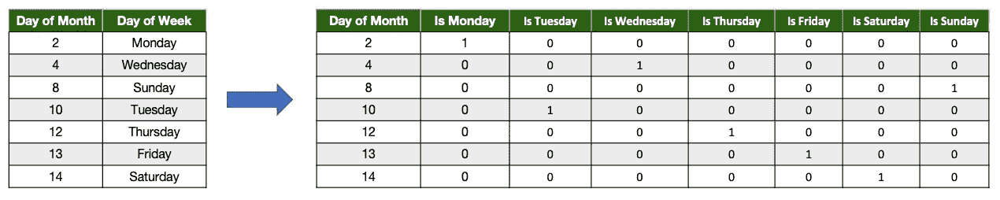
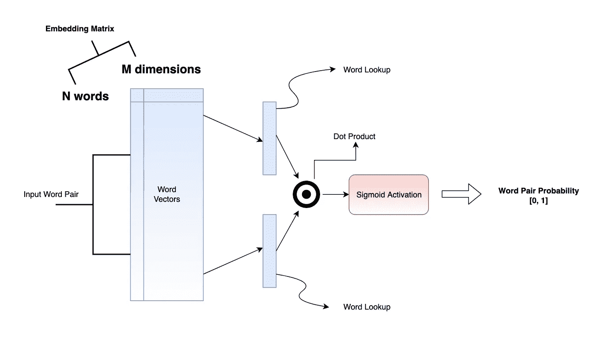

# 范畴嵌入与迁移学习

> 原文：<https://towardsdatascience.com/categorical-embedding-and-transfer-learning-dd3c4af6345d?source=collection_archive---------2----------------------->

## 深度学习的副产品比你想象的更有用。

Transferring the embedding matrix!

# 介绍

许多机器学习算法不能直接处理分类变量，除非它们被转换成数字。然而，问题是它们的性能会因这些分类变量编码成数字的方式而有很大差异。本文探讨了分类编码的问题，并简要介绍了新旧方法。

# 分类变量

一个 [***分类变量***](https://en.wikipedia.org/wiki/Categorical_variable) 是一个变量，它可以取一个可能的固定且大部分有限的值集合。它们与定性特征相关，因此无法测量。例如，星期几是一个分类变量，可以接受 7 个离散值。任何语言的单词/标记都是范畴变量。机器学习算法致力于处理数字，因此我们必须将这些分类变量转换为数字，以取悦算法。这个过程充满了陷阱，我们冒着丢失大量信息的风险。

让我们来看看将类别转换成数字的几种常见方法，以及与之相关的问题。

## 标签编码

在这个过程中，我们使用一些已定义的过程为每个唯一的类别分配一个离散的数字。例如，我们可以按照出现的次数对变量进行排序，并按照升序对它们进行编号。另一种方法是为每个独特的类别随机分配一个数字。

Simple Label Encoder

在上面的示例中，日期按照它们在数据中出现的顺序进行标记。这里的主要问题是

1.  自然排序丢失了
2.  类别之间的常见关系未被捕获。(例如，星期六和星期天一起构成周末，因此应该彼此更接近)

## 一个热/虚拟编码

在这个方案中，我们将分类变量分成单独的二进制变量(每个唯一的类别有一个变量),这样，当示例属于特定的类别时，每个新变量都被设置为 1，否则设置为 0。下面的例子将使事情变得清楚。

One Hot Encoding

这里的主要问题类似于标签编码。自然秩序丧失了，每个独特类别之间的关系也丧失了。

> 失去自然顺序的问题是，算法(线性模型)试图通过假设每个变量的顺序来进行归纳，而基于树的算法必须进行多次分裂才能克服错误的顺序。

# 嵌入向量

嵌入是分类变量的向量表示。例如，我们可以用 4 个浮点数来表示一周中的每一天。

在这里，星期一和星期二彼此非常相似，但都与星期日非常不同。这是一个玩具示例，但是我们在实践中得到类似的嵌入，它捕获了丰富的信息和类别之间的关系。

## 学习嵌入矩阵

嵌入矩阵是浮点数的 **NxM** 矩阵。这里 **N** 是唯一类别的数量 **M** 是嵌入维度。我们决定选择 M 的值，这里我通常设置 M 的值等于 N 的平方根 [*开始，然后根据需要增加或减少它。实际上，嵌入矩阵是向量的查找表。嵌入矩阵的每一行都是唯一类别的向量。*](https://forums.fast.ai/t/embedding-layer-size-rule/50691)

为了学习嵌入，我们创建一个任务，使用这些嵌入作为特征，并与其他特征交互，以学习一组示例。让我用开启嵌入时代的例子来解释这一点；**词向量**。

单词向量是语言中每个单词的嵌入向量。单词向量的整体思想是，在一个句子中出现的更近的单词通常彼此更近。嵌入是 ***n 维向量*** 。每个维度捕捉每个单词的某些属性/特性，所以特性越接近，单词就越接近。为了学习单词向量，我们创建一组出现在一个小单词窗口(比如 5 个单词)内的单词对作为正例，并创建一组不出现在该窗口内的单词对作为负例。

Word2Vec Negative Sampling Architecture

当我们在足够大的数据集上训练上述神经网络时，模型会学习预测两个词是否相关。然而，这个模型的副产品是嵌入矩阵，它是词汇表中每个单词的信息丰富的向量表示。

## 范畴嵌入

上面的部分是一个引子，说明如果我们定义一个有意义的任务，神经网络可以学习分类变量的有意义的向量表示。然而，上面的例子并没有处理通常的分类数据集，所以让我们看一些表格数据。

在 [Draup](https://draup.com/) ，我们分析各种组织的职位描述(JD)。每个 JD 都有以下字段:-

*   位置(大约 1000 个唯一值)
*   工作角色(超过 600 个唯一值)
*   公司(超过 4400 个唯一值)
*   技能(大约 15000 个唯一值)

每个 JD 被标记为内部定义的 18 个业务功能之一。数据集类似于下表。

A snippet of the tabular data.

在上面的数据集中，所有列都有分类值，每个分类值都有许多唯一值。为了构建分类嵌入，我们需要两件事情

1.  解决有意义任务的深度学习模型。
2.  在上述任务中使用嵌入矩阵来表示分类变量。

我们建立了一个深度学习模型，使用其他 4 个变量(技能、位置、公司、工作角色)来预测 JD 的业务功能。

*下图显示了为业务功能预测任务构建的模型。*

Model to predict the Business Function of a JD.

我们在数百万个 JDs 上训练了上述模型，准确率达到 85%以上。然而，从模型中榨取最大的准确性并不是这个模型的意图(更不用说这个模型本身是非常有用的)。我们对这个模型的副产品更感兴趣。所有分类输入变量的嵌入。下图显示了模型使用 **t-SNE 学习的工作角色嵌入。**

Clusters formed by tSNE

# 为什么它会起作用？

我喜欢把这个过程想象成变量之间的相互信息交换。下面，我用一小部分数据进行讨论。

A subset of our Data

1.  在第一个示例中，模型了解到脸书和机器学习工程师与 AI 相关联，而脸书和机器学习工程师是有关系的。
2.  现在它了解到谷歌和数据科学家是有关联的，两者都与人工智能有关。正因如此，它试图将谷歌和脸书的嵌入彼此拉近。类似地，机器学习工程师和数据科学家的嵌入被拉近了。
3.  接下来的几个例子再次证实了模型对公司和工作角色的了解。
4.  现在它遇到了这样一个事实，脸书也与 NLP 工程师有关，两者都与人工智能有关。因此，该模型试图使 NLP 工程师更接近数据科学家和机器学习工程师。

*上面的例子过于简单，只是为了带来一些直觉，因此应该有所保留。*

# 迁移学习

迁移学习是一种技术，其中从一个任务/模型中收集的知识被用于类似性质的另一个任务。

> 迁移学习最明显的使用案例是当我们想要模拟任务 A，但是有一个小的数据集，然而我们有一个类似任务 b 的大数据集。

我们在拥有大量数据的情况下为任务建立模型，然后重用模型权重(在嵌入的情况下)或模型的子集(通常在计算机视觉问题和最近的 NLP 中看到)。

Draup 是一个人力资源技术平台。平台的部分显示了按不同工作角色划分的人口统计信息。

> 这项任务是预测每个特定地点从事某项工作的人数。

总 ***工作角色—地点*** 组合总计约 30 万个。然而，训练样本的数量在 10，000 左右。我们构建了深度学习模型， ***重用了在业务功能*** 预测任务中学习到的嵌入。除了嵌入，我们还使用了一些其他的数字特征来训练模型。

Regression Model

该模型在转移嵌入方面表现得令人难以置信的好，并且获得了超过 **0.9** 的 **r2 得分**。

# 摘要

我们讨论了机器学习模型对数字变量驾轻就熟，但对分类变量却束手无策。处理分类变量的传统技术是可行的，但是限制了算法的能力。然而，在正确的情况下，我们可以使用从其他任务中学习到的分类嵌入或学习全新的嵌入来提高模型性能。类别嵌入通常表现得相当好，因为它们在自身之间有相似和相异的感觉，从而帮助模型更好地概括。

# 参考

*   [实体嵌入纸](https://arxiv.org/pdf/1604.06737.pdf)
*   [常见分类编码器](http://contrib.scikit-learn.org/categorical-encoding/)
*   [如何选择嵌入尺寸大小](https://forums.fast.ai/t/embedding-layer-size-rule/50691)
*   [Word2Vec 阴性采样纸](https://papers.nips.cc/paper/5021-distributed-representations-of-words-and-phrases-and-their-compositionality.pdf)
*   [转移学习](http://ruder.io/transfer-learning/)