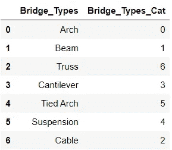

# 使用标签编码和一次性编码器的分类编码

> 原文：<https://towardsdatascience.com/categorical-encoding-using-label-encoding-and-one-hot-encoder-911ef77fb5bd?source=collection_archive---------0----------------------->


Photo by [Patrick Fore](https://unsplash.com/@patrickian4?utm_source=medium&utm_medium=referral) on [Unsplash](https://unsplash.com?utm_source=medium&utm_medium=referral)

在许多机器学习或数据科学活动中，数据集可能包含文本或分类值(基本上是非数值)。例如，具有像红色、橙色、蓝色、白色等值的颜色特征。膳食计划包括早餐、午餐、小吃、晚餐、茶等。很少有算法(如 cat saw、决策树)能够很好地处理分类值，但大多数算法都希望数值能够达到最先进的结果。

在你学习人工智能和机器学习的过程中，有一点你会注意到，大多数算法在处理数字输入时效果更好。因此，分析师面临的主要挑战是将文本/分类数据转换为数字数据，并仍然制定算法/模型来理解这些数据。神经网络是深度学习的基础，它期望输入值是数字。

有许多方法可以将分类值转换成数值。每种方法都有自己的权衡和对特性集的影响。在此，我将重点介绍两种主要方法:一热编码和标签编码。这两个编码器都是 SciKit-learn 库(使用最广泛的 Python 库之一)的一部分，用于将文本或分类数据转换为模型期望的数值数据，并且可以更好地执行。

本文中的代码片段将是 Python 的，因为我更熟悉 Python。如果你需要 R(另一种广泛使用的机器学习语言),那么在评论中说出来。

# **标签编码**

这种方法非常简单，它包括将一列中的每个值转换成一个数字。考虑一个桥梁数据集，该数据集具有一个名为 bridge-types 的列，该列具有以下值。尽管数据集中会有更多的列，但为了理解标签编码，我们将只关注一个分类列。

```
**BRIDGE-TYPE** Arch
Beam
Truss
Cantilever
Tied Arch
Suspension
Cable
```

我们选择通过为每个文本值放置一个运行序列来对文本值进行编码，如下所示:


这样，我们完成了可变桥类型的标签编码。这就是标签编码的全部内容。但是根据数据值和数据类型，标签编码引入了新的问题，因为它使用了数字排序。使用数字的问题在于它们引入了它们之间的联系/比较。显然，各种桥型之间没有关系，但当看数字时，人们可能会认为“缆索”桥型比“拱形”桥型优先。该算法可能会误解数据具有某种等级/顺序 0 < 1 < 2 … < 6，并可能在计算中给予“电缆”比“拱形”桥类型多 6 倍的权重。


让我们考虑另一个名为“安全级别”的列。对该列执行标签编码还会导致数字中的顺序/优先级，但方式是正确的。在这里，数字顺序看起来不是现成的，如果算法将安全顺序解释为 0 < 1 < 2 < 3 < 4，即无

# **Python 中的标签编码**

**使用类别代码方式:**

这种方法要求 category 列的数据类型为“category”。默认情况下，非数字列属于“对象”类型。因此，在使用这种方法之前，您可能必须将类型更改为“category”。

```
# import required libraries
import pandas as pd
import numpy as np# creating initial dataframe
bridge_types = ('Arch','Beam','Truss','Cantilever','Tied Arch','Suspension','Cable')
bridge_df = pd.DataFrame(bridge_types, columns=['Bridge_Types'])# converting type of columns to 'category'
bridge_df['Bridge_Types'] = bridge_df['Bridge_Types'].astype('category')# Assigning numerical values and storing in another column
bridge_df['Bridge_Types_Cat'] = bridge_df['Bridge_Types'].cat.codes
bridge_df
```

**利用 sci-kit 学习文库的方法:**

许多数据分析师执行标签编码另一种常见方法是使用 SciKit 学习库。

```
import pandas as pd
import numpy as np
from sklearn.preprocessing import LabelEncoder# creating initial dataframe
bridge_types = ('Arch','Beam','Truss','Cantilever','Tied Arch','Suspension','Cable')
bridge_df = pd.DataFrame(bridge_types, columns=['Bridge_Types'])# creating instance of labelencoder
labelencoder = LabelEncoder()# Assigning numerical values and storing in another column
bridge_df['Bridge_Types_Cat'] = labelencoder.fit_transform(bridge_df['Bridge_Types'])
bridge_df
```



bridge_df with categorical caolumn and label-encoded column values

# 一键编码器

虽然标签编码是直截了当的，但它的缺点是数值可能被算法误解为具有某种层次/顺序。这种排序问题在另一种称为“一键编码”的常见替代方法中得到解决。在这个策略中，每个类别值都被转换成一个新列，并为该列分配一个 1 或 0(表示真/假)值。让我们考虑一下之前的例子，使用一键编码的网桥类型和安全级别。


以上是分类列“桥型”的一键编码值。同样，让我们检查“安全级别”列。


具有第一列值(Arch/None)的行将具有‘1’(表示真)，而其他值的列将具有‘0’(表示假)。类似地，对于值与列值匹配的其他行。

虽然这种方法消除了层次/顺序问题，但也有向数据集添加更多列的缺点。如果在一个类别列中有许多唯一值，这可能会导致列数大幅增加。在上面的例子中，这是可以管理的，但是当编码给出许多列时，管理起来将变得非常困难。

# Python 中的一键编码

**使用 sci-kit 学习库方法:**

SciKit 库中的 OneHotEncoder 只接受数字分类值，因此任何字符串类型的值都应该在 hot 编码之前进行标签编码。因此，以前面示例中的数据帧为例，我们将对 Bridge_Types_Cat 列应用 OneHotEncoder。

```
import pandas as pd
import numpy as np
from sklearn.preprocessing import OneHotEncoder# creating instance of one-hot-encoder
enc = OneHotEncoder(handle_unknown='ignore')# passing bridge-types-cat column (label encoded values of bridge_types)
enc_df = pd.DataFrame(enc.fit_transform(bridge_df[['Bridge_Types_Cat']]).toarray())# merge with main df bridge_df on key values
bridge_df = bridge_df.join(enc_df)
bridge_df
```


Bridge_Type column encoded using SciKit OneHotEncoder

可以从数据框架中删除列“Bridge_Types_Cat”。

**使用虚拟值方法:**

这种方法更加灵活，因为它允许对任意多的类别列进行编码，并选择如何使用前缀来标记列。正确的命名会使剩下的分析变得简单一点。

```
import pandas as pd
import numpy as np# creating initial dataframe
bridge_types = ('Arch','Beam','Truss','Cantilever','Tied Arch','Suspension','Cable')
bridge_df = pd.DataFrame(bridge_types, columns=['Bridge_Types'])# generate binary values using get_dummies
dum_df = pd.get_dummies(bridge_df, columns=["Bridge_Types"], prefix=["Type_is"] )# merge with main df bridge_df on key values
bridge_df = bridge_df.join(dum_df)
bridge_df
```


Bridge_Type values encoded using dummies approach

# 结论

理解对分类变量进行编码各种选择是很重要的，因为每种方法都有自己的优缺点。在数据科学中，这是重要的一步，所以我真的鼓励你在处理分类变量时记住这些想法。对于本文中使用的代码的任何建议或更多细节，请随时发表评论。