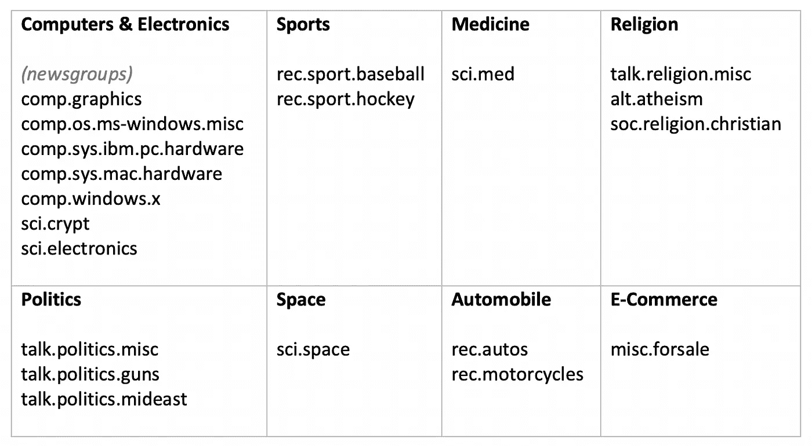
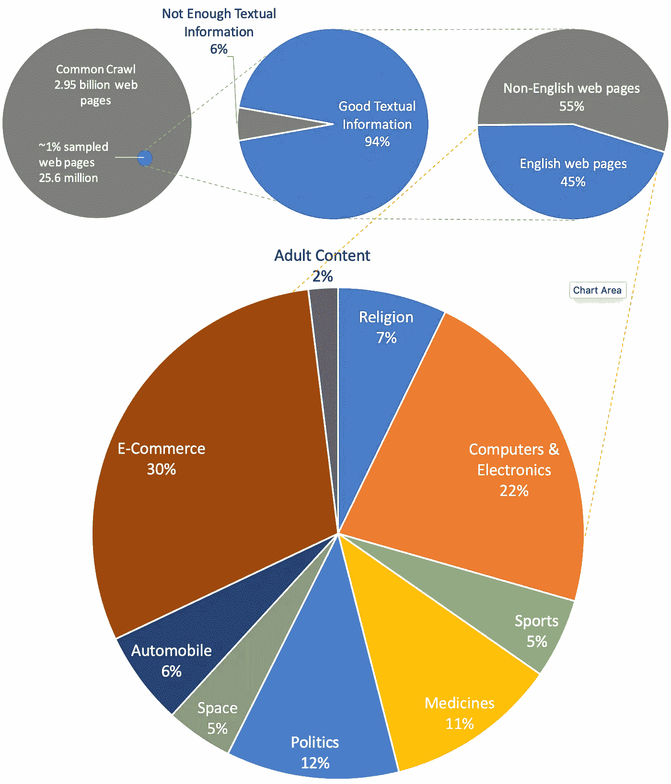

# 对万维网进行分类

> 原文：<https://towardsdatascience.com/categorizing-world-wide-web-c130abd9b717?source=collection_archive---------21----------------------->


> 互联网是世界上最大的图书馆。只是所有的书都在地板上。
> 
> 约翰·艾伦·保罗斯

让我们扫扫地，试着把这些书堆在书架上。

## 通用爬网数据集

与其对开放的 web 进行爬网，不如使用现有的通用爬网数据集，这是一个对 29.5 亿个网页进行爬网的归档，总内容为 260。当然，它不是 web 的完整代表，但它给了我们一个很好的开始。

要对如此庞大的语料库进行分析和分类，我们需要强大的计算能力。因此，我们将在 Amazon Elastic MapReduce (EMR)上使用数百台运行 Apache Spark 的机器。好消息是，作为亚马逊公共数据集计划的一部分，通用抓取数据集已经存在于亚马逊 S3 上，因此我们应该能够有效地访问它。

## 从网页中提取文本

普通抓取 [WARC 文件](https://commoncrawl.org/the-data/get-started/#WARC-Format)包含抓取的原始数据，包括它所接触的网站的 HTTP 响应。如果我们看一个这样的 HTML 文档

```
<!DOCTYPE html>
<html lang=”en-US”>
<head>
<meta charset=”UTF-8">
<meta name=”viewport” content=”width=device-width, initial-scale=1">
<link rel=”profile” href=”http://gmpg.org/xfn/11">
...
<div class=”cover”>
</p>
</div>
<div>
<div id=”desc-B00UVA0J6E” class=”description”>
<p>By Richard S. Smith,Simon W. M. John,Patsy M. Nishina,John P. Sundberg</p>
<p>ISBN-10: 084930864X</p>
<p>ISBN-13: 9780849308642</p>
<div> finishing touch of the 1st section of the Human Genome venture has awarded scientists with a mountain of recent info.
...
<footer id=”colophon” class=”site-footer” role=”contentinfo”>
<div class=”site-info”>
...
</body>
</html>
```

如您所见，HTML 文档是非常复杂的代码，通常有多种格式。我们将使用 python 库——漂亮的汤——从这些文档中提取文本。

```
**def** get_text(html_content):
    soup = BeautifulSoup(html_content, **"lxml"**)

    *# strip all script and style elements* **for** script **in** soup([**"script"**, **"style"**]):
        script.decompose()

    **return** soup.get_text(**" "**, strip=**True**)
```

我们通过传递原始 HTML 内容创建了 BeautifulSoup 对象。它包含嵌套结构中的所有数据。所有文本数据都可以通过调用该对象上的 get_text 以编程方式提取。然而，除了文本之外，它还提取我们可能不需要的 javascript 和 CSS 代码，所以在提取之前，我们会删除它们。这应该会给我们想要的，只是文本—

```
Download e-book for iPad: Systematic Evaluation of the Mouse Eye: Anatomy, Pathology, by Richard S. Smith,Simon W. M. John,Patsy M. Nishina,John P. - Gdynia Design E-books...finishing touch of the 1st section of the Human Genome venture has awarded scientists with a mountain of recent info. the supply of all human genes and their destinations is fascinating, yet their mechanisms of motion and interplay with different genes ...the booklet then studies and illustrates nearby ocular pathology and correlates it with human eye disease.
```

## 分类

为了对这些文本进行分类，我们将使用 scikit-learn——一个用于机器学习的 python 库。我们将用 20 个新闻组数据集训练我们的分类器。它是大约 20，000 个新闻组文档的集合，平均分布在 20 个不同的新闻组中。我们将把这些新闻组分为以下八类。



```
**class** Classifier:

    *# train the model
* **def** __init__(self):
        newsgroups_train = fetch_20newsgroups(subset=**'train'**, remove = (**'headers'**, **'footers'**, **'quotes'**))
        self.target_names = newsgroups_train.target_names
        self.vectorizer = TfidfVectorizer(sublinear_tf=**True**, max_df=0.5, stop_words=**'english'**)
        vectors = self.vectorizer.fit_transform(newsgroups_train.data)
        self.clf = LinearSVC(penalty=**'l2'**, dual=**False**, tol=1e-3)
        self.clf.fit(vectors, newsgroups_train.target)

    **def** predict(self, document):
        x_test = self.vectorizer.transform([document])
        pred = self.clf.predict(x_test)
        **return** self.target_names[pred[0]]
```

fetch_20newsgroups 函数从原来的 20newsgroups 网站下载数据存档。我们正在对它进行配置，以分别删除标题、签名块和引用块，这与主题分类没有什么关系。我们将使用 TfidfVectorizer 将文本转换为数字值的向量，以便将它们提供给预测模型。现在，我们将使用线性支持向量分类(LinearSVC)来训练我们的模型，该模型在大型数据集上具有更好的扩展性。事实上，许多其他模型可以很容易地插入，如朴素贝叶斯、SGD 分类器、k-最近邻、决策树等。但是从经验上来说，我发现 SVM 在我们的案例中表现很好。现在，我们可以在模型上调用 predict 函数，将文档分类到八个类别之一。

## 分析预测

分类器似乎做得不错。这里有一些网页——

```
*Beautiful Kazak carpet of distinctive colours matches with the curtains add lively touch. ...**Carpet cleaning is something which can be done at home but you might damage your carpet instead of cleaning it. Often the colours of carpet run as soon as it comes in contact with water. ...**Carpet Repairing**If your carpet is torn or there is piece missing, AbeeRugs can help you fix that. We fix it in a way that we also complete the design no matter how intricate it is. ...*Classified as **E-Commerce**
--------------------------------*Make more time for the moments that matter. Get expertly-curated updates and medical education, instantly.**New to EasyWeb?**EasyWeb is a free service for United States Healthcare Professionals. ...**Specialty Anesthesiology: general Anesthesiology: adult cardiothoracic Anesthesiology: critical care Anesthesiology: pain Anesthesiology: pediatric Dermatology Emergency Medicine Family Medicine ...*Classified as **Medicines** --------------------------------*All Films & Events | Arab Film Festival 2014 ...**Watch Trailer Watch Trailer**A Stone’s Throw from Prison**Raquel Castells / Documentary / Palestine, Spain / 2013 / 65 mins**Growing up in the Occupied Palestinian Territory is not easy. When you leave home for school, your mother can't be sure of when you'll be back. Rami, Ahmed, Mohammed, three among thousands, this documentary is their story, but also that of courageous Israelis and Palestinians working to cut abuses, stop conflict ...*Classified as **Politics**
```

显然，通过分析更多的预测，可以注意到类别过于宽泛。

```
*Tanzania farmers adopts vegetable farming to improve nutrition**The farmers in Tanzania are encouraged to grow elite varieties of vegetables, enriched with high-value nutritional content, in order to fight malnutrition, hunger and double agricultural productivity and income of smallholders**The Africa RISING project focuses on the need to take urgent action in achieving Sustainable Development Goals (SDGs) which aim* ...Classified as **Medicines**
```

通过查看我们拥有的所有可能的类别，预测的类别似乎是正确的，但如果将其归类为农业会更好。此外，航空学更适合下面的例子。

```
*Schofields Flying Club - N1418V Flight Schedule**N1418V Flight Schedule**Cessna 172M**Perhaps the staple of general aviation flight training, and rightfully so. The 172 has been in production since 1956, with no end in sight! Our 172 is an ideal VFR training platform!! Because of its high wings, 18V provides a great view of the ground, ...*Classified as **Space**
```

有很多例子表明网页可以分为多个类别。例如，下面的示例也可以归类为电子商务。

```
*Recently Sold Vehicles**Here are some vehicles that we recently sold. It's just a sample of the variety and quality of our vehicle selection.**Please feel free to browse our Internet showroom and contact us to make an appointment if you would like to see any of our vehicles in person. ...*Classified as **Automobile**
```

也有相当多的样本，分类器似乎得到了错误的。

```
*... We all make mistakes. That is a dictum of life. It’s surprising how ignored it is and how discouraged one is to fail in the world. Then again current with this theme of artificial organizing is that the soul is now completely detached from the world it swims in. The title Greenberg centers around […]**To the dilettante the thing is the end, while to the professional as such it is the means; and only he who is directly interested in a thing, and occupies himself with it from love of it ...**Support Joseph A. Hazani on Patreon! ...*Misclassified as **Sports** --------------------------------... *Fast, Reliable Everytime**ABC Messenger Local Flower Hill NY Delivery Service**ABC Messenger & Transport, Inc. has the ability to offer rush and pre-scheduled Delivery Service at competitive prices and excellent Flower Hill NY service. Their Delivery Service is recognized as fast and dependable. Through highly experienced and skilled veteran Flower Hill NY dispatchers and seasoned couriers we are able to predict traffic patterns easily and avoid or overcome ...*Misclassified as **Medicines**
```

总之，它给出了我们可以依赖于我们的初始项目体面的预测。

## 语言检测

由于分类器是在英语数据集上训练的，我们将使用 langdetect 库来跳过非英语网页。

```
**from** langdetect **import** detectlang = detect(text)
**if** lang != **'en'**:
    *# skip non-English pages* **return**
```

## 亵渎过滤器

我们还将使用脏话过滤器来忽略成人内容。

```
**from** profanity_check **import** predict**if** predict([text])[0]:
    **# adult content**
```

## 亚马逊电子病历上的火花

如前所述，由于公共爬行数据集非常庞大，我们将在 Amazon EMR 上的 Spark 上运行我们的应用程序。我们将采用常见的抓取[示例代码](https://github.com/commoncrawl/cc-pyspark/blob/master/sparkcc.py)来处理 Spark 上的数据。

```
**class** WebClassifier(CCSparkJob):

    name = **"**WebClassifier**"
    def** __init__(self):
        CCSparkJob.__init__(self)
        self.output_schema = StructType([
            StructField(**"topic"**, StringType(), **True**),
            StructField(**"count"**, LongType(), **True**)
        ])
        self.classifier = Classifier() **def** process_record(self, record):
        *# html record* **if** self.is_html(record): 
            *# extract text from web page*
            text = self.get_text(record)
        **else**:
            **return** *# skip non-English pages**# filter profane content*

        topic = self.classifier.predict(text)
        **yield** topic, text

**if** __name__ == **'__main__'**:
    job = WebClassifier()
    job.run()
```

将对数据集中的每条记录调用 process_record 函数，我们将把它分类到前面列出的类别中。完整的源代码上传到[这里](https://github.com/sterlingshrey/web-categorization)。

为了进一步加快速度，我们将使用[湿文件](https://commoncrawl.org/the-data/get-started/#WET-Format)代替 WARC，它包含提取的明文。此外，我们将加载预先训练的序列化分类器，以避免在每台机器上训练它。我使用了 100 个 ec2 实例，花了大约一个半小时来处理 1%的普通爬行语料库。它花了我大约 25 美元。这是我们得到的结果:

## Web 类别



我们从大约 1%的普通抓取数据或大约 2560 万个网页开始。我们过滤了 140 万个网页，因为它们不包含足够的文本信息用于分类。后来我们跳过了大约 1320 万个非英文页面。我们能够对剩下的 1090 万页进行分类。显然，有大量的电子商务内容和大量的内容谈论计算机和电子，其次是政治，医药，宗教，汽车和空间。请注意，我们还过滤了大约 25 万个成人网页。

总之，我们做了一个温和的尝试来对网络的现状进行分类。我希望这也是进一步 web 分析的良好开端。