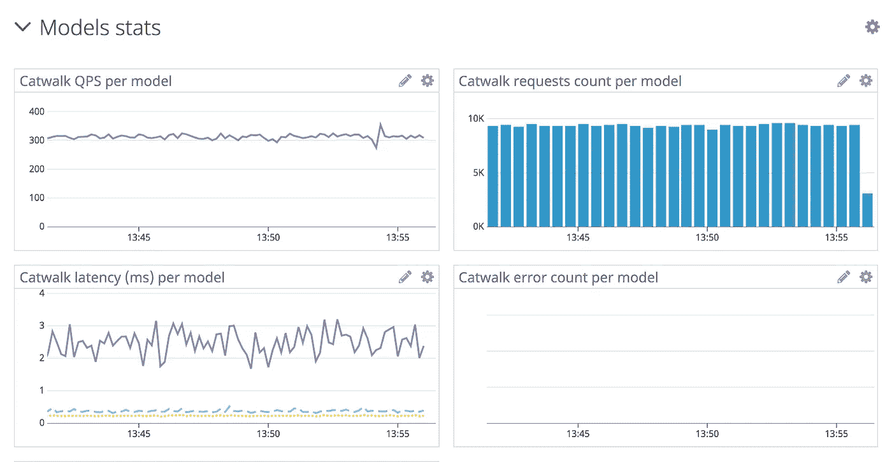

# 走秀:大规模服务机器学习模型

> 原文：<https://towardsdatascience.com/catwalk-serving-machine-learning-models-at-scale-221d1100aa2b?source=collection_archive---------9----------------------->

*本文首发于 2019 年 7 月 2 日* [*Grab 的工程博客*](https://engineering.grab.com/catwalk-serving-machine-learning-models-at-scale) *。它是与 Nutdanai Phansooksai，Juho Lee 和 Romain Basseville 合作编写的。*

# 介绍

Grab 坚定不移的目标是成为东南亚最好的超级应用，为我们的客户增加日常价值。为了实现这一目标，每一次 Grab 服务的客户体验都必须完美无瑕。以我们经常使用的打车服务为例。我们希望为司机和乘客提供公平的价格、准确的 eta 估算、有效的欺诈行为检测，并确保客户的乘车安全。完善这些客户旅程的关键是人工智能(AI)。

Grab 拥有大量数据，我们可以利用这些数据来解决欺诈性用户活动等复杂问题，并为我们的客户提供个性化的产品体验。我们用来理解这些数据的工具之一是机器学习(ML)。

随着 Grab 在整个组织内越来越多地使用机器学习方面取得巨大进展，越来越多的团队正在为他们自己的用例有机地构建模型服务解决方案。不幸的是，这些模型服务解决方案需要数据科学家了解它们背后的基础设施。此外，在构建这些模型服务解决方案的工作中有很多重叠。

这就是为什么我们想出了 Catwalk:一个易于使用的，自助式的，机器学习模型服务平台，为 Grab 的每个人服务。

# 目标

为了确定我们希望 Catwalk 做什么，我们首先查看了我们的目标受众(Grab 的数据科学家)的典型工作流程:

*   建立一个经过训练的模型来解决问题。
*   将模型部署到他们项目的特定服务解决方案中。如果这涉及到写入数据库，那么数据科学家需要以编程方式获得输出，并将它们写入数据库。如果这涉及在服务器上运行模型，数据科学家需要深入了解服务器如何扩展和内部工作，以确保模型的行为符合预期。
*   使用部署的模型为用户服务，获取用户交互数据等反馈。使用此数据重新训练模型，使其更加准确。
*   将重新培训的模型部署为新版本。
*   使用监控和日志记录来检查新版本的性能。如果新版本运行不正常，请恢复到旧版本，以便生产流量不受影响。否则，在新版本和旧版本之间运行 AB 测试。

我们发现了一个明显的痛点——部署模型的过程需要额外的努力和关注，这导致数据科学家无法专注于手头的问题。除此之外，让许多数据科学家构建和维护他们自己的服务解决方案意味着有许多重复的工作。随着 Grab 越来越多地采用机器学习，这种情况不能再继续下去了。

为了解决这些问题，我们设计了 Catwalk，目标是:

1.  抽象出复杂性，并为数据科学家提供一个最小的接口
2.  通过为 Grab 中的每个人创建一个 ML 模型服务平台来防止重复工作
3.  创建一个高性能、高可用性、支持模型版本控制的 ML 模型服务平台，并将其与 Grab 现有的监控系统集成
4.  通过自助式模型部署缩短上市时间

# 什么是走秀？

简而言之，Catwalk 是一个平台，我们在 Kubernetes 集群上运行 Tensorflow 服务容器，该集群集成了 Grab 上使用的 observability 堆栈。

在接下来的部分中，我们将解释 Catwalk 中的两个主要组件——tensor flow Serving 和 Kubernetes，以及它们如何帮助我们实现我们概述的目标。

# Tensorflow 提供的是什么？

[Tensorflow Serving](https://www.tensorflow.org/tfx/guide/serving) 是 Google 的开源 ML 模型服务项目。用谷歌自己的话说，“Tensorflow Serving 是一个灵活的、高性能的机器学习模型服务系统，专为生产环境而设计。它使得部署新的算法和实验变得容易，同时保持相同的服务器架构和 API。Tensorflow 服务提供了与 [Tensorflow](https://www.tensorflow.org/) 模型的现成集成，但可以轻松扩展以服务于其他类型的模型和数据。”

# 为什么 Tensorflow 服务？

现在市场上有许多 ML 模型服务平台。我们选择 Tensorflow 服务是因为这三个原因，按优先级排序:

1.  高性能。据[网站](https://www.tensorflow.org/tfx)称，它已经证明了在谷歌每秒处理数千万次推理的性能。
2.  高度可用。它有一个模型版本化系统，以确保在将新版本加载到内存中时，总是有一个健康的版本
3.  由开发者社区积极维护并得到 Google 的支持

尽管默认情况下，Tensorflow 服务只支持用 Tensorflow 构建的模型，但这不是一个约束，因为 Grab 正在积极地向使用 Tensorflow 发展。

# 我们如何使用 Tensorflow 服务？

在本节中，我们将解释我们如何使用 Tensorflow 服务，以及它如何帮助数据科学家抽象出复杂性。

以下是展示我们如何使用 Tensorflow 服务于一个训练好的模型的步骤:

1.  数据科学家使用 [tf.saved_model](https://www.tensorflow.org/api_docs/python/tf/saved_model) API 导出模型，并将其放入 S3 模型桶。导出的模型是一个包含模型文件的文件夹，可以加载到 Tensorflow 服务器。
2.  数据科学家被授予管理其文件夹的权限。
3.  我们运行 Tensorflow 服务，并让它直接从 S3 模型桶中加载模型文件。Tensorflow 服务支持直接从 S3 开箱加载模型。模特服了！
4.  数据科学家提出了一个重新训练的模型。他们导出并上传到他们的模型文件夹。
5.  由于 Tensorflow 服务会持续监视新模型的 S3 模型桶，因此它会自动加载重新训练的模型并提供服务。根据模型配置的不同，它可以用更新的版本优雅地替换正在运行的模型版本，也可以同时服务于多个版本。

数据科学家的唯一界面是 S3 模型存储桶中模型文件夹的路径。为了更新他们的模型，他们将导出的模型上传到他们的文件夹中，模型将被自动提供。复杂性消失了。我们已经实现了其中一个目标！

嗯，不完全是…

假设您要运行 Tensorflow 来为云提供商的一个模型提供服务，这意味着您需要云提供商的计算资源来运行它。在一台机器上运行它不能提供高可用性，因此您需要另一台机器运行相同的模型。为了根据流量进行横向扩展，还需要自动扩展。在这些盒子的顶部有一个负载平衡器。负载平衡器将传入流量均匀地分布到所有机器，从而确保任何客户端都有一个入口点，可以从水平扩展中抽象出来。负载平衡器还向外部用户公开 HTTP 端点。因此，我们形成了一个 Tensorflow 服务集群，随时准备提供服务。

接下来，假设您有更多的模型要部署。你有三个选择

1.  将模型加载到现有集群中，让一个集群服务于所有模型。
2.  启动一个新的集群来为每个模型提供服务—有多个集群，一个集群为一个模型提供服务。
3.  1 和 2 的组合—拥有多个集群，一个集群服务于几个型号。

第一个选项无法扩展，因为不可能将所有模型加载到一个集群中，因为集群的资源有限。

第二种选择肯定可行，但听起来不像是一个有效的过程，因为每次有新模型要部署时，您都需要创建一组资源。此外，您如何优化资源的使用，例如，您的集群中可能有未利用的资源，这些资源可能会被其他资源共享。

第三个选项看起来很有希望，您可以手动选择集群来部署每个新模型，以便所有集群的资源利用率都是最优的。问题是你必须手动管理它。使用 25 个集群管理 100 个模型可能是一项具有挑战性的任务。此外，在一个集群中运行多个模型也会导致问题，因为不同的模型通常具有不同的资源利用模式，并且会相互干扰。例如，一个型号可能会用完所有的 CPU，而另一个型号将无法再提供服务。

如果我们有一个根据资源利用模式自动编排模型部署并防止它们相互干扰的系统，不是更好吗？幸运的是，这正是 Kubernetes 想要做的！

# 那么什么是 Kubernetes 呢？

Kubernetes 将一个物理/虚拟主机集群(比如 EC2)抽象成一个逻辑主机集群(Kubernetes 术语中的 pod)。它提供了以容器为中心的管理环境。它代表用户工作负载协调计算、网络和存储基础架构。

让我们看看 Kubernetes 资源的一些定义

*   集群—运行 Kubernetes 的节点集群。
*   节点—群集中的节点。
*   部署—指示 Kubernetes 应用程序所需状态的配置。它还负责推出更新(金丝雀、百分比展示等)、回滚和水平缩放。
*   Pod —单个处理单元。在我们的例子中，Tensorflow 服务将作为 pod 中的容器运行。Pod 可以定义 CPU/内存限制。
*   服务——一个抽象层，它抽象出一组 pod，并将应用程序公开给客户端。
*   入口—控制外部用户如何访问群集中运行的服务的路由规则集合。
*   入口控制器—负责读取入口信息并相应处理该数据的控制器，例如创建云提供商负载平衡器或使用入口资源中定义的规则启动新的 pod 作为负载平衡器。

本质上，我们部署资源来指导 Kubernetes 我们的应用程序的期望状态，Kubernetes 将确保它总是如此。

# 我们如何使用 Kubernetes？

在本节中，我们将带您了解我们如何在 Kubernetes 集群中部署 Tensorflow 服务，以及它如何使管理模型部署变得非常方便。

我们使用托管的 Kubernetes 服务来创建 Kubernetes 集群，并手动将计算资源配置为节点。因此，我们有了一个 Kubernetes 集群，其中的节点可以随时运行应用程序。

服务于一个模型的应用程序包括

1.  两个或更多 Tensorflow 服务单元，为带有自动缩放器的模型提供服务，以根据资源消耗来缩放单元
2.  一个负载平衡器，用于将传入的流量均匀地分配给各个单元
3.  向外部用户公开的 HTTP 端点

为了部署应用程序，我们需要

1.  部署部署资源，指定
2.  Tensorflow 服务的豆荚数量
3.  用于加载模型文件的 Tensorflow 的 S3 url
4.  部署服务资源以公开它
5.  部署入口资源以定义 HTTP 端点 url

然后，Kubernetes 根据部署资源中定义的值将 Tensorflow 服务单元分配到具有单元数量的集群。pod 可以分配给集群中的任何节点，Kubernetes 确保它将 pod 分配到的节点有足够的 pod 所需的资源。如果没有节点拥有足够的资源，我们可以通过添加新节点来轻松地扩展集群。

为了让 ingressresource 中定义的规则发挥作用，集群必须有一个正在运行的入口控制器，这就是我们选择负载平衡器的原因。入口控制器做的事情很简单:它不断检查 Ingres resource，创建负载平衡器，并根据 Ingres resource 中的规则定义规则。一旦配置了负载平衡器，它就能够将传入的请求重定向到 Tensorflow 服务单元。

就是这样！我们有一个可扩展的 Tensorflow 服务应用程序，它通过负载平衡器为模型提供服务！为了服务于另一个模型，我们需要做的就是部署相同的资源集，但是使用模型的 S3 url 和 HTTP 端点。

为了说明集群内部正在运行什么，让我们看看部署两个应用程序时的情况:一个用于服务定价模型，另一个用于服务欺诈检查模型。每个应用程序都配置有两个 Tensorflow 服务单元，暴露在/v1/models/model

有两个 Tensorflow 服务单元为欺诈检查模型提供服务，并通过负载平衡器公开。定价模型也是如此，唯一的区别是它所服务的模型和公开的 HTTP 端点 url。定价和欺诈检查模型的负载平衡器规则如下所示

如果转发到路径是/v1/models/pricing pod IP-1 pricing pod IP-2 路径是/v1/models/fraud-check fraud-check pod IP-1 fraud-check pod IP-2

# 统计和日志

最后一部分是统计和日志的工作原理。在此之前，我们需要介绍一下[达蒙塞特](https://kubernetes.io/docs/concepts/workloads/controllers/daemonset/)。根据该文档，DaemonSet 确保所有(或一些)节点运行 pod 的副本。随着节点添加到集群中，单元也会添加到其中。随着节点从集群中移除，这些 pod 将被垃圾收集。删除 DaemonSet 将清理它创建的 pod。

我们将 datadog-agent 和 filebeat 部署为 DaemonSet。因此，我们在所有节点中始终有一个 datadog-agent pod 和一个 filebeat pod，并且可以从同一节点中的 Tensorflow 服务 pod 访问它们。Tensorflow 服务 pod 针对每个请求向其所在节点中的 datadog-agent pod 发出一个 stats 事件。

以下是 DataDog 统计数据的示例:

以及我们放置的日志:

# 从走秀中获得的好处

Catwalk 已经成为服务于机器学习模型的首选集中式系统。数据科学家不需要负责服务基础设施，因此他们可以专注于最重要的事情:提出解决客户问题的模型。他们只需要提供导出的模型文件和对预期流量的估计，以便准备足够的资源来运行他们的模型。作为回报，他们会得到一个端点来对他们的模型进行推理调用，以及所有必要的监控和调试工具。更新模型版本是自助的，模型改进周期比以前短了很多。我们过去以天计算，现在以分钟计算。